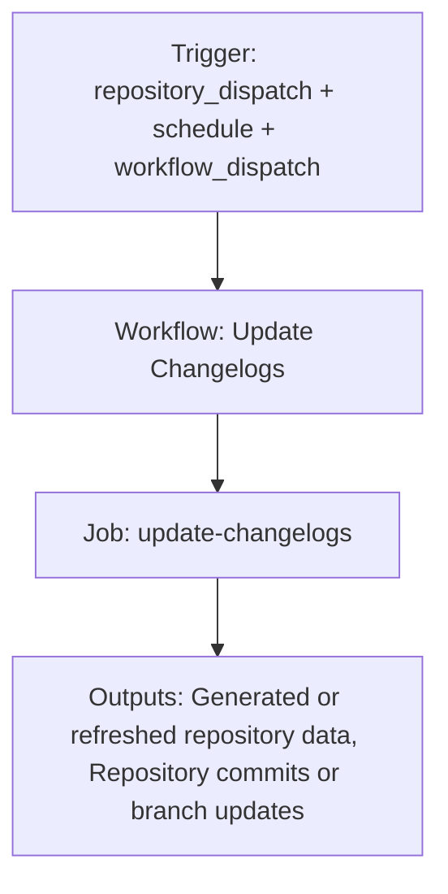

{/*
generated-file-banner: ai-tools-visual-library:v1
Generation Script: operations/scripts/generators/governance/catalogs/generate-ai-tools-visual-library.js
Purpose: AI-tools canonical visual library for workflows and dispatcher actions.
Run when: GitHub workflows, dispatcher definitions, registry coverage, or visual-library contracts change.
Run command: node operations/scripts/generators/governance/catalogs/generate-ai-tools-visual-library.js --write
*/}

<Note>
**Generation Script**: This file is generated from script(s): `operations/scripts/generators/governance/catalogs/generate-ai-tools-visual-library.js`.  
**Purpose**: AI-tools canonical visual library for workflows and dispatcher actions.  
**Run when**: GitHub workflows, dispatcher definitions, registry coverage, or visual-library contracts change.  
**Important**: Do not manually edit this file; run `node operations/scripts/generators/governance/catalogs/generate-ai-tools-visual-library.js --write`.  
</Note>

# Update Changelogs

## Summary

Update Changelogs runs on repository_dispatch, schedule, workflow_dispatch and primarily produces generated or refreshed repository data.

## Why It Exists

Govern the `.github/workflows/update-changelogs.yml` workflow as a human-readable, visually explorable source-of-truth page inside `ai-tools/registry/workflows`.

## Triggers

- repository_dispatch: types=solution-release, governor-scripts-update
- schedule: default event configuration
- workflow_dispatch: configured in workflow file

## Jobs

| Job ID | Name | Runs On | Needs | Step Count |
| --- | --- | --- | --- | --- |
| `update-changelogs` | update-changelogs | `ubuntu-latest` | none | 6 |

### update-changelogs

- `Checkout docs repository` | uses actions/checkout@v4
- `Setup Node.js` | uses actions/setup-node@v4
- `Generate changelog entries (enhanced)` | runs `FLAGS=(--enhance)`
- `Generate changelog entries (fallback — no LLM)` | runs `FLAGS=()`
- `Check for changes` | runs `git diff --exit-code v2/solutions/ v2/resources/changelog/ || echo "changed=true" >> "$GITHUB_OUTPUT"`
- `Commit and push if changed` | runs `git config --global user.name 'github-actions[bot]'`

## Inputs

- workflow_dispatch:category (optional)
- workflow_dispatch:changelog_key (optional)
- workflow_dispatch:dry_run (optional)
- workflow_dispatch:enhance (optional)
- workflow_dispatch:llm_provider (optional)
- workflow_dispatch:use_test_branch (optional)

## Outputs

- Generated or refreshed repository data
- Repository commits or branch updates

## Dependencies

- .github/scripts/generate-changelog.js
- action:actions/checkout@v4
- action:actions/setup-node@v4
- secret:ARBISCAN_API_KEY
- secret:ETHERSCAN_API_KEY
- secret:GITHUB_TOKEN
- secret:GITLAB_TOKEN
- secret:OPENROUTER_API_KEY
- v2/resources/changelog/
- v2/solutions/

## Dependants

- dispatcher:page-ship

## Mermaid Pipeline

## Frailty And Risk

- Contains advisory steps with `continue-on-error`, so failures may be softened rather than fully blocking.
- Mutates repository state from CI, which raises coordination and safety risk.
- Depends on secrets, so runtime behavior cannot be fully reasoned about from repo state alone.
- Scheduled execution can hide drift until the next cron window.

## Consolidation Notes

Dispatcher suggestion: `page-ship`. This is a governance hint for consolidation review, not a runtime rewrite instruction.

## Handover Notes

Use this page as the human-facing workflow brief during audits, cleanup, and handover. Promote any missing operational knowledge back into the canonical page rather than leaving it in chat.
