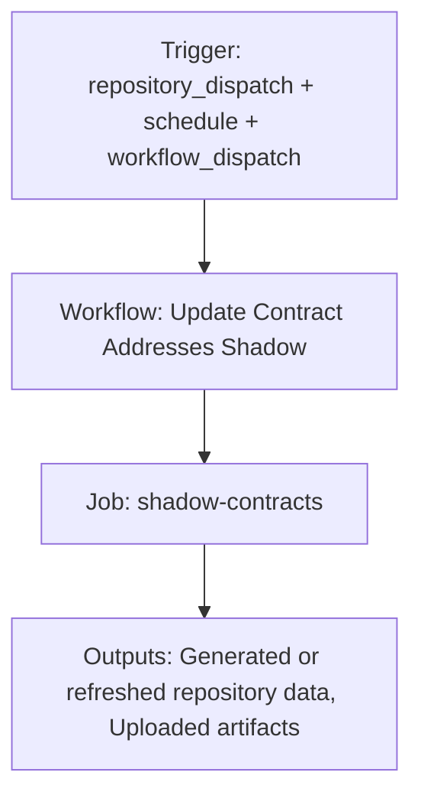

{/*
generated-file-banner: ai-tools-visual-library:v1
Generation Script: operations/scripts/generators/governance/catalogs/generate-ai-tools-visual-library.js
Purpose: AI-tools canonical visual library for workflows and dispatcher actions.
Run when: GitHub workflows, dispatcher definitions, registry coverage, or visual-library contracts change.
Run command: node operations/scripts/generators/governance/catalogs/generate-ai-tools-visual-library.js --write
*/}

<Note>
**Generation Script**: This file is generated from script(s): `operations/scripts/generators/governance/catalogs/generate-ai-tools-visual-library.js`.  
**Purpose**: AI-tools canonical visual library for workflows and dispatcher actions.  
**Run when**: GitHub workflows, dispatcher definitions, registry coverage, or visual-library contracts change.  
**Important**: Do not manually edit this file; run `node operations/scripts/generators/governance/catalogs/generate-ai-tools-visual-library.js --write`.  
</Note>

# Update Contract Addresses Shadow

## Summary

Update Contract Addresses Shadow runs on repository_dispatch, schedule, workflow_dispatch and primarily produces generated or refreshed repository data.

## Why It Exists

Govern the `.github/workflows/update-contract-addresses-shadow.yml` workflow as a human-readable, visually explorable source-of-truth page inside `ai-tools/registry/workflows`.

## Triggers

- repository_dispatch: types=governor-scripts-update, protocol-update, bridge-update, go-livepeer-update
- schedule: default event configuration
- workflow_dispatch: configured in workflow file

## Jobs

| Job ID | Name | Runs On | Needs | Step Count |
| --- | --- | --- | --- | --- |
| `shadow-contracts` | shadow-contracts | `ubuntu-latest` | none | 7 |

### shadow-contracts

- `Checkout docs repository` | uses actions/checkout@v4
- `Set up Node.js` | uses actions/setup-node@v4
- `Install contracts pipeline dependencies` | runs `npm ci --prefix operations`
- `Run shadow contracts pipeline` | runs `set -euo pipefail`
- `Upload shadow pipeline artifacts` | uses actions/upload-artifact@v4
- `Create or update contracts incident issue` | uses actions/github-script@v7
- `Fail on blocking contracts incident` | runs `echo "Shadow contracts pipeline failed."`

## Inputs

- workflow_dispatch:skip_verify (optional)
- workflow_dispatch:use_test_branch (optional)

## Second Pass Assessment

- Workflow family: `content-publication`
- Usage status: `active-advisory`
- Cleanup decision: `consolidate`
- Process fit: `core-shipping`
- Consolidation target: `dispatcher:page-ship`
- Recommended engineering action: Consolidate this workflow under `dispatcher:page-ship` and keep the script or validator layer as the reusable implementation boundary.

## Outputs

- Generated or refreshed repository data
- Uploaded artifacts

## Dependencies

- .github/scripts/fetch-contract-addresses.js
- action:actions/checkout@v4
- action:actions/github-script@v7
- action:actions/setup-node@v4
- action:actions/upload-artifact@v4
- secret:ARBISCAN_API_KEY
- secret:ARBITRUM_RPC_FALLBACK_URL
- secret:ARBITRUM_RPC_URL
- secret:ETHEREUM_RPC_FALLBACK_URL
- secret:ETHEREUM_RPC_URL
- secret:ETHERSCAN_API_KEY
- secret:GITHUB_TOKEN

## Dependants

- dispatcher:page-ship

## Mermaid Pipeline

## Frailty And Risk

- Contains advisory steps with `continue-on-error`, so failures may be softened rather than fully blocking.
- Depends on secrets, so runtime behavior cannot be fully reasoned about from repo state alone.
- Scheduled execution can hide drift until the next cron window.

## Consolidation Notes

Dispatcher suggestion: `page-ship`. Second-pass target: `dispatcher:page-ship`. This is a governance recommendation, not an automatic rewrite instruction.

## Cleanup Rationale

- This workflow is advisory-shaped, which is useful for audits but can also hide unresolved failures.

## Handover Notes

Use this page as the human-facing workflow brief during audits, cleanup, and handover. Promote any missing operational knowledge back into the canonical page rather than leaving it in chat.
