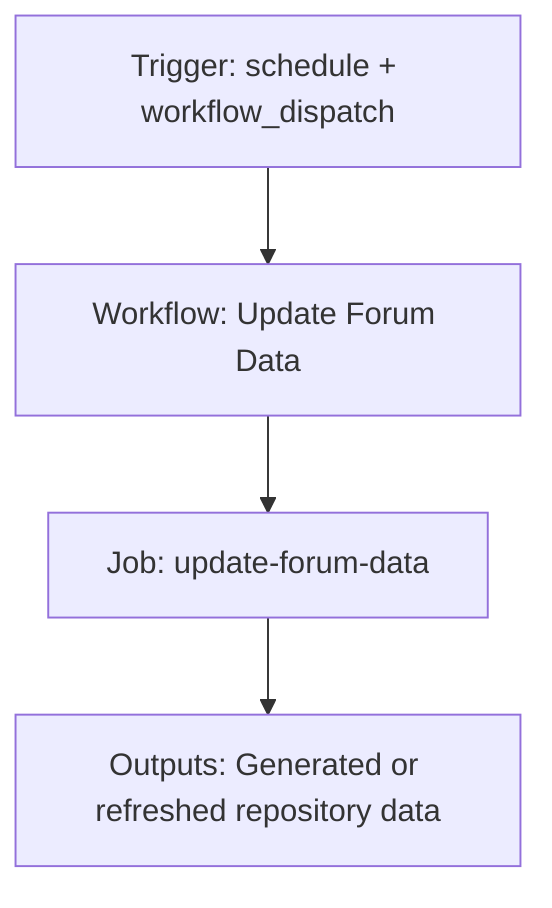

{/*
generated-file-banner: ai-tools-visual-library:v1
Generation Script: operations/scripts/generators/governance/catalogs/generate-ai-tools-visual-library.js
Purpose: AI-tools canonical visual library for workflows and dispatcher actions.
Run when: GitHub workflows, dispatcher definitions, registry coverage, or visual-library contracts change.
Run command: node operations/scripts/generators/governance/catalogs/generate-ai-tools-visual-library.js --write
*/}

<Note>
**Generation Script**: This file is generated from script(s): `operations/scripts/generators/governance/catalogs/generate-ai-tools-visual-library.js`.  
**Purpose**: AI-tools canonical visual library for workflows and dispatcher actions.  
**Run when**: GitHub workflows, dispatcher definitions, registry coverage, or visual-library contracts change.  
**Important**: Do not manually edit this file; run `node operations/scripts/generators/governance/catalogs/generate-ai-tools-visual-library.js --write`.  
</Note>

# Update Forum Data

## Summary

Update Forum Data runs on schedule, workflow_dispatch and primarily produces generated or refreshed repository data.

## Why It Exists

Govern the `.github/workflows/update-forum-data.yml` workflow as a human-readable, visually explorable source-of-truth page inside `ai-tools/registry/workflows`.

## Triggers

- schedule: default event configuration
- workflow_dispatch: configured in workflow file

## Jobs

| Job ID | Name | Runs On | Needs | Step Count |
| --- | --- | --- | --- | --- |
| `update-forum-data` | update-forum-data | n/a | none | 0 |

### update-forum-data

- No steps parsed.

## Inputs

- workflow_dispatch:use_test_branch (optional)

## Second Pass Assessment

- Workflow family: `data-refresh`
- Usage status: `compatibility-wrapper`
- Cleanup decision: `merge`
- Process fit: `legacy-or-unclear`
- Consolidation target: `data-refresh-governance`
- Recommended engineering action: Keep this as a thin compatibility wrapper until the Actions vs n8n ownership decision is resolved, then either retire it or keep only the canonical reusable workflow.

## Outputs

- Generated or refreshed repository data

## Dependencies

- No direct dependencies identified in current repo scan.

## Dependants

- dispatcher:page-ship

## Mermaid Pipeline

## Frailty And Risk

- No local repo dependencies were detected automatically; verify whether this is truly standalone.
- Scheduled execution can hide drift until the next cron window.

## Consolidation Notes

Dispatcher suggestion: `page-ship`. Second-pass target: `data-refresh-governance`. This is a governance recommendation, not an automatic rewrite instruction.

## Cleanup Rationale

- Dual ownership between Actions and n8n is governance debt.
- This belongs to a repeating data-refresh pattern and should not stay as an uncoordinated top-level workflow forever.
- This wrapper should not regain unique logic.
- Workflow comments explicitly say n8n is being used as an alternative.

## Handover Notes

Use this page as the human-facing workflow brief during audits, cleanup, and handover. Promote any missing operational knowledge back into the canonical page rather than leaving it in chat.
