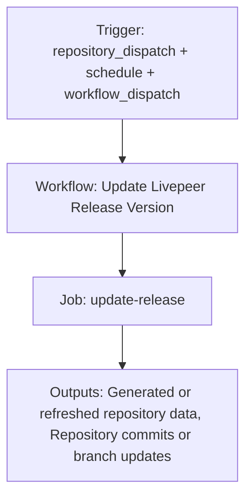

{/*
generated-file-banner: ai-tools-visual-library:v1
Generation Script: operations/scripts/generators/governance/catalogs/generate-ai-tools-visual-library.js
Purpose: AI-tools canonical visual library for workflows and dispatcher actions.
Run when: GitHub workflows, dispatcher definitions, registry coverage, or visual-library contracts change.
Run command: node operations/scripts/generators/governance/catalogs/generate-ai-tools-visual-library.js --write
*/}

<Note>
**Generation Script**: This file is generated from script(s): `operations/scripts/generators/governance/catalogs/generate-ai-tools-visual-library.js`.  
**Purpose**: AI-tools canonical visual library for workflows and dispatcher actions.  
**Run when**: GitHub workflows, dispatcher definitions, registry coverage, or visual-library contracts change.  
**Important**: Do not manually edit this file; run `node operations/scripts/generators/governance/catalogs/generate-ai-tools-visual-library.js --write`.  
</Note>

# Update Livepeer Release Version

## Summary

Update Livepeer Release Version runs on repository_dispatch, schedule, workflow_dispatch and primarily produces generated or refreshed repository data.

## Why It Exists

Govern the `.github/workflows/update-livepeer-release.yml` workflow as a human-readable, visually explorable source-of-truth page inside `ai-tools/registry/workflows`.

## Triggers

- repository_dispatch: types=go-livepeer-release
- schedule: default event configuration
- workflow_dispatch: configured in workflow file

## Jobs

| Job ID | Name | Runs On | Needs | Step Count |
| --- | --- | --- | --- | --- |
| `update-release` | update-release | `ubuntu-latest` | none | 5 |

### update-release

- `Checkout docs repository` | uses actions/checkout@v4
- `Resolve target version` | runs `if [[ -n "${{ github.event.client_payload.version }}" ]]; then`
- `Read current version` | runs `CURRENT=$(grep -oP 'latestVersion = "\K[^"]+' snippets/automations/globals/globals.jsx || echo "")`
- `Update globals.jsx` | runs `VERSION="${{ steps.version.outputs.version }}"`
- `Commit and push` | runs `git config user.name "github-actions[bot]"`

## Inputs

- workflow_dispatch:use_test_branch (optional)
- workflow_dispatch:version (optional)

## Outputs

- Generated or refreshed repository data
- Repository commits or branch updates

## Dependencies

- action:actions/checkout@v4
- secret:GITHUB_TOKEN
- snippets/automations/globals/globals.jsx

## Dependants

- dispatcher:page-ship

## Mermaid Pipeline

## Frailty And Risk

- Mutates repository state from CI, which raises coordination and safety risk.
- Depends on secrets, so runtime behavior cannot be fully reasoned about from repo state alone.
- Scheduled execution can hide drift until the next cron window.

## Consolidation Notes

Dispatcher suggestion: `page-ship`. This is a governance hint for consolidation review, not a runtime rewrite instruction.

## Handover Notes

Use this page as the human-facing workflow brief during audits, cleanup, and handover. Promote any missing operational knowledge back into the canonical page rather than leaving it in chat.
