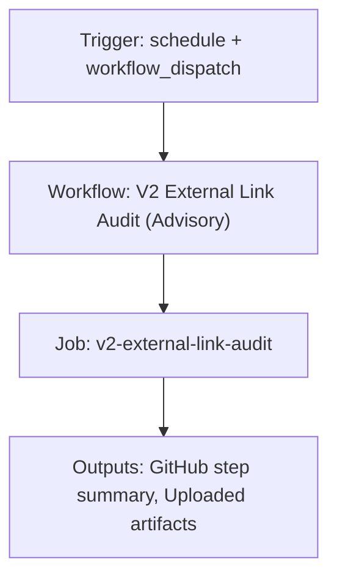

{/*
generated-file-banner: ai-tools-visual-library:v1
Generation Script: operations/scripts/generators/governance/catalogs/generate-ai-tools-visual-library.js
Purpose: AI-tools canonical visual library for workflows and dispatcher actions.
Run when: GitHub workflows, dispatcher definitions, registry coverage, or visual-library contracts change.
Run command: node operations/scripts/generators/governance/catalogs/generate-ai-tools-visual-library.js --write
*/}

<Note>
**Generation Script**: This file is generated from script(s): `operations/scripts/generators/governance/catalogs/generate-ai-tools-visual-library.js`.  
**Purpose**: AI-tools canonical visual library for workflows and dispatcher actions.  
**Run when**: GitHub workflows, dispatcher definitions, registry coverage, or visual-library contracts change.  
**Important**: Do not manually edit this file; run `node operations/scripts/generators/governance/catalogs/generate-ai-tools-visual-library.js --write`.  
</Note>

# V2 External Link Audit (Advisory)

## Summary

V2 External Link Audit (Advisory) runs on schedule, workflow_dispatch and primarily produces github step summary.

## Why It Exists

Govern the `.github/workflows/v2-external-link-audit.yml` workflow as a human-readable, visually explorable source-of-truth page inside `ai-tools/registry/workflows`.

## Triggers

- schedule: default event configuration
- workflow_dispatch: default event configuration

## Jobs

| Job ID | Name | Runs On | Needs | Step Count |
| --- | --- | --- | --- | --- |
| `v2-external-link-audit` | v2-external-link-audit | `ubuntu-latest` | none | 5 |

### v2-external-link-audit

- `Checkout repository` | uses actions/checkout@v4
- `Set up Node.js` | uses actions/setup-node@v4
- `Run V2 external link audit (advisory)` | runs `node operations/scripts/audits/content/health/page-links-audit.js \`
- `Upload external link audit reports` | uses actions/upload-artifact@v4
- `Publish summary` | runs `echo "## V2 External Link Audit (Advisory)" >> "$GITHUB_STEP_SUMMARY"`

## Inputs

- No explicit workflow inputs declared.

## Second Pass Assessment

- Workflow family: `validation-sweeps`
- Usage status: `active-advisory`
- Cleanup decision: `consolidate`
- Process fit: `core-shipping`
- Consolidation target: `dispatcher:review-fix`
- Recommended engineering action: Consolidate this workflow under `dispatcher:review-fix` and keep the script or validator layer as the reusable implementation boundary.

## Outputs

- GitHub step summary
- Uploaded artifacts

## Dependencies

- action:actions/checkout@v4
- action:actions/setup-node@v4
- action:actions/upload-artifact@v4
- operations/scripts/audits/content/health/page-links-audit.js

## Dependants

- dispatcher:review-fix

## Mermaid Pipeline

## Frailty And Risk

- Contains advisory steps with `continue-on-error`, so failures may be softened rather than fully blocking.
- Scheduled execution can hide drift until the next cron window.

## Consolidation Notes

Dispatcher suggestion: `review-fix`. Second-pass target: `dispatcher:review-fix`. This is a governance recommendation, not an automatic rewrite instruction.

## Cleanup Rationale

- This workflow is advisory-shaped, which is useful for audits but can also hide unresolved failures.

## Handover Notes

Use this page as the human-facing workflow brief during audits, cleanup, and handover. Promote any missing operational knowledge back into the canonical page rather than leaving it in chat.
