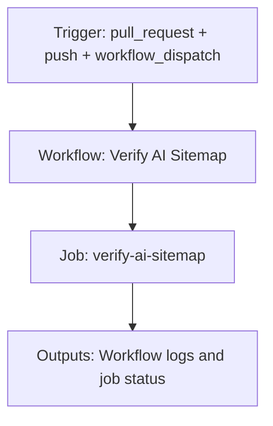

{/*
generated-file-banner: ai-tools-visual-library:v1
Generation Script: operations/scripts/generators/governance/catalogs/generate-ai-tools-visual-library.js
Purpose: AI-tools canonical visual library for workflows and dispatcher actions.
Run when: GitHub workflows, dispatcher definitions, registry coverage, or visual-library contracts change.
Run command: node operations/scripts/generators/governance/catalogs/generate-ai-tools-visual-library.js --write
*/}

<Note>
**Generation Script**: This file is generated from script(s): `operations/scripts/generators/governance/catalogs/generate-ai-tools-visual-library.js`.  
**Purpose**: AI-tools canonical visual library for workflows and dispatcher actions.  
**Run when**: GitHub workflows, dispatcher definitions, registry coverage, or visual-library contracts change.  
**Important**: Do not manually edit this file; run `node operations/scripts/generators/governance/catalogs/generate-ai-tools-visual-library.js --write`.  
</Note>

# Verify AI Sitemap

## Summary

Verify AI Sitemap runs on pull_request, push, workflow_dispatch and primarily produces workflow logs and job status.

## Why It Exists

Govern the `.github/workflows/verify-ai-sitemap.yml` workflow as a human-readable, visually explorable source-of-truth page inside `ai-tools/registry/workflows`.

## Triggers

- pull_request: branches=docs-v2
- push: branches=docs-v2
- workflow_dispatch: default event configuration

## Jobs

| Job ID | Name | Runs On | Needs | Step Count |
| --- | --- | --- | --- | --- |
| `verify-ai-sitemap` | verify-ai-sitemap | `ubuntu-latest` | none | 4 |

### verify-ai-sitemap

- `Checkout repository` | uses actions/checkout@v4
- `Set up Node.js` | uses actions/setup-node@v4
- `Install dependencies` | runs `cd tools && npm install`
- `Verify AI sitemap output` | runs `node operations/scripts/generators/content/seo/generate-ai-sitemap.js --check`

## Inputs

- No explicit workflow inputs declared.

## Second Pass Assessment

- Workflow family: `ai-runtime-artifacts`
- Usage status: `active`
- Cleanup decision: `merge`
- Process fit: `handover-support`
- Consolidation target: `future:ai-runtime-artifacts-workflow`
- Recommended engineering action: Merge this workflow with its sibling family into `future:ai-runtime-artifacts-workflow` so one workflow owns both check and write modes.

## Outputs

- Workflow logs and job status

## Dependencies

- action:actions/checkout@v4
- action:actions/setup-node@v4
- operations/scripts/generators/content/seo/generate-ai-sitemap.js

## Dependants

- dispatcher:handover-readiness

## Mermaid Pipeline

## Frailty And Risk

- Current heuristic risk level is `low`; no exceptional frailty markers were detected in the file scan.

## Consolidation Notes

Dispatcher suggestion: `handover-readiness`. Second-pass target: `future:ai-runtime-artifacts-workflow`. This is a governance recommendation, not an automatic rewrite instruction.

## Cleanup Rationale

- This family already has obvious check/generate pairings that likely want one governed workflow with mode flags.

## Handover Notes

Use this page as the human-facing workflow brief during audits, cleanup, and handover. Promote any missing operational knowledge back into the canonical page rather than leaving it in chat.
