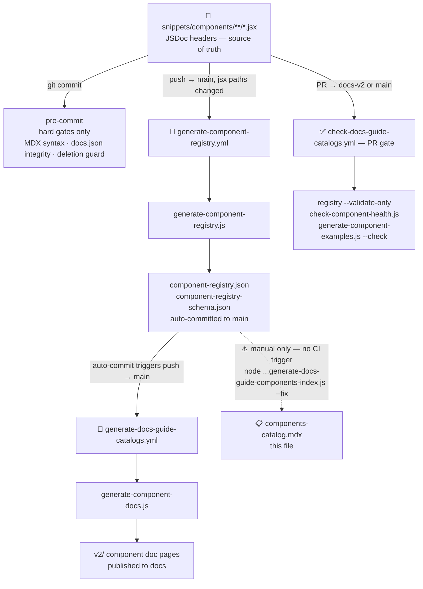

{/*
generated-file-banner: generated-file-banner:v1
Generation Script: operations/scripts/generators/governance/catalogs/generate-docs-guide-components-index.js
Purpose: Generated inventory of governed component exports from docs-guide/config/component-registry.json and docs-guide/config/component-usage-map.json.
Run when: Component governance metadata, registry output, or usage-map output changes.
Run command: node operations/scripts/generators/governance/catalogs/generate-docs-guide-components-index.js --fix
*/}

import { BorderedBox } from "/snippets/components/wrappers/containers/Containers.jsx"
import { SearchTable } from "/snippets/components/displays/tables/Tables.jsx"
import { DynamicTable } from "/snippets/components/displays/tables/Tables.jsx"

{/* should not be here.  */}
export const componentTableData = [
  { Name: 'MermaidColours', Category: 'config', Status: 'stable', File: 'snippets/components/config/MermaidColours.jsx' },
  { Name: 'CardVideo', Category: 'displays', Status: 'stable', File: 'snippets/components/displays/video/Video.jsx' },
  { Name: 'CodeComponent', Category: 'displays', Status: 'stable', File: 'snippets/components/displays/code/Code.jsx' },
  { Name: 'CodeSection', Category: 'displays', Status: 'stable', File: 'snippets/components/displays/code/Code.jsx' },
  { Name: 'ComplexCodeBlock', Category: 'displays', Status: 'stable', File: 'snippets/components/displays/code/Code.jsx' },
  { Name: 'CustomCodeBlock', Category: 'displays', Status: 'stable', File: 'snippets/components/displays/code/Code.jsx' },
  { Name: 'CustomResponseField', Category: 'displays', Status: 'stable', File: 'snippets/components/displays/response-fields/ResponseField.jsx' },
  { Name: 'FrameQuote', Category: 'displays', Status: 'stable', File: 'snippets/components/displays/quotes/Quote.jsx' },
  { Name: 'LinkedInEmbed', Category: 'displays', Status: 'stable', File: 'snippets/components/displays/video/Video.jsx' },
  { Name: 'Quote', Category: 'displays', Status: 'stable', File: 'snippets/components/displays/quotes/Quote.jsx' },
  { Name: 'ResponseFieldAccordion', Category: 'displays', Status: 'stable', File: 'snippets/components/displays/response-fields/ResponseField.jsx' },
  { Name: 'ResponseFieldExpandable', Category: 'displays', Status: 'stable', File: 'snippets/components/displays/response-fields/ResponseField.jsx' },
  { Name: 'ResponseFieldGroup', Category: 'displays', Status: 'stable', File: 'snippets/components/displays/response-fields/ResponseField.jsx' },
  { Name: 'ScrollableDiagram', Category: 'displays', Status: 'stable', File: 'snippets/components/displays/diagrams/ScrollableDiagram.jsx' },
  { Name: 'ShowcaseVideo', Category: 'displays', Status: 'stable', File: 'snippets/components/displays/video/Video.jsx' },
  { Name: 'TitledVideo', Category: 'displays', Status: 'stable', File: 'snippets/components/displays/video/Video.jsx' },
  { Name: 'ValueResponseField', Category: 'displays', Status: 'stable', File: 'snippets/components/displays/response-fields/ResponseField.jsx' },
  { Name: 'Video', Category: 'displays', Status: 'stable', File: 'snippets/components/displays/video/Video.jsx' },
  { Name: 'YouTubeVideo', Category: 'displays', Status: 'stable', File: 'snippets/components/displays/video/Video.jsx' },
  { Name: 'YouTubeVideoData', Category: 'displays', Status: 'stable', File: 'snippets/components/displays/video/Video.jsx' },
  { Name: 'YouTubeVideoDownload', Category: 'displays', Status: 'stable', File: 'snippets/components/displays/video/Video.jsx' },
  { Name: 'AccordionTitleWithArrow', Category: 'elements', Status: 'stable', File: 'snippets/components/elements/text/Text.jsx' },
  { Name: 'BlinkingIcon', Category: 'elements', Status: 'stable', File: 'snippets/components/elements/links/Links.jsx' },
  { Name: 'BlinkingTerminal', Category: 'elements', Status: 'stable', File: 'snippets/components/elements/links/Links.jsx' },
  { Name: 'CardTitleTextWithArrow', Category: 'elements', Status: 'stable', File: 'snippets/components/elements/text/Text.jsx' },
  { Name: 'ComingSoonCallout', Category: 'elements', Status: 'stable', File: 'snippets/components/elements/callouts/PreviewCallouts.jsx' },
  { Name: 'CopyText', Category: 'elements', Status: 'stable', File: 'snippets/components/elements/text/Text.jsx' },
  { Name: 'CustomCallout', Category: 'elements', Status: 'stable', File: 'snippets/components/elements/links/Links.jsx' },
  { Name: 'CustomCardTitle', Category: 'elements', Status: 'stable', File: 'snippets/components/elements/text/CustomCardTitle.jsx' },
  { Name: 'CustomDivider', Category: 'elements', Status: 'stable', File: 'snippets/components/elements/spacing/Divider.jsx' },
  { Name: 'DoubleIconLink', Category: 'elements', Status: 'stable', File: 'snippets/components/elements/links/Links.jsx' },
  { Name: 'DownloadButton', Category: 'elements', Status: 'stable', File: 'snippets/components/elements/buttons/Buttons.jsx' },
  { Name: 'FocusableScrollRegions', Category: 'elements', Status: 'stable', File: 'snippets/components/elements/a11y/A11y.jsx' },
  { Name: 'GotoCard', Category: 'elements', Status: 'stable', File: 'snippets/components/elements/links/Links.jsx' },
  { Name: 'GotoLink', Category: 'elements', Status: 'stable', File: 'snippets/components/elements/links/Links.jsx' },
  { Name: 'Image', Category: 'elements', Status: 'stable', File: 'snippets/components/elements/images/Image.jsx' },
  { Name: 'LinkArrow', Category: 'elements', Status: 'stable', File: 'snippets/components/elements/links/Links.jsx' },
  { Name: 'LinkImage', Category: 'elements', Status: 'stable', File: 'snippets/components/elements/images/Image.jsx' },
  { Name: 'LivepeerIcon', Category: 'elements', Status: 'stable', File: 'snippets/components/elements/icons/Icons.jsx' },
  { Name: 'LivepeerSVG', Category: 'elements', Status: 'stable', File: 'snippets/components/elements/icons/Icons.jsx' },
  { Name: 'MathBlock', Category: 'elements', Status: 'stable', File: 'snippets/components/elements/math/Math.jsx' },
  { Name: 'MathInline', Category: 'elements', Status: 'stable', File: 'snippets/components/elements/math/Math.jsx' },
  { Name: 'PreviewCallout', Category: 'elements', Status: 'stable', File: 'snippets/components/elements/callouts/PreviewCallouts.jsx' },
  { Name: 'ReviewCallout', Category: 'elements', Status: 'stable', File: 'snippets/components/elements/callouts/PreviewCallouts.jsx' },
  { Name: 'SocialLinks', Category: 'elements', Status: 'stable', File: 'snippets/components/elements/social/SocialLinks.jsx' },
  { Name: 'Spacer', Category: 'elements', Status: 'stable', File: 'snippets/components/elements/spacing/Spacer.jsx' },
  { Name: 'Subtitle', Category: 'elements', Status: 'stable', File: 'snippets/components/elements/text/Text.jsx' },
  { Name: 'TipWithArrow', Category: 'elements', Status: 'stable', File: 'snippets/components/elements/links/Links.jsx' },
  { Name: 'BlogCard', Category: 'integrators', Status: 'stable', File: 'snippets/components/integrators/blog/Data.jsx' },
  { Name: 'BlogDataLayout', Category: 'integrators', Status: 'stable', File: 'snippets/components/integrators/blog/Data.jsx' },
  { Name: 'CardBlogDataLayout', Category: 'integrators', Status: 'stable', File: 'snippets/components/integrators/blog/Data.jsx' },
  { Name: 'CardColumnsPostLayout', Category: 'integrators', Status: 'stable', File: 'snippets/components/integrators/blog/Data.jsx' },
  { Name: 'CardInCardLayout', Category: 'integrators', Status: 'stable', File: 'snippets/components/integrators/blog/Data.jsx' },
  { Name: 'CoinGeckoExchanges', Category: 'integrators', Status: 'stable', File: 'snippets/components/integrators/feeds/Coingecko.jsx' },
  { Name: 'ColumnsBlogCardLayout', Category: 'integrators', Status: 'stable', File: 'snippets/components/integrators/blog/Data.jsx' },
  { Name: 'DiscordAnnouncements', Category: 'integrators', Status: 'stable', File: 'snippets/components/integrators/blog/Data.jsx' },
  { Name: 'ExternalContent', Category: 'integrators', Status: 'stable', File: 'snippets/components/integrators/embeds/ExternalContent.jsx' },
  { Name: 'ForumLatestLayout', Category: 'integrators', Status: 'stable', File: 'snippets/components/integrators/blog/Data.jsx' },
  { Name: 'LatestVersion', Category: 'integrators', Status: 'experimental', File: 'snippets/components/integrators/feeds/Release.jsx' },
  { Name: 'LumaEvents', Category: 'integrators', Status: 'stable', File: 'snippets/components/integrators/blog/Data.jsx' },
  { Name: 'MarkdownEmbed', Category: 'integrators', Status: 'stable', File: 'snippets/components/integrators/embeds/DataEmbed.jsx' },
  { Name: 'PdfEmbed', Category: 'integrators', Status: 'stable', File: 'snippets/components/integrators/embeds/DataEmbed.jsx' },
  { Name: 'PostCard', Category: 'integrators', Status: 'stable', File: 'snippets/components/integrators/blog/Data.jsx' },
  { Name: 'ShowcaseCards', Category: 'integrators', Status: 'experimental', File: 'snippets/components/integrators/feeds/ShowcaseCards.jsx' },
  { Name: 'TwitterTimeline', Category: 'integrators', Status: 'stable', File: 'snippets/components/integrators/embeds/DataEmbed.jsx' },
  { Name: 'YouTubeVideoData', Category: 'integrators', Status: 'stable', File: 'snippets/components/integrators/video-data/VideoData.jsx' },
  { Name: 'Divider', Category: 'scaffolding', Status: 'stable', File: 'snippets/components/scaffolding/frame-mode/FrameMode.jsx' },
  { Name: 'H1', Category: 'scaffolding', Status: 'stable', File: 'snippets/components/scaffolding/frame-mode/FrameMode.jsx' },
  { Name: 'H2', Category: 'scaffolding', Status: 'stable', File: 'snippets/components/scaffolding/frame-mode/FrameMode.jsx' },
  { Name: 'H3', Category: 'scaffolding', Status: 'stable', File: 'snippets/components/scaffolding/frame-mode/FrameMode.jsx' },
  { Name: 'H4', Category: 'scaffolding', Status: 'stable', File: 'snippets/components/scaffolding/frame-mode/FrameMode.jsx' },
  { Name: 'H5', Category: 'scaffolding', Status: 'stable', File: 'snippets/components/scaffolding/frame-mode/FrameMode.jsx' },
  { Name: 'H6', Category: 'scaffolding', Status: 'stable', File: 'snippets/components/scaffolding/frame-mode/FrameMode.jsx' },
  { Name: 'HeroContentContainer', Category: 'scaffolding', Status: 'stable', File: 'snippets/components/scaffolding/portals/Portals.jsx' },
  { Name: 'HeroImageBackgroundComponent', Category: 'scaffolding', Status: 'stable', File: 'snippets/components/scaffolding/portals/Portals.jsx' },
  { Name: 'HeroOverviewContent', Category: 'scaffolding', Status: 'stable', File: 'snippets/components/scaffolding/portals/Portals.jsx' },
  { Name: 'HeroSectionContainer', Category: 'scaffolding', Status: 'stable', File: 'snippets/components/scaffolding/portals/Portals.jsx' },
  { Name: 'LogoHeroContainer', Category: 'scaffolding', Status: 'stable', File: 'snippets/components/scaffolding/portals/Portals.jsx' },
  { Name: 'P', Category: 'scaffolding', Status: 'stable', File: 'snippets/components/scaffolding/frame-mode/FrameMode.jsx' },
  { Name: 'PageHeader', Category: 'scaffolding', Status: 'stable', File: 'snippets/components/scaffolding/frame-mode/FrameMode.jsx' },
  { Name: 'PortalCardsHeader', Category: 'scaffolding', Status: 'stable', File: 'snippets/components/scaffolding/portals/Portals.jsx' },
  { Name: 'PortalContentContainer', Category: 'scaffolding', Status: 'stable', File: 'snippets/components/scaffolding/portals/Portals.jsx' },
  { Name: 'PortalHeroContent', Category: 'scaffolding', Status: 'stable', File: 'snippets/components/scaffolding/portals/Portals.jsx' },
  { Name: 'PortalSectionHeader', Category: 'scaffolding', Status: 'stable', File: 'snippets/components/scaffolding/portals/Portals.jsx' },
  { Name: 'RefCardContainer', Category: 'scaffolding', Status: 'stable', File: 'snippets/components/scaffolding/portals/Portals.jsx' },
  { Name: 'Starfield', Category: 'scaffolding', Status: 'stable', File: 'snippets/components/scaffolding/heroes/HeroGif.jsx' },
  { Name: 'AccordionGroupList', Category: 'wrappers', Status: 'stable', File: 'snippets/components/displays/accordions/Accordions.jsx' },
  { Name: 'AccordionLayout', Category: 'wrappers', Status: 'stable', File: 'snippets/components/displays/accordions/Accordions.jsx' },
  { Name: 'BasicList', Category: 'wrappers', Status: 'planned', File: 'snippets/components/displays/steps/Steps.jsx' },
  { Name: 'BorderedBox', Category: 'wrappers', Status: 'stable', File: 'snippets/components/wrappers/containers/Containers.jsx' },
  { Name: 'CardCarousel', Category: 'wrappers', Status: 'stable', File: 'snippets/components/displays/grids/Grids.jsx' },
  { Name: 'CenteredContainer', Category: 'wrappers', Status: 'stable', File: 'snippets/components/wrappers/containers/Containers.jsx' },
  { Name: 'DisplayCard', Category: 'wrappers', Status: 'stable', File: 'snippets/components/displays/cards/Cards.jsx' },
  { Name: 'DynamicTable', Category: 'wrappers', Status: 'stable', File: 'snippets/components/displays/tables/Tables.jsx' },
  { Name: 'FlexContainer', Category: 'wrappers', Status: 'stable', File: 'snippets/components/wrappers/containers/Layout.jsx' },
  { Name: 'FullWidthContainer', Category: 'wrappers', Status: 'stable', File: 'snippets/components/wrappers/containers/Containers.jsx' },
  { Name: 'GridContainer', Category: 'wrappers', Status: 'stable', File: 'snippets/components/wrappers/containers/Layout.jsx' },
  { Name: 'IconList', Category: 'wrappers', Status: 'planned', File: 'snippets/components/displays/steps/Steps.jsx' },
  { Name: 'InlineImageCard', Category: 'wrappers', Status: 'stable', File: 'snippets/components/displays/cards/Cards.jsx' },
  { Name: 'InteractiveCard', Category: 'wrappers', Status: 'stable', File: 'snippets/components/displays/cards/Cards.jsx' },
  { Name: 'InteractiveCards', Category: 'wrappers', Status: 'stable', File: 'snippets/components/displays/cards/Cards.jsx' },
  { Name: 'ListSteps', Category: 'wrappers', Status: 'stable', File: 'snippets/components/displays/steps/Steps.jsx' },
  { Name: 'QuadGrid', Category: 'wrappers', Status: 'stable', File: 'snippets/components/displays/grids/Grids.jsx' },
  { Name: 'ScrollBox', Category: 'wrappers', Status: 'stable', File: 'snippets/components/wrappers/containers/ScrollBox.jsx' },
  { Name: 'SearchTable', Category: 'wrappers', Status: 'stable', File: 'snippets/components/displays/tables/Tables.jsx' },
  { Name: 'ShowcaseCards', Category: 'wrappers', Status: 'stable', File: 'snippets/components/displays/cards/Cards.jsx' },
  { Name: 'Spacer', Category: 'wrappers', Status: 'stable', File: 'snippets/components/wrappers/containers/Layout.jsx' },
  { Name: 'StepLinkList', Category: 'wrappers', Status: 'stable', File: 'snippets/components/displays/steps/Steps.jsx' },
  { Name: 'StepList', Category: 'wrappers', Status: 'stable', File: 'snippets/components/displays/steps/Steps.jsx' },
  { Name: 'StyledStep', Category: 'wrappers', Status: 'stable', File: 'snippets/components/displays/steps/Steps.jsx' },
  { Name: 'StyledSteps', Category: 'wrappers', Status: 'stable', File: 'snippets/components/displays/steps/Steps.jsx' },
  { Name: 'StyledTable', Category: 'wrappers', Status: 'stable', File: 'snippets/components/displays/tables/Tables.jsx' },
  { Name: 'TableCell', Category: 'wrappers', Status: 'stable', File: 'snippets/components/displays/tables/Tables.jsx' },
  { Name: 'TableRow', Category: 'wrappers', Status: 'stable', File: 'snippets/components/displays/tables/Tables.jsx' },
  { Name: 'UpdateLinkList', Category: 'wrappers', Status: 'stable', File: 'snippets/components/displays/steps/Steps.jsx' },
  { Name: 'UpdateList', Category: 'wrappers', Status: 'planned', File: 'snippets/components/displays/steps/Steps.jsx' },
  { Name: 'WidthCard', Category: 'wrappers', Status: 'stable', File: 'snippets/components/displays/cards/Cards.jsx' },
];

<Tip>
This file is an auto-generated index catalog for all available Livepeer Custom Components  
</Tip>
<Danger> Do not manually edit this file </Danger>

<Expandable title="Script Generation Details">
**Generation Script**
- This file is generated from script(s): `operations/scripts/generators/governance/catalogs/generate-docs-guide-components-index.js`.

**Purpose**
- Generated inventory of governed component exports from docs-guide/config/component-registry.json and docs-guide/config/component-usage-map.json.

**Run when**
- Component governance metadata, registry output, or usage-map output changes.  

**Important**
- Do not manually edit this file; run `node operations/scripts/generators/governance/catalogs/generate-docs-guide-components-index.js --fix`.

## Script Pipeline

</Expandable>

<CustomDivider />

## Component Tree

<Tree>
  <Tree.Folder name="snippets/components" defaultOpen>
    <Tree.Folder name="elements">
      <Tree.File name="a11y/A11y.jsx" />
      <Tree.File name="buttons/Buttons.jsx" />
      <Tree.File name="callouts/PreviewCallouts.jsx" />
      <Tree.File name="links/Links.jsx" />
      <Tree.File name="spacing/Divider.jsx" />
      <Tree.File name="text/CustomCardTitle.jsx" />
      <Tree.File name="text/Text.jsx" />
    </Tree.Folder>
    <Tree.Folder name="wrappers">
      <Tree.File name="cards/Cards.jsx" />
      <Tree.File name="containers/Containers.jsx" />
      <Tree.File name="grids/Grids.jsx" />
      <Tree.File name="tabs/Tabs.jsx" />
    </Tree.Folder>
    <Tree.Folder name="displays">
      <Tree.File name="badges/Badges.jsx" />
      <Tree.File name="quotes/Quote.jsx" />
      <Tree.File name="stats/Stats.jsx" />
      <Tree.File name="tables/Tables.jsx" />
      <Tree.File name="video/Video.jsx" />
    </Tree.Folder>
    <Tree.Folder name="scaffolding">
      <Tree.File name="embeds/DataEmbed.jsx" />
      <Tree.File name="images/Image.jsx" />
      <Tree.File name="layouts/Layouts.jsx" />
      <Tree.File name="navigation/Navigation.jsx" />
    </Tree.Folder>
    <Tree.Folder name="integrators">
      <Tree.File name="embeds/Embeds.jsx" />
      <Tree.File name="forms/Forms.jsx" />
      <Tree.File name="social/Social.jsx" />
    </Tree.Folder>
    <Tree.Folder name="config">
      <Tree.File name="theme/Theme.jsx" />
    </Tree.Folder>
  </Tree.Folder>
</Tree>

{/* ## Component Framework - SHOULD LINK TO THE PAGE THAT HAS THIS

Categorisation:

<Expandable title="JsDocs Headers">
Jsdocs Template Here with definition and use of each "tag"
-> separate to generic jsdocs items
-> our custom extension

<Expandable />

## Component Tooling */}
{/* Tooling available for components */}

## Component Summary

The governed component library currently exposes **121** named export(s).

| Category | Exports | 🟢 Stable | 🧪 Experimental | 🟠 Deprecated | 🔴 Broken | ⬜ Placeholder | Unused |
| --- | --- | --- | --- | --- | --- | --- | --- |
| [Elements](#elements) | 30 | 27 | 0 | 3 | 0 | 0 | 2 |
| [Wrappers](#wrappers) | 31 | 28 | 0 | 0 | 3 | 0 | 5 |
| [Displays](#displays) | 20 | 20 | 0 | 0 | 0 | 0 | 1 |
| [Scaffolding](#scaffolding) | 20 | 20 | 0 | 0 | 0 | 0 | 4 |
| [Integrators](#integrators) | 19 | 16 | 2 | 1 | 0 | 0 | 2 |
| [Config](#config) | 1 | 1 | 0 | 0 | 0 | 0 | 1 |
| **Total** | **121** | **112** | **2** | **4** | **3** | **0** | **15** |

# Components: Searchable

<SearchTable
  TableComponent={DynamicTable}
  headerList={['Name', 'Category', 'Status', 'File']}
  itemsList={componentTableData}
  searchColumns={['Name', 'Category', 'Status']}
  categoryColumn="Category"
  monospaceColumns={['File']}
  searchPlaceholder="Search by name or category..."
/>

# Components by Type

<BorderedBox style={{width: "fit-content"}}>
**Status Key**  
🟢 stable  
🧪 experimental  
🟠 deprecated  
🔴 broken  
⬜ placeholder  
</BorderedBox>

## Elements

<AccordionGroup>

<Accordion title="🟢 AccordionTitleWithArrow">
<ResponseField name="status" type="string">`stable`</ResponseField>
<ResponseField name="description" type="string">Accordion header text with trailing arrow icon.</ResponseField>
<ResponseField name="file" type="string">`/snippets/components/elements/text/Text.jsx`</ResponseField>
<ResponseField name="usage" type="string">in use</ResponseField>
</Accordion>

<Accordion title="🟠 BasicBtn">
<ResponseField name="status" type="string">`deprecated`</ResponseField>
<ResponseField name="description" type="string">Empty placeholder button stub — non-functional.</ResponseField>
<ResponseField name="file" type="string">`/snippets/components/elements/buttons/Buttons.jsx`</ResponseField>
<ResponseField name="usage" type="string">in use</ResponseField>
</Accordion>

<Accordion title="🟢 BlinkingIcon">
<ResponseField name="status" type="string">`stable`</ResponseField>
<ResponseField name="description" type="string">Animated icon with pulsing opacity. Respects prefers-reduced-motion.</ResponseField>
<ResponseField name="file" type="string">`/snippets/components/elements/links/Links.jsx`</ResponseField>
<ResponseField name="usage" type="string">in use</ResponseField>
</Accordion>

<Accordion title="🟢 BlinkingTerminal">
<ResponseField name="status" type="string">`stable`</ResponseField>
<ResponseField name="description" type="string">Preset blinking terminal icon (alias for BlinkingIcon with terminal defaults).</ResponseField>
<ResponseField name="file" type="string">`/snippets/components/elements/links/Links.jsx`</ResponseField>
<ResponseField name="usage" type="string">in use</ResponseField>
</Accordion>

<Accordion title="🟢 CardTitleTextWithArrow">
<ResponseField name="status" type="string">`stable`</ResponseField>
<ResponseField name="description" type="string">Card title with trailing arrow icon for navigation indication.</ResponseField>
<ResponseField name="file" type="string">`/snippets/components/elements/text/Text.jsx`</ResponseField>
<ResponseField name="usage" type="string">in use</ResponseField>
</Accordion>

<Accordion title="🟢 ComingSoonCallout">
<ResponseField name="status" type="string">`stable`</ResponseField>
<ResponseField name="description" type="string">Banner indicating a feature or page is coming soon, with links to related resources.</ResponseField>
<ResponseField name="file" type="string">`/snippets/components/elements/callouts/PreviewCallouts.jsx`</ResponseField>
<ResponseField name="usage" type="string">in use</ResponseField>
</Accordion>

<Accordion title="🟢 CopyText">
<ResponseField name="status" type="string">`stable`</ResponseField>
<ResponseField name="description" type="string">Text with a click-to-copy button that copies content to clipboard.</ResponseField>
<ResponseField name="file" type="string">`/snippets/components/elements/text/Text.jsx`</ResponseField>
<ResponseField name="usage" type="string">in use</ResponseField>
</Accordion>

<Accordion title="🟢 CustomCallout">
<ResponseField name="status" type="string">`stable`</ResponseField>
<ResponseField name="description" type="string">Styled callout box with icon, custom colour, and child content.</ResponseField>
<ResponseField name="file" type="string">`/snippets/components/elements/links/Links.jsx`</ResponseField>
<ResponseField name="usage" type="string">in use</ResponseField>
</Accordion>

<Accordion title="🟢 CustomCardTitle">
<ResponseField name="status" type="string">`stable`</ResponseField>
<ResponseField name="description" type="string">Card title row with icon and text, using flexbox alignment.</ResponseField>
<ResponseField name="file" type="string">`/snippets/components/elements/text/CustomCardTitle.jsx`</ResponseField>
<ResponseField name="usage" type="string">in use</ResponseField>
</Accordion>

<Accordion title="🟢 CustomDivider">
<ResponseField name="status" type="string">`stable`</ResponseField>
<ResponseField name="description" type="string">Themed horizontal divider with optional centre text and Livepeer logo accents.</ResponseField>
<ResponseField name="file" type="string">`/snippets/components/elements/spacing/Divider.jsx`</ResponseField>
<ResponseField name="usage" type="string">in use</ResponseField>
</Accordion>

<Accordion title="🟢 DoubleIconLink">
<ResponseField name="status" type="string">`stable`</ResponseField>
<ResponseField name="description" type="string">Inline link with icons on both sides.</ResponseField>
<ResponseField name="file" type="string">`/snippets/components/elements/links/Links.jsx`</ResponseField>
<ResponseField name="usage" type="string">in use</ResponseField>
</Accordion>

<Accordion title="🟢 DownloadButton">
<ResponseField name="status" type="string">`stable`</ResponseField>
<ResponseField name="description" type="string">Lazy-loaded download button with icon that renders on viewport intersection.</ResponseField>
<ResponseField name="file" type="string">`/snippets/components/elements/buttons/Buttons.jsx`</ResponseField>
<ResponseField name="usage" type="string">in use</ResponseField>
</Accordion>

<Accordion title="🟢 FocusableScrollRegions">
<ResponseField name="status" type="string">`stable`</ResponseField>
<ResponseField name="description" type="string">Makes scroll regions keyboard-focusable by adding tabindex to matching selectors.</ResponseField>
<ResponseField name="file" type="string">`/snippets/components/elements/a11y/A11y.jsx`</ResponseField>
<ResponseField name="usage" type="string">in use</ResponseField>
</Accordion>

<Accordion title="🟢 GotoCard">
<ResponseField name="status" type="string">`stable`</ResponseField>
<ResponseField name="description" type="string">Card-style navigation link wrapping Mintlify Card component.</ResponseField>
<ResponseField name="file" type="string">`/snippets/components/elements/links/Links.jsx`</ResponseField>
<ResponseField name="usage" type="string">in use</ResponseField>
</Accordion>

<Accordion title="🟢 GotoLink">
<ResponseField name="status" type="string">`stable`</ResponseField>
<ResponseField name="description" type="string">Inline navigation link with icon prefix and label.</ResponseField>
<ResponseField name="file" type="string">`/snippets/components/elements/links/Links.jsx`</ResponseField>
<ResponseField name="usage" type="string">in use</ResponseField>
</Accordion>

<Accordion title="🟢 Image">
<ResponseField name="status" type="string">`stable`</ResponseField>
<ResponseField name="description" type="string">Framed image with optional caption and full-width toggle.</ResponseField>
<ResponseField name="file" type="string">`/snippets/components/elements/images/Image.jsx`</ResponseField>
<ResponseField name="usage" type="string">in use</ResponseField>
</Accordion>

<Accordion title="🟢 LinkArrow">
<ResponseField name="status" type="string">`stable`</ResponseField>
<ResponseField name="description" type="string">External link with arrow icon, optional description, and line break control.</ResponseField>
<ResponseField name="file" type="string">`/snippets/components/elements/links/Links.jsx`</ResponseField>
<ResponseField name="usage" type="string">in use</ResponseField>
</Accordion>

<Accordion title="🟢 LinkImage">
<ResponseField name="status" type="string">`stable`</ResponseField>
<ResponseField name="description" type="string">Clickable framed image that opens a URL in a new tab.</ResponseField>
<ResponseField name="file" type="string">`/snippets/components/elements/images/Image.jsx`</ResponseField>
<ResponseField name="usage" type="string">in use</ResponseField>
</Accordion>

<Accordion title="🟢 LivepeerIcon">
<ResponseField name="status" type="string">`stable`</ResponseField>
<ResponseField name="description" type="string">Theme-aware Livepeer icon with CSS custom property colour adaptation.</ResponseField>
<ResponseField name="file" type="string">`/snippets/components/elements/icons/Icons.jsx`</ResponseField>
<ResponseField name="usage" type="string">in use</ResponseField>
</Accordion>

<Accordion title="🟠 LivepeerIconFlipped">
<ResponseField name="status" type="string">`deprecated`</ResponseField>
<ResponseField name="description" type="string">Horizontally flipped legacy Livepeer icon.</ResponseField>
<ResponseField name="file" type="string">`/snippets/components/elements/icons/Icons.jsx`</ResponseField>
<ResponseField name="usage" type="string">in use</ResponseField>
</Accordion>

<Accordion title="🟠 LivepeerIconOld">
<ResponseField name="status" type="string">`deprecated`</ResponseField>
<ResponseField name="description" type="string">Legacy Livepeer icon using light-only SVG path.</ResponseField>
<ResponseField name="file" type="string">`/snippets/components/elements/icons/Icons.jsx`</ResponseField>
<ResponseField name="usage" type="string">in use</ResponseField>
</Accordion>

<Accordion title="🟢 LivepeerSVG">
<ResponseField name="status" type="string">`stable`</ResponseField>
<ResponseField name="description" type="string">Inline Livepeer logo as SVG with currentColor fill.</ResponseField>
<ResponseField name="file" type="string">`/snippets/components/elements/icons/Icons.jsx`</ResponseField>
<ResponseField name="usage" type="string">in use</ResponseField>
</Accordion>

<Accordion title="🟢 MathBlock">
<ResponseField name="status" type="string">`stable`</ResponseField>
<ResponseField name="description" type="string">Renders LaTeX as a block-level math expression using KaTeX.</ResponseField>
<ResponseField name="file" type="string">`/snippets/components/elements/math/Math.jsx`</ResponseField>
<ResponseField name="usage" type="string">in use</ResponseField>
</Accordion>

<Accordion title="🟢 MathInline">
<ResponseField name="status" type="string">`stable`</ResponseField>
<ResponseField name="description" type="string">Renders LaTeX as inline math using KaTeX.</ResponseField>
<ResponseField name="file" type="string">`/snippets/components/elements/math/Math.jsx`</ResponseField>
<ResponseField name="usage" type="string">in use</ResponseField>
</Accordion>

<Accordion title="🟢 PreviewCallout">
<ResponseField name="status" type="string">`stable`</ResponseField>
<ResponseField name="description" type="string">Banner indicating content is in preview/draft state with feedback links.</ResponseField>
<ResponseField name="file" type="string">`/snippets/components/elements/callouts/PreviewCallouts.jsx`</ResponseField>
<ResponseField name="usage" type="string">in use</ResponseField>
</Accordion>

<Accordion title="🟢 ReviewCallout">
<ResponseField name="status" type="string">`stable`</ResponseField>
<ResponseField name="description" type="string">Banner indicating content is under review with status links.</ResponseField>
<ResponseField name="file" type="string">`/snippets/components/elements/callouts/PreviewCallouts.jsx`</ResponseField>
<ResponseField name="usage" type="string">unused</ResponseField>
</Accordion>

<Accordion title="🟢 SocialLinks">
<ResponseField name="status" type="string">`stable`</ResponseField>
<ResponseField name="description" type="string">Row of icon-only social media links with tooltips and aria-labels.</ResponseField>
<ResponseField name="file" type="string">`/snippets/components/elements/social/SocialLinks.jsx`</ResponseField>
<ResponseField name="usage" type="string">unused</ResponseField>
</Accordion>

<Accordion title="🟢 Spacer">
<ResponseField name="status" type="string">`stable`</ResponseField>
<ResponseField name="description" type="string">Empty spacer div with configurable size and direction.</ResponseField>
<ResponseField name="file" type="string">`/snippets/components/elements/spacing/Spacer.jsx`</ResponseField>
<ResponseField name="usage" type="string">in use</ResponseField>
</Accordion>

<Accordion title="🟢 Subtitle">
<ResponseField name="status" type="string">`stable`</ResponseField>
<ResponseField name="description" type="string">Styled subtitle text with configurable colour, size, and alignment.</ResponseField>
<ResponseField name="file" type="string">`/snippets/components/elements/text/Text.jsx`</ResponseField>
<ResponseField name="usage" type="string">in use</ResponseField>
</Accordion>

<Accordion title="🟢 TipWithArrow">
<ResponseField name="status" type="string">`stable`</ResponseField>
<ResponseField name="description" type="string">Callout box with tip icon and corner arrow indicator.</ResponseField>
<ResponseField name="file" type="string">`/snippets/components/elements/links/Links.jsx`</ResponseField>
<ResponseField name="usage" type="string">in use</ResponseField>
</Accordion>

</AccordionGroup>

## Wrappers

<AccordionGroup>

<Accordion title="🟢 AccordionGroupList">
<ResponseField name="status" type="string">`stable`</ResponseField>
<ResponseField name="description" type="string">Generates N numbered accordion sections inside an AccordionGroup.</ResponseField>
<ResponseField name="file" type="string">`/snippets/components/displays/accordions/Accordions.jsx`</ResponseField>
<ResponseField name="usage" type="string">unused</ResponseField>
</Accordion>

<Accordion title="🟢 AccordionLayout">
<ResponseField name="status" type="string">`stable`</ResponseField>
<ResponseField name="description" type="string">Vertical stack layout with small gap, designed for accordion content sections.</ResponseField>
<ResponseField name="file" type="string">`/snippets/components/displays/accordions/Accordions.jsx`</ResponseField>
<ResponseField name="usage" type="string">in use</ResponseField>
</Accordion>

<Accordion title="🔴 BasicList">
<ResponseField name="status" type="string">`broken`</ResponseField>
<ResponseField name="description" type="string">Non-functional stub — returns empty fragment.</ResponseField>
<ResponseField name="file" type="string">`/snippets/components/displays/steps/Steps.jsx`</ResponseField>
<ResponseField name="usage" type="string">in use</ResponseField>
</Accordion>

<Accordion title="🟢 BorderedBox">
<ResponseField name="status" type="string">`stable`</ResponseField>
<ResponseField name="description" type="string">Bordered container with configurable radius and background.</ResponseField>
<ResponseField name="file" type="string">`/snippets/components/wrappers/containers/Containers.jsx`</ResponseField>
<ResponseField name="usage" type="string">in use</ResponseField>
</Accordion>

<Accordion title="🟢 CardCarousel">
<ResponseField name="status" type="string">`stable`</ResponseField>
<ResponseField name="description" type="string">Paginated horizontal carousel with prev/next navigation and dot indicators.</ResponseField>
<ResponseField name="file" type="string">`/snippets/components/displays/grids/Grids.jsx`</ResponseField>
<ResponseField name="usage" type="string">unused</ResponseField>
</Accordion>

<Accordion title="🟢 CenteredContainer">
<ResponseField name="status" type="string">`stable`</ResponseField>
<ResponseField name="description" type="string">Horizontally centred container with configurable max-width.</ResponseField>
<ResponseField name="file" type="string">`/snippets/components/wrappers/containers/Containers.jsx`</ResponseField>
<ResponseField name="usage" type="string">in use</ResponseField>
</Accordion>

<Accordion title="🟢 DisplayCard">
<ResponseField name="status" type="string">`stable`</ResponseField>
<ResponseField name="description" type="string">Card with icon, custom title row, and body content.</ResponseField>
<ResponseField name="file" type="string">`/snippets/components/displays/cards/Cards.jsx`</ResponseField>
<ResponseField name="usage" type="string">in use</ResponseField>
</Accordion>

<Accordion title="🟢 DynamicTable">
<ResponseField name="status" type="string">`stable`</ResponseField>
<ResponseField name="description" type="string">Renders structured data as a scrollable table with section separators and accessible region.</ResponseField>
<ResponseField name="file" type="string">`/snippets/components/displays/tables/Tables.jsx`</ResponseField>
<ResponseField name="usage" type="string">in use</ResponseField>
</Accordion>

<Accordion title="🟢 FlexContainer">
<ResponseField name="status" type="string">`stable`</ResponseField>
<ResponseField name="description" type="string">Flexbox container with configurable direction, gap, and alignment.</ResponseField>
<ResponseField name="file" type="string">`/snippets/components/wrappers/containers/Layout.jsx`</ResponseField>
<ResponseField name="usage" type="string">in use</ResponseField>
</Accordion>

<Accordion title="🟢 FullWidthContainer">
<ResponseField name="status" type="string">`stable`</ResponseField>
<ResponseField name="description" type="string">Full-viewport-width container that breaks out of parent padding.</ResponseField>
<ResponseField name="file" type="string">`/snippets/components/wrappers/containers/Containers.jsx`</ResponseField>
<ResponseField name="usage" type="string">in use</ResponseField>
</Accordion>

<Accordion title="🟢 GridContainer">
<ResponseField name="status" type="string">`stable`</ResponseField>
<ResponseField name="description" type="string">CSS Grid container with configurable columns and gap.</ResponseField>
<ResponseField name="file" type="string">`/snippets/components/wrappers/containers/Layout.jsx`</ResponseField>
<ResponseField name="usage" type="string">in use</ResponseField>
</Accordion>

<Accordion title="🔴 IconList">
<ResponseField name="status" type="string">`broken`</ResponseField>
<ResponseField name="description" type="string">Non-functional stub — returns empty fragment.</ResponseField>
<ResponseField name="file" type="string">`/snippets/components/displays/steps/Steps.jsx`</ResponseField>
<ResponseField name="usage" type="string">in use</ResponseField>
</Accordion>

<Accordion title="🟢 InlineImageCard">
<ResponseField name="status" type="string">`stable`</ResponseField>
<ResponseField name="description" type="string">Card with inline image alongside content, using negative margin breakout.</ResponseField>
<ResponseField name="file" type="string">`/snippets/components/displays/cards/Cards.jsx`</ResponseField>
<ResponseField name="usage" type="string">in use</ResponseField>
</Accordion>

<Accordion title="🟢 InteractiveCard">
<ResponseField name="status" type="string">`stable`</ResponseField>
<ResponseField name="description" type="string">Single interactive card with hover effects.</ResponseField>
<ResponseField name="file" type="string">`/snippets/components/displays/cards/Cards.jsx`</ResponseField>
<ResponseField name="usage" type="string">unused</ResponseField>
</Accordion>

<Accordion title="🟢 InteractiveCards">
<ResponseField name="status" type="string">`stable`</ResponseField>
<ResponseField name="description" type="string">Multi-column layout of interactive cards.</ResponseField>
<ResponseField name="file" type="string">`/snippets/components/displays/cards/Cards.jsx`</ResponseField>
<ResponseField name="usage" type="string">unused</ResponseField>
</Accordion>

<Accordion title="🟢 ListSteps">
<ResponseField name="status" type="string">`stable`</ResponseField>
<ResponseField name="description" type="string">Renders an array of step items inside Mintlify Steps component.</ResponseField>
<ResponseField name="file" type="string">`/snippets/components/displays/steps/Steps.jsx`</ResponseField>
<ResponseField name="usage" type="string">unused</ResponseField>
</Accordion>

<Accordion title="🟢 QuadGrid">
<ResponseField name="status" type="string">`stable`</ResponseField>
<ResponseField name="description" type="string">2x2 grid with centred rotating icon overlay. Respects prefers-reduced-motion.</ResponseField>
<ResponseField name="file" type="string">`/snippets/components/displays/grids/Grids.jsx`</ResponseField>
<ResponseField name="usage" type="string">in use</ResponseField>
</Accordion>

<Accordion title="🟢 ScrollBox">
<ResponseField name="status" type="string">`stable`</ResponseField>
<ResponseField name="description" type="string">Scrollable container with max-height, overflow hint, and accessible region role.</ResponseField>
<ResponseField name="file" type="string">`/snippets/components/wrappers/containers/ScrollBox.jsx`</ResponseField>
<ResponseField name="usage" type="string">in use</ResponseField>
</Accordion>

<Accordion title="🟢 SearchTable">
<ResponseField name="status" type="string">`stable`</ResponseField>
<ResponseField name="description" type="string">Filterable table wrapper with search input and category dropdown.</ResponseField>
<ResponseField name="file" type="string">`/snippets/components/displays/tables/Tables.jsx`</ResponseField>
<ResponseField name="usage" type="string">in use</ResponseField>
</Accordion>

<Accordion title="🟢 ShowcaseCards">
<ResponseField name="status" type="string">`stable`</ResponseField>
<ResponseField name="description" type="string">Paginated card layout with search, category, and product filtering.</ResponseField>
<ResponseField name="file" type="string">`/snippets/components/displays/cards/Cards.jsx`</ResponseField>
<ResponseField name="usage" type="string">in use</ResponseField>
</Accordion>

<Accordion title="🟢 Spacer">
<ResponseField name="status" type="string">`stable`</ResponseField>
<ResponseField name="description" type="string">Spacer element with configurable size.</ResponseField>
<ResponseField name="file" type="string">`/snippets/components/wrappers/containers/Layout.jsx`</ResponseField>
<ResponseField name="usage" type="string">in use</ResponseField>
</Accordion>

<Accordion title="🟢 StepLinkList">
<ResponseField name="status" type="string">`stable`</ResponseField>
<ResponseField name="description" type="string">Renders listItems as Mintlify Steps with GotoLink navigation.</ResponseField>
<ResponseField name="file" type="string">`/snippets/components/displays/steps/Steps.jsx`</ResponseField>
<ResponseField name="usage" type="string">in use</ResponseField>
</Accordion>

<Accordion title="🟢 StepList">
<ResponseField name="status" type="string">`stable`</ResponseField>
<ResponseField name="description" type="string">Renders listItems as Mintlify Steps with title, icon, and content.</ResponseField>
<ResponseField name="file" type="string">`/snippets/components/displays/steps/Steps.jsx`</ResponseField>
<ResponseField name="usage" type="string">in use</ResponseField>
</Accordion>

<Accordion title="🟢 StyledStep">
<ResponseField name="status" type="string">`stable`</ResponseField>
<ResponseField name="description" type="string">Single step with configurable icon, size, and colour.</ResponseField>
<ResponseField name="file" type="string">`/snippets/components/displays/steps/Steps.jsx`</ResponseField>
<ResponseField name="usage" type="string">in use</ResponseField>
</Accordion>

<Accordion title="🟢 StyledSteps">
<ResponseField name="status" type="string">`stable`</ResponseField>
<ResponseField name="description" type="string">Wrapper around Mintlify Steps with custom icon styling via injected CSS.</ResponseField>
<ResponseField name="file" type="string">`/snippets/components/displays/steps/Steps.jsx`</ResponseField>
<ResponseField name="usage" type="string">in use</ResponseField>
</Accordion>

<Accordion title="🟢 StyledTable">
<ResponseField name="status" type="string">`stable`</ResponseField>
<ResponseField name="description" type="string">Full-width table with header row styling and rounded container.</ResponseField>
<ResponseField name="file" type="string">`/snippets/components/displays/tables/Tables.jsx`</ResponseField>
<ResponseField name="usage" type="string">in use</ResponseField>
</Accordion>

<Accordion title="🟢 TableCell">
<ResponseField name="status" type="string">`stable`</ResponseField>
<ResponseField name="description" type="string">Table cell that switches between th and td based on header prop.</ResponseField>
<ResponseField name="file" type="string">`/snippets/components/displays/tables/Tables.jsx`</ResponseField>
<ResponseField name="usage" type="string">in use</ResponseField>
</Accordion>

<Accordion title="🟢 TableRow">
<ResponseField name="status" type="string">`stable`</ResponseField>
<ResponseField name="description" type="string">Table row with optional header styling and hover effect.</ResponseField>
<ResponseField name="file" type="string">`/snippets/components/displays/tables/Tables.jsx`</ResponseField>
<ResponseField name="usage" type="string">in use</ResponseField>
</Accordion>

<Accordion title="🟢 UpdateLinkList">
<ResponseField name="status" type="string">`stable`</ResponseField>
<ResponseField name="description" type="string">Renders update items as linked entries inside Mintlify Update component.</ResponseField>
<ResponseField name="file" type="string">`/snippets/components/displays/steps/Steps.jsx`</ResponseField>
<ResponseField name="usage" type="string">in use</ResponseField>
</Accordion>

<Accordion title="🔴 UpdateList">
<ResponseField name="status" type="string">`broken`</ResponseField>
<ResponseField name="description" type="string">Non-functional — ignores props, renders hardcoded static content.</ResponseField>
<ResponseField name="file" type="string">`/snippets/components/displays/steps/Steps.jsx`</ResponseField>
<ResponseField name="usage" type="string">in use</ResponseField>
</Accordion>

<Accordion title="🟢 WidthCard">
<ResponseField name="status" type="string">`stable`</ResponseField>
<ResponseField name="description" type="string">Width-constrained card wrapper with configurable percentage width.</ResponseField>
<ResponseField name="file" type="string">`/snippets/components/displays/cards/Cards.jsx`</ResponseField>
<ResponseField name="usage" type="string">in use</ResponseField>
</Accordion>

</AccordionGroup>

## Displays

<AccordionGroup>

<Accordion title="🟢 CardVideo">
<ResponseField name="status" type="string">`stable`</ResponseField>
<ResponseField name="description" type="string">YouTube embed inside a Card wrapper with aspect-ratio iframe.</ResponseField>
<ResponseField name="file" type="string">`/snippets/components/displays/video/Video.jsx`</ResponseField>
<ResponseField name="usage" type="string">in use</ResponseField>
</Accordion>

<Accordion title="🟢 CodeComponent">
<ResponseField name="status" type="string">`stable`</ResponseField>
<ResponseField name="description" type="string">Simple code block with title and language syntax highlighting.</ResponseField>
<ResponseField name="file" type="string">`/snippets/components/displays/code/Code.jsx`</ResponseField>
<ResponseField name="usage" type="string">in use</ResponseField>
</Accordion>

<Accordion title="🟢 CodeSection">
<ResponseField name="status" type="string">`stable`</ResponseField>
<ResponseField name="description" type="string">Expandable code section with title header.</ResponseField>
<ResponseField name="file" type="string">`/snippets/components/displays/code/Code.jsx`</ResponseField>
<ResponseField name="usage" type="string">in use</ResponseField>
</Accordion>

<Accordion title="🟢 ComplexCodeBlock">
<ResponseField name="status" type="string">`stable`</ResponseField>
<ResponseField name="description" type="string">Code block with both pre-note and post-note sections.</ResponseField>
<ResponseField name="file" type="string">`/snippets/components/displays/code/Code.jsx`</ResponseField>
<ResponseField name="usage" type="string">in use</ResponseField>
</Accordion>

<Accordion title="🟢 CustomCodeBlock">
<ResponseField name="status" type="string">`stable`</ResponseField>
<ResponseField name="description" type="string">Code block with optional pre/post notes and expandable wrapper.</ResponseField>
<ResponseField name="file" type="string">`/snippets/components/displays/code/Code.jsx`</ResponseField>
<ResponseField name="usage" type="string">in use</ResponseField>
</Accordion>

<Accordion title="🟢 CustomResponseField">
<ResponseField name="status" type="string">`stable`</ResponseField>
<ResponseField name="description" type="string">Custom-styled API response field with configurable margin.</ResponseField>
<ResponseField name="file" type="string">`/snippets/components/displays/response-fields/ResponseField.jsx`</ResponseField>
<ResponseField name="usage" type="string">in use</ResponseField>
</Accordion>

<Accordion title="🟢 FrameQuote">
<ResponseField name="status" type="string">`stable`</ResponseField>
<ResponseField name="description" type="string">Framed blockquote with optional author, source link, and image.</ResponseField>
<ResponseField name="file" type="string">`/snippets/components/displays/quotes/Quote.jsx`</ResponseField>
<ResponseField name="usage" type="string">in use</ResponseField>
</Accordion>

<Accordion title="🟢 LinkedInEmbed">
<ResponseField name="status" type="string">`stable`</ResponseField>
<ResponseField name="description" type="string">LinkedIn post embed via responsive iframe with compact layout.</ResponseField>
<ResponseField name="file" type="string">`/snippets/components/displays/video/Video.jsx`</ResponseField>
<ResponseField name="usage" type="string">in use</ResponseField>
</Accordion>

<Accordion title="🟢 Quote">
<ResponseField name="status" type="string">`stable`</ResponseField>
<ResponseField name="description" type="string">Styled blockquote with accent border and centred italic text.</ResponseField>
<ResponseField name="file" type="string">`/snippets/components/displays/quotes/Quote.jsx`</ResponseField>
<ResponseField name="usage" type="string">in use</ResponseField>
</Accordion>

<Accordion title="🟢 ResponseFieldAccordion">
<ResponseField name="status" type="string">`stable`</ResponseField>
<ResponseField name="description" type="string">Accordion-style response field with collapsible detail section.</ResponseField>
<ResponseField name="file" type="string">`/snippets/components/displays/response-fields/ResponseField.jsx`</ResponseField>
<ResponseField name="usage" type="string">in use</ResponseField>
</Accordion>

<Accordion title="🟢 ResponseFieldExpandable">
<ResponseField name="status" type="string">`stable`</ResponseField>
<ResponseField name="description" type="string">Expandable response field that reveals nested content on click.</ResponseField>
<ResponseField name="file" type="string">`/snippets/components/displays/response-fields/ResponseField.jsx`</ResponseField>
<ResponseField name="usage" type="string">in use</ResponseField>
</Accordion>

<Accordion title="🟢 ResponseFieldGroup">
<ResponseField name="status" type="string">`stable`</ResponseField>
<ResponseField name="description" type="string">Container for grouping multiple response fields with consistent spacing.</ResponseField>
<ResponseField name="file" type="string">`/snippets/components/displays/response-fields/ResponseField.jsx`</ResponseField>
<ResponseField name="usage" type="string">unused</ResponseField>
</Accordion>

<Accordion title="🟢 ScrollableDiagram">
<ResponseField name="status" type="string">`stable`</ResponseField>
<ResponseField name="description" type="string">Pannable, zoomable diagram container with zoom controls and accessible buttons.</ResponseField>
<ResponseField name="file" type="string">`/snippets/components/displays/diagrams/ScrollableDiagram.jsx`</ResponseField>
<ResponseField name="usage" type="string">in use</ResponseField>
</Accordion>

<Accordion title="🟢 ShowcaseVideo">
<ResponseField name="status" type="string">`stable`</ResponseField>
<ResponseField name="description" type="string">Full-width video with negative-margin breakout and rounded frame.</ResponseField>
<ResponseField name="file" type="string">`/snippets/components/displays/video/Video.jsx`</ResponseField>
<ResponseField name="usage" type="string">in use</ResponseField>
</Accordion>

<Accordion title="🟢 TitledVideo">
<ResponseField name="status" type="string">`stable`</ResponseField>
<ResponseField name="description" type="string">Auto-playing video with title/subtitle overlay. Respects prefers-reduced-motion.</ResponseField>
<ResponseField name="file" type="string">`/snippets/components/displays/video/Video.jsx`</ResponseField>
<ResponseField name="usage" type="string">in use</ResponseField>
</Accordion>

<Accordion title="🟢 ValueResponseField">
<ResponseField name="status" type="string">`stable`</ResponseField>
<ResponseField name="description" type="string">API response field with name, type, and value display.</ResponseField>
<ResponseField name="file" type="string">`/snippets/components/displays/response-fields/ResponseField.jsx`</ResponseField>
<ResponseField name="usage" type="string">in use</ResponseField>
</Accordion>

<Accordion title="🟢 Video">
<ResponseField name="status" type="string">`stable`</ResponseField>
<ResponseField name="description" type="string">Basic framed video player with caption support.</ResponseField>
<ResponseField name="file" type="string">`/snippets/components/displays/video/Video.jsx`</ResponseField>
<ResponseField name="usage" type="string">in use</ResponseField>
</Accordion>

<Accordion title="🟢 YouTubeVideo">
<ResponseField name="status" type="string">`stable`</ResponseField>
<ResponseField name="description" type="string">YouTube embed via responsive iframe with aspect-ratio preservation.</ResponseField>
<ResponseField name="file" type="string">`/snippets/components/displays/video/Video.jsx`</ResponseField>
<ResponseField name="usage" type="string">in use</ResponseField>
</Accordion>

<Accordion title="🟢 YouTubeVideoData">
<ResponseField name="status" type="string">`stable`</ResponseField>
<ResponseField name="description" type="string">Renders a columned grid of YouTubeVideo embeds from an items array.</ResponseField>
<ResponseField name="file" type="string">`/snippets/components/displays/video/Video.jsx`</ResponseField>
<ResponseField name="usage" type="string">in use</ResponseField>
</Accordion>

<Accordion title="🟢 YouTubeVideoDownload">
<ResponseField name="status" type="string">`stable`</ResponseField>
<ResponseField name="description" type="string">YouTube embed with download hint text below.</ResponseField>
<ResponseField name="file" type="string">`/snippets/components/displays/video/Video.jsx`</ResponseField>
<ResponseField name="usage" type="string">in use</ResponseField>
</Accordion>

</AccordionGroup>

## Scaffolding

<AccordionGroup>

<Accordion title="🟢 Divider">
<ResponseField name="status" type="string">`stable`</ResponseField>
<ResponseField name="description" type="string">Horizontal rule divider for frame-mode pages.</ResponseField>
<ResponseField name="file" type="string">`/snippets/components/scaffolding/frame-mode/FrameMode.jsx`</ResponseField>
<ResponseField name="usage" type="string">unused</ResponseField>
</Accordion>

<Accordion title="🟢 H1">
<ResponseField name="status" type="string">`stable`</ResponseField>
<ResponseField name="description" type="string">Heading override with optional icon prefix for frame-mode pages.</ResponseField>
<ResponseField name="file" type="string">`/snippets/components/scaffolding/frame-mode/FrameMode.jsx`</ResponseField>
<ResponseField name="usage" type="string">in use</ResponseField>
</Accordion>

<Accordion title="🟢 H2">
<ResponseField name="status" type="string">`stable`</ResponseField>
<ResponseField name="description" type="string">Heading override with optional icon prefix for frame-mode pages.</ResponseField>
<ResponseField name="file" type="string">`/snippets/components/scaffolding/frame-mode/FrameMode.jsx`</ResponseField>
<ResponseField name="usage" type="string">in use</ResponseField>
</Accordion>

<Accordion title="🟢 H3">
<ResponseField name="status" type="string">`stable`</ResponseField>
<ResponseField name="description" type="string">Heading override with optional icon prefix for frame-mode pages.</ResponseField>
<ResponseField name="file" type="string">`/snippets/components/scaffolding/frame-mode/FrameMode.jsx`</ResponseField>
<ResponseField name="usage" type="string">in use</ResponseField>
</Accordion>

<Accordion title="🟢 H4">
<ResponseField name="status" type="string">`stable`</ResponseField>
<ResponseField name="description" type="string">Heading override with optional icon prefix for frame-mode pages.</ResponseField>
<ResponseField name="file" type="string">`/snippets/components/scaffolding/frame-mode/FrameMode.jsx`</ResponseField>
<ResponseField name="usage" type="string">unused</ResponseField>
</Accordion>

<Accordion title="🟢 H5">
<ResponseField name="status" type="string">`stable`</ResponseField>
<ResponseField name="description" type="string">Heading override with optional icon prefix for frame-mode pages.</ResponseField>
<ResponseField name="file" type="string">`/snippets/components/scaffolding/frame-mode/FrameMode.jsx`</ResponseField>
<ResponseField name="usage" type="string">in use</ResponseField>
</Accordion>

<Accordion title="🟢 H6">
<ResponseField name="status" type="string">`stable`</ResponseField>
<ResponseField name="description" type="string">Heading override with optional icon prefix for frame-mode pages.</ResponseField>
<ResponseField name="file" type="string">`/snippets/components/scaffolding/frame-mode/FrameMode.jsx`</ResponseField>
<ResponseField name="usage" type="string">unused</ResponseField>
</Accordion>

<Accordion title="🟢 HeroContentContainer">
<ResponseField name="status" type="string">`stable`</ResponseField>
<ResponseField name="description" type="string">Centred content container inside hero sections.</ResponseField>
<ResponseField name="file" type="string">`/snippets/components/scaffolding/portals/Portals.jsx`</ResponseField>
<ResponseField name="usage" type="string">in use</ResponseField>
</Accordion>

<Accordion title="🟢 HeroImageBackgroundComponent">
<ResponseField name="status" type="string">`stable`</ResponseField>
<ResponseField name="description" type="string">Hero background with image overlay and gradient.</ResponseField>
<ResponseField name="file" type="string">`/snippets/components/scaffolding/portals/Portals.jsx`</ResponseField>
<ResponseField name="usage" type="string">in use</ResponseField>
</Accordion>

<Accordion title="🟢 HeroOverviewContent">
<ResponseField name="status" type="string">`stable`</ResponseField>
<ResponseField name="description" type="string">Hero content layout with title, icon, subtitle, and CTA slots.</ResponseField>
<ResponseField name="file" type="string">`/snippets/components/scaffolding/portals/Portals.jsx`</ResponseField>
<ResponseField name="usage" type="string">in use</ResponseField>
</Accordion>

<Accordion title="🟢 HeroSectionContainer">
<ResponseField name="status" type="string">`stable`</ResponseField>
<ResponseField name="description" type="string">Full-width hero section wrapper with min-height and gradient background.</ResponseField>
<ResponseField name="file" type="string">`/snippets/components/scaffolding/portals/Portals.jsx`</ResponseField>
<ResponseField name="usage" type="string">in use</ResponseField>
</Accordion>

<Accordion title="🟢 LogoHeroContainer">
<ResponseField name="status" type="string">`stable`</ResponseField>
<ResponseField name="description" type="string">Hero banner with centred logo image, title, and subtitle.</ResponseField>
<ResponseField name="file" type="string">`/snippets/components/scaffolding/portals/Portals.jsx`</ResponseField>
<ResponseField name="usage" type="string">in use</ResponseField>
</Accordion>

<Accordion title="🟢 P">
<ResponseField name="status" type="string">`stable`</ResponseField>
<ResponseField name="description" type="string">Paragraph override with optional icon prefix for frame-mode pages.</ResponseField>
<ResponseField name="file" type="string">`/snippets/components/scaffolding/frame-mode/FrameMode.jsx`</ResponseField>
<ResponseField name="usage" type="string">in use</ResponseField>
</Accordion>

<Accordion title="🟢 PageHeader">
<ResponseField name="status" type="string">`stable`</ResponseField>
<ResponseField name="description" type="string">Page-level header with icon, title, and subtitle for frame-mode pages.</ResponseField>
<ResponseField name="file" type="string">`/snippets/components/scaffolding/frame-mode/FrameMode.jsx`</ResponseField>
<ResponseField name="usage" type="string">unused</ResponseField>
</Accordion>

<Accordion title="🟢 PortalCardsHeader">
<ResponseField name="status" type="string">`stable`</ResponseField>
<ResponseField name="description" type="string">Section header with mission label and optional subtitle.</ResponseField>
<ResponseField name="file" type="string">`/snippets/components/scaffolding/portals/Portals.jsx`</ResponseField>
<ResponseField name="usage" type="string">in use</ResponseField>
</Accordion>

<Accordion title="🟢 PortalContentContainer">
<ResponseField name="status" type="string">`stable`</ResponseField>
<ResponseField name="description" type="string">Outer container for portal page content below the hero.</ResponseField>
<ResponseField name="file" type="string">`/snippets/components/scaffolding/portals/Portals.jsx`</ResponseField>
<ResponseField name="usage" type="string">in use</ResponseField>
</Accordion>

<Accordion title="🟢 PortalHeroContent">
<ResponseField name="status" type="string">`stable`</ResponseField>
<ResponseField name="description" type="string">Hero content with logo, title, tagline, description, and card grid.</ResponseField>
<ResponseField name="file" type="string">`/snippets/components/scaffolding/portals/Portals.jsx`</ResponseField>
<ResponseField name="usage" type="string">in use</ResponseField>
</Accordion>

<Accordion title="🟢 PortalSectionHeader">
<ResponseField name="status" type="string">`stable`</ResponseField>
<ResponseField name="description" type="string">Section header with icon, title, and horizontal rule.</ResponseField>
<ResponseField name="file" type="string">`/snippets/components/scaffolding/portals/Portals.jsx`</ResponseField>
<ResponseField name="usage" type="string">in use</ResponseField>
</Accordion>

<Accordion title="🟢 RefCardContainer">
<ResponseField name="status" type="string">`stable`</ResponseField>
<ResponseField name="description" type="string">Container for reference cards with configurable column count.</ResponseField>
<ResponseField name="file" type="string">`/snippets/components/scaffolding/portals/Portals.jsx`</ResponseField>
<ResponseField name="usage" type="string">in use</ResponseField>
</Accordion>

<Accordion title="🟢 Starfield">
<ResponseField name="status" type="string">`stable`</ResponseField>
<ResponseField name="description" type="string">Animated canvas starfield background with floating Livepeer logos. Respects prefers-reduced-motion.</ResponseField>
<ResponseField name="file" type="string">`/snippets/components/scaffolding/heroes/HeroGif.jsx`</ResponseField>
<ResponseField name="usage" type="string">in use</ResponseField>
</Accordion>

</AccordionGroup>

## Integrators

<AccordionGroup>

<Accordion title="🟢 BlogCard">
<ResponseField name="status" type="string">`stable`</ResponseField>
<ResponseField name="description" type="string">Blog post card with scrollable content, metadata, and CTA.</ResponseField>
<ResponseField name="file" type="string">`/snippets/components/integrators/blog/Data.jsx`</ResponseField>
<ResponseField name="usage" type="string">in use</ResponseField>
</Accordion>

<Accordion title="🟢 BlogDataLayout">
<ResponseField name="status" type="string">`stable`</ResponseField>
<ResponseField name="description" type="string">Single-column BlogCard stack.</ResponseField>
<ResponseField name="file" type="string">`/snippets/components/integrators/blog/Data.jsx`</ResponseField>
<ResponseField name="usage" type="string">in use</ResponseField>
</Accordion>

<Accordion title="🟢 CardBlogDataLayout">
<ResponseField name="status" type="string">`stable`</ResponseField>
<ResponseField name="description" type="string">Grid layout rendering BlogCards from an items array.</ResponseField>
<ResponseField name="file" type="string">`/snippets/components/integrators/blog/Data.jsx`</ResponseField>
<ResponseField name="usage" type="string">in use</ResponseField>
</Accordion>

<Accordion title="🟢 CardColumnsPostLayout">
<ResponseField name="status" type="string">`stable`</ResponseField>
<ResponseField name="description" type="string">Multi-column PostCard layout.</ResponseField>
<ResponseField name="file" type="string">`/snippets/components/integrators/blog/Data.jsx`</ResponseField>
<ResponseField name="usage" type="string">in use</ResponseField>
</Accordion>

<Accordion title="🟢 CardInCardLayout">
<ResponseField name="status" type="string">`stable`</ResponseField>
<ResponseField name="description" type="string">PostCards rendered inside Card wrappers.</ResponseField>
<ResponseField name="file" type="string">`/snippets/components/integrators/blog/Data.jsx`</ResponseField>
<ResponseField name="usage" type="string">in use</ResponseField>
</Accordion>

<Accordion title="🟢 CoinGeckoExchanges">
<ResponseField name="status" type="string">`stable`</ResponseField>
<ResponseField name="description" type="string">Sortable table of exchanges listing a token. Keyboard-accessible sort headers.</ResponseField>
<ResponseField name="file" type="string">`/snippets/components/integrators/feeds/Coingecko.jsx`</ResponseField>
<ResponseField name="usage" type="string">in use</ResponseField>
</Accordion>

<Accordion title="🟢 ColumnsBlogCardLayout">
<ResponseField name="status" type="string">`stable`</ResponseField>
<ResponseField name="description" type="string">Multi-column BlogCard layout using Mintlify Columns.</ResponseField>
<ResponseField name="file" type="string">`/snippets/components/integrators/blog/Data.jsx`</ResponseField>
<ResponseField name="usage" type="string">in use</ResponseField>
</Accordion>

<Accordion title="🟢 DiscordAnnouncements">
<ResponseField name="status" type="string">`stable`</ResponseField>
<ResponseField name="description" type="string">Discord announcement feed with parsed markdown content. Sanitised HTML.</ResponseField>
<ResponseField name="file" type="string">`/snippets/components/integrators/blog/Data.jsx`</ResponseField>
<ResponseField name="usage" type="string">in use</ResponseField>
</Accordion>

<Accordion title="🟠 EmbedMarkdown">
<ResponseField name="status" type="string">`deprecated`</ResponseField>
<ResponseField name="description" type="string">Alias for MarkdownEmbed — use MarkdownEmbed instead.</ResponseField>
<ResponseField name="file" type="string">`/snippets/components/integrators/embeds/DataEmbed.jsx`</ResponseField>
<ResponseField name="usage" type="string">unused</ResponseField>
</Accordion>

<Accordion title="🟢 ExternalContent">
<ResponseField name="status" type="string">`stable`</ResponseField>
<ResponseField name="description" type="string">Fetches and renders external markdown with scrollable container and source link.</ResponseField>
<ResponseField name="file" type="string">`/snippets/components/integrators/embeds/ExternalContent.jsx`</ResponseField>
<ResponseField name="usage" type="string">in use</ResponseField>
</Accordion>

<Accordion title="🟢 ForumLatestLayout">
<ResponseField name="status" type="string">`stable`</ResponseField>
<ResponseField name="description" type="string">Latest forum topics with banner image and topic cards.</ResponseField>
<ResponseField name="file" type="string">`/snippets/components/integrators/blog/Data.jsx`</ResponseField>
<ResponseField name="usage" type="string">in use</ResponseField>
</Accordion>

<Accordion title="🧪 LatestVersion">
<ResponseField name="status" type="string">`experimental`</ResponseField>
<ResponseField name="description" type="string">Displays the latest release version string from automation data.</ResponseField>
<ResponseField name="file" type="string">`/snippets/components/integrators/feeds/Release.jsx`</ResponseField>
<ResponseField name="usage" type="string">in use</ResponseField>
</Accordion>

<Accordion title="🟢 LumaEvents">
<ResponseField name="status" type="string">`stable`</ResponseField>
<ResponseField name="description" type="string">Upcoming/past event cards from Luma calendar data.</ResponseField>
<ResponseField name="file" type="string">`/snippets/components/integrators/blog/Data.jsx`</ResponseField>
<ResponseField name="usage" type="string">in use</ResponseField>
</Accordion>

<Accordion title="🟢 MarkdownEmbed">
<ResponseField name="status" type="string">`stable`</ResponseField>
<ResponseField name="description" type="string">Fetches and renders remote markdown content.</ResponseField>
<ResponseField name="file" type="string">`/snippets/components/integrators/embeds/DataEmbed.jsx`</ResponseField>
<ResponseField name="usage" type="string">unused</ResponseField>
</Accordion>

<Accordion title="🟢 PdfEmbed">
<ResponseField name="status" type="string">`stable`</ResponseField>
<ResponseField name="description" type="string">Embeds a PDF in a framed iframe with caption.</ResponseField>
<ResponseField name="file" type="string">`/snippets/components/integrators/embeds/DataEmbed.jsx`</ResponseField>
<ResponseField name="usage" type="string">in use</ResponseField>
</Accordion>

<Accordion title="🟢 PostCard">
<ResponseField name="status" type="string">`stable`</ResponseField>
<ResponseField name="description" type="string">Post card with gradient header, scrollable content, and metadata.</ResponseField>
<ResponseField name="file" type="string">`/snippets/components/integrators/blog/Data.jsx`</ResponseField>
<ResponseField name="usage" type="string">in use</ResponseField>
</Accordion>

<Accordion title="🧪 ShowcaseCards">
<ResponseField name="status" type="string">`experimental`</ResponseField>
<ResponseField name="description" type="string">Paginated project showcase with search, filtering, and media cards.</ResponseField>
<ResponseField name="file" type="string">`/snippets/components/integrators/feeds/ShowcaseCards.jsx`</ResponseField>
<ResponseField name="usage" type="string">in use</ResponseField>
</Accordion>

<Accordion title="🟢 TwitterTimeline">
<ResponseField name="status" type="string">`stable`</ResponseField>
<ResponseField name="description" type="string">Embeds a Twitter/X timeline feed widget via iframe.</ResponseField>
<ResponseField name="file" type="string">`/snippets/components/integrators/embeds/DataEmbed.jsx`</ResponseField>
<ResponseField name="usage" type="string">in use</ResponseField>
</Accordion>

<Accordion title="🟢 YouTubeVideoData">
<ResponseField name="status" type="string">`stable`</ResponseField>
<ResponseField name="description" type="string">Renders YouTube video data with video embed and metadata columns.</ResponseField>
<ResponseField name="file" type="string">`/snippets/components/integrators/video-data/VideoData.jsx`</ResponseField>
<ResponseField name="usage" type="string">in use</ResponseField>
</Accordion>

</AccordionGroup>

## Config

<AccordionGroup>

<Accordion title="🟢 MermaidColours">
<ResponseField name="status" type="string">`stable`</ResponseField>
<ResponseField name="description" type="string">Theme colour definitions for Mermaid diagrams (light/dark/CSS variable mappings).</ResponseField>
<ResponseField name="file" type="string">`/snippets/components/config/MermaidColours.jsx`</ResponseField>
<ResponseField name="usage" type="string">unused</ResponseField>
</Accordion>

</AccordionGroup>

## Audit
<Accordion title="⚠️ Audit — 18 items">

| Component | Category | Status | Note |
| --- | --- | --- | --- |
| BasicBtn | `elements` | `deprecated` | Non-functional stub — do not use. |
| LivepeerIconFlipped | `elements` | `deprecated` | Replaced by `LivepeerIcon` |
| LivepeerIconOld | `elements` | `deprecated` | Replaced by `LivepeerIcon` |
| EmbedMarkdown | `integrators` | `deprecated` | Replaced by `MarkdownEmbed` |
| MermaidColours | `config` | `stable` | Not imported in any page |
| ResponseFieldGroup | `displays` | `stable` | Not imported in any page |
| ReviewCallout | `elements` | `stable` | Not imported in any page |
| SocialLinks | `elements` | `stable` | Not imported in any page |
| MarkdownEmbed | `integrators` | `stable` | Not imported in any page |
| Divider | `scaffolding` | `stable` | Not imported in any page |
| H4 | `scaffolding` | `stable` | Not imported in any page |
| H6 | `scaffolding` | `stable` | Not imported in any page |
| PageHeader | `scaffolding` | `stable` | Not imported in any page |
| AccordionGroupList | `wrappers` | `stable` | Not imported in any page |
| CardCarousel | `wrappers` | `stable` | Not imported in any page |
| InteractiveCard | `wrappers` | `stable` | Not imported in any page |
| InteractiveCards | `wrappers` | `stable` | Not imported in any page |
| ListSteps | `wrappers` | `stable` | Not imported in any page |

</Accordion>

