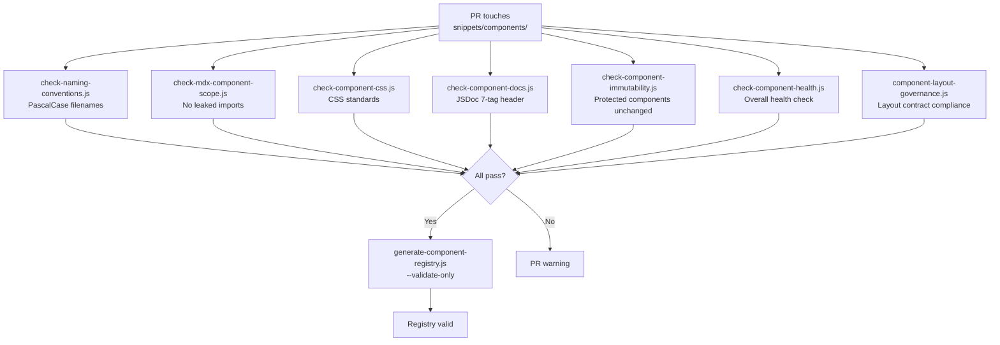
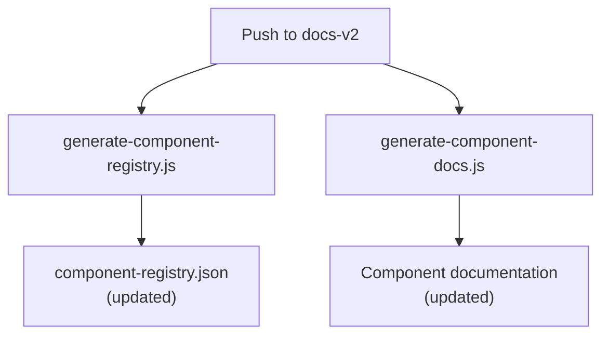

# Component Health Pipeline

> **Gate:** P3 (advisory — part of content quality suite)
> **Trigger:** PR touching `snippets/components/**`
> **Workflow:** Sub-job of `validator-copy-check-content-quality-suite.yml`

---

## What happens when component files change

## What happens post-merge

---

## Validators

| Script | What it checks |
|--------|----------------|
| `check-naming-conventions.js` | PascalCase filenames, kebab-case folders |
| `check-mdx-component-scope.js` | No React hooks, no SSR, Mintlify-safe imports |
| `check-component-css.js` | CSS-in-JS standards, no global styles |
| `check-component-docs.js` | 7-tag JSDoc header present and complete |
| `check-component-immutability.js` | Protected components not modified without approval |
| `check-component-health.js` | Overall component health (imports, exports, size) |
| `component-layout-governance.js` | Page layout contract compliance |

---

## Generators

| Script | What it produces |
|--------|-----------------|
| `generate-component-registry.js` | Component registry JSON with all components classified |
| `generate-component-docs.js` | Component documentation pages |
| `generate-component-examples.js` | Example code snippets for each component |
| `generate-ui-templates.js` | UI template pages |

---

## Remediators

| Script | What it fixes |
|--------|---------------|
| `repair-component-metadata.js` | Repairs component metadata and JSDoc headers |

---

## Audits

| Script | What it reports |
|--------|----------------|
| `scan-component-imports.js` | Import dependency graph across all components |
| `audit-component-usage.js` | Which components are used, which are orphaned |

---

## Gaps

- **Registry validation not blocking:** `generate-component-registry.js --validate-only` uses continue-on-error in CI
- **Badges sub-niche undocumented:** Component framework acknowledges this gap but has not been updated
- **No auto-repair workflow:** Component metadata repair requires manual invocation
