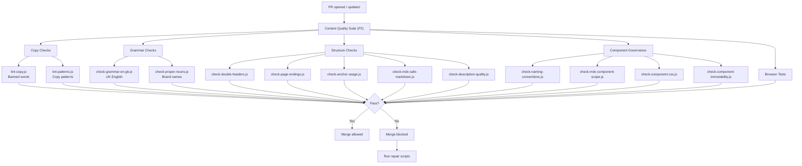

# Content Quality Pipeline

> **Gate:** P2 (hard gate — blocks merge on failure)
> **Trigger:** Every pull request touching `v2/**/*.mdx` or `docs-guide/**/*.mdx`
> **Workflow:** `validator-copy-check-content-quality-suite.yml`

---

## What happens when a PR is opened

---

## Validators (read-only, exit 0/1)

| Script | Concern | Niche | What it checks |
|--------|---------|-------|----------------|
| `lint-copy.js` | content | copy | Banned words, filler phrases, self-reference |
| `lint-patterns.js` | content | copy | Copy pattern violations (tone, voice) |
| `check-grammar-en-gb.js` | content | grammar | UK English spelling (-ise, -our, -re) |
| `check-proper-nouns.js` | content | grammar | Brand capitalisation (Livepeer, Arbitrum) |
| `check-double-headers.js` | content | structure | Duplicate heading detection |
| `check-page-endings.js` | content | structure | Page ending quality |
| `check-anchor-usage.js` | content | structure | Anchor link validity |
| `check-mdx-safe-markdown.js` | content | structure | MDX-unsafe markdown patterns |
| `check-description-quality.js` | content | structure | SEO description length, boilerplate, duplicates |
| `check-docs-path-sync.js` | content | structure | docs.json path consistency |
| `verify-all-pages.js` | content | structure | Full page rendering verification |
| `test-v2-pages.js` | content | structure | Browser-based page render tests |

---

## Remediators (auto-fix)

| Script | What it fixes | Mode |
|--------|---------------|------|
| `repair-mdx-safe-markdown.js` | Invalid MDX patterns | edit |
| `repair-page-links.js` | Broken page references | edit |
| `repair-relative-page-hrefs.js` | Relative URL errors | edit |
| `repair-spelling.js` | Spelling corrections | edit |
| `repair-page-imports.js` | Broken import statements | edit |
| `sync-docs-paths.js` | docs.json after file moves | edit |

---

## Audits (reporting)

| Script | What it reports |
|--------|----------------|
| `docs-quality-and-freshness-audit.js` | Page quality scores and staleness |
| `audit-copy-patterns.js` | Copy pattern compliance across all pages |
| `page-imports-audit.js` | Import health across all pages |
| `page-links-audit.js` | Link integrity across all pages |

---

## Gaps

- **No auto-repair on PR:** Remediators exist but require manual invocation. No workflow auto-creates a fix PR when validators fail
- **Browser tests use continue-on-error:** `test-v2-pages.js` runs in the suite but does not block merge
