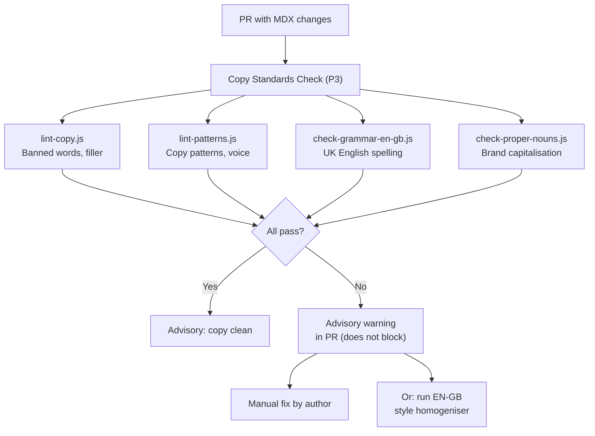
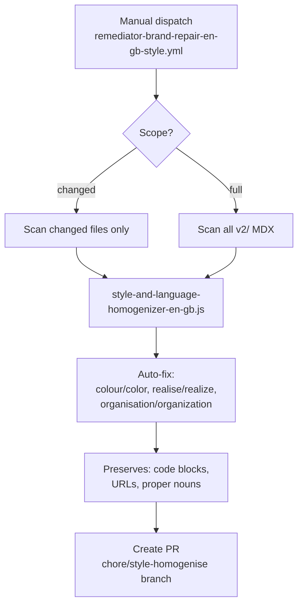

# Copy and Brand Pipeline

> **Gate:** P3 (advisory — does not block merge)
> **Trigger:** PR touching `v2/**/*.mdx` or `docs-guide/**/*.mdx`
> **Workflow:** `validator-brand-check-copy-standards.yml`

---

## What happens when copy changes

## Auto-repair (manual dispatch)

---

## Validators (P3 — advisory)

| Script | What it checks | Config |
|--------|----------------|--------|
| `lint-copy.js` | Banned words (effectively, essentially, basically, etc.), banned phrases, banned constructions | `operations/scripts/config/copy-standards.json` |
| `lint-patterns.js` | Copy pattern violations (tone, structure) | Pattern definitions in script |
| `check-grammar-en-gb.js` | UK English spelling (-ise not -ize, -our not -or, -re not -er) | Custom EN-GB dictionary |
| `check-proper-nouns.js` | Brand names capitalised correctly (Livepeer, Arbitrum, Ethereum) | `operations/scripts/config/proper-nouns.json` |

---

## Remediators

| Script | What it fixes | Mode |
|--------|---------------|------|
| `style-and-language-homogenizer-en-gb.js` | American → British English. Smart preservation of code blocks, URLs, proper nouns. ~80-90% auto-fixable | Manual dispatch |
| `repair-spelling.js` | Individual spelling corrections | Manual |
| `wcag-repair-common.js` | Accessibility text improvements | Manual |
| `repair-ownerless-language.js` | Language style in ownerless governance docs | Manual |

---

## Standards

| Standard | Location |
|----------|----------|
| Voice rules (7 audiences) | `docs-guide/standards/voice-and-copy.mdx` |
| Banned words and phrases | `docs-guide/standards/voice-and-copy.mdx` |
| UK English correction table | `docs-guide/standards/voice-and-copy.mdx` |
| Domain terminology | `docs-guide/standards/voice-and-copy.mdx` |
| Naming conventions | `docs-guide/standards/naming-conventions.mdx` |

---

## Gaps

- **Advisory only (P3):** Brand checks do not block merge. Violations can ship to production. Transition to P2 (hard gate) not yet scheduled
- **No auto-repair on PR failure:** Remediator exists but requires manual dispatch. No workflow auto-creates a fix PR when brand checks fail
- **No voice validation:** Validators check spelling and banned words but not voice register (gateway vs delegator tone). Voice compliance is manual review only
