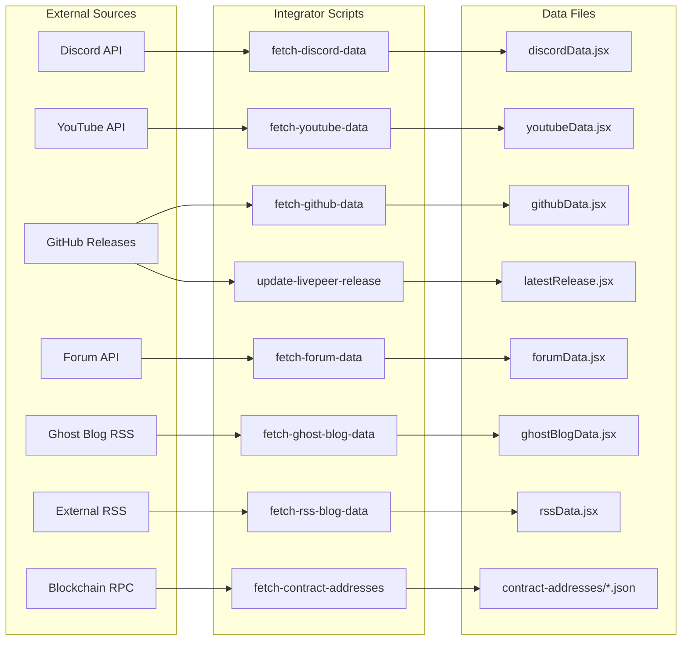
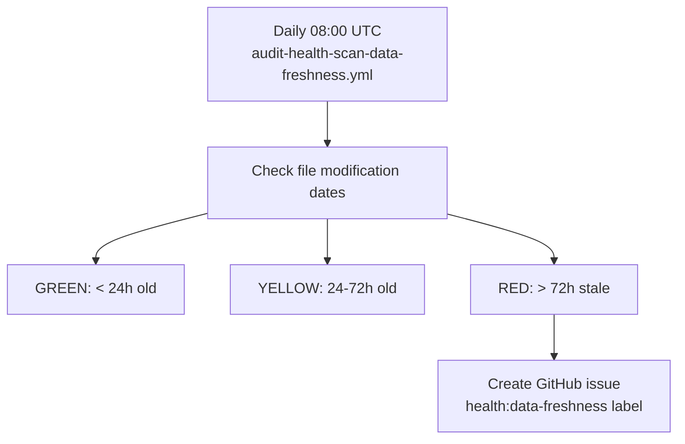
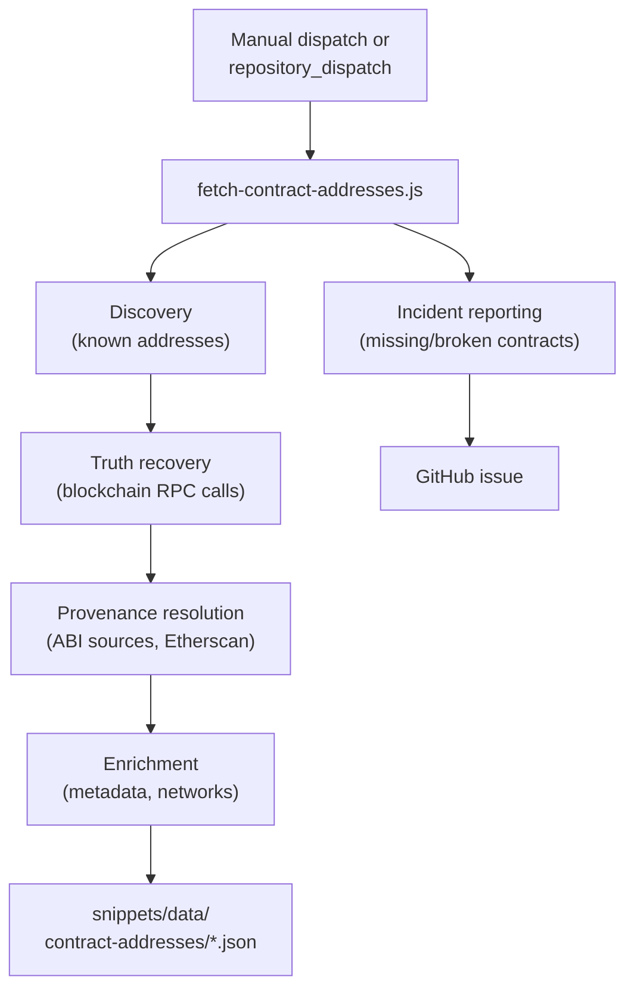

# Data Integration Pipeline

> **Gate:** P5/P5-auto (scheduled with auto-commit) + P6 (manual dispatch)
> **Trigger:** Cron schedules (weekly), repository_dispatch, workflow_dispatch
> **Workflows:** `integrator-copy-update-*.yml` + `integrator-maintenance-update-*.yml`

---

## Overview: what feeds into the docs

---

## Feed schedule

| Feed | Workflow | Schedule | Source | Output |
|------|----------|----------|--------|--------|
| Discord announcements | `integrator-copy-update-discord-data.yml` | Weekly | Discord API (bot token) | `snippets/data/social-feeds/discordAnnouncementsData.jsx` |
| YouTube videos | `integrator-copy-update-youtube-data.yml` | Weekly | YouTube Data API | `snippets/data/social-feeds/youtubeData.jsx` |
| GitHub activity | `integrator-copy-update-github-data.yml` | Weekly | GitHub API | `snippets/data/social-feeds/githubData.jsx` |
| Forum posts | `integrator-copy-update-forum-data.yml` | Weekly | Forum API | `snippets/data/social-feeds/forumData.jsx` |
| Ghost blog | `integrator-copy-update-ghost-blog-data.yml` | Weekly | RSS (blog.livepeer.org) | `snippets/data/social-feeds/ghostBlogData.jsx` |
| RSS blogs | `integrator-copy-update-rss-blog-data.yml` | Weekly | External RSS feeds | `snippets/data/social-feeds/rssData.jsx` |
| Changelogs | `integrator-copy-update-changelogs.yml` | Weekly Monday | GitHub/GitLab Releases | `snippets/data/changelogs/{product}/CHANGELOG.json` |
| Contract addresses | `integrator-maintenance-update-contract-addresses.yml` | On-demand | Blockchain RPC + Etherscan | `snippets/data/contract-addresses/*.json` |
| Release version | `integrator-maintenance-update-release-version.yml` | On-demand | GitHub Releases (go-livepeer) | `snippets/data/globals/latestRelease.jsx` |
| Translations | `integrator-copy-update-translations.yml` | On-demand | OpenRouter LLM API | `v2/{language}/**/*.mdx` |
| Large assets | `integrator-maintenance-update-large-assets.yml` | Manual | Git history | Branch migration logs |

---

## Freshness monitoring

**Monitored files:**
- `snippets/data/social-feeds/ghostBlogData.jsx`
- `snippets/data/social-feeds/discordAnnouncementsData.jsx`
- `snippets/data/social-feeds/forumData.jsx`
- `snippets/data/social-feeds/youtubeData.jsx`
- `snippets/data/showcase-feed/showcaseData.jsx`
- `snippets/data/globals/latestRelease.jsx`

---

## Contract addresses pipeline (detailed)

---

## Gaps

- **No auto-retrigger for stale feeds:** Freshness monitor creates issues but does not re-dispatch the integrator workflow. Manual intervention required
- **Social feed scripts in wrong location:** `.github/scripts/fetch-*.js` marked for migration to `operations/scripts/` per D-ACT-06 but not yet moved
- **Translation pipeline manual only:** No scheduled periodic re-translation check. No webhook for upstream source changes
- **Contract addresses workflow never dispatched on production branch:** Exists only on `docs-v2-dev`. Must be cherry-picked to `docs-v2` for live use (flagged P0)
