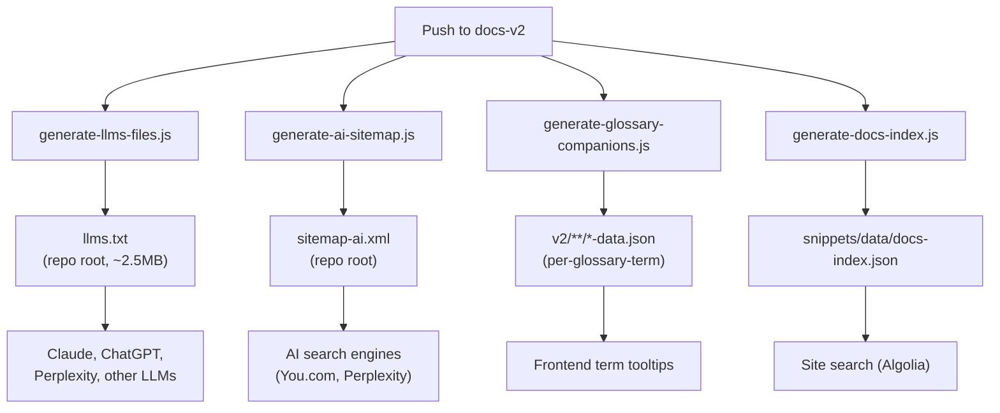
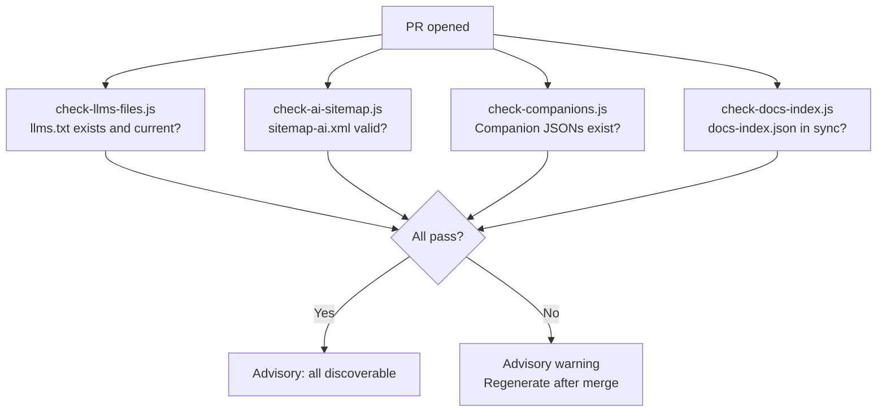

# Discoverability Pipeline

> **Gate:** P4 (post-merge auto-commit) + P3 validators on PR
> **Trigger:** Push to `docs-v2` branch after merge
> **Workflows:** `generator-discoverability-generate-*.yml` + `validator-discoverability-check-*.yml`

---

## What happens after a page merge

## What happens on PR (validation)

---

## Generators

| Script | Output | Consumer | Refresh |
|--------|--------|----------|---------|
| `generate-llms-files.js` | `llms.txt` | Claude, ChatGPT, Perplexity | Post-merge (P4) |
| `generate-ai-sitemap.js` | `sitemap-ai.xml` | AI crawlers | Post-merge (P4) |
| `generate-glossary-companions.js` | `v2/**/*-data.json` | Frontend tooltips | Post-merge (P4) |
| `generate-docs-index.js` | `snippets/data/docs-index.json` | Site search | Post-merge (P4) |
| `generate-pages-index.js` | `docs-guide/catalog/pages-catalog.mdx` | Internal reference | Manual |
| `generate-og-images.js` | `snippets/assets/media/og-images/*.png` | Social sharing | Manual (requires Puppeteer) |

---

## Validators (P3 — advisory)

| Script | What it checks |
|--------|----------------|
| `verify-llms-files.js` (check-llms-files) | llms.txt exists and matches what the generator would produce |
| `verify-ai-sitemap.js` (check-ai-sitemap) | sitemap-ai.xml is valid and current |
| `check-companion-manifest.js` (check-companions) | Companion JSON files exist for all glossary terms |
| `check-docs-index.js` | docs-index.json matches current page inventory |

---

## Remediators

| Script | What it fixes |
|--------|---------------|
| `generate-seo.js` | Regenerates SEO metadata (descriptions, keywords) |

---

## Gaps

- **Validators check existence only:** No content quality validation of llms.txt or sitemap-ai.xml (e.g., completeness, broken entries)
- **OG images manual only:** `generate-og-images.js` not in CI — requires Puppeteer, runs locally. Fallback OG is generic
- **No auto-update on page rename:** llms.txt and sitemap-ai.xml have no mechanism to detect renames between generator runs. Stale entries persist until the next full regeneration
