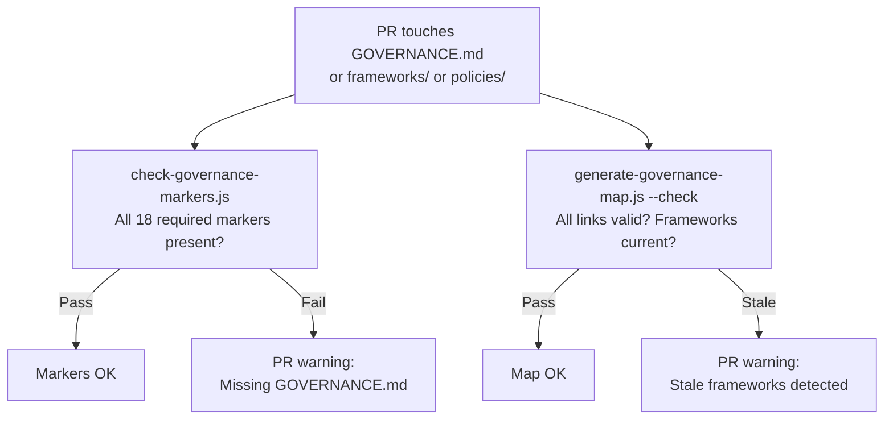
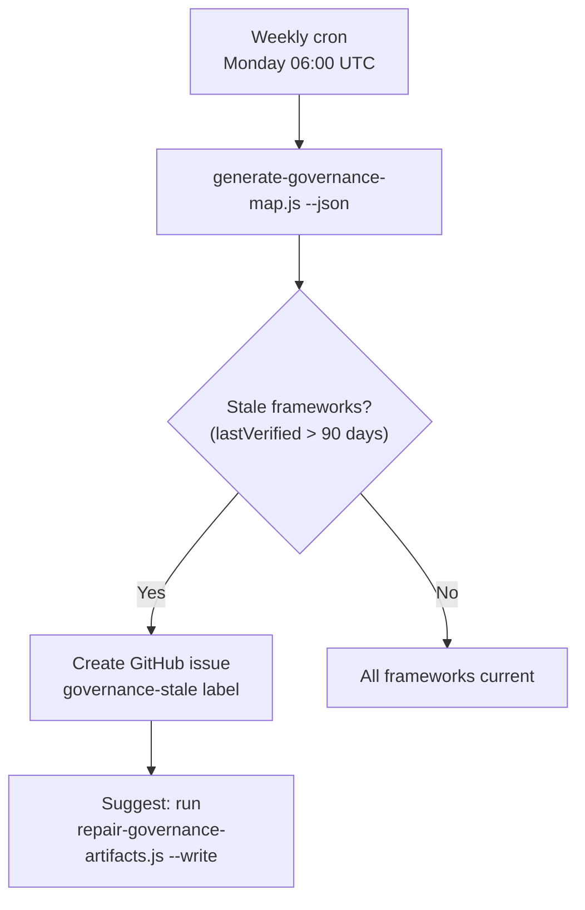
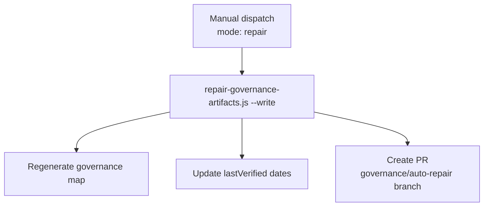

# Governance Compliance Pipeline

> **Gate:** P3 (advisory on PR) + weekly staleness cron + manual repair dispatch
> **Trigger:** PR touching governance files, Monday 06:00 UTC cron, manual dispatch
> **Workflow:** `validator-governance-check-governance-map.yml`

---

## What happens when governance files change

## What happens every Monday at 06:00 UTC

## What happens on manual repair dispatch

---

## Validators

| Script | What it checks |
|--------|----------------|
| `check-governance-markers.js` | GOVERNANCE.md exists in all 18 required folders, all links resolve |
| `check-repo-governance-sync.js` | Repo governance registry, outputs, and ownerless paths aligned |
| `check-root-governance-sync.js` | Root governance allowlist matches root-governance.json |
| `check-workflow-headers.js` | All workflow YAML files have type/concern/pipeline comments |
| `check-jsdoc-headers.js` | All governed JS files have 11-tag JSDoc headers |
| `check-mintlify-canonical-sync.js` | Mintlify consumer registry stays synced |
| `check-agent-docs-freshness.js` | Agent adapter docs match current governance |
| `validate-ai-tools-registry.js` | AI tools registry matches filesystem |
| `validate-codex-task-contract.js` | Codex task contract valid |
| `check-governance-approvals.js` | Governance-sensitive PRs have required labels |

---

## Generators

| Script | What it produces |
|--------|-----------------|
| `generate-governance-map.js` | `GOVERNANCE_MAP_LATEST.json` — marker inventory, link validation, staleness flags |
| `generate-root-governance-artifacts.js` | `.allowlist`, root governance map, sync reports |
| `generate-repo-governance-status.js` | `REPO_GOVERNANCE_STATUS_LATEST.json` — full surface status |
| `generate-script-registry.js` | `scripts-catalog.mdx` — script inventory |

---

## Remediators

| Script | What it fixes |
|--------|---------------|
| `repair-governance-artifacts.js` | Regenerates governance map, updates lastVerified dates |
| `add-workflow-governance-headers.js` | Adds type/concern/pipeline headers to workflow YAML |
| `update-jsdoc-headers.js` | Repairs missing or incomplete JSDoc headers |

---

## Gaps

- **Advisory only on PR:** Governance checks do not block merge (P3). Human review is the final gate
- **Weekly cron only:** No continuous monitoring between Monday checks. A framework could go stale mid-week without detection until the next cycle
