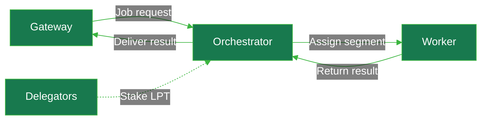
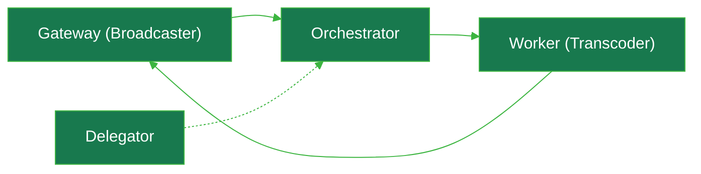

## Protocol Overview

The Livepeer Protocol is a decentralised media processing network built on Ethereum smart contracts, using a delegated proof-of-stake model to coordinate participants and distribute economic incentives. The protocol has evolved beyond video transcoding to include comprehensive AI inference capabilities.

<Card title="Livepeer Protocol" href="https://github.com/livepeer/protocol/" icon="github" horizontal />

## Protocol Role

The **Livepeer Protocol** is the underlying on-chain logic that enforces the mechanisms, incentives and rules to ensure the security, reliability, cooperation and coordination of these decentralised actors for the desired network outcomes (video streaming & AI pipelines).

The protocol additionally defines the economic mechanisms and governance rules that enforce staking, bonding, slashing, and reward rules on-chain, while off-chain nodes and services handle the actual compute jobs and job routing.

<Accordion icon="cubes" title="Protocol Services">
    Protocol services include:
    - staking
    - delegation
    - inflation & rewards
    - orchestrator selection
    - slashing
    - probabilistic payments
    - verification rules

    This makes up the economic and coordination layer that incenticises and enforces desired behaviour.
</Accordion>

## Key Actors and Participants

The protocol involves four main actors:

1. **Delegators** - LPT token holders who delegate their tokens to transcoders to earn rewards
2. **Transcoders/Orchestrators** - Service providers who perform video transcoding and AI inference work, earning rewards and fees
3. **Broadcasters/Gateways** - Users who pay for transcoding and AI services using ETH through the ticket system
4. **AI Workers** - Specialised nodes that execute AI inference tasks in Docker containers or as external endpoints

## Video vs AI Pipelines

### Video Transcoding Pipeline
- **Ingest**: RTMP/HTTP streams via `LivepeerServer.HandlePush()`
- **Segmentation**: RTMPSegmenter converts to HLS segments
- **Processing**: `processSegment()` handles transcoding
- **Distribution**: `BroadcastSessionsManager` selects orchestrators and submits segments

### AI Processing Pipeline
- **Request**: HTTP endpoints for different AI tasks (text-to-image, image-to-video, LLM, audio-to-text, etc.)
- **Session Management**: `AISessionManager` maintains warm/cold model pools
- **Execution**: AI workers run in Docker containers or as external HTTP endpoints
- **Live Video**: Specialised real-time pipeline using Trickle protocol for bidirectional streaming

## Key Capabilities

The protocol provides:

- **Decentralised transcoding** - Video processing distributed across network participants
- **AI Inference** - Multiple pipelines including text-to-image, image-to-video, live video-to-video, LLM, audio-to-text, and image segmentation
- **Economic incentives** - LPT inflation rewards and ETH fee distribution
- **Probabilistic micropayments** - Ticket-based payment system for both transcoding and AI services
- **Round-based governance** - Time progression through discrete rounds
- **Staking and delegation** - Token bonding to secure the network
- **Bring Your Own Container (BYOC)** - Generic processing pipeline for custom workloads

## Key Value Propositions

- **Cost efficiency** - Decentralised infrastructure reduces transcoding and AI processing costs
- **Reliability** - Economic incentives ensure network participation and uptime
- **Scalability** - Distributed processing can scale with demand for both video and AI workloads
- **Permissionless** - Anyone can participate as delegator, transcoder, or AI worker
- **Versatility** - Single network supporting both video transcoding and AI inference

## Job Routing

Jobs are routed through different mechanisms based on type:

### Video Transcoding Jobs
1. Transcoders register and set commission rates (reward cut and fee share)
2. The top transcoders by stake are selected for the active set each round
3. Broadcasters send work to active transcoders
4. The `SortedDoublyLL` data structure maintains the ordered transcoder pool

### AI Jobs
1. AI workers register with orchestrators via gRPC stream, advertising capabilities and capacity
2. Orchestrators maintain `RemoteAIWorkerManager` to track connected workers
3. Jobs are routed to compatible workers based on pipeline, model ID, and available capacity
4. Capacity is reserved during processing and released upon completion

## Economic Model

The protocol uses a dual-token economic system:

- **LPT (Livepeer Token)** - Governance and staking token with inflationary rewards
- **ETH** - Payment currency for transcoding and AI services

**Reward Distribution**:
- New LPT minted each round based on inflation rate and active stake
- Rewards split between transcoders (reward cut) and delegators
- ETH fees from broadcasters split between transcoders (fee share) and delegators

**AI-Specific Economics**:
- Per-unit pricing for different AI models and pipelines
- Live video-to-video uses time-based billing (1 ticket per second of compute)
- Capacity management ensures efficient resource allocation

**Key Economic Parameters**:
- `inflation` - Per-round inflation rate
- `targetBondingRate` - Target percentage of bonded tokens
- `unbondingPeriod` - Time delay for withdrawing staked tokens

## Governance

The protocol evolves through Livepeer Improvement Proposals ([LIPs](https://github.com/livepeer/LIPs)). LPT holders propose changes, the community discusses them on the Livepeer Forum, and on-chain votes determine which proposals pass. Voting power is bonded LPT, weighted by delegation.

The treasury funds public-good work through Special Purpose Entities (SPEs) that receive LPT-denominated grants for infrastructure, tooling, and ecosystem development. Treasury allocation is set by governance, not by a foundation budget. <LinkArrow href="/v2/about/protocol/governance-and-treasury" label="Governance and treasury" newline={false} />

---

## Notes

This overview combines information from both the protocol smart contracts and the go-livepeer implementation. The protocol contracts provide the economic foundation, while the go-livepeer repository implements the full network infrastructure including both video transcoding and AI inference capabilities. The AI infrastructure represents a significant expansion of the original Livepeer vision, creating a comprehensive decentralised media processing network.

Wiki pages you might want to explore:
- [Architecture (livepeer/go-livepeer)](/wiki/livepeer/go-livepeer#1.1)
- [AI Workers (livepeer/go-livepeer)](/wiki/livepeer/go-livepeer#2.7)

Wiki pages you might want to explore:
- [Architecture (livepeer/go-livepeer)](/wiki/livepeer/go-livepeer#1.1)
- [AI Workers (livepeer/go-livepeer)](/wiki/livepeer/go-livepeer#2.7)

---

## Protocol Overview

The Livepeer protocol is the software layer that coordinates decentralised video and AI processing.

Its core is implemented as Ethereum smart contracts (now on Arbitrum L2 after the Confluence upgrade) complemented by off-chain nodes and services.

The protocol enforces staking, bonding, slashing, and reward rules on-chain, while specialised nodes handle the actual video jobs.

#### Protocol Actors
- **Gateways** (Broadcasters): These demand-side nodes submit video/AI jobs to Livepeer. A gateway takes a video stream (or AI task), creates on-chain payment tickets, and routes the work to an Orchestrator. It then collects the transcoded or AI-processed result. Gateways are typically stateless routers that pay for compute.
- **Orchestrators**: These supply-side nodes bond LPT and accept jobs from gateways. An orchestrator advertises which video/audio renditions it can provide, and claims work up to its bonded stake. When it receives a job, it divides the work among its workers (transcoders or AI workers). The orchestrator must also periodically call the on-chain reward function to distribute newly minted LPT to itself and its delegators.
- **Delegators**: LPT holders who do not run nodes. Delegators stake their tokens on existing Orchestrators to secure the network. Their stake increases an orchestrator’s bonded weight, which can route more work to it. In return, delegators passively earn a share of the orchestrator’s rewards (both LPT emissions and ETH fees) proportional to their stake.

## Protocol Implementation
- **Workers** (Transcoders): These are the actual compute units (often GPUs) that perform video encoding or AI inference. In legacy terms, they were called Transcoders. Today they execute the heavy lifting, and they are typically managed by an Orchestrator node. Once a worker finishes processing a segment, the orchestrator returns the result to the Gateway.

Job routing flow can be summarised as:
Here's the flow:

  1. Gateway submits a job request to an Orchestrator.
  2. Orchestrator accepts the job and assigns the segment to one of its Workers.
  3. Worker processes the segment and returns the result to the Orchestrator.
  4. Orchestrator delivers the finished result back to the Gateway.

Delegators sit behind the Orchestrator (dashed line). They don't touch the job path, but their staked LPT backs the Orchestrator's slot in the active set and they share in the fees and rewards earned from this work.

{/* A Gateway creates a job request
→ an Orchestrator accepts the job
→ the Orchestrator assigns it to a Worker node
→ the Worker processes the segment
→ the result is returned to the Gateway. Delegators sit “behind” the orchestrator by staking LPT (shown below). */}

The orchestrator earns ETH fees from the Gateway, and can share a portion of those fees with delegators based on its fee-sharing policy. Smart contracts on Arbitrum enforce each step, ensuring trustless cooperation.

This diagram shows a simplified Livepeer job: the Gateway (left) sends work to an Orchestrator (middle), which directs a Worker (right) to process it, and then returns results back to the Gateway. Delegators (dotted line) back the Orchestrator with staked LPT.
