{/* Auto-generated from docs.json - DO NOT EDIT DIRECTLY */}

```mermaid
%%{init: {'theme': 'base', 'themeVariables': { 'primaryColor': '#1a1a1a', 'primaryTextColor': '#fff', 'primaryBorderColor': '#2d9a67', 'lineColor': '#2d9a67', 'secondaryColor': '#0d0d0d', 'tertiaryColor': '#1a1a1a', 'background': '#0d0d0d', 'fontFamily': 'system-ui', 'fontSize': '14px' }}}%%
flowchart TB
    subgraph Tabs[" "]
        direction LR
        n3[["Home"]]
        n7[["About"]]
        n13[["Community"]]
        n22[["Developers"]]
        n28[["Gateways"]]
        n33[["GPU Nodes"]]
        n39[["Delegators & LPT"]]
        n52[["Reference HUB"]]
    end

    n3 --> n0["Home"]
    n0 --> n1["Livepeer Showcase"]
    n1 --> n2["Get Started"]
    n7 --> n4["About Livepeer"]
    n4 --> n5["Livepeer Protocol"]
    n5 --> n6["Livepeer Network"]
    n13 --> n8["Livepeer Community"]
    n8 --> n9["Livepeer Connect"]
    n9 --> n10["Livepeer Contribute"]
    n10 --> n11["[MOVE HERE] Help Center"]
    n11 --> n12["[TO DELETE] Tests"]
    n22 --> n14["Building on Livepeer"]
    n14 --> n15["Quickstart"]
    n15 --> n16["Developer Platforms"]
    n16 --> n17["Developer Tools"]
    n17 --> n18["Guides & Tutorials"]
    n18 --> n19["Builder Opportunities"]
    n19 --> n20["Technical References"]
    n20 --> n21["Changelog & Migrations"]
    n28 --> n23["About Gateways"]
    n23 --> n24["Gateway Services & Providers"]
    n24 --> n25["Run Your Own Gateway"]
    n25 --> n26["Gateway Guides & Resources"]
    n26 --> n27["[moved] Gateway Tools & Dashboards"]
    n33 --> n29["About Orchestrators (GPU Nodes)"]
    n29 --> n30["Set up an Orchestrator"]
    n30 --> n31["Orchestrator Tooling"]
    n31 --> n32["Orchestrator Guides & Resources"]
    n39 --> n34["About LPT"]
    n34 --> n35["Delegating LPT"]
    n35 --> n36["Livepeer Governance"]
    n36 --> n37["Livepeer Treasury"]
    n37 --> n38["Guides & Resources"]
    n52 --> n40["Home"]
    n40 --> n41["Documentation Guide"]
    n41 --> n42["Livepeer Concepts"]
    n42 --> n43["Developer References"]
    n43 --> n44["Gateway References"]
    n44 --> n45["Orchestrator References"]
    n45 --> n46["LPT & Delegator References"]
    n46 --> n47["Community Resources"]
    n47 --> n48["Partner Resources"]
    n48 --> n49["Help Center"]
    n49 --> n50["Technical References"]
    n50 --> n51["Changelog"]

    classDef default fill:#1a1a1a,color:#fff,stroke:#2d9a67,stroke-width:1px
    classDef tab fill:#0d0d0d,color:#2d9a67,stroke:#2d9a67,stroke-width:2px
    style Tabs fill:#0d0d0d,stroke:#2d9a67,stroke-width:2px
    class n3 tab
    class n7 tab
    class n13 tab
    class n22 tab
    class n28 tab
    class n33 tab
    class n39 tab
    class n52 tab
```

---

## Page Structure by Tab

<AccordionGroup>
<Accordion title="Home" icon="folder">

### Home

- [Landing](/v2/pages/00_home/Landing)
- [livepeer tl dr](/v2/pages/00_home/home/livepeer-tl-dr)
- [trending at livepeer](/v2/pages/00_home/home/trending-at-livepeer)

### Livepeer Showcase

- [projects built on livepeer](/v2/pages/00_home/project-showcase/projects-built-on-livepeer)
- [livepeer applications](/v2/pages/00_home/project-showcase/livepeer-applications)
- [industry verticals](/v2/pages/00_home/project-showcase/industry-verticals)

### Get Started

- [use livepeer](/v2/pages/00_home/get-started/use-livepeer)
- [stream video quickstart](/v2/pages/00_home/get-started/stream-video-quickstart)
- [livepeer ai quickstart](/v2/pages/00_home/get-started/livepeer-ai-quickstart)
- [build on livepeer](/v2/pages/00_home/get-started/build-on-livepeer)

</Accordion>

<Accordion title="About" icon="folder">

### About Livepeer

- [livepeer overview](/v2/pages/01_about/about-livepeer/livepeer-overview)
- [why livepeer](/v2/pages/01_about/about-livepeer/why-livepeer)
- [livepeer evolution](/v2/pages/01_about/about-livepeer/livepeer-evolution)
- [livepeer ecosystem](/v2/pages/01_about/about-livepeer/livepeer-ecosystem)

### Livepeer Protocol

- [protocol overview](/v2/pages/01_about/livepeer-protocol/protocol-overview)
- [livepeer whitepaper](/v2/pages/01_about/livepeer-protocol/livepeer-whitepaper)
- [technical overview](/v2/pages/01_about/livepeer-protocol/technical-overview)

### Livepeer Network

- [actor overview](/v2/pages/01_about/livepeer-network/actor-overview)
- [livepeer token economics](/v2/pages/01_about/livepeer-network/livepeer-token-economics)
- [livepeer governance](/v2/pages/01_about/livepeer-network/livepeer-governance)

</Accordion>

<Accordion title="Community" icon="folder">

### Livepeer Community

- [livepeer community hub](/v2/pages/02_community/livepeer-community/livepeer-community-hub)
- [livepeer Latest Topics](/v2/pages/02_community/livepeer-community/livepeer-Latest-Topics)
- [community guidelines](/v2/pages/02_community/livepeer-community/community-guidelines)

### Livepeer Connect

- [news and socials](/v2/pages/02_community/livepeer-connect/news-and-socials)
- [events and community streams](/v2/pages/02_community/livepeer-connect/events-and-community-streams)
- [forums and discussions](/v2/pages/02_community/livepeer-connect/forums-and-discussions)

### Livepeer Contribute

- [contribute](/v2/pages/02_community/livepeer-contribute/contribute)
- [opportunities](/v2/pages/02_community/livepeer-contribute/opportunities)
- [build livepeer](/v2/pages/02_community/livepeer-contribute/build-livepeer)

### [MOVE HERE] Help Center

- [trending test](/v2/pages/02_community/livepeer-community/trending-test)

### [TO DELETE] Tests

- [trending test](/v2/pages/02_community/livepeer-community/trending-test)

</Accordion>

<Accordion title="Developers" icon="folder">

### Building on Livepeer

- [developer guide](/v2/pages/03_developers/building-on-livepeer/developer-guide)

### Quickstart

- [livepeer ai](/v2/pages/03_developers/building-on-livepeer/quick-starts/livepeer-ai)
- [README.mdx](/v2/pages/03_developers/livepeer-real-time-video/video-streaming-on-livepeer/README.mdx)
- [video streaming](/v2/pages/03_developers/building-on-livepeer/quick-starts/video-streaming)
- [livepeer ai](/v2/pages/03_developers/building-on-livepeer/quick-starts/livepeer-ai)

### Developer Platforms

- [builder hub](/v2/pages/03_developers/developer-platforms/builder-hub)
- [daydream](/v2/pages/03_developers/developer-platforms/daydream/daydream)
- [livepeer studio](/v2/pages/03_developers/developer-platforms/livepeer-studio/livepeer-studio)
- [frameworks](/v2/pages/03_developers/developer-platforms/frameworks/frameworks)
- [streamplace](/v2/pages/03_developers/developer-platforms/streamplace/streamplace)
- [ecosystem products](/v2/pages/03_developers/developer-platforms/all-ecosystem/ecosystem-products/ecosystem-products)

### Developer Tools

- [tooling hub](/v2/pages/03_developers/developer-tools/tooling-hub)
- [livepeer explorer](/v2/pages/03_developers/developer-tools/livepeer-explorer)
- [livepeer cloud](/v2/pages/03_developers/developer-tools/livepeer-cloud)
- [dashboards](/v2/pages/03_developers/developer-tools/dashboards)

### Guides & Tutorials

- [developer guides](/v2/pages/03_developers/guides-and-resources/developer-guides)
- [resources](/v2/pages/03_developers/guides-and-resources/resources)
- [developer help](/v2/pages/03_developers/guides-and-resources/developer-help)
- [contribution guide](/v2/pages/03_developers/guides-and-resources/contribution-guide)

### Builder Opportunities

- [dev programs](/v2/pages/03_developers/builder-opportunities/dev-programs)
- [livepeer rfps](/v2/pages/03_developers/builder-opportunities/livepeer-rfps)

### Technical References

- [sdks](/v2/pages/03_developers/technical-references-sdks.-and-apis/sdks)
- [apis](/v2/pages/03_developers/technical-references-sdks.-and-apis/apis)
- [awesome livepeer](/v2/pages/03_developers/technical-references/awesome-livepeer)
- [wiki](/v2/pages/03_developers/technical-references/wiki)
- [deepwiki](/v2/pages/03_developers/technical-references/deepwiki)

### Changelog & Migrations

- [changelog](/v2/pages/07_resources/changelog/changelog)
- [migration guides](/v2/pages/07_resources/changelog/migration-guides)

</Accordion>

<Accordion title="Gateways" icon="folder">

### About Gateways

- [gateway explainer](/v2/pages/04_gateways/about-gateways/gateway-explainer)
- [gateway functions](/v2/pages/04_gateways/about-gateways/gateway-functions)
- [gateway architecture](/v2/pages/04_gateways/about-gateways/gateway-architecture)
- [gateways vs orchestrators](/v2/pages/04_gateways/about-gateways/gateways-vs-orchestrators)

### Gateway Services & Providers

- [choosing a gateway](/v2/pages/04_gateways/using-gateways/choosing-a-gateway)
- [index](/v2/pages/04_gateways/using-gateways/gateway-providers/index)
- [daydream gateway](/v2/pages/04_gateways/using-gateways/gateway-providers/daydream-gateway)
- [livepeer studio gateway](/v2/pages/04_gateways/using-gateways/gateway-providers/livepeer-studio-gateway)
- [cloud spe gateway](/v2/pages/04_gateways/using-gateways/gateway-providers/cloud-spe-gateway)
- [streamplace](/v2/pages/04_gateways/using-gateways/gateway-providers/streamplace)

### Run Your Own Gateway

- [run a gateway](/v2/pages/04_gateways/run-a-gateway/run-a-gateway)
- [requirements](/v2/pages/04_gateways/run-a-gateway/requirements/requirements)
- [install overview](/v2/pages/04_gateways/run-a-gateway/install/install-overview)
- [docker install](/v2/pages/04_gateways/run-a-gateway/install/docker-install)
- [linux install](/v2/pages/04_gateways/run-a-gateway/install/linux-install)
- [windows install](/v2/pages/04_gateways/run-a-gateway/install/windows-install)
- [community projects](/v2/pages/04_gateways/run-a-gateway/install/community-projects)
- [publish offerings](/v2/pages/04_gateways/run-a-gateway/publish/publish-offerings)

### Gateway Guides & Resources

- [explorer](/v2/pages/04_gateways/gateway-tools/explorer)
- [livepeer tools](/v2/pages/04_gateways/gateway-tools/livepeer-tools)
- [community guides](/v2/pages/04_gateways/guides-references/community-guides)
- [community projects](/v2/pages/04_gateways/guides-references/community-projects)
- [technical architecture](/v2/pages/04_gateways/guides-references/technical-architecture)
- [protocol specifications](/v2/pages/04_gateways/guides-references/protocol-specifications)
- [FAQ](/v2/pages/04_gateways/guides-references/FAQ)

### [moved] Gateway Tools & Dashboards

- [explorer](/v2/pages/04_gateways/gateway-tools/explorer)
- [livepeer tools](/v2/pages/04_gateways/gateway-tools/livepeer-tools)

</Accordion>

<Accordion title="GPU Nodes" icon="folder">

### About Orchestrators (GPU Nodes)

- [overview](/v2/pages/05_orchestrators/about-orchestrators/overview)
- [transcoding](/v2/pages/05_orchestrators/about-orchestrators/orchestrator-functions/transcoding)
- [ai pipelines](/v2/pages/05_orchestrators/about-orchestrators/orchestrator-functions/ai-pipelines)

### Set up an Orchestrator

- [hardware requirements](/v2/pages/05_orchestrators/setting-up-an-orchestrator/hardware-requirements)
- [orchestrator stats](/v2/pages/05_orchestrators/setting-up-an-orchestrator/orchestrator-stats)
- [quickstart add your gpu to livepeer](/v2/pages/05_orchestrators/setting-up-an-orchestrator/setting-up-an-orchestrator/quickstart-add-your-gpu-to-livepeer)
- [join a pool](/v2/pages/05_orchestrators/setting-up-an-orchestrator/join-a-pool)
- [data centres and large scale hardware providers](/v2/pages/05_orchestrators/setting-up-an-orchestrator/setting-up-an-orchestrator/data-centres-and-large-scale-hardware-providers)

### Orchestrator Tooling

- [orchestrator tools](/v2/pages/05_orchestrators/orchestrator-tooling/orchestrator-tools)
- [orchestrator dashboards](/v2/pages/05_orchestrators/orchestrator-tooling/orchestrator-dashboards)

### Orchestrator Guides & Resources

- [orchestrator guides and references](/v2/pages/05_orchestrators/orchestrator-guides-and-references/orchestrator-guides-and-references)
- [orchestrator resources](/v2/pages/05_orchestrators/orchestrator-guides-and-references/orchestrator-resources)
- [orchestrator community and help](/v2/pages/05_orchestrators/orchestrator-guides-and-references/orchestrator-community-and-help)

</Accordion>

<Accordion title="Delegators & LPT" icon="folder">

### About LPT

- [overview](/v2/pages/06_delegators/about-lpt-livepeer-token/overview)
- [why have a token](/v2/pages/06_delegators/about-lpt-livepeer-token/why-have-a-token)
- [livepeer token economics](/v2/pages/06_delegators/about-lpt-livepeer-token/livepeer-token-economics)
- [how to get lpt](/v2/pages/06_delegators/about-lpt-livepeer-token/how-to-get-lpt)
- [delegators](/v2/pages/06_delegators/about-lpt-livepeer-token/delegators)

### Delegating LPT

- [overview](/v2/pages/06_delegators/delegating-lpt/overview)
- [delegation economics](/v2/pages/06_delegators/delegating-lpt/delegation-economics)
- [how to delegate lpt](/v2/pages/06_delegators/delegating-lpt/how-to-delegate-lpt)

### Livepeer Governance

- [overview](/v2/pages/06_delegators/livepeer-governance/overview)
- [livepeer governance](/v2/pages/06_delegators/livepeer-governance/livepeer-governance)
- [livepeer treasury](/v2/pages/06_delegators/livepeer-governance/livepeer-treasury)

### Livepeer Treasury

_No pages_

### Guides & Resources

- [lpt exchanges](/v2/pages/06_delegators/token-resources/lpt-exchanges)

</Accordion>

<Accordion title="Reference HUB" icon="folder">

### Home

- [resources_hub](/v2/pages/07_resources/resources_hub)

### Documentation Guide

- [documentation overview](/v2/pages/07_resources/documentation-guide/documentation-overview)
- [documentation guide](/v2/pages/07_resources/documentation-guide/documentation-guide)
- [docs features and ai integrations](/v2/pages/07_resources/documentation-guide/docs-features-and-ai-integrations)
- [contribute to the docs](/v2/pages/07_resources/documentation-guide/contribute-to-the-docs)

### Livepeer Concepts

- [livepeer core concepts](/v2/pages/07_resources/concepts/livepeer-core-concepts)
- [livepeer glossary](/v2/pages/07_resources/livepeer-glossary)
- [livepeer actors](/v2/pages/07_resources/concepts/livepeer-actors)

### Developer References

- [livepeer glossary](/v2/pages/07_resources/livepeer-glossary)

### Gateway References

- [livepeer ai content directory](/v2/pages/07_resources/ai-inference-on-livepeer/livepeer-ai/livepeer-ai-content-directory)

### Orchestrator References

- [livepeer glossary](/v2/pages/07_resources/livepeer-glossary)

### LPT & Delegator References

- [livepeer glossary](/v2/pages/07_resources/livepeer-glossary)

### Community Resources

- [livepeer glossary](/v2/pages/07_resources/livepeer-glossary)

### Partner Resources

- [livepeer glossary](/v2/pages/07_resources/livepeer-glossary)

### Help Center

- [livepeer glossary](/v2/pages/07_resources/livepeer-glossary)

### Technical References

_No pages_

### Changelog

- [changelog](/v2/pages/00_home/changelog/changelog)
- [migration guide](/v2/pages/00_home/changelog/migration-guide)

</Accordion>

</AccordionGroup>
