{/* Auto-generated from docs.json - DO NOT EDIT DIRECTLY */}

```mermaid
%%{init: {'theme': 'base', 'themeVariables': { 'primaryColor': '#1a1a1a', 'primaryTextColor': '#fff', 'primaryBorderColor': '#2d9a67', 'lineColor': '#2d9a67', 'secondaryColor': '#0d0d0d', 'tertiaryColor': '#1a1a1a', 'background': '#0d0d0d', 'fontFamily': 'system-ui', 'fontSize': '14px' }}}%%
flowchart TB
    subgraph Tabs[" "]
        direction LR
        n3[["Home"]]
        n8[["About"]]
        n15[["Platforms"]]
        n21[["Developers"]]
        n28[["Gateways"]]
        n35[["GPU Nodes"]]
        n41[["LP Token"]]
        n47[["Community"]]
        n60[["Resource HUB"]]
    end

    n3 --> n0["Home"]
    n0 --> n1["Livepeer"]
    n1 --> n2["Showcase"]
    n8 --> n4["About Livepeer"]
    n4 --> n5["Livepeer Protocol"]
    n5 --> n6["Livepeer Network"]
    n6 --> n7["Resources"]
    n15 --> n9["Use Livepeer"]
    n9 --> n10["Daydream"]
    n10 --> n11["Livepeer Studio"]
    n11 --> n12["Stream.place"]
    n12 --> n13["Embody Avatars"]
    n13 --> n14["Frameworks"]
    n21 --> n16["Building on Livepeer"]
    n16 --> n17["Quickstart"]
    n17 --> n18["AI Pipelines"]
    n18 --> n19["Guides & Tutorials"]
    n19 --> n20["Builder Opportunities"]
    n28 --> n22["Gateway Knowledge Hub"]
    n22 --> n23["Quickstart ⚡"]
    n23 --> n24["Gateway Services & Providers"]
    n24 --> n25["Run A Gateway"]
    n25 --> n26["Gateway Tools & Resources"]
    n26 --> n27["Technical References"]
    n35 --> n29["Orchestrator Knowledge Hub"]
    n29 --> n30["Quickstart ⚡"]
    n30 --> n31["Run an Orchestrator"]
    n31 --> n32["Advanced Orchestrator Information"]
    n32 --> n33["Orchestrator Tools & Resources"]
    n33 --> n34["Technical References"]
    n41 --> n36["About LPT"]
    n36 --> n37["Delegating LPT"]
    n37 --> n38["Livepeer Governance"]
    n38 --> n39["Livepeer Treasury"]
    n39 --> n40["Guides & Resources"]
    n47 --> n42["Livepeer Community"]
    n42 --> n43["Livepeer Connect"]
    n43 --> n44["Livepeer Contribute"]
    n44 --> n45["[MOVE HERE] Help Center"]
    n45 --> n46["Resources"]
    n60 --> n48["Home"]
    n48 --> n49["Documentation Guide"]
    n49 --> n50["Livepeer Concepts"]
    n50 --> n51["Developer References"]
    n51 --> n52["Gateway References"]
    n52 --> n53["Orchestrator References"]
    n53 --> n54["LPT & Delegator References"]
    n54 --> n55["Community Resources"]
    n55 --> n56["Partner Resources"]
    n56 --> n57["Help Center"]
    n57 --> n58["Technical References"]
    n58 --> n59["Changelog"]

    classDef default fill:#1a1a1a,color:#fff,stroke:#2d9a67,stroke-width:1px
    classDef tab fill:#0d0d0d,color:#2d9a67,stroke:#2d9a67,stroke-width:2px
    style Tabs fill:#0d0d0d,stroke:#2d9a67,stroke-width:2px
    class n3 tab
    class n8 tab
    class n15 tab
    class n21 tab
    class n28 tab
    class n35 tab
    class n41 tab
    class n47 tab
    class n60 tab
```

---

## Page Structure by Tab

<AccordionGroup>
<Accordion title="Home" icon="folder">

### Home

- [mission control](/v2/home/mission-control)
- [get started](/v2/home/home/get-started)
- [primer](/v2/home/home/primer)

### Livepeer

- [vision](/v2/home/introduction/vision)
- [evolution](/v2/home/introduction/evolution)
- [why livepeer](/v2/home/introduction/why-livepeer)
- [ecosystem](/v2/home/introduction/ecosystem)
- [roadmap](/v2/home/introduction/roadmap)

### Showcase

- [showcase](/v2/home/project-showcase/showcase)
- [industry verticals](/v2/home/project-showcase/industry-verticals)
- [applications](/v2/home/project-showcase/applications)

</Accordion>

<Accordion title="About" icon="folder">

### About Livepeer

- [about portal](/v2/about/about-portal)
- [livepeer overview](/v2/about/core-concepts/livepeer-overview)
- [livepeer core concepts](/v2/about/core-concepts/livepeer-core-concepts)
- [mental model](/v2/about/core-concepts/mental-model)

### Livepeer Protocol

- [overview](/v2/about/livepeer-protocol/overview)
- [core mechanisms](/v2/about/livepeer-protocol/core-mechanisms)
- [livepeer token](/v2/about/livepeer-protocol/livepeer-token)
- [governance model](/v2/about/livepeer-protocol/governance-model)
- [treasury](/v2/about/livepeer-protocol/treasury)
- [protocol economics](/v2/about/livepeer-protocol/protocol-economics)
- [technical architecture](/v2/about/livepeer-protocol/technical-architecture)

### Livepeer Network

- [overview](/v2/about/livepeer-network/overview)
- [actors](/v2/about/livepeer-network/actors)
- [job lifecycle](/v2/about/livepeer-network/job-lifecycle)
- [marketplace](/v2/about/livepeer-network/marketplace)
- [technical architecture](/v2/about/livepeer-network/technical-architecture)
- [interfaces](/v2/about/livepeer-network/interfaces)

### Resources

- [livepeer whitepaper](/v2/about/resources/livepeer-whitepaper)
- [livepeer glossary](/v2/about/resources/livepeer-glossary)
- [blockchain contracts](/v2/about/resources/blockchain-contracts)
- [technical roadmap](/v2/about/resources/technical-roadmap)
- [gateways vs orchestrators](/v2/about/resources/gateways-vs-orchestrators)

</Accordion>

<Accordion title="Platforms" icon="folder">

### Use Livepeer

- [products portal](/v2/platforms/products-portal)
- [product hub](/v2/platforms/products/all-ecosystem/product-hub)
- [ecosystem products](/v2/platforms/products/all-ecosystem/ecosystem-products)

### Daydream

- [daydream](/v2/platforms/products/daydream/daydream)

### Livepeer Studio

- [overview](/v2/platforms/products/livepeer-studio/overview/overview)
- [client use cases](/v2/platforms/products/livepeer-studio/overview/client-use-cases)
- [overview](/v2/platforms/products/livepeer-studio/getting-started/overview)
- [quickstart](/v2/platforms/products/livepeer-studio/overview/quickstart)
- [authentication](/v2/platforms/products/livepeer-studio/getting-started/authentication)
- [studio cli](/v2/platforms/products/livepeer-studio/getting-started/studio-cli)
- [livestream overview](/v2/platforms/products/livepeer-studio/overview/livestream-overview)
- [create livestream](/v2/platforms/products/livepeer-studio/guides/create-livestream)
- [playback livestream](/v2/platforms/products/livepeer-studio/guides/playback-livestream)
- [stream via obs](/v2/platforms/products/livepeer-studio/guides/stream-via-obs)
- [livestream from browser](/v2/platforms/products/livepeer-studio/guides/livestream-from-browser)
- [multistream](/v2/platforms/products/livepeer-studio/guides/multistream)
- [clip livestream](/v2/platforms/products/livepeer-studio/guides/clip-livestream)
- [stream health](/v2/platforms/products/livepeer-studio/guides/stream-health)
- [optimize latency](/v2/platforms/products/livepeer-studio/guides/optimize-latency)
- [vod overview](/v2/platforms/products/livepeer-studio/overview/vod-overview)
- [upload asset](/v2/platforms/products/livepeer-studio/guides/upload-asset)
- [playback asset](/v2/platforms/products/livepeer-studio/guides/playback-asset)
- [encrypted assets](/v2/platforms/products/livepeer-studio/guides/encrypted-assets)
- [thumbnails vod](/v2/platforms/products/livepeer-studio/guides/thumbnails-vod)
- [transcode video](/v2/platforms/products/livepeer-studio/guides/transcode-video)
- [overview](/v2/platforms/products/livepeer-studio/guides/access-control/overview)
- [webhooks](/v2/platforms/products/livepeer-studio/guides/access-control/webhooks)
- [jwt](/v2/platforms/products/livepeer-studio/guides/access-control/jwt)
- [webhooks](/v2/platforms/products/livepeer-studio/guides/webhooks)
- [listen to events](/v2/platforms/products/livepeer-studio/guides/listen-to-events)
- [overview](/v2/platforms/products/livepeer-studio/guides/analytics/overview)
- [player and embed](/v2/platforms/products/livepeer-studio/guides/player-and-embed)
- [api overview](/v2/platforms/products/livepeer-studio/overview/api-overview)
- [overview](/v2/platforms/products/livepeer-studio/api-reference/overview)
- [sdks overview](/v2/platforms/products/livepeer-studio/overview/sdks-overview)
- [managing projects](/v2/platforms/products/livepeer-studio/guides/managing-projects)

### Stream.place

- [streamplace](/v2/platforms/products/streamplace/streamplace)
- [streamplace guide](/v2/platforms/products/streamplace/streamplace-guide)
- [streamplace architecture](/v2/platforms/products/streamplace/streamplace-architecture)
- [streamplace integration](/v2/platforms/products/streamplace/streamplace-integration)
- [streamplace provenance](/v2/platforms/products/streamplace/streamplace-provenance)
- streamplace funding ⚠️ missing-route

### Embody Avatars

- [overview](/v2/platforms/products/embody/overview)

### Frameworks

- [frameworks](/v2/platforms/products/frameworks/frameworks)

</Accordion>

<Accordion title="Developers" icon="folder">

### Building on Livepeer

- [developer portal](/v2/developers/developer-portal)
- [developer guide](/v2/developers/building-on-livepeer/developer-guide)
- [partners](/v2/developers/building-on-livepeer/partners)
- [developer journey](/v2/developers/building-on-livepeer/developer-journey)

### Quickstart

- [livepeer ai](/v2/developers/building-on-livepeer/quick-starts/livepeer-ai)
- [README.mdx](/v2/developers/livepeer-real-time-video/video-streaming-on-livepeer/README.mdx)
- [video streaming](/v2/developers/building-on-livepeer/quick-starts/video-streaming)
- [livepeer ai](/v2/developers/building-on-livepeer/quick-starts/livepeer-ai)

### AI Pipelines

- [overview](/v2/developers/ai-inference-on-livepeer/ai-pipelines/overview)
- [byoc](/v2/developers/ai-inference-on-livepeer/ai-pipelines/byoc)
- [comfystream](/v2/developers/ai-inference-on-livepeer/ai-pipelines/comfystream)

### Guides & Tutorials

- [developer guides](/v2/developers/guides-and-resources/developer-guides)
- [resources](/v2/developers/guides-and-resources/resources)
- [developer help](/v2/developers/guides-and-resources/developer-help)
- [contribution guide](/v2/developers/guides-and-resources/contribution-guide)

### Builder Opportunities

- [dev programs](/v2/developers/builder-opportunities/dev-programs)
- [livepeer rfps](/v2/developers/builder-opportunities/livepeer-rfps)

</Accordion>

<Accordion title="Gateways" icon="folder">

### Gateway Knowledge Hub

- [gateways portal](/v2/pages/04_gateways/gateways-portal)
- [gateway explainer](/v2/gateways/about-gateways/gateway-explainer)
- [gateway functions](/v2/gateways/about-gateways/gateway-functions)
- [gateway architecture](/v2/gateways/about-gateways/gateway-architecture)
- [gateway economics](/v2/gateways/about-gateways/gateway-economics)

### Quickstart ⚡

- quickstart a gateway ⚠️ missing-route
- get AI to setup the gateway ⚠️ missing-route

### Gateway Services & Providers

- [choosing a gateway](/v2/pages/04_gateways/using-gateways/choosing-a-gateway)
- [gateway providers](/v2/pages/04_gateways/using-gateways/gateway-providers)
- [daydream gateway](/v2/pages/04_gateways/using-gateways/gateway-providers/daydream-gateway)
- [livepeer studio gateway](/v2/pages/04_gateways/using-gateways/gateway-providers/livepeer-studio-gateway)
- [cloud spe gateway](/v2/pages/04_gateways/using-gateways/gateway-providers/cloud-spe-gateway)
- streamplace ⚠️ missing-route

### Run A Gateway

- [quickstart a gateway](/v2/pages/04_gateways/run-a-gateway/quickstart/quickstart-a-gateway)
- [get AI to setup the gateway.mdx](/v2/pages/04_gateways/run-a-gateway/quickstart/get-AI-to-setup-the-gateway.mdx)
- [why run a gateway](/v2/pages/04_gateways/run-a-gateway/why-run-a-gateway)
- [run a gateway](/v2/pages/04_gateways/run-a-gateway/run-a-gateway)

### Gateway Tools & Resources

- [explorer](/v2/pages/04_gateways/gateway-tools/explorer)
- [livepeer tools](/v2/pages/04_gateways/gateway-tools/livepeer-tools)
- [community guides](/v2/pages/04_gateways/guides-and-resources/community-guides)
- [community projects](/v2/pages/04_gateways/guides-and-resources/community-projects)
- [faq](/v2/pages/04_gateways/guides-and-resources/faq)

### Technical References

- [technical architecture](/v2/pages/04_gateways/references/technical-architecture)
- [configuration flags](/v2/pages/04_gateways/references/configuration-flags)
- video flags ⚠️ missing-route
- [cli commands](/v2/pages/04_gateways/references/cli-commands)
- [livepeer exchanges](/v2/pages/04_gateways/references/livepeer-exchanges)
- [artibtrum exchanges](/v2/pages/04_gateways/references/artibtrum-exchanges)
- [arbitrum rpc](/v2/pages/04_gateways/references/arbitrum-rpc)

</Accordion>

<Accordion title="GPU Nodes" icon="folder">

### Orchestrator Knowledge Hub

- [orchestrators portal](/v2/pages/05_orchestrators/orchestrators-portal)
- [overview](/v2/pages/05_orchestrators/about-orchestrators/overview)
- [orchestrator functions](/v2/pages/05_orchestrators/about-orchestrators/orchestrator-functions)
- [architecture](/v2/pages/05_orchestrators/about-orchestrators/architecture)
- [economics](/v2/pages/05_orchestrators/about-orchestrators/economics)

### Quickstart ⚡

- [overview](/v2/pages/05_orchestrators/quickstart/overview)
- [join a pool](/v2/pages/05_orchestrators/quickstart/join-a-pool)
- [orchestrator setup](/v2/pages/05_orchestrators/quickstart/orchestrator-setup)

### Run an Orchestrator

- [overview](/v2/pages/05_orchestrators/setting-up-an-orchestrator/overview)

### Advanced Orchestrator Information

- [staking LPT](/v2/pages/05_orchestrators/advanced-setup/staking-LPT)
- [rewards and fees](/v2/pages/05_orchestrators/advanced-setup/rewards-and-fees)
- [delegation](/v2/pages/05_orchestrators/advanced-setup/delegation)
- [ai pipelines](/v2/pages/05_orchestrators/advanced-setup/ai-pipelines)
- [run a pool](/v2/pages/05_orchestrators/advanced-setup/run-a-pool)

### Orchestrator Tools & Resources

- [orchestrator tools](/v2/pages/05_orchestrators/orchestrator-tools-and-resources/orchestrator-tools)
- [community pools](/v2/pages/05_orchestrators/orchestrator-tools-and-resources/community-pools)
- [orchestrator guides](/v2/pages/05_orchestrators/orchestrator-tools-and-resources/orchestrator-guides)
- [orchestrator resources](/v2/pages/05_orchestrators/orchestrator-tools-and-resources/orchestrator-resources)
- [orchestrator community and help](/v2/pages/05_orchestrators/orchestrator-tools-and-resources/orchestrator-community-and-help)

### Technical References

- [faq](/v2/pages/05_orchestrators/references/faq)
- [cli flags](/v2/pages/05_orchestrators/references/cli-flags)
- [faq](/v2/pages/05_orchestrators/references/faq)

</Accordion>

<Accordion title="LP Token" icon="folder">

### About LPT

- [token portal](/v2/lpt/token-portal)
- [overview](/v2/lpt/about/overview)
- [purpose](/v2/lpt/about/purpose)
- [tokenomics](/v2/lpt/about/tokenomics)
- [mechanics](/v2/lpt/about/mechanics)

### Delegating LPT

- [overview](/v2/lpt/delegation/overview)
- [about delegators](/v2/lpt/delegation/about-delegators)
- [delegation guide](/v2/lpt/delegation/delegation-guide)

### Livepeer Governance

- [overview](/v2/lpt/governance/overview)
- [model](/v2/lpt/governance/model)
- [processes](/v2/lpt/governance/processes)

### Livepeer Treasury

- [overview](/v2/lpt/treasury/overview)
- [proposals](/v2/lpt/treasury/proposals)
- [allocations](/v2/lpt/treasury/allocations)

### Guides & Resources

- [exchanges](/v2/lpt/resources/exchanges)
- [lpt eth usage](/v2/lpt/resources/lpt-eth-usage)

</Accordion>

<Accordion title="Community" icon="folder">

### Livepeer Community

- [community portal](/v2/community/community-portal)
- [trending topics](/v2/community/livepeer-community/trending-topics)
- [roadmap](/v2/community/livepeer-community/roadmap)

### Livepeer Connect

- [community guidelines](/v2/community/livepeer-community/community-guidelines)
- [news and socials](/v2/community/livepeer-connect/news-and-socials)
- [events and community streams](/v2/community/livepeer-connect/events-and-community-streams)
- [forums and discussions](/v2/community/livepeer-connect/forums-and-discussions)

### Livepeer Contribute

- [contribute](/v2/community/livepeer-contribute/contribute)
- [opportunities](/v2/community/livepeer-contribute/opportunities)
- [build livepeer](/v2/community/livepeer-contribute/build-livepeer)

### [MOVE HERE] Help Center

- trending test ⚠️ missing-route

### Resources

- media kit ⚠️ missing-route
- trending test ⚠️ missing-route
- latest topics ⚠️ missing-route

</Accordion>

<Accordion title="Resource HUB" icon="folder">

### Home

- [resources portal](/v2/pages/07_resources/resources-portal)

### Documentation Guide

- [documentation overview](/v2/pages/07_resources/documentation-guide/documentation-overview)
- [documentation guide](/v2/pages/07_resources/documentation-guide/documentation-guide)
- [docs features and ai integrations](/v2/pages/07_resources/documentation-guide/docs-features-and-ai-integrations)
- [style guide](/v2/pages/07_resources/documentation-guide/style-guide)
- [snippets inventory](/v2/pages/07_resources/documentation-guide/snippets-inventory)
- [contribute to the docs](/v2/pages/07_resources/documentation-guide/contribute-to-the-docs)
- [automations workflows](/v2/pages/07_resources/documentation-guide/automations-workflows)
- [component library](/v2/pages/07_resources/documentation-guide/component-library)
- [primitives](/v2/pages/07_resources/documentation-guide/component-library/primitives)
- [display](/v2/pages/07_resources/documentation-guide/component-library/display)
- [content](/v2/pages/07_resources/documentation-guide/component-library/content)
- [layout](/v2/pages/07_resources/documentation-guide/component-library/layout)
- [integrations](/v2/pages/07_resources/documentation-guide/component-library/integrations)
- [domain](/v2/pages/07_resources/documentation-guide/component-library/domain)

### Livepeer Concepts

- livepeer core concepts ⚠️ missing-route
- [livepeer glossary](/v2/pages/07_resources/livepeer-glossary)
- livepeer actors ⚠️ missing-route

### Developer References

- [livepeer glossary](/v2/pages/07_resources/livepeer-glossary)

### Gateway References

- livepeer ai content directory ⚠️ missing-route

### Orchestrator References

- [livepeer glossary](/v2/pages/07_resources/livepeer-glossary)

### LPT & Delegator References

- [livepeer glossary](/v2/pages/07_resources/livepeer-glossary)

### Community Resources

- [livepeer glossary](/v2/pages/07_resources/livepeer-glossary)

### Partner Resources

- [livepeer glossary](/v2/pages/07_resources/livepeer-glossary)

### Help Center

- [livepeer glossary](/v2/pages/07_resources/livepeer-glossary)

### Technical References

-   ⚠️ missing-route

### Changelog

- changelog ⚠️ missing-route
- migration guide ⚠️ missing-route

</Accordion>

</AccordionGroup>
