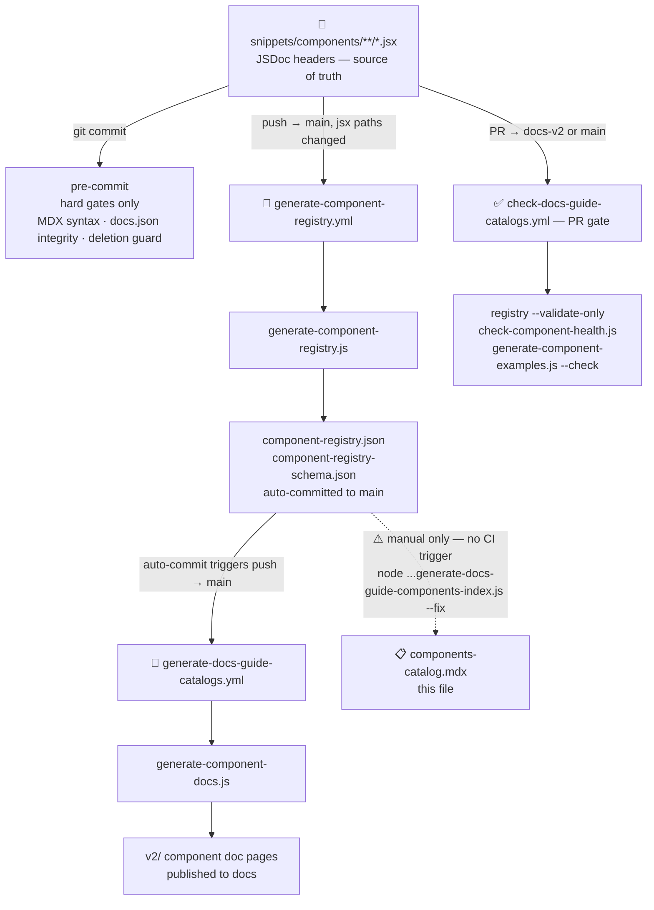

{/*
generated-file-banner:v1
Generation Script: [path/to/generator.js]
Purpose: [What this catalog indexes and why]
Run when: [Condition that makes this stale]
Run command: node [path/to/generator.js] --write
*/}

import { BorderedBox } from "/snippets/components/wrappers/containers/Containers.jsx"
import { CustomDivider } from "/snippets/components/elements/spacing/Divider.jsx"

<Tip>
This file is an auto-generated index catalog for all available Livepeer Custom Components  
</Tip>
<Danger> Do not manually edit this file </Danger>

<Expandable title="Script Generation Details">
**Generation Script**:
- This file is generated from script(s): `[path/to/generator.js]`.
**Purpose**:
- [What this catalog indexes and why.]  
**Run when**:
- [Condition that makes this stale.]  
**Important**:
- Do not manually edit this file; run `node [path/to/generator.js] --write`.  

## PIPELINE

</Expandable>

<CustomDivider />

{/*
━━━━━━━━━━━━━━━━━━━━━━━━━━━━━━━━━━━━━━━━━━━━━━━━━━━━━━━━━━━━
@catalog-layout: accordion-group
━━━━━━━━━━━━━━━━━━━━━━━━━━━━━━━━━━━━━━━━━━━━━━━━━━━━━━━━━━━━

FULL OUTPUT STRUCTURE (generator must produce in this order):

1. [N exports count line]

2. ## Summary
   Summary table with status icon columns + Unused column.
   | Category | Exports | 🟢 Stable | 🧪 Experimental | 🟠 Deprecated | 🔴 Broken | ⬜ Placeholder | Unused |

3. # Components: Searchable
   Searchable table component — searchable by category and name.
   [Component to be sourced/built]

4. # Component Tree
   <Tree> of snippets/components folder hierarchy.
   One folder per category, files inside.

4. # Components by Type

   <BorderedBox style={{width: "fit-content"}}>
   **Status:**
   🟢 stable
   🧪 experimental
   🟠 deprecated
   🔴 broken
   ⬜ placeholder
   </BorderedBox>

   Then one ## + <AccordionGroup> per category:

   ## [Category Name]

   <AccordionGroup>

   <Accordion title="[🟢 ComponentName]">
   <ResponseField name="status" type="string">`[stable | experimental | deprecated | broken | placeholder]`</ResponseField>
   <ResponseField name="description" type="string">[One-line description from JSDoc.]</ResponseField>
   <ResponseField name="file" type="string">`/[path/to/file.jsx]`</ResponseField>
   <ResponseField name="usage" type="string">[in use | unused]</ResponseField>
   </Accordion>

   </AccordionGroup>

5. AUDIT SECTION (bottom, only when non-empty)
   Single <Accordion> — NOT in AccordionGroup.

   <Accordion title="⚠️ Audit — [N items]">

   | Component | Category | Status | Note |
   | --- | --- | --- | --- |
   | [Name] | `[category]` | `[status]` | [e.g. Not imported in any page] |

   </Accordion>

━━━━━━━━━━━━━━━━━━━━━━━━━━━━━━━━━━━━━━━━━━━━━━━━━━━━━━━━━━━━
*/}

[Auto-populated content — replaced on each regeneration]

# Components: Searchable
{/*
ADD searchable table COMPONENT
- searchable by category and name

*/}
