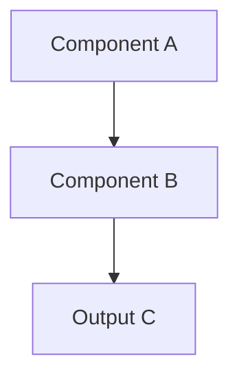

# [Feature / System Name]

> [One-line summary of this system and what it enables]

---

## System Overview

[High-level description of the system: what it does, who uses it, where it fits in the repo.]

---

## Architecture / Diagram

[Mermaid diagram or annotated image showing system components and relationships.]

---

## Component Table

[All components, scripts, or modules in this system.]

| Name | Type | Location | Purpose | Owner |
|------|------|----------|---------|-------|
| [item] | [script/config/page] | `[path]` | [what it does] | [team/script] |

---

## Automation Surfaces

[Any automations, pipelines, hooks, or scheduled jobs that interact with this system.]

| Trigger | Action | Script |
|---------|--------|--------|
| [On commit] | [What runs] | `[path]` |

---

## Ownership

[Who maintains this system. Who to contact for changes.]

| Area | Owner |
|------|-------|
| [Area] | [Team / person] |

---

## Related

- [Link to related policy]
- [Link to related catalog]
- [Link to related framework]
