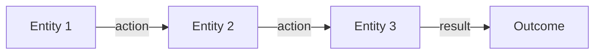

{/*
SECTION BLOCK: Concept Explanation
PURPOSE: Explain how something works — mechanism, system, or idea.

WHEN TO USE:
- Primary on concept and overview pages
- Sometimes on guide pages (explaining a system before giving practical advice)

WHEN NOT TO USE:
- instruction, tutorial (these DO things, they don't explain mechanisms)
- reference (structured lookup, not narrative)
- navigation (pure routing)

RULES:
- Concrete before abstract — start with what the reader can observe, then explain why
- Diagram REQUIRED — if you can't draw it, the concept is too abstract for this block
- Layered: overview prose first, then diagram, then optional detail in Accordions
- Entity-led voice: the subject is the system/node/protocol, never "this page" or "we"
- Quantify claims: "14 orchestrators" not "several orchestrators"
- Lead with fact, end with fact — never end with a hedge
*/}

{/*
import { ScrollableDiagram } from '/snippets/components/displays/diagrams/ScrollableDiagram.jsx'
import { CustomDivider } from '/snippets/components/elements/spacing/Divider.jsx'

## [Governing-Concept Label — e.g., "Protocol Architecture", "Job Lifecycle"]

[Opening paragraph: state the core mechanism in concrete terms. What does the reader
observe? What happens when X occurs? Use specific numbers and real entities.

E.g., "When a gateway receives an AI inference request, it queries the on-chain
registry for orchestrators advertising the required pipeline capability. The gateway
selects based on price, latency, and stake weight, then routes the job directly."]

[Second paragraph: explain WHY the mechanism works this way. What problem does it solve?
What would break without it?]
*/}

{/* ─── VARIANT A: Mermaid diagram (simple, 3-7 nodes) ─── */}

{/*

*/}

{/* ─── VARIANT B: ScrollableDiagram (complex architecture) ─── */}

{/*
<ScrollableDiagram>
```mermaid
graph TB
    subgraph [System Layer 1]
        A[Component] --> B[Component]
    end
    subgraph [System Layer 2]
        C[Component] --> D[Component]
    end
    B --> C
```
</ScrollableDiagram>
*/}

{/*
[Follow-up paragraph explaining the diagram. What should the reader take away?
Point to specific nodes or flows if helpful.]

<Note>
  [Optional supplementary context — a constraint, exception, or future change
  that the reader should be aware of but doesn't need for the main understanding.]
</Note>

<CustomDivider />
*/}
