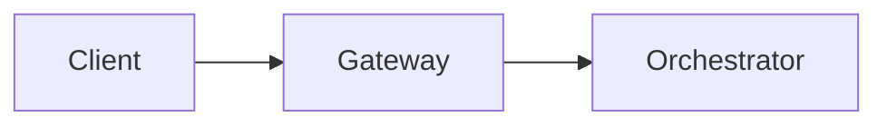

## Overview

`lpd-mdx-preview` is a VS Code extension that opens a live preview panel for `.mdx` and `.md` files. It renders Livepeer custom components, Mintlify built-in components, and Mermaid diagrams — without running a Mintlify dev server.

<Note>
Custom components render at a structural fidelity level. Mintlify-specific styling (fonts, themes, spacing tokens) is approximated. Interactive features like search tables are indicated as placeholders.
</Note>

**Source:** `tools/vscode/lpd-mdx-preview/`

---

## Installation

<Steps>
  <Step title="Locate the .vsix file">
    The packaged extension is at `tools/vscode/lpd-mdx-preview/lpd-mdx-preview-0.0.1.vsix`.
  </Step>
  <Step title="Install from VSIX">
    Open the Command Palette (`Cmd+Shift+P`) → **Extensions: Install from VSIX...** → select the `.vsix` file.

    Alternatively, from the terminal:

    ```bash
    code --install-extension tools/vscode/lpd-mdx-preview/lpd-mdx-preview-0.0.1.vsix
    ```
  </Step>
  <Step title="Reload VS Code">
    Reload the window when prompted. The extension activates automatically on `.mdx` and `.md` files.
  </Step>
</Steps>

---

## Usage

<Tabs>
  <Tab title="Keyboard shortcut">
    Open any `.mdx` or `.md` file, then press:

    - **Mac:** `Cmd+Shift+V`
    - **Windows/Linux:** `Ctrl+Shift+V`

    The preview panel opens to the side and updates on every save.
  </Tab>
  <Tab title="Command Palette">
    Open the Command Palette (`Cmd+Shift+P`) and run either command:

    - **Livepeer: Open MDX Preview** — opens preview in the current pane
    - **Livepeer: Open MDX Preview to the Side** — opens preview in a split pane (same as keyboard shortcut)
  </Tab>
  <Tab title="Editor title button">
    When a `.mdx` or `.md` file is active, a preview icon appears in the editor title bar (top-right). Click it to open the preview to the side.
  </Tab>
</Tabs>

---

## Configuration

One setting is available via VS Code settings (`Cmd+,`):

| Setting | Type | Default | Description |
|---|---|---|---|
| `livepeer.mdxPreview.theme` | `"auto"` \| `"light"` \| `"dark"` | `"auto"` | Preview theme. `auto` follows VS Code's active theme. |

---

## Component Reference

The extension renders components at three tiers. Unknown components fall back to a visible placeholder showing the tag name and props.

<AccordionGroup>
  <Accordion title="Tier 1 — Mintlify Built-ins" icon="cube">

    Standard Mintlify components rendered natively.

    <AccordionGroup>
      <Accordion title="Callouts: Note, Tip, Warning, Info, Callout">

        | Component | Props | Notes |
        |---|---|---|
        | `<Note>` | — | Blue info callout |
        | `<Tip>` | — | Green tip callout |
        | `<Warning>` | — | Yellow/amber warning callout |
        | `<Info>` | — | Info callout (same as Note visually) |
        | `<Callout>` | `icon` | Generic callout; `icon` renders as a badge label |

        **Usage:**
        ```mdx
        <Note>This is a note.</Note>
        <Warning>This will overwrite data.</Warning>
        <Callout icon="star">Highlighted callout.</Callout>
        ```
      </Accordion>

      <Accordion title="Card, CardGroup">

        | Component | Props | Notes |
        |---|---|---|
        | `<Card>` | `title`, `icon`, `href`, `horizontal`, `arrow` | `horizontal` and `arrow` are boolean flags |
        | `<CardGroup>` | `cols` | Defaults to 2 columns |

        **Usage:**
        ```mdx
        <CardGroup cols={2}>
          <Card title="Setup" icon="gear" href="/setup" arrow>
            Get started quickly.
          </Card>
        </CardGroup>
        ```
      </Accordion>

      <Accordion title="Tabs, Tab">

        | Component | Props | Notes |
        |---|---|---|
        | `<Tabs>` | — | Container for Tab children |
        | `<Tab>` | `title`, `icon` | Each tab section; tabs are rendered as a tabbed panel in preview |

        **Usage:**
        ```mdx
        <Tabs>
          <Tab title="Mac" icon="apple">Mac instructions here.</Tab>
          <Tab title="Linux" icon="linux">Linux instructions here.</Tab>
        </Tabs>
        ```
      </Accordion>

      <Accordion title="Accordion, AccordionGroup">

        | Component | Props | Notes |
        |---|---|---|
        | `<Accordion>` | `title`, `icon` | Renders as a `<details>` element; open/close works in preview |
        | `<AccordionGroup>` | — | Groups accordions with consistent spacing |

        **Usage:**
        ```mdx
        <AccordionGroup>
          <Accordion title="Section A" icon="circle">Content A</Accordion>
          <Accordion title="Section B" icon="square">Content B</Accordion>
        </AccordionGroup>
        ```
      </Accordion>

      <Accordion title="Steps, Step">

        | Component | Props | Notes |
        |---|---|---|
        | `<Steps>` | — | Numbered step container |
        | `<Step>` | `title` | Individual step with optional title |

        **Usage:**
        ```mdx
        <Steps>
          <Step title="Install">Run npm install.</Step>
          <Step title="Configure">Edit the config file.</Step>
        </Steps>
        ```
      </Accordion>

      <Accordion title="Frame, Columns, Expandable">

        | Component | Props | Notes |
        |---|---|---|
        | `<Frame>` | — | Bordered container for images or diagrams |
        | `<Columns>` | — | Two-column layout wrapper |
        | `<Expandable>` | `title` | Collapsible section; defaults to "Show more" |

        **Usage:**
        ```mdx
        <Frame>
          
        </Frame>

        <Expandable title="Advanced options">
          Details shown on expand.
        </Expandable>
        ```
      </Accordion>

      <Accordion title="CodeBlock, Icon, Update, ResponseField">

        | Component | Props | Notes |
        |---|---|---|
        | `<CodeBlock>` | `language` / `lang` | Renders a styled code block |
        | `<Icon>` | `icon` / `name` | Renders icon as a text badge `[icon-name]` |
        | `<Update>` | `label` / `date` | Changelog-style entry with accent border |
        | `<ResponseField>` | `name`, `type` | API field entry; `name` in accent color, `type` muted |

        **Usage:**
        ```mdx
        <ResponseField name="address" type="string">
          The wallet address of the gateway operator.
        </ResponseField>

        <Update label="Q4 2025">Off-chain gateway shipped.</Update>
        ```
      </Accordion>

      <Accordion title="StyledTable, TableRow, TableCell">

        | Component | Props | Notes |
        |---|---|---|
        | `<StyledTable>` | `variant` | Scrollable table wrapper |
        | `<TableRow>` | `header` | Boolean flag; applies header background when set |
        | `<TableCell>` | `header` | Boolean flag; renders as `<th>` when set |

        **Usage:**
        ```mdx
        <StyledTable variant="bordered">
          <thead>
            <TableRow header>
              <TableCell header>Name</TableCell>
              <TableCell header>Value</TableCell>
            </TableRow>
          </thead>
          <tbody>
            <TableRow>
              <TableCell>address</TableCell>
              <TableCell>0x123...</TableCell>
            </TableRow>
          </tbody>
        </StyledTable>
        ```
      </Accordion>
    </AccordionGroup>

  </Accordion>

  <Accordion title="Tier 2 — Livepeer Custom Components" icon="layer-group">

    Project-specific components from `snippets/components/`. All are fully rendered (not placeholders).

    <AccordionGroup>
      <Accordion title="Spacing: CustomDivider, Spacer, Divider">

        | Component | Props | Notes |
        |---|---|---|
        | `<CustomDivider>` | `middleText` / `text` | Horizontal rule; optional centered label |
        | `<Spacer>` | `height` / `size` | Blank vertical gap; defaults to `24px` |
        | `<Divider>` | — | Plain `<hr>` rule |

        **Usage:**
        ```mdx
        <CustomDivider middleText="Role Functions" />
        <Spacer height="40px" />
        <Divider />
        ```
      </Accordion>

      <Accordion title="Containers: CenteredContainer, BorderedBox, FlexContainer, GridContainer, ScrollBox, FullWidthContainer">

        | Component | Props | Notes |
        |---|---|---|
        | `<CenteredContainer>` | `maxWidth` | Centers content with max-width cap; defaults to `100%` |
        | `<BorderedBox>` | `borderColor`, `backgroundColor`, `padding` | Styled bordered container |
        | `<FlexContainer>` | `direction`, `gap`, `align`, `justify`, `wrap` | Flexbox wrapper; all props optional |
        | `<GridContainer>` | `columns`, `gap` | CSS grid wrapper |
        | `<ScrollBox>` | `maxHeight` | Vertically scrollable box; defaults to `400px` |
        | `<FullWidthContainer>` | — | Full-width block wrapper |

        **Usage:**
        ```mdx
        <CenteredContainer maxWidth="960px">
          Content centered at 960px.
        </CenteredContainer>

        <FlexContainer direction="row" gap="16px" wrap>
          <div>Item A</div>
          <div>Item B</div>
        </FlexContainer>

        <GridContainer columns="repeat(3, 1fr)" gap="12px">
          <div>Col 1</div>
          <div>Col 2</div>
          <div>Col 3</div>
        </GridContainer>
        ```
      </Accordion>

      <Accordion title="Diagrams: ScrollableDiagram">

        | Component | Props | Notes |
        |---|---|---|
        | `<ScrollableDiagram>` | `title`, `maxHeight` | Horizontally scrollable diagram wrapper with optional title and height cap |

        **Usage:**
        ```mdx
        <ScrollableDiagram title="Gateway Architecture" maxHeight="420px">
        ```mermaid
        flowchart LR
          A[Client] --> B[Gateway] --> C[Orchestrator]
        ```
        </ScrollableDiagram>
        ```

        <Note>
          Mermaid diagrams render natively inside `ScrollableDiagram` — both as fenced code blocks and as raw `mermaid` divs.
        </Note>
      </Accordion>

      <Accordion title="Links: LinkArrow, GotoLink, GotoCard">

        | Component | Props | Notes |
        |---|---|---|
        | `<LinkArrow>` | `href`, `label` / `text` | Inline link rendered as `label →` |
        | `<GotoLink>` | `href`, `label` | Inline `→ label` link |
        | `<GotoCard>` | `href` | Card-style link wrapper |

        **Usage:**
        ```mdx
        See <LinkArrow href="/v2/gateways/concepts/capabilities" label="Gateway Capabilities" newline={false} />

        <GotoLink href="/v2/gateways/quickstart" label="Run a Gateway" />
        ```
      </Accordion>

      <Accordion title="Callouts: CustomCallout, TipWithArrow, ComingSoonCallout, PreviewCallout, ReviewCallout">

        | Component | Props | Notes |
        |---|---|---|
        | `<CustomCallout>` | `icon` | Generic callout; defaults to `ℹ️` if no icon |
        | `<TipWithArrow>` | — | Tip callout with `💡` icon |
        | `<ComingSoonCallout>` | — | Banner with `🚧` icon |
        | `<PreviewCallout>` | — | Banner with `👁️` icon |
        | `<ReviewCallout>` | — | Banner with `📝` icon |

        **Usage:**
        ```mdx
        <ComingSoonCallout>This feature ships in Q2 2026.</ComingSoonCallout>
        <CustomCallout icon="⚡">Performance note here.</CustomCallout>
        ```
      </Accordion>

      <Accordion title="Text: Subtitle, CopyText, CardTitleTextWithArrow, AccordionTitleWithArrow">

        | Component | Props | Notes |
        |---|---|---|
        | `<Subtitle>` | — | Muted subtitle span |
        | `<CopyText>` | `text` / `value` | Inline code-styled text |
        | `<CardTitleTextWithArrow>` | — | Bold title with accent `→` |
        | `<AccordionTitleWithArrow>` | — | Inline span with accent `→` |

        **Usage:**
        ```mdx
        <Subtitle>Last updated March 2026</Subtitle>
        <CopyText text="livepeer-gateway-v0.9.1" />
        ```
      </Accordion>

      <Accordion title="Quotes: Quote, FrameQuote">

        | Component | Props | Notes |
        |---|---|---|
        | `<Quote>` | — | Styled `<blockquote>` |
        | `<FrameQuote>` | — | Bordered frame wrapping a `<blockquote>` |

        **Usage:**
        ```mdx
        <Quote>Gateways are the demand side of the Livepeer network.</Quote>

        <FrameQuote>
          The gateway is where business logic, customer relationships, and service margins live.
        </FrameQuote>
        ```
      </Accordion>

      <Accordion title="Headings: H1–H6, P, PageHeader">

        Used in frame-mode pages where standard markdown headings are not available.

        | Component | Props | Notes |
        |---|---|---|
        | `<H1>` through `<H6>` | `icon` | Heading with optional icon badge prefix |
        | `<P>` | — | Paragraph wrapper |
        | `<PageHeader>` | `title`, `subtitle` | Centered page title block |

        **Usage:**
        ```mdx
        <PageHeader title="Gateway Hub" subtitle="Everything you need to run a gateway." />
        <H2 icon="gear">Configuration</H2>
        ```
      </Accordion>

      <Accordion title="Tables: DynamicTable, SearchTable">

        | Component | Props | Notes |
        |---|---|---|
        | `<DynamicTable>` | — | Scrollable table wrapper |
        | `<SearchTable>` | — | Renders content with a note that search is Mintlify-only; static in preview |

        **Usage:**
        ```mdx
        <SearchTable>
          <table>...</table>
        </SearchTable>
        ```
      </Accordion>

      <Accordion title="Cards: DisplayCard, WidthCard, InlineImageCard, InteractiveCard">

        | Component | Props | Notes |
        |---|---|---|
        | `<DisplayCard>` | `title`, `icon` | Standard display card with title and body |
        | `<WidthCard>` | `width` / `maxWidth` | Card with configurable max-width |
        | `<InlineImageCard>` | `src` | Horizontal card with a left-side image |
        | `<InteractiveCard>` | `title` | Card variant (same rendering as DisplayCard in preview) |

        **Usage:**
        ```mdx
        <DisplayCard title="AI Gateway" icon="brain">
          Route AI inference workloads.
        </DisplayCard>

        <InlineImageCard src="/snippets/assets/logo.png">
          Gateway overview content.
        </InlineImageCard>
        ```
      </Accordion>

      <Accordion title="Steps: StyledSteps, StyledStep, ListSteps">

        Custom step variants that render identically to Mintlify `<Steps>` in the preview.

        | Component | Props | Notes |
        |---|---|---|
        | `<StyledSteps>` | — | Wrapper; same as `<Steps>` |
        | `<StyledStep>` | `title` | Individual step; same as `<Step>` |
        | `<ListSteps>` | — | Alias for StyledSteps |

        **Usage:**
        ```mdx
        <StyledSteps>
          <StyledStep title="Clone the repo">
            ```bash
            git clone https://github.com/livepeer/go-livepeer
            ```
          </StyledStep>
        </StyledSteps>
        ```
      </Accordion>

      <Accordion title="Grids: QuadGrid, CardCarousel, AccordionLayout, AccordionGroupList">

        | Component | Props | Notes |
        |---|---|---|
        | `<QuadGrid>` | — | 2-column grid; intended for 4-item layouts |
        | `<CardCarousel>` | — | Horizontally scrollable card row |
        | `<AccordionLayout>` | — | Column-flex wrapper for accordion groups |
        | `<AccordionGroupList>` | — | Alias for AccordionGroup styling |

        **Usage:**
        ```mdx
        <QuadGrid>
          <Card title="Video" />
          <Card title="AI" />
          <Card title="BYOC" />
          <Card title="LLM" />
        </QuadGrid>

        <CardCarousel>
          <Card title="Option A" />
          <Card title="Option B" />
        </CardCarousel>
        ```
      </Accordion>

      <Accordion title="Media: Image, LinkImage, YouTubeVideo, TitledVideo">

        | Component | Props | Notes |
        |---|---|---|
        | `<Image>` | `src`, `alt`, `caption` | Renders img with optional caption |
        | `<LinkImage>` | `src`, `href`, `alt` | Clickable image |
        | `<YouTubeVideo>` | `id` / `videoId` | Embeds YouTube iframe |
        | `<TitledVideo>` | `title` | Video with a label above it |

        **Usage:**
        ```mdx
        <Image src="/snippets/assets/diagram.png" alt="Architecture" caption="Livepeer gateway architecture" />
        <YouTubeVideo id="dQw4w9WgXcQ" />
        ```
      </Accordion>

      <Accordion title="Portals / Scaffolding: HeroSectionContainer, HeroContentContainer, PortalHeroContent, PortalContentContainer">

        Used in frame-mode portal pages.

        | Component | Props | Notes |
        |---|---|---|
        | `<HeroSectionContainer>` | — | Full-width section block |
        | `<HeroContentContainer>` | — | Centered 960px content block |
        | `<PortalHeroContent>` | — | Centered hero area |
        | `<PortalContentContainer>` | — | 960px centered body container |

        **Usage:**
        ```mdx
        <HeroSectionContainer>
          <HeroContentContainer>
            <PageHeader title="Gateways" subtitle="Run the demand side of Livepeer." />
          </HeroContentContainer>
        </HeroSectionContainer>
        ```
      </Accordion>

      <Accordion title="Embeds: MarkdownEmbed, ExternalContent">

        | Component | Props | Notes |
        |---|---|---|
        | `<MarkdownEmbed>` | — | Bordered box for embedded markdown content |
        | `<ExternalContent>` | `title` | Titled bordered panel; body scrollable at 400px max |

        **Usage:**
        ```mdx
        <ExternalContent title="Release Notes">
          Content pulled from an external source.
        </ExternalContent>
        ```
      </Accordion>

      <Accordion title="Math: MathInline, MathBlock">

        | Component | Props | Notes |
        |---|---|---|
        | `<MathInline>` | `expression` / `math` | Inline code-styled math expression |
        | `<MathBlock>` | `expression` / `math` | Centered block math expression |

        <Note>
          Full LaTeX rendering is not available in preview. Expressions are shown as literal text in an italic code style.
        </Note>

        **Usage:**
        ```mdx
        <MathInline expression="E = mc^2" />
        <MathBlock expression="\sum_{i=1}^{n} x_i" />
        ```
      </Accordion>

      <Accordion title="Icons & Buttons: LivepeerIcon, BlinkingIcon, DownloadButton">

        | Component | Props | Notes |
        |---|---|---|
        | `<LivepeerIcon>` | — | Renders `[Livepeer]` badge |
        | `<BlinkingIcon>` | `icon` | Renders `[icon-name]` badge; defaults to `terminal` |
        | `<DownloadButton>` | `href`, `label` | Inline download link with `[⬇]` prefix |

        **Usage:**
        ```mdx
        <DownloadButton href="/release/v0.9.1.tar.gz" label="Download v0.9.1" />
        <BlinkingIcon icon="cpu" />
        ```
      </Accordion>

      <Accordion title="Social: SocialLinks">

        | Component | Props | Notes |
        |---|---|---|
        | `<SocialLinks>` | — | Renders a static placeholder note; interactive icons display in Mintlify only |

        **Usage:**
        ```mdx
        <SocialLinks />
        ```
      </Accordion>

    </AccordionGroup>

  </Accordion>

  <Accordion title="Tier 3 — Unknown Components (Placeholder)" icon="question">

    Any component not in Tier 1 or Tier 2 renders as a visible placeholder showing the tag name and all props. Children are rendered normally.

    ```
    ┌─────────────────────────────────────────┐
    │ <MyUnknownComponent prop="value">       │
    │   children rendered here                │
    └─────────────────────────────────────────┘
    ```

    This is intentional — placeholders make it immediately obvious when a component is missing from the registry, rather than silently dropping content.

    To add a component to Tier 2, add a renderer function to `lib/component-map.js`.

  </Accordion>

</AccordionGroup>

---

## Mermaid Support

Mermaid diagrams render natively. Both forms are supported:

````mdx

````

And inside `<ScrollableDiagram>`:

```mdx
<ScrollableDiagram title="Network Flow">
  ```mermaid
  flowchart LR
    A --> B
  ```
</ScrollableDiagram>
```

All Mermaid diagram types work: `flowchart`, `sequenceDiagram`, `timeline`, `gantt`, `classDiagram`, `erDiagram`.

---

## Known Limitations

| Limitation | Detail |
|---|---|
| No live hot-reload | Preview updates on file **save**, not on keypress |
| No Mintlify fonts or global CSS | Preview uses system fonts; spacing approximated |
| `SearchTable` is static | Search input is not functional in preview |
| `SocialLinks` is a placeholder | Requires Mintlify runtime for icon rendering |
| Math is literal text | LaTeX not parsed; expressions shown as code |
| Frame-mode pages | Layout renders but Mintlify's full canvas mode is not replicated |
| Images with absolute paths | Paths beginning `/snippets/` may not resolve unless opened from the repo root |

---

## Packaging

To rebuild the `.vsix` from source:

```bash
cd tools/vscode/lpd-mdx-preview
npm run package
```

Requires `@vscode/vsce` (installed via `npx` automatically). Output: `lpd-mdx-preview-0.0.1.vsix`.
