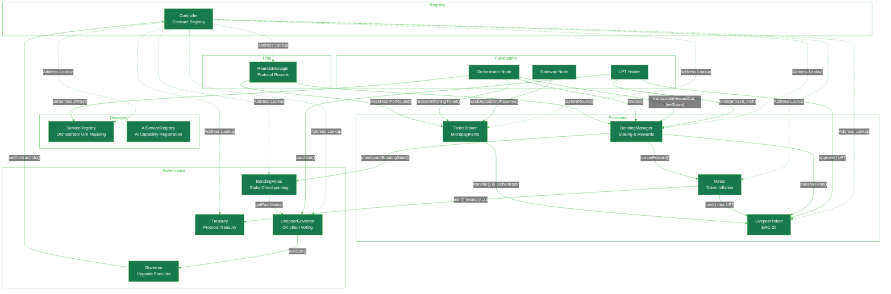
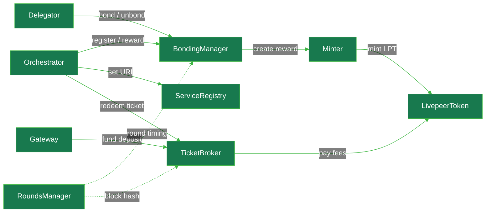
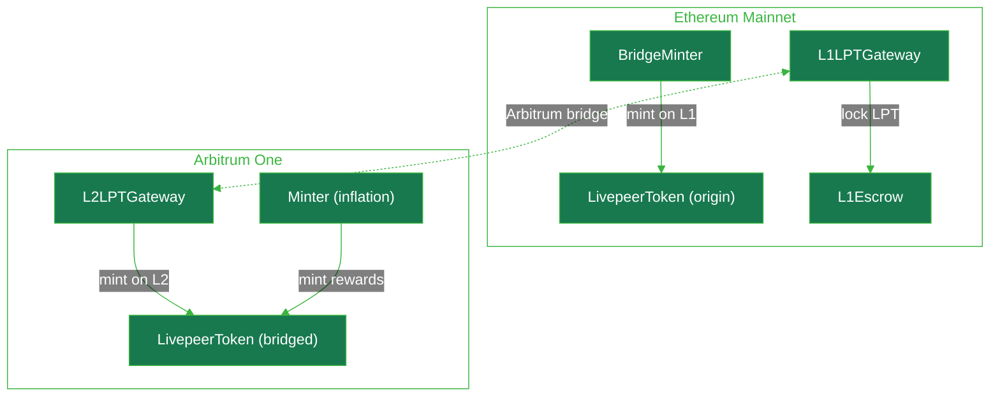
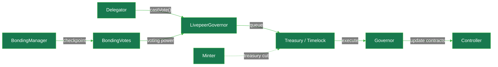

{/*
NOTES

Good question. Let me clarify the relationship:

livepeer/protocol (delta branch) is the source code that the deployed Arbitrum contracts were compiled from. The verified bytecode on Arbiscan was produced from this repo. They are the same code at the point of deployment.

livepeer/arbitrum-lpt-bridge is a separate repo for the bridge-specific contracts (L1LPTGateway, L2LPTGateway, L1Escrow). These are also deployed on-chain but live in a different repo because they span two chains and have different dependencies.

The risk with GitHub raw URLs: the delta branch can move forward after deployment. If someone pushes new commits, the GitHub source no longer matches what's actually deployed. The page already pins to commit e8b6243c for some contracts, which is the safe approach.

So the lightweight version would be:

MarkdownEmbed + pinned commit raw URLs (e.g. raw.githubusercontent.com/livepeer/protocol/e8b6243c/contracts/Controller.sol)
ExternalContent wrapper for scroll + "View on GitHub" link
No API calls, no JSON parsing, just a raw text fetch
The trade-off is no Solidity syntax highlighting (MarkdownEmbed renders <pre> only). But it's a single HTTP fetch per contract, same weight as the README embeds already on the solutions community pages.

Want me to prototype this on one accordion (say Controller) so you can see how it looks before committing to all 14?

## Full Contract Registry

### Core Protocol (Arbitrum One, chain 42161)

| #   | Contract                      | Address          | GitHub .sol                | Arbiscan  | Verified? | Same? |
| --- | ----------------------------- | ---------------- | -------------------------- | --------- | --------- | ----- |
| 1   | Controller                    | 0xD8E8...ee4     | Controller.sol             | Arbiscan  | YES       | YES – paths match, compiler 0.8.9, optimizer 200 |
| 2a  | BondingManager (proxy)        | 0x35Bc...e40     | ManagerProxy.sol           | Arbiscan  | YES       | YES – generic ManagerProxy |
| 2b  | BondingManager (target V11)   | 0x4bA7...BB4     | BondingManager.sol         | Arbiscan  | NO        | UNKNOWN – not verified on Blockscout |
| 3a  | TicketBroker (proxy)          | 0xa8bB...41B     | ManagerProxy.sol           | Arbiscan  | YES       | YES – generic ManagerProxy |
| 3b  | TicketBroker (target)         | 0xea1b...65c     | TicketBroker.sol           | Arbiscan  | YES       | YES – contracts/pm/TicketBroker.sol matches |
| 4a  | RoundsManager (proxy)         | 0xdd6f...c39f    | ManagerProxy.sol           | Arbiscan  | YES       | YES – generic ManagerProxy |
| 4b  | RoundsManager (target)        | 0x92d8...e841    | RoundsManager.sol          | Arbiscan  | YES       | YES – contracts/rounds/RoundsManager.sol matches |
| 5   | Minter                        | 0xc20D...7252    | Minter.sol                 | Arbiscan  | YES       | YES – contracts/token/Minter.sol matches |
| 6a  | ServiceRegistry (proxy)       | 0xC92d...7431    | ManagerProxy.sol           | Arbiscan  | YES       | YES – generic ManagerProxy |
| 6b  | ServiceRegistry (target)      | 0x3809...0a7     | ServiceRegistry.sol        | Arbiscan  | YES       | YES – contracts/ServiceRegistry.sol matches |
| 7   | AIServiceRegistry             | 0x04C0...34C5    | ServiceRegistry.sol        | Arbiscan  | YES       | YES – same ServiceRegistry.sol code, different deployer |

### Token and Bridge

| #   | Contract             | Chain | Address          | GitHub .sol            | Explorer  | Verified?      | Same? |
| --- | -------------------- | ----- | ---------------- | ---------------------- | --------- | -------------- | ----- |
| 8   | LivepeerToken (L2)   | Arb   | 0x289b...a839    | LivepeerToken.sol      | Arbiscan  | YES            | YES – contracts/L2/token/LivepeerToken.sol matches, compiler 0.8.9 |
| 9   | LivepeerToken (L1)   | ETH   | 0x58b6...b239    | LivepeerToken.sol      | Etherscan | YES (partial)  | DIFFERENT – L1 is Solidity 0.4.18, completely different codebase from L2 version |
| 10  | BridgeMinter         | ETH   | 0x8dDD...Ab05    | BridgeMinter.sol       | Etherscan | YES            | YES – contracts/token/BridgeMinter.sol matches, but imports from contracts/solc-0.8.9/ (L1-specific build) |
| 11  | L1LPTGateway         | ETH   | 0x6142...0676    | L1LPTGateway.sol       | Etherscan | YES            | YES – paths match |
| 12  | L2LPTGateway         | Arb   | 0x6D24...D318    | L2LPTGateway.sol       | Arbiscan  | YES            | YES – paths match |
| 13  | L1Escrow             | ETH   | 0x6A23...210A    | L1Escrow.sol           | Etherscan | YES            | YES – paths match |

### Governance (Arbitrum One)

| #   | Contract                      | Address          | GitHub .sol                | Arbiscan  | Verified? | Same? |
| --- | ----------------------------- | ---------------- | -------------------------- | --------- | --------- | ----- |
| 14a | BondingVotes (proxy)          | 0x0B9C...69A     | ManagerProxy.sol           | Arbiscan  | YES       | YES – generic ManagerProxy |
| 14b | BondingVotes (target)         | 0x68AF...8119    | BondingVotes.sol           | Arbiscan  | YES       | YES – contracts/bonding/BondingVotes.sol matches |
| 15  | Governor                      | 0xD9dE...36a6    | Governor.sol               | Arbiscan  | YES       | YES – contracts/governance/Governor.sol matches |
| 16a | LivepeerGovernor (proxy)      | 0xcFE4...8C4     | ManagerProxy.sol           | Arbiscan  | YES       | YES – generic ManagerProxy |
| 16b | LivepeerGovernor (target)     | 0xd2Ce...0634    | LivepeerGovernor.sol       | Arbiscan  | YES       | YES – contracts/treasury/LivepeerGovernor.sol matches |
| 17  | Treasury                      | 0xf82C...8C4     | Treasury.sol               | Arbiscan  | YES       | YES – contracts/treasury/Treasury.sol matches |

*/}

import { CustomDivider } from '/snippets/components/elements/spacing/Divider.jsx'
import { LinkArrow, DoubleIconLink, LinkIcon } from '/snippets/components/elements/links/Links.jsx'
import { Subtitle, CopyText } from '/snippets/components/elements/text/Text.jsx'
import { CenteredContainer, BorderedBox } from '/snippets/components/wrappers/containers/Containers.jsx'
import { ScrollableDiagram } from '/snippets/components/displays/diagrams/ZoomableDiagram.jsx'
import { contractAddresses } from '/snippets/data/contract-addresses/contractAddressesData.jsx'
import { CustomCardTitle } from '/snippets/components/elements/text/CustomCardTitle.jsx'
import { AddressLinks } from '/snippets/components/elements/links/Links.jsx'
import { LazyLoad } from '/snippets/components/wrappers/containers/LazyLoad.jsx'
import { ArbitrumIcon, ArbitrumSVG, LivepeerIcon, LivepeerSVG } from '/snippets/components/elements/icons/Icons.jsx'
import { SolidityEmbed } from '/snippets/components/integrators/embeds/DataEmbed.jsx'
import { FunctionField } from '/snippets/components/displays/response-fields/ResponseField.jsx'

{/* ADDRESS EXTRACTIONS — sourced from contractAddressesData; no addresses hardcoded below */}
export const arb = contractAddresses.meta.explorerUrls.arbiscan
export const eth = contractAddresses.meta.explorerUrls.etherscan

export const controller = contractAddresses.arbitrumOne.current.find(c => c.name === 'Controller')?.address
export const bondingManagerProxy = contractAddresses.arbitrumOne.current.find(c => c.name === 'BondingManager' && c.type === 'proxy')?.address
export const bondingManagerTarget = contractAddresses.arbitrumOne.current.find(c => c.name === 'BondingManager' && c.type === 'target')?.address
export const ticketBrokerProxy = contractAddresses.arbitrumOne.current.find(c => c.name === 'TicketBroker' && c.type === 'proxy')?.address
export const ticketBrokerTarget = contractAddresses.arbitrumOne.current.find(c => c.name === 'TicketBroker' && c.type === 'target')?.address
export const roundsManagerProxy = contractAddresses.arbitrumOne.current.find(c => c.name === 'RoundsManager' && c.type === 'proxy')?.address
export const roundsManagerTarget = contractAddresses.arbitrumOne.current.find(c => c.name === 'RoundsManager' && c.type === 'target')?.address
export const minter = contractAddresses.arbitrumOne.current.find(c => c.name === 'Minter')?.address
export const serviceRegistryProxy = contractAddresses.arbitrumOne.current.find(c => c.name === 'ServiceRegistry' && c.type === 'proxy')?.address
export const serviceRegistryTarget = contractAddresses.arbitrumOne.current.find(c => c.name === 'ServiceRegistry' && c.type === 'target')?.address
export const aiServiceRegistry = contractAddresses.arbitrumOne.current.find(c => c.name === 'AIServiceRegistry')?.address
export const lptArb = contractAddresses.arbitrumOne.current.find(c => c.name === 'LivepeerToken')?.address
export const lptEth = contractAddresses.ethereumMainnet.current.find(c => c.name === 'LivepeerToken')?.address
export const bridgeMinter = contractAddresses.ethereumMainnet.current.find(c => c.name === 'BridgeMinter')?.address
export const l2Gateway = contractAddresses.arbitrumOne.current.find(c => c.name === 'L2LPTGateway')?.address
export const l1Gateway = contractAddresses.ethereumMainnet.current.find(c => c.name === 'L1LPTGateway')?.address
export const l1Escrow = contractAddresses.ethereumMainnet.current.find(c => c.name === 'L1Escrow')?.address
export const bondingVotesProxy = contractAddresses.arbitrumOne.current.find(c => c.name === 'BondingVotes' && c.type === 'proxy')?.address
export const bondingVotesTarget = contractAddresses.arbitrumOne.current.find(c => c.name === 'BondingVotes' && c.type === 'target')?.address
export const governor = contractAddresses.arbitrumOne.current.find(c => c.name === 'Governor')?.address
export const livepeerGovernorProxy = contractAddresses.arbitrumOne.current.find(c => c.name === 'LivepeerGovernor' && c.type === 'proxy')?.address
export const livepeerGovernorTarget = contractAddresses.arbitrumOne.current.find(c => c.name === 'LivepeerGovernor' && c.type === 'target')?.address
export const treasury = contractAddresses.arbitrumOne.current.find(c => c.name === 'Treasury')?.address

<Tip>
  Addresses on this page are automatically updated via a Github Action workflow.  
   Data is sourced from the canonical <DoubleIconLink label="governor-scripts" href="https://github.com/livepeer/governor-scripts" iconRightColor="var(--hero-text)"/> and verified on-chain.   
   Last verified: {contractAddresses.meta.lastVerified ? new Date(contractAddresses.meta.lastVerified).toLocaleDateString("en-GB", { day: "numeric", month: "short", year: "numeric" }) : "Pending"} 
</Tip>

<Columns cols={2}>
  <Card
    href="https://github.com/livepeer/governor-scripts/blob/master/updates/addresses.js"
    icon="github"
    title={<>Livepeer Contract Addresses    <Badge color="green"> Canonical </Badge></>}
    horizontal
  />
  <Card
    href="https://arbiscan.io/accounts/label/livepeer"
    icon="cubes"
    title={<>Livepeer Contracts Arbiscan    <Badge color="green"> Canonical </Badge></>}
    horizontal
  />
  <Card title="Solidity Protocol Contracts" icon="github" href="https://github.com/livepeer/protocol/tree/delta/contracts" horizontal />
  <Card title="Solidity LPT Bridge Contracts" icon="github" href="https://github.com/livepeer/arbitrum-lpt-bridge/tree/main/contracts" horizontal />
</Columns>

<CustomDivider style={{margin: "0 0 -1rem 0"}} />

Livepeer uses a system of Ethereum smart contracts to permissionlessly govern its decentralised network.

The [Livepeer Protocol](https://github.com/livepeer/protocol/tree/delta) <LivepeerIcon size={12} color="var(--accent)"/> is deployed on [Arbitrum One](https://arbiscan.io/accounts/label/livepeer) <ArbitrumIcon size={14} color="var(--arbitrum)"/> and uses these contracts to govern:

- Livepeer Token (LPT) ownership and delegation
- Staking and selection of active orchestrators
- Distribution of inflationary rewards and fees to participants
- Time-based progression of the protocol through rounds
- Payment processing through a probabilistic micropayment system

There are three categories of contracts in the Livepeer Protocol:

1. **[Core Protocol Contracts](#core-protocol-contracts)** – staking, payments, round progression, and service discovery
2. **[Token and Utility Contracts](#token-and-utility-contracts)** – the LPT token and bridge infrastructure
3. **[Governance Contracts](#governance-contracts)** – on-chain voting, proposal execution, and treasury management

## Contract Interaction Architecture

<LazyLoad>
<ScrollableDiagram title="Contract Interaction Architecture" maxHeight="1000px" maxWidth="100%" showControls={true}>

</ScrollableDiagram>
</LazyLoad>

<CustomDivider style={{margin: "0 0 -2rem 0"}} />

## Core Protocol Contracts

The core protocol contracts manage staking, delegation, reward distribution, round progression, payment processing, and service discovery. The Controller serves as the central registry – upgrading a contract means registering a new target implementation address via the Controller, while the proxy address remains stable.

---

#### **Controller** <Subtitle text="Contract Registry" />
<Badge color="blue">
  Arbitrum One
</Badge>
The Controller is the central registry for all protocol contracts. Every other contract resolves peer contract addresses by calling `getContract(keccak256("<name>"))` on the Controller. Upgrades are applied by registering a new implementation address under the same name hash – the proxy addresses never change.

{/* {<CustomCardTitle variant="accordion" icon={<ArbitrumSVG size={18} />} title= */}
<Accordion  title={<CustomCardTitle variant="accordion" icon={<ArbitrumIcon color="var(--arbitrum)" />} title="Controller"/>} >
  <AddressLinks
  address={controller}
  blockchainHref={`${arb}${controller}`}
  githubHref="https://github.com/livepeer/protocol/blob/delta/contracts/Controller.sol"
/>
    {/* <LinkArrow label="View on Arbiscan" href={`${arb}${controller}`} /> */}
   <Icon icon="check" color="var(--text)"/> _Verified · Deployed by Livepeer Deployer · 20 transactions_

**Purpose**:

- Central address registry for all protocol contracts
- Enables contract upgrades while keeping proxy addresses stable
- Provides `pause()`/`unpause()` for emergency system-wide halts
- Owner is the Governor contract – all upgrades must go through governance

**Key functions** (from `Controller.sol`):

<FunctionField name="getContract" returns="address" params={["bytes32 _id"]}>
  Look up a registered contract by keccak256 name hash
</FunctionField>
<FunctionField name="getContractInfo" returns="(address, bytes20)" params={["bytes32 _id"]}>
  Returns address and git commit hash
</FunctionField>
<FunctionField name="setContractInfo" params={["bytes32 _id", "address _contractAddress", "bytes20 _gitCommitHash"]}>
  Register or update a contract; callable by owner (Governor) only
</FunctionField>
<FunctionField name="pause">
  Halt all contracts that check `controller.paused()`
</FunctionField>
<FunctionField name="unpause">
  Resume all contracts that check `controller.paused()`
</FunctionField>
<FunctionField name="updateController" params={["bytes32 _id", "address _controller"]}>
  Update the Controller reference in a registered contract
</FunctionField>

**Contract**

<SolidityEmbed
  url="https://raw.githubusercontent.com/livepeer/protocol/delta/contracts/Controller.sol"
  title={<DoubleIconLink label="Controller.sol"/>}
  filename="Controller.sol"
/>

</Accordion>

#### **BondingManager** <Subtitle text="Staking and Delegation" />
<Badge color="blue">
  Arbitrum One
</Badge>
The BondingManager is the most critical economic contract in the protocol. It manages the active orchestrator pool as a sorted doubly-linked list, handles all LPT bonding and unbonding, and distributes inflationary rewards and fees each round.

`feeShare` in the protocol is defined as: **the percentage of fees paid to delegators by the transcoder (orchestrator)**. It is not the gateway's cut – it is the orchestrator's share of fees that they pass on to their delegators. Source: `BondingManager.sol` struct comment: `// % of fees paid to delegators by transcoder`.

<Accordion title={<CustomCardTitle variant="accordion" icon={<ArbitrumIcon color="var(--arbitrum)" />} title="BondingManager" />}>
  **Address (Arbitrum One)**:
  <AddressLinks address={bondingManagerProxy} blockchainHref={`${arb}${bondingManagerProxy}`} githubHref="https://github.com/livepeer/protocol/blob/delta/contracts/bonding/BondingManager.sol" />
  <Icon icon="check" color="var(--text)"/> _Verified · 198,341 transactions · Active_

**Purpose**:

- Manages the active orchestrator pool (sorted by stake using SortedDoublyLL)
- Handles `bond()`, `unbond()`, and `withdrawStake()` for all delegators
- Distributes inflationary LPT rewards to orchestrators and their delegators each round
- Manages the unbonding period – delegators must wait `unbondingPeriod` rounds before withdrawing
- Tracks per-round earnings pools for each orchestrator
- Calls `checkpointBondingState()` on BondingVotes on every state change for governance weight
- Since Delta upgrade: sends `treasuryRewardCutRate` fraction of each reward to Treasury

**Key functions** (from `BondingManager.sol`, `delta` branch):

<FunctionField name="bond" params={["uint256 _amount", "address _to"]}>
  Delegate LPT stake to an orchestrator
</FunctionField>
<FunctionField name="unbond" params={["uint256 _amount"]}>
  Begin withdrawal; creates an unbonding lock, starts the unbonding period
</FunctionField>
<FunctionField name="rebond" params={["uint256 _unbondingLockId"]}>
  Cancel unbonding and re-bond stake
</FunctionField>
<FunctionField name="rebondFromUnbonded" params={["address _to", "uint256 _unbondingLockId"]}>
  Re-bond to a new orchestrator from unbonded state
</FunctionField>
<FunctionField name="withdrawStake" params={["uint256 _unbondingLockId"]}>
  Complete withdrawal after unbonding period expires
</FunctionField>
<FunctionField name="withdrawFees" params={["address payable _recipient", "uint256 _amount"]}>
  Withdraw accumulated ETH fees
</FunctionField>
<FunctionField name="transcoder" params={["uint256 _rewardCut", "uint256 _feeShare"]}>
  Register as an orchestrator or update parameters; `_rewardCut` is % of reward kept by orchestrator; `_feeShare` is % of fees passed to delegators
</FunctionField>
<FunctionField name="reward">
  Called by active orchestrators each round to mint inflationary LPT and distribute to earnings pool
</FunctionField>
<FunctionField name="claimEarnings" params={["uint256 _endRound"]}>
  Checkpoint and claim accumulated rewards and fees through a given round
</FunctionField>
<FunctionField name="pendingStake" returns="uint256" params={["address _addr", "uint256 _endRound"]}>
  Returns unclaimed pending stake for a delegator
</FunctionField>
<FunctionField name="pendingFees" returns="uint256" params={["address _addr", "uint256 _endRound"]}>
  Returns unclaimed pending ETH fees for a delegator
</FunctionField>
<FunctionField name="getTranscoder" params={["address _transcoder"]}>
  Returns orchestrator state (rewardCut, feeShare, active status, etc.)
</FunctionField>
<FunctionField name="getDelegator" params={["address _delegator"]}>
  Returns delegator state (bondedAmount, delegate, lastClaimRound, etc.)
</FunctionField>

**Contract**

<SolidityEmbed
  url="https://raw.githubusercontent.com/livepeer/protocol/delta/contracts/bonding/BondingManager.sol"
  title={<DoubleIconLink label="BondingManager.sol"/>}
  filename="BondingManager.sol"
/>

</Accordion>

#### **TicketBroker** <Subtitle text="Probabilistic Micropayments" />
<Badge color="blue">
  Arbitrum One
</Badge>
The TicketBroker implements Livepeer's off-chain probabilistic micropayment (PM) system. Gateways pre-fund a deposit and reserve on-chain; they send lottery tickets to orchestrators off-chain with each transcoding job. Orchestrators redeem winning tickets on-chain to claim payment. This amortises per-segment payment costs across many tickets.

<Accordion title={<CustomCardTitle variant="accordion" icon={<ArbitrumIcon color="var(--arbitrum)" />} title="TicketBroker" />}>
  **Address (Arbitrum One)**:
  <AddressLinks address={ticketBrokerProxy} blockchainHref={`${arb}${ticketBrokerProxy}`} githubHref="https://github.com/livepeer/protocol/blob/delta/contracts/pm/TicketBroker.sol" />
  <Icon icon="check" color="var(--text)"/> _Verified · Active_

**Purpose**:

- Holds gateway ETH deposits and reserves
- Validates and settles winning probabilistic payment tickets
- Manages the unlock period before gateways can withdraw funds
- Tracks claimed reserves per orchestrator per round to prevent over-redemption
- Emits `WinningTicketRedeemed` events used for on-chain payment monitoring

**Key functions** (from `TicketBroker.sol`):

<FunctionField name="fundDeposit">
  Gateway adds to ETH deposit (payable)
</FunctionField>
<FunctionField name="fundReserve">
  Gateway adds to ETH reserve (payable)
</FunctionField>
<FunctionField name="fundDepositAndReserve" params={["uint256 _depositAmount", "uint256 _reserveAmount"]}>
  Fund both in one call (payable)
</FunctionField>
<FunctionField name="redeemWinningTicket" params={["Ticket calldata _ticket", "bytes calldata _sig", "uint256 _recipientRand"]}>
  Orchestrator redeems a winning ticket; transfers ETH to fee pool via BondingManager
</FunctionField>
<FunctionField name="unlock">
  Gateway initiates the withdrawal unlock period
</FunctionField>
<FunctionField name="cancelUnlock">
  Gateway cancels an in-progress unlock
</FunctionField>
<FunctionField name="withdraw">
  Gateway withdraws deposit and reserve after unlock period
</FunctionField>
<FunctionField name="getReserve" returns="Reserve" params={["address _reserveHolder"]}>
  Returns reserve state for an address
</FunctionField>
<FunctionField name="getSender" returns="Sender" params={["address _sender"]}>
  Returns sender (gateway) state: deposit, reserve, unlock period
</FunctionField>

**Contract**

<SolidityEmbed
  url="https://raw.githubusercontent.com/livepeer/protocol/delta/contracts/pm/TicketBroker.sol"
  title={<DoubleIconLink label="TicketBroker.sol"/>}
  filename="TicketBroker.sol"
/>

</Accordion>

#### **RoundsManager** <Subtitle text="Protocol Time Management" />
<Badge color="blue">
  Arbitrum One
</Badge>
The RoundsManager defines the protocol's time unit. A round is a fixed number of Arbitrum blocks. The current round must be initialised before orchestrators can call `reward()`. It stores per-round block hashes used as randomness for ticket validation.

<Accordion title={<CustomCardTitle variant="accordion" icon={<ArbitrumIcon color="var(--arbitrum)" />} title="RoundsManager" />}>
  **Address (Arbitrum One)**:
  <AddressLinks address={roundsManagerProxy} blockchainHref={`${arb}${roundsManagerProxy}`} githubHref="https://github.com/livepeer/protocol/blob/delta/contracts/rounds/RoundsManager.sol" />
  <Icon icon="check" color="var(--text)"/> _Verified · Active_

**Purpose**:

- Tracks the current round number and round length in blocks
- Stores block hashes per round for ticket randomness (used by TicketBroker)
- Enforces the round lock period – orchestrators cannot change parameters during the lock window at end of each round
- `initializeRound()` must be called at the start of each new round before reward calls proceed

**Key functions** (from `RoundsManager.sol`):

<FunctionField name="initializeRound">
  Initialise a new round; callable by any address; updates block hash store and lip upgrade rounds
</FunctionField>
<FunctionField name="currentRound" returns="uint256">
  Returns current round number
</FunctionField>
<FunctionField name="currentRoundInitialized" returns="bool">
  Returns whether the current round has been initialised
</FunctionField>
<FunctionField name="currentRoundLocked" returns="bool">
  Returns whether the current round is in its lock period
</FunctionField>
<FunctionField name="blockHashForRound" returns="bytes32" params={["uint256 _round"]}>
  Returns the stored block hash for a given round
</FunctionField>
<FunctionField name="roundLength" returns="uint256">
  Returns round length in blocks
</FunctionField>
<FunctionField name="roundLockAmount" returns="uint256">
  Returns lock period as a percentage of round length (MathUtils percPoint)
</FunctionField>

**Contract**

<SolidityEmbed
  url="https://raw.githubusercontent.com/livepeer/protocol/delta/contracts/rounds/RoundsManager.sol"
  title={<DoubleIconLink label="RoundsManager.sol"/>}
  filename="RoundsManager.sol"
/>

</Accordion>

#### **Minter** <Subtitle text="Token Inflation" />
<Badge color="blue">
  Arbitrum One
</Badge>
The Minter controls LPT token inflation. Each round it calculates the mintable token supply based on the configured inflation rate. Since the Delta upgrade (LIP-91), a configurable fraction of each round's reward is minted to the Treasury rather than solely to orchestrators and delegators.

<Accordion title={<CustomCardTitle variant="accordion" icon={<ArbitrumIcon color="var(--arbitrum)" />} title="Minter" />}>
  **Address (Arbitrum One)**:
  <AddressLinks address={minter} blockchainHref={`${arb}${minter}`} githubHref="https://github.com/livepeer/protocol/blob/delta/contracts/token/Minter.sol" />
  <Icon icon="check" color="var(--text)"/> _Verified · Active_

**Purpose**:

- Manages LPT token inflation schedule
- Calculates mintable tokens per round based on current `inflation` rate and total LPT supply
- Adjusts inflation up or down each round based on actual bonding rate vs `targetBondingRate`
- Called by BondingManager during orchestrator `reward()` calls – not called directly
- Holds ETH received from TicketBroker redemptions and disburses to orchestrators

**Key functions** (from `Minter.sol`):

<FunctionField name="createReward" returns="uint256" params={["uint256 _fracNum", "uint256 _fracDenom"]}>
  Called only by BondingManager; mints a fraction of mintable tokens for the round as a reward
</FunctionField>
<FunctionField name="trustedTransferTokens" params={["address _to", "uint256 _amount"]}>
  Transfer LPT to an address; callable by BondingManager only
</FunctionField>
<FunctionField name="trustedBurnTokens" params={["uint256 _amount"]}>
  Burn LPT; callable by BondingManager only
</FunctionField>
<FunctionField name="trustedWithdrawETH" params={["address payable _to", "uint256 _amount"]}>
  Withdraw ETH to an address; callable by BondingManager only
</FunctionField>
<FunctionField name="depositETH">
  Receive ETH from TicketBroker on ticket redemption (payable)
</FunctionField>
<FunctionField name="currentMintableTokens" returns="uint256">
  Returns LPT mintable in the current round
</FunctionField>
<FunctionField name="currentMintedTokens" returns="uint256">
  Returns LPT already minted in the current round
</FunctionField>
<FunctionField name="inflation" returns="uint256">
  Returns current inflation rate as a MathUtils percPoint value
</FunctionField>
<FunctionField name="inflationChange" returns="uint256">
  Returns per-round inflation adjustment amount
</FunctionField>
<FunctionField name="targetBondingRate" returns="uint256">
  Returns the target bonding rate that inflation adjusts towards
</FunctionField>

**Contract**

<SolidityEmbed
  url="https://raw.githubusercontent.com/livepeer/protocol/delta/contracts/token/Minter.sol"
  title={<DoubleIconLink label="Minter.sol"/>}
  filename="Minter.sol"
/>

</Accordion>

#### **ServiceRegistry** <Subtitle text="Orchestrator Discovery" />
<Badge color="blue">
  Arbitrum One
</Badge>
The ServiceRegistry stores each orchestrator's publicly advertised HTTPS service URI on-chain. Gateway nodes query this registry during network initialisation to discover orchestrators. Each update emits a `ServiceURIUpdate` event that off-chain indexers track.

<Accordion title={<CustomCardTitle variant="accordion" icon={<ArbitrumIcon color="var(--arbitrum)" />} title="ServiceRegistry" />}>
  **Address (Arbitrum One)**:
  <AddressLinks address={serviceRegistryProxy} blockchainHref={`${arb}${serviceRegistryProxy}`} githubHref="https://github.com/livepeer/protocol/blob/delta/contracts/ServiceRegistry.sol" />
  <Icon icon="check" color="var(--text)"/> _Verified · ~600 transactions · Last active Jan 2026_

**Purpose**:

- Allows orchestrators to register and update their service endpoint URIs
- Enables gateway nodes to discover orchestrators when using `-network arbitrum-one-mainnet`
- Not used when a gateway specifies `-orchAddr` directly

**Key functions** (from `ServiceRegistry.sol`):

<FunctionField name="setServiceURI" params={["string calldata _serviceURI"]}>
  Orchestrator registers or updates their HTTPS endpoint; emits `ServiceURIUpdate(address indexed _addr, string _serviceURI)`
</FunctionField>
<FunctionField name="getServiceURI" returns="string" params={["address _addr"]}>
  Returns the registered URI for a given orchestrator address
</FunctionField>

**Contract**

<SolidityEmbed
  url="https://raw.githubusercontent.com/livepeer/protocol/delta/contracts/ServiceRegistry.sol"
  title={<DoubleIconLink label="ServiceRegistry.sol"/>}
  filename="ServiceRegistry.sol"
/>

</Accordion>

#### **AIServiceRegistry** <Subtitle text="AI Capability Registration" />
<Badge color="blue">
  Arbitrum One
</Badge>
A standalone ServiceRegistry for AI subnet orchestrators. Detached from the Controller – its address is hardcoded in go-livepeer (`starter.go`) rather than resolved dynamically. Deployed by a different deployer than the main protocol contracts.

<Accordion title={<CustomCardTitle variant="accordion" icon={<ArbitrumIcon color="var(--arbitrum)" />} title="AIServiceRegistry" />}>
  **Address (Arbitrum One)**:
  <AddressLinks address={aiServiceRegistry} blockchainHref={`${arb}${aiServiceRegistry}`} githubHref="https://github.com/livepeer/protocol/blob/delta/contracts/ServiceRegistry.sol" />
  <Icon icon="check" color="var(--text)"/> _Verified · Deployed Apr 2024 · Active · Deployed by AI subnet deployer (different from main Livepeer Deployer)_

**Purpose**:

- Stores service URI and capability metadata for AI-enabled orchestrators
- Used when a node is started with `-aiServiceRegistry` flag
- Same interface as ServiceRegistry (`setServiceURI`, `getServiceURI`)
</Accordion>

<CustomDivider style={{margin: "0 0 -2rem 0"}} />

## Token and Utility Contracts

<Info>
Livepeer moved from Ethereum Mainnet to Arbitrum One in 2022 (the Confluence upgrade) to increase throughput and reduce fees.

On Ethereum Mainnet, only the `LivepeerToken` and `BridgeMinter` contracts remain operational. All other Ethereum Mainnet protocol contracts are paused.

LPT must be bridged to Arbitrum One to participate in protocol operations.

</Info>
 

#### **LivepeerToken (LPT)** <Subtitle text="ERC-20 Token" />
<Badge color="green">
  Ethereum Mainnet (origin)
</Badge>

The LivepeerToken is the native protocol token. It is an ERC-20 with AccessControl-based MINTER_ROLE and BURNER_ROLE. The canonical token contract lives on Ethereum Mainnet; a bridged representation exists on Arbitrum One.

<Accordion title={<CustomCardTitle variant="accordion" icon={<LivepeerIcon color="var(--accent)" size={13} />} title="LivepeerToken" />}>
  **Address (Arbitrum One)**:
  <AddressLinks address={lptArb} blockchainHref={`${arb}${lptArb}`} githubHref="https://github.com/livepeer/arbitrum-lpt-bridge/blob/main/contracts/L2/token/LivepeerToken.sol" />
  <Icon icon="check" color="var(--text)"/> _Verified · 261,217 holders · Active_

**Address (Ethereum Mainnet)**:

  <AddressLinks address={lptEth} blockchainHref={`${eth}${lptEth}`} githubHref="https://github.com/livepeer/protocol/blob/master/contracts/token/LivepeerToken.sol" />
  <Icon icon="check" color="var(--text)"/> _Verified · 1.88M holders · Origin token_

**Purpose**:

- ERC-20 token used for bonding, staking, gateway payment reserves, and governance voting weight
- `approve()` must be called before bonding or funding deposits
- On Arbitrum One: minted by Minter (inflationary rewards) and by the bridge (inflows from L1)

**Key functions** (from `LivepeerToken.sol`, inherits OpenZeppelin ERC20 + ERC20Permit + ERC20Burnable + AccessControl):

<FunctionField name="transfer / transferFrom / approve / balanceOf / totalSupply / allowance">
  Standard ERC-20 interface
</FunctionField>
<FunctionField name="permit" params={["..."]}>
  EIP-2612 gasless approval
</FunctionField>
<FunctionField name="mint" params={["address _to", "uint256 _amount"]}>
  Callable only by MINTER_ROLE (Minter contract on Arbitrum, BridgeMinter on L1)
</FunctionField>
<FunctionField name="burn" params={["uint256 _amount"]}>
  Callable only by BURNER_ROLE
</FunctionField>

**Contract**

<SolidityEmbed
  url="https://raw.githubusercontent.com/livepeer/arbitrum-lpt-bridge/main/contracts/L2/token/LivepeerToken.sol"
  title={<DoubleIconLink label="LivepeerToken.sol (L2)"/>}
  filename="LivepeerToken.sol"
/>

</Accordion>

#### **BridgeMinter** <Subtitle text="L1 Bridge Minting" />

<Badge color="green">Ethereum Mainnet</Badge>

Holds MINTER_ROLE on the L1 LivepeerToken. Called by the bridge when LPT is transferred from Arbitrum back to Ethereum Mainnet, minting the corresponding L1 LPT.

<Accordion title={<CustomCardTitle variant="accordion" icon={<Icon icon="ethereum" color="var(--hero-text)"/>} title="BridgeMinter" />}>
  **Address (Ethereum Mainnet)**:
  <AddressLinks address={bridgeMinter} blockchainHref={`${eth}${bridgeMinter}`} />
  <Icon icon="check" color="var(--text)"/> _Verified · Active · "Livepeer: Bridge Minter" on Blockscout_

</Accordion>

#### **L1 LPTGateway / L2 LPTGateway** <Subtitle text="Token Bridge" />
<Badge color="gren">
  Ethereum
</Badge>
<Badge color="blue">
  Arbitrum One
</Badge>
Paired bridge gateway contracts on Ethereum Mainnet (L1) and Arbitrum One (L2). LPT bridged L1→L2 is locked in L1Escrow; LPT bridged L2→L1 is released from escrow or minted via BridgeMinter. Based on the Dai bridge architecture.

<Accordion title={<CustomCardTitle variant="accordion" icon={<ArbitrumIcon color="var(--arbitrum)" />} title="Bridge Gateways" />}>
  **L2LPTGateway (Arbitrum One)**:
  <AddressLinks address={l2Gateway} blockchainHref={`${arb}${l2Gateway}`} githubHref="https://github.com/livepeer/arbitrum-lpt-bridge/blob/main/contracts/L2/gateway/L2LPTGateway.sol" />
  <Icon icon="check" color="var(--text)"/> _Verified · Active_

**L1LPTGateway (Ethereum Mainnet)**:

  <AddressLinks address={l1Gateway} blockchainHref={`${eth}${l1Gateway}`} githubHref="https://github.com/livepeer/arbitrum-lpt-bridge/blob/main/contracts/L1/gateway/L1LPTGateway.sol" />
  <Icon icon="check" color="var(--text)"/> _Verified · Active_

**L1Escrow (Ethereum Mainnet)**:

  <AddressLinks address={l1Escrow} blockchainHref={`${eth}${l1Escrow}`} githubHref="https://github.com/livepeer/arbitrum-lpt-bridge/blob/main/contracts/L1/escrow/L1Escrow.sol" />
  <Icon icon="check" color="var(--text)"/> _Verified · Active · Holds bridged LPT_

**Contract**

<SolidityEmbed
  url="https://raw.githubusercontent.com/livepeer/arbitrum-lpt-bridge/main/contracts/L2/gateway/L2LPTGateway.sol"
  title={<DoubleIconLink label="L2LPTGateway.sol"/>}
  filename="L2LPTGateway.sol"
/>

</Accordion>

#### **LivepeerTokenFaucet** <Subtitle text="Test Token Distribution" />
<Badge color="surface">Testnets Only</Badge>

Distributes test LPT on testnets. **Does not exist on Ethereum Mainnet or Arbitrum One mainnet.**

<CustomDivider style={{margin: "0 0 -2rem 0"}} />

## Governance Contracts

The Delta upgrade (LIP-89, LIP-91 – October 2023) introduced full on-chain governance. The governance system consists of four contracts working together: BondingVotes checkpoints voting power, LivepeerGovernor manages proposal voting, Treasury holds protocol funds, and Governor executes approved upgrades.

---

#### **BondingVotes** <Subtitle text="Voting Power Checkpointing" />
<Badge color="blue">
  Arbitrum One
</Badge>
BondingVotes implements the ERC-5805 votes interface, storing per-round stake checkpoints for every delegator and orchestrator. The LivepeerGovernor queries it to determine voting power at proposal creation time. Checkpoints are written automatically by BondingManager on every bond, unbond, reward, and earnings claim.

<Accordion title={<CustomCardTitle variant="accordion" icon={<ArbitrumIcon color="var(--arbitrum)" />} title="BondingVotes" />}>
  **Address (Arbitrum One)**:
  <AddressLinks address={bondingVotesProxy} blockchainHref={`${arb}${bondingVotesProxy}`} githubHref="https://github.com/livepeer/protocol/blob/delta/contracts/bonding/BondingVotes.sol" />
  <Icon icon="check" color="var(--text)"/> _Verified · Active_

**Purpose**:

- Stores per-round stake checkpoints for every participant
- Implements ERC-5805 (`getPastVotes`, `getPastTotalSupply`) used by LivepeerGovernor
- Checkpoints are written by BondingManager – not called directly by users
- Supports delegator vote overrides: a delegator can override their orchestrator's vote

**Key functions** (from `BondingVotes.sol`, `delta` branch):

<FunctionField name="checkpointBondingState" params={["address _owner", "uint256 _startRound", "uint256 _bondedAmount", "address _delegateAddress", "uint256 _delegatedAmount", "uint256 _lastClaimRound", "uint256 _lastRewardRound"]}>
  Called by BondingManager to checkpoint stake state; not callable directly
</FunctionField>
<FunctionField name="checkpointTotalActiveStake" params={["uint256 _totalStake", "uint256 _round"]}>
  Checkpoint total active stake; called by BondingManager
</FunctionField>
<FunctionField name="getPastVotes" returns="uint256" params={["address _account", "uint256 _round"]}>
  Returns voting power for an account at the start of a given round
</FunctionField>
<FunctionField name="getPastTotalSupply" returns="uint256" params={["uint256 _round"]}>
  Returns total voting power (active stake) at a given round
</FunctionField>
<FunctionField name="hasCheckpoint" returns="bool" params={["address _account"]}>
  Returns whether an account has any checkpointed stake
</FunctionField>

**Contract**

<SolidityEmbed
  url="https://raw.githubusercontent.com/livepeer/protocol/delta/contracts/bonding/BondingVotes.sol"
  title={<DoubleIconLink label="BondingVotes.sol"/>}
  filename="BondingVotes.sol"
/>

</Accordion>

#### **Governor** <Subtitle text="Protocol Upgrade Executor" />
<Badge color="blue">
  Arbitrum One
</Badge>
The original upgrade execution contract. Holds the owner role on the Controller. Executes protocol upgrades (contract address updates, parameter changes) via a staged proposal queue with a configurable delay.

<Accordion title={<CustomCardTitle variant="accordion" icon={<ArbitrumIcon color="var(--arbitrum)" />} title="Governor" />}>
  **Address (Arbitrum One)**:
  <AddressLinks address={governor} blockchainHref={`${arb}${governor}`} githubHref="https://github.com/livepeer/protocol/blob/delta/contracts/governance/Governor.sol" />
  <Icon icon="check" color="var(--text)"/> _Verified · 18 transactions · Last active Aug 2025 · Deployed by Livepeer Deployer_

**Purpose**:

- Owns the Controller contract – only address that can call `setContractInfo()`
- Executes protocol upgrade transactions after governance approval
- Enforces a staged execution queue with a mandatory delay

**Key functions** (from `Governor.sol`):

<FunctionField name="stage" params={["Transaction[] calldata _transactions", "uint256 _delay"]}>
  Queue a batch of upgrade transactions with a delay; emits `TransactionStaged`
</FunctionField>
<FunctionField name="execute" params={["Transaction[] calldata _transactions"]}>
  Execute a queued batch after its delay has elapsed; emits `TransactionExecuted`
</FunctionField>
<FunctionField name="owner" returns="address">
  Returns the owner (currently the LivepeerGovernor proxy via timelock)
</FunctionField>

**Contract**

<SolidityEmbed
  url="https://raw.githubusercontent.com/livepeer/protocol/delta/contracts/governance/Governor.sol"
  title={<DoubleIconLink label="Governor.sol"/>}
  filename="Governor.sol"
/>

</Accordion>

#### **LivepeerGovernor** <Subtitle text="On-Chain Voting" />
<Badge color="blue">
  Arbitrum One
</Badge>
Implements OpenZeppelin's upgradeable Governor framework adapted for Livepeer's stake-weighted voting. Voting power equals bonded LPT as recorded by BondingVotes at proposal creation time. Supports GovernorCountingOverridable – delegators can override their orchestrator's vote on any proposal.

<Accordion title={<CustomCardTitle variant="accordion" icon={<ArbitrumIcon color="var(--arbitrum)" />} title="LivepeerGovernor" />}>
  **Address (Arbitrum One)**:
  <AddressLinks address={livepeerGovernorProxy} blockchainHref={`${arb}${livepeerGovernorProxy}`} githubHref="https://github.com/livepeer/protocol/blob/delta/contracts/treasury/LivepeerGovernor.sol" />
  <Icon icon="check" color="var(--text)"/> _Verified · Active_

**Purpose**:

- On-chain voting for protocol proposals, weighted by bonded LPT stake
- Delegators can override their orchestrator's vote (GovernorCountingOverridable)
- Passed proposals execute through the Treasury timelock, then through the Governor to the Controller
- `bumpGovernorVotesTokenAddress()` must be called if BondingVotes address ever changes

**Key functions** (from `LivepeerGovernor.sol`, `delta` branch):

<FunctionField name="initialize" params={["uint256 _initialVotingDelay", "uint256 _initialVotingPeriod", "uint256 _initialProposalThreshold", "uint256 _initialQuorumNumerator", "TimelockControllerUpgradeable _timelock", "address _controller"]}>
  One-time initialisation via proxy
</FunctionField>
<FunctionField name="propose" returns="uint256" params={["address[] memory targets", "uint256[] memory values", "bytes[] memory calldatas", "string memory description"]}>
  Submit a new governance proposal; returns proposalId
</FunctionField>
<FunctionField name="castVote" returns="uint256" params={["uint256 proposalId", "uint8 support"]}>
  Cast a vote (0=Against, 1=For, 2=Abstain)
</FunctionField>
<FunctionField name="castVoteWithReason" returns="uint256" params={["uint256 proposalId", "uint8 support", "string calldata reason"]}>
  Vote with explanation
</FunctionField>
<FunctionField name="queue" returns="uint256" params={["address[] memory targets", "uint256[] memory values", "bytes[] memory calldatas", "bytes32 descriptionHash"]}>
  Queue a passed proposal into the timelock
</FunctionField>
<FunctionField name="execute" returns="uint256" params={["address[] memory targets", "uint256[] memory values", "bytes[] memory calldatas", "bytes32 descriptionHash"]}>
  Execute a queued proposal after timelock delay
</FunctionField>
<FunctionField name="quorumDenominator" returns="uint256">
  Returns `MathUtils.PERC_DIVISOR` (the quorum denominator)
</FunctionField>
<FunctionField name="bumpGovernorVotesTokenAddress">
  Update the internal BondingVotes reference if its address has changed
</FunctionField>

**Contract**

<SolidityEmbed
  url="https://raw.githubusercontent.com/livepeer/protocol/delta/contracts/treasury/LivepeerGovernor.sol"
  title={<DoubleIconLink label="LivepeerGovernor.sol"/>}
  filename="LivepeerGovernor.sol"
/>

</Accordion>

#### **Treasury** <Subtitle text="Protocol Treasury" />
<Badge color="blue">
  Arbitrum One
</Badge>
An OpenZeppelin TimelockControllerUpgradeable that holds the protocol's on-chain treasury. A configurable percentage of each round's inflationary LPT rewards is directed here by the Minter. All disbursements require a passed LivepeerGovernor proposal. Automatic contributions halt when the treasury balance exceeds `treasuryBalanceCeiling` (configured in BondingManager).

<Accordion title={<CustomCardTitle variant="accordion" icon={<ArbitrumIcon color="var(--arbitrum)" />} title="Treasury" />}>
  **Address (Arbitrum One)**:
  <AddressLinks address={treasury} blockchainHref={`${arb}${treasury}`} githubHref="https://github.com/livepeer/protocol/blob/delta/contracts/treasury/Treasury.sol" />
  <Icon icon="check" color="var(--text)"/> _Verified · Active_

**Purpose**:

- Receives a fraction of each round's inflationary LPT rewards (rate set by `treasuryRewardCutRate` in BondingManager)
- Governed entirely by LivepeerGovernor – all disbursements require a passed proposal
- Implements TimelockController – all operations have a mandatory delay between queue and execution
- Contributions automatically halt when LPT balance exceeds `treasuryBalanceCeiling`
- Funds Special Purpose Entities (SPEs) and ecosystem grants via governance proposals

**Key functions** (OpenZeppelin TimelockControllerUpgradeable):

<FunctionField name="schedule" params={["address target", "uint256 value", "bytes calldata data", "bytes32 predecessor", "bytes32 salt", "uint256 delay"]}>
  Schedule an operation; callable by proposer role (LivepeerGovernor)
</FunctionField>
<FunctionField name="execute" params={["address target", "uint256 value", "bytes calldata payload", "bytes32 predecessor", "bytes32 salt"]}>
  Execute a ready operation; callable by executor role
</FunctionField>
<FunctionField name="cancel" params={["bytes32 id"]}>
  Cancel a pending operation; callable by canceller role
</FunctionField>
<FunctionField name="isOperation" returns="bool" params={["bytes32 id"]}>
  Check if an operation exists
</FunctionField>
<FunctionField name="isOperationReady" returns="bool" params={["bytes32 id"]}>
  Check if an operation is past its delay and ready to execute
</FunctionField>
<FunctionField name="getMinDelay" returns="uint256">
  Returns the minimum delay for all operations
</FunctionField>

**Contract**

<SolidityEmbed
  url="https://raw.githubusercontent.com/livepeer/protocol/delta/contracts/treasury/Treasury.sol"
  title={<DoubleIconLink label="Treasury.sol"/>}
  filename="Treasury.sol"
/>

</Accordion>

<CustomDivider style={{margin: "0 0 -2rem 0"}} />

## Full Address Reference

For the complete list of all current and historical contract addresses across Arbitrum One and Ethereum Mainnet, including all historical target/implementation versions, see the [Contract Addresses](/v2/about/resources/contract-addresses) reference page.

All addresses in this page were verified on 18 March 2026 by querying the Controller contract directly on-chain via `getContract(keccak256("<name>"))` (Arbitrum One) and Blockscout `get_address_info` (Ethereum Mainnet). No documentation sources were used.

<Columns cols={2}>
  <Card
    href="https://github.com/livepeer/governor-scripts/blob/master/updates/addresses.js"
    icon="github"
    title={<>Livepeer Contract Addresses    <Badge color="green"> Canonical </Badge></>}
    horizontal
  />
  <Card
    href="https://arbiscan.io/accounts/label/livepeer"
    icon="cubes"
    title={<>Livepeer Contracts Arbiscan    <Badge color="green"> Canonical </Badge></>}
    horizontal
  />
</Columns>

<CustomDivider />

## Related Pages
