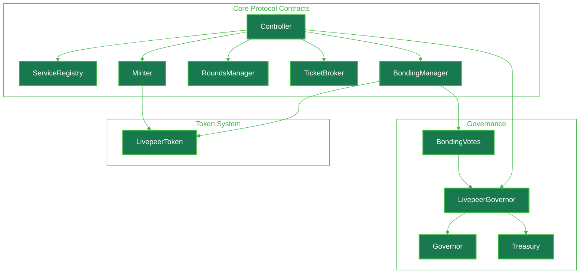
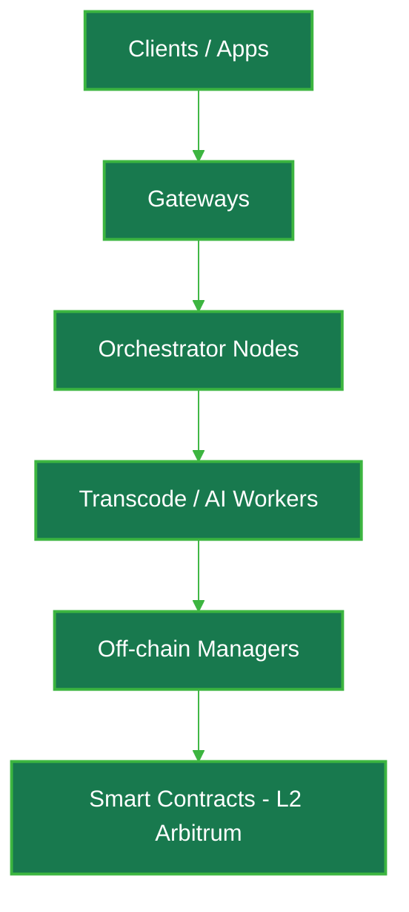
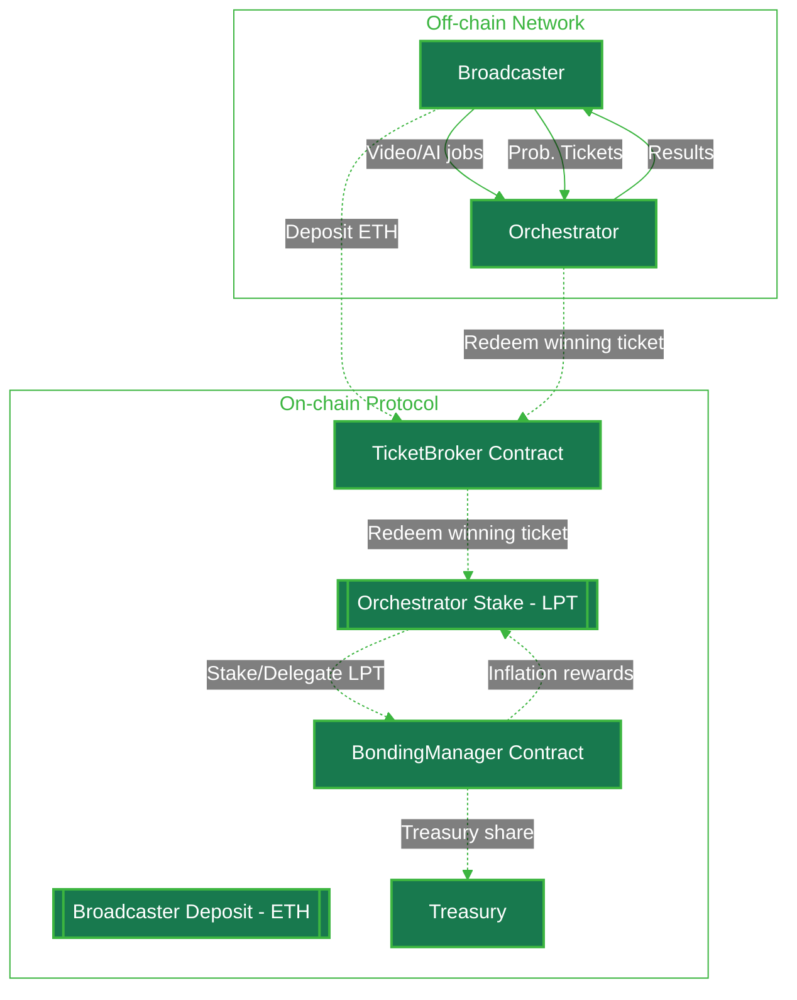

{/* This page describes:
7. **Technical Architecture**

   * Smart contracts
   * On-chain components
   * How protocol interacts with network

How in depth though?
*/}

import { GotoCard, GotoLink } from '/snippets/components/elements/links/Links.jsx'
import { Image } from '/snippets/components/elements/images/Image.jsx'
import { ScrollableDiagram } from '/snippets/components/displays/diagrams/ScrollableDiagram.jsx'
import { DynamicTable, DynamicTableV2 } from '/snippets/components/displays/tables/Tables.jsx'
import { CardTitleTextWithArrow } from '/snippets/components/elements/text/Text.jsx'
import { CustomDivider } from '/snippets/components/elements/spacing/Divider.jsx'
import { Quote } from '/snippets/components/displays/quotes/Quote.jsx'

<FlexContainer justify="center" style={{padding: 0, margin: 0}}>
 <CardTitleTextWithArrow icon="github" horizontal href="https://github.com/livepeer/protocol"> Livepeer Protocol </CardTitleTextWithArrow>
</FlexContainer>
<CustomDivider style={{margin: 0, marginBottom: "-1rem"}} />

<Quote>

</Quote>

Notes
- The blockchain handles economic incentives and coordination, while `go-livepeer` network nodes handle the computationally intensive work of media processing and AI inference.
- The on-chain contracts verify work and handle payments, but don't perform the actual transcoding/AI inference
- `go-livepeer` nodes communicate with the blockchain to submit work proofs and claim rewards
- This architecture allows the protocol to scale while maintaining economic security through on-chain verification

<CustomDivider />

{/* <Warning> this is the NETWORK not the protocol </Warning>
The [go-livepeer](https://github.com/livepeer/go-livepeer) architecture is organized around three node types that work together to form a decentralised media processing network:

- Gateway: Accepts video streams and AI jobs, routes work to orchestrators
- Orchestrator: Manages transcoding tasks, pays out rewards
- Worker Nodes: (Transcoder & AI Worker) Performs video transcoding or AI inference work

<Image src="/snippets/assets/domain/01_ABOUT/ProtocolNodeDiagram.png" alt="System Overview" caption="Livepeer System Overview" height="500px"/> */}

{/* Livepeer is a decentralized infrastructure protocol that allows users to upload, transcode, and serve video content & run AI pipelines. It operates on a network with different node types including Gateways (formerly Broadcasters), Orchestrators, and Transcoders. The protocol uses smart contracts deployed on Ethereum Mainnet and Arbitrum Mainnet, with the native token LPT (Livepeer Token). Since the Confluence upgrade, the protocol primarily runs on Arbitrum Mainnet.

The core components of the Livepeer node implementation work together to provide a distributed, scalable video transcoding platform. Each component has specific responsibilities:
- LivepeerNode: The central structure representing a node in the network
- LivepeerServer: Handles media operations and HTTP interfaces
- Orchestrator: Manages transcoding tasks and payment processing
- BroadcastSessionsManager: Coordinates with multiple orchestrators
- RemoteTranscoderManager: Distributes work to transcoders
- RPC System: Enables communication between different node types

These components implement the Livepeer protocol, allowing video to be efficiently transcoded in a decentralized network. */}

## Architecture Overview

Blockchain layer (Arbitrum One) for staking, payments, and coordination
Protocol layer (off-chain) for job negotiation and micropayments
Node layer (go-livepeer) for video processing and protocol interaction

**Blockchain Layer** - Smart contracts deployed on Arbitrum One that manage staking, payments, time progression, and service discovery. All contracts are registered through the Controller contract for discoverability.

The blockchain layer provides:

- Immutable transaction history
- State consensus via Arbitrum One rollup
- Economic security through fraud proofs
- Cross-chain token bridging between L1 and L2

<Tip> The Confluence upgrade (LIP-73) moved contracts from Ethereum mainnet to Arbitrum One, reducing gas costs by approximately 100x while maintaining Ethereum's security guarantees. </Tip>

**Protocol Layer** - Off-chain protocols that enable scalable payments, job assignment, and work verification without requiring on-chain transactions for every segment.

Protocol Mechanisms
The protocol layer implements economic and coordination mechanisms on top of the blockchain:

<DynamicTableV2
  headerList={['Protocol', 'Purpose', 'On-chain Component', 'Off-chain Component']}
  itemsList={[
    {
      Protocol: 'Bonding/Delegation',
      Purpose: 'Stake coordination',
      'On-chain Component': 'BondingManager.bond()',
      'Off-chain Component': 'Client delegation decisions',
    },
    {
      Protocol: 'Service Discovery',
      Purpose: 'Orchestrator advertising',
      'On-chain Component': 'ServiceRegistry.setServiceURI()',
      'Off-chain Component': 'Client queries and filtering',
    },
    {
      Protocol: 'Job Negotiation',
      Purpose: 'Price discovery',
      'On-chain Component': 'None',
      'Off-chain Component': 'P2P price quotes',
    },
    {
      Protocol: 'Probabilistic Micropayments',
      Purpose: 'Scalable payments',
      'On-chain Component': 'TicketBroker.redeemWinningTicket()',
      'Off-chain Component': 'Ticket generation/validation',
    },
    {
      Protocol: 'Verification',
      Purpose: 'Work correctness',
      'On-chain Component': 'BondingManager.slashTranscoder()',
      'Off-chain Component': 'Segment re-encoding checks',
    },
    {
      Protocol: 'Rewards',
      Purpose: 'Inflation distribution',
      'On-chain Component': 'Minter.reward()',
      'Off-chain Component': 'Orchestrator reward() calls',
    },
  ]}
/>

**Node Layer** - Software implementations running on participant machines that interact with both blockchain and protocol layers to perform video transcoding work.

## Protocol Architecture

<ScrollableDiagram title="Livepeer Protocol Contract Architecture" maxHeight="600px">

</ScrollableDiagram>

## System Overview

Livepeer can be modeled as a layered architecture:

{/* <ScrollableDiagram title="Livepeer System Overview" maxHeight="500px">

</ScrollableDiagram> */}

<DynamicTable
  headerList={["Layer", "Role"]}
  itemsList={[
    { "Layer": "Client Layer", "Role": "Streams or submits jobs via Application Layer (eg. CLI, SDK, API)" },
    { "Layer": "Gateway Layer", "Role": "Receives jobs, initiates session routing" },
    { "Layer": "Orchestrator Layer", "Role": "Bids on sessions, runs compute nodes" },
    { "Layer": "Worker Layer", "Role": "Performs transcoding / AI inference" },
    { "Layer": "Off-chain Manager", "Role": "Handles bonding sync, ticket validation" },
    { "Layer": "L2 Contracts (ARB)", "Role": "TicketBroker, BondingManager, Delegator claims, reward withdrawal" },
    { "Layer": "L1 Contracts (ETH)", "Role": "LivepeerToken, BridgeMinter - token issuance & bridging only" },
  ]}
/>

## System Diagram

<ScrollableDiagram title="Livepeer Protocol System Diagram" maxHeight="600px">

</ScrollableDiagram>

## Actor & Incentive Model

## Trust & Verification Model

## Job Lifecycle

## Governance & Treasury

## Protocol References

<Note>Aggregate from internal Livepeer Notions, Prev site & deepwiki</Note>

{/*
### A/B/C TEST LAYOUTS

**Expandable**

  <Expandable title="All References" defaultOpen={true}>
    <ResponseField name="Contract Addresses">
        <GotoLink
          label="Contract Addresses"
          text="See all current contract addresses for the deployed protocol"
          relativePath="/v2/about/resources/reference/livepeer-contract-addresses"
        />
    </ResponseField>

    <ResponseField name="is_over_21" type="boolean">
 Whether the user is over 21 years old
    </ResponseField>

  </Expandable>

**Steps**

<Steps>
  <Step title="Contract Addresses" icon="code">
    <GotoLink
      label="Contract Addresses"
      text="See all current contract addresses for the deployed protocol"
      relativePath="/v2/about/resources/reference/livepeer-contract-addresses"
    />
  </Step>
  <Step title="Contract Addresses" icon="home">
 See all current contract addresses for the deployed protocol
  </Step>
  <Step title="Contract Addresses" icon="book">
 See all current contract addresses for the deployed protocol
  </Step>
</Steps>

**Basic Link**

<GotoLink
  label="Contract Addresses"
  text="See all current contract addresses for the deployed protocol"
  relativePath="/v2/about/resources/reference/livepeer-contract-addresses"
/>

**Link Cards**

<GotoCard
  label="Contract Addresses"
  text="See all current contract addresses for the deployed protocol"
  relativePath="/v2/about/resources/reference/livepeer-contract-addresses"
/>

### Links

<Warning>To remove... Notes only</Warning>
Internal

- [Reward Calc](https://www.notion.so/livepeer/Livepeer-Protocol-Reward-Calculation-2320a34856878026adb0e7bcb7521661)
- [Reward Accumulation](https://www.notion.so/livepeer/Livepeer-Rewards-Accumulation-Mechanism-23e0a348568780199f26f8cbc3c2d231)
- [Migration Report](https://www.notion.so/livepeer/Livepeer-L1-L2-Migration-Report-Complete-Technical-Overview-2b10a348568780a28b59df9d8710bff9)

Docs Current

- */}
