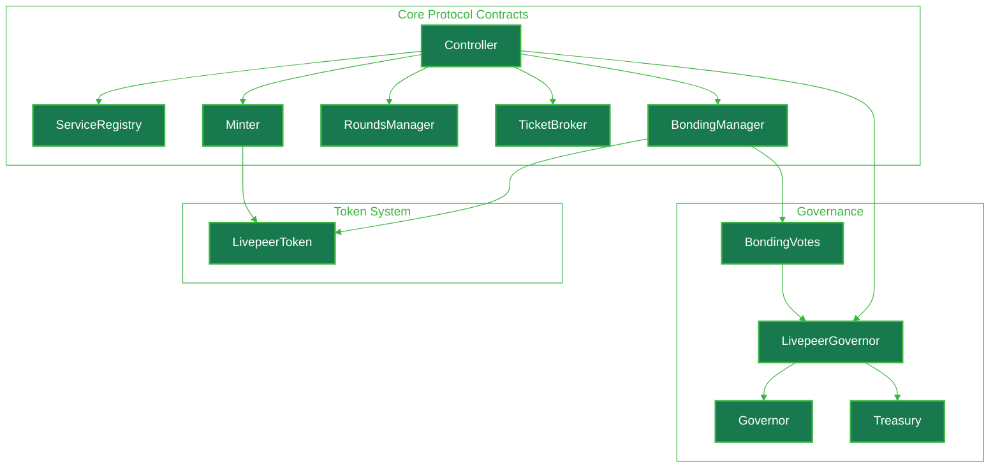

import { CardTitleTextWithArrow, CustomCardTitle } from '/snippets/components/elements/text/Text.jsx'
import { Quote, FrameQuote } from '/snippets/components/displays/quotes/Quote.jsx'
import { CustomDivider } from '/snippets/components/elements/spacing/Divider.jsx'
import { LinkArrow } from '/snippets/components/elements/links/Links.jsx'
import { DynamicTableV2 } from '/snippets/components/displays/tables/Tables.jsx'
import { StyledSteps, StyledStep } from '/snippets/components/displays/steps/Steps.jsx'
import { ScrollableDiagram } from '/snippets/components/displays/diagrams/ScrollableDiagram.jsx'

<Quote>
The Protocol is the **on-chain coordination, security and economic layer** responsible for _governing the network_, _securing the system_, and _incentivising desired behaviour_ from participants.
 {/* It leverages unique cyrptoeconomic primitives to create the conditions for a secure, open marketplace enabling performant, verifiable media and AI compute workloads. */}
</Quote>
{/* The Livepeer protocol secures a permissionless, decentralised marketplace for verifiable media and AI compute through a tightly coupled set of economic and cryptographic contracts. */}

<CustomDivider style={{ margin: 0, marginBottom: "-2rem" }} />

## Protocol Purpose

The protocol was designed to create a secure, open marketplace for media and AI compute by leveraging unique cryptoeconomic primitives that align incentives and create the conditions for a robust, performant, and verifiable network.

The **Livepeer Protocol** secures and governs the Livepeer permissionless, decentralised marketplace for verifiable media and AI compute through a set of smart contracts encoded in [Solidity](https://soliditylang.org/) and deployed on the [Arbitrum One](https://arbitrum.io/) blockchain (with the token deployed on Ethereum mainnet).

<FrameQuote author="Livepeer Whitepaper (2017)" href="/v2/about/resources/knowledge-hub/livepeer-whitepaper">
The **Livepeer Protocol defines how the multiple actors** in a live streaming ecosystem **participate in a secure and economically rational way**...[incl] the economic incentives for encouraging participation in the network in a secure and game-theoretic manner.
</FrameQuote>

{/* The **Livepeer Protocol** secures and governs the Livepeer permissionless, decentralised marketplace for verifiable media and AI compute through a set of smart contracts encoded in [Solidity](https://soliditylang.org/) and deployed on the [Arbitrum One](https://arbitrum.io/) blockchain (with the token deployed on Ethereum mainnet).

It enforces mechanisms such as LPT bonding, dynamic inflation, staking and delegation, slashing conditions, and rewards distribution to create the conditions for a secure, open marketplace enabling performant, verifiable media and AI compute workloads. */}

See the [Livepeer Whitepaper](/v2/about/resources/knowledge-hub/livepeer-whitepaper) for a detailed overview of the protocol's design, mechanisms, and economic principles.

{/* <Card title={<CustomCardTitle icon="scroll" title="Livepeer Whitepaper" />} href="/v2/about/resources/knowledge-hub/livepeer-whitepaper" arrow /> */}

## Protocol Design
The Protocol serves several critical functions in the Livepeer ecosystem:
<StyledSteps iconColor="var(--accent)" titleColor="var(--accent)">
  <StyledStep title="Governing the Network" icon="building-columns">
    Establishes the rules and mechanisms for how participants interact, coordinate, and make decisions within the network.
  </StyledStep>
  <StyledStep title="Securing the System" icon="shield-halved">
    Provides economic incentives and penalties to ensure honest behaviour, reliability, and uptime from network participants.
  </StyledStep>
  <StyledStep title="Incentivising Desired Behaviour" icon="scale-balanced">
    Aligns the economic interests of participants with the health and performance of the network, encouraging contributions of resources and honest work.
  </StyledStep>
  <StyledStep title="Settling Payments" icon="ticket">
    Coordinates the flow of ETH from Gateways to Orchestrators and Delegators, settling work performed off-chain at low overhead.
  </StyledStep>
</StyledSteps>

<Card title={<CustomCardTitle icon="cogs" title="Mechanisms and Primitives" />} href="/v2/about/protocol/mechanisms" horizontal > For details on the specific mechanisms and primitives of the protocol, refer to the [Protocol Mechanisms](/v2/about/protocol/mechanisms) page. </Card>

<CustomDivider style={{ margin: "-1rem 0 -2rem 0" }} />

## Design Decisions
The protocol's design reflects specific choices and tradeoffs made to achieve its goals of security, openness, and performance:
- **Delegated Proof-of-Stake Model**: The protocol uses a delegated proof-of-stake model for video transcoding, which allows for scalable participation and economic security via bonding, slashing, and reward mechanisms to ensure honest behaviour.
- **Probabilistic Micropayment System**: Payments are settled through a probabilistic micropayment system, which enables low-overhead transactions and efficient handling of microtransactions.
- **On-Chain Governance**: Governance and upgrades to the protocol are performed through on-chain token voting, which allows for open participation of invested parties and composability.
- **Deployment on Arbitrum**: The decision to deploy on Arbitrum (since the [Confluence upgrade](https://livepeer.org/blog/confluence-upgrade)) provides scalability and lower transaction costs compared to Ethereum mainnet.

<Tip>
AI and Video Workflows do not follow the same protocol staking design as they have different economic and operational requirements.
</Tip>

## Design Implementation

The **Livepeer Protocol** consists of a set of smart contracts encoded in [Solidity](https://soliditylang.org/) and deployed on the [Arbitrum One](https://arbitrum.io/) blockchain (with the token deployed on Ethereum mainnet).

There are three categories of contracts in the Livepeer Protocol mapping to the core functions of the protocol:
  1. Core Protocol Contracts – staking, payments, round progression, and service discovery
  2. Token and Utility Contracts – the LPT token and bridge infrastructure
  3. Governance Contracts – on-chain voting, proposal execution, and treasury management

<ScrollableDiagram title="Livepeer Protocol Contract Architecture" maxHeight="600px">

</ScrollableDiagram>

<Card title={<CustomCardTitle icon="scroll" title="Blockchain Contracts" />} href="/v2/about/protocol/blockchain-contracts" horizontal arrow > Full contract architecture and implementation details. </Card>

{ /*
These contracts enforce the rules of the network, coordinate participant behaviour, and provide economic incentives to secure the system and align it with desired outcomes.

These contracts govern:
  - LivepeerToken (LPT) ownership and delegation
  - Staking and selection of active transcoder operators (Orchestrators)
  - Distribution of inflationary rewards and fees to participants
  - Time-based progression of the protocol through rounds
  - Payment processing through a probabilistic micropayment system */}

{/* <ScrollableDiagram title="Livepeer Protocol Contract Architecture" maxHeight="600px">

</ScrollableDiagram>

<Info> For specific implementation details, refer to the respective contract documentation. </Info> */}

<CustomDivider style={{ margin: "-1rem 0 -2rem 0" }} />

## Protocol Actors

<Tip> The Protocol does not perform any of the actual work of transcoding or AI inference - that is the role of the Network. The Protocol governs the rules and incentives that coordinate and secure these Network Actors. </Tip>

The Livepeer Protocol defines and governs the roles and responsibilities of various participants in the network, including:
- [**Orchestrators**](/v2/orchestrators/portal): GPU operators who perform transcoding and AI inference work, and earn rewards and fees for their contributions.
- [**Delegators**](/v2/delegators/portal): LPT holders who delegate their stake to Orchestrators, sharing in the rewards and helping to secure the network.
- [**Gateways/Broadcasters**](/v2/gateways/portal): Entities that submit video and AI jobs to the network, paying for the work performed by Orchestrators.

<DynamicTableV2
  headerList={["Role", "Stake Required", "Responsibilities", "Earns"]}
  itemsList={[
    { "Role": "Orchestrator", "Stake Required": "Yes (LPT)", "Responsibilities": "Run transcoding/AI node, redeem tickets", "Earns": "ETH fees, LPT rewards" },
    { "Role": "Delegator", "Stake Required": "Yes (LPT)", "Responsibilities": "Bond to Orchestrator, securing the network", "Earns": "Share of ETH + LPT rewards" },
    { "Role": "Gateway (Broadcaster)", "Stake Required": "No", "Responsibilities": "Submits video jobs, sends ETH tickets", "Earns": "Transcoded/processed output" },
  ]}
/>

{  /*
## Protocol Mechanisms

The Livepeer Protocol defines multiple key operational rules for the network and network actors. */}

{/* The Livepeer Protocol serves several critical functions in the Livepeer ecosystem:

- **Incentivise honest behaviour** among participants (Orchestrators, Delegators, Gateways/Broadcasters)

- **Scale supply capacity** by rewarding infrastructure providers proportionally

- **Secure verification** of off-chain video and AI workloads through bonded stake

- **Disincentivise dishonest actors** via penalties (slashing) */}

{/* <StyledSteps iconColor="var(--accent)" titleColor="var(--accent)">
  <StyledStep title="Align incentives" icon="scale-balanced">
    Reward orchestrators, gateways, and delegators for honest, reliable work, and disincentivise misbehaviour through stake-weighted accountability.
  </StyledStep>

  <StyledStep title="Scale supply" icon="gauge-high">
    Coordinate a permissionless pool of GPU operators that grows with demand, without per-job on-chain settlement or central provisioning.
  </StyledStep>

  <StyledStep title="Settle payments" icon="ticket">
    Move ETH from gateways to orchestrators reliably and at low overhead, so off-chain video and AI work can be paid for at production volume.
  </StyledStep>

  <StyledStep title="Govern openly" icon="building-columns">
    Let LPT holders propose and vote on protocol upgrades, treasury spending, and parameter changes through on-chain governance.
  </StyledStep>
</StyledSteps> */}

