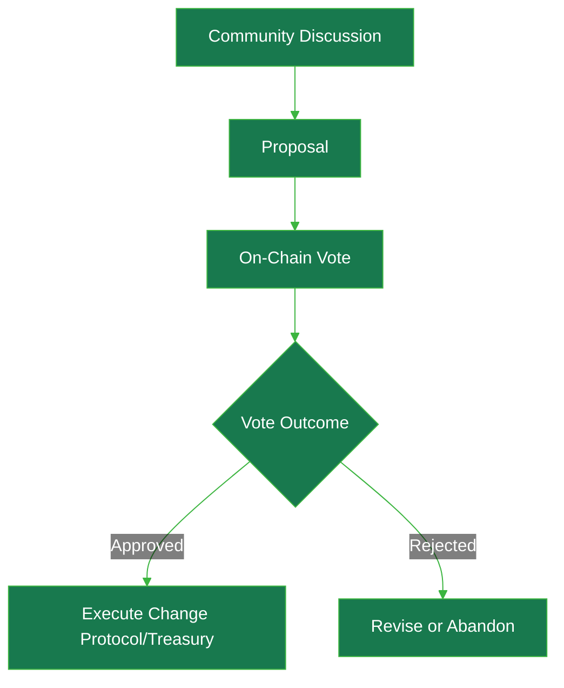

import { CardTitleTextWithArrow } from '/snippets/components/elements/text/Text.jsx'
import { AccordionTitleWithArrow } from '/snippets/components/elements/text/Text.jsx'
import { Quote } from '/snippets/components/displays/quotes/Quote.jsx'
import { CustomDivider } from '/snippets/components/elements/spacing/Divider.jsx'
import { LinkArrow } from '/snippets/components/elements/links/Links.jsx'

<CenteredContainer preset="fitContent">
 <CardTitleTextWithArrow icon="github" href="https://github.com/livepeer/LIPs" horizontal> livepeer-lips </CardTitleTextWithArrow>
 {/* <Card title="On-Chain Voting Explorer" icon="check-to-slot" href="https://explorer.livepeer.org/voting" horizontal arrow /> */}
</CenteredContainer>
<Quote>
Livepeer is a community-driven protocol, where token holders have the ability to vote on proposals to upgrade protocol mechanisms or to spend from the treasury.
Voting is conducted on-chain via the Livepeer Governor contract, with the protocol contracts enforcing the outcome.
</Quote>
<CustomDivider style={{margin: 0, marginBottom: "-2rem" }} />

## Governance
Livepeer is committed to open-source, transparent, community governance.
It uses a hybrid on‑chain/off‑chain governance model that combines open community discussion with binding on‑chain votes.
This model ensures that the community (token holders) collectively controls upgrades and spending, with the protocol enforcing the outcome.

<CenteredContainer preset="fitContent">
<Accordion title={
ELI5: Governance Model
} icon="user-crown">
 Imagine a community garden run by people who own shares (tokens).

   - **Proposing a Change:** If someone has at least 100 staked share tokens, they can suggest a new rule (like “we should plant carrots”).
   - **Voting:** After a one-round delay, eligible voters decide yes, no, or abstain for 10 Livepeer rounds. If enough voting power participates and more votes are “yes” than “no,” the idea becomes official.
   - **Delegating Votes:** If you’ve given your shares to a friend to manage (delegation), you still get to vote because your votes travel with your shares.

 Rules are set by token holders: stake some tokens to propose, everyone votes, and a rule only passes if enough people say yes.
</Accordion>
</CenteredContainer>

### Governance Functions
Governance in Livepeer serves two primary functions:
- **Protocol Upgrades**: Proposals to upgrade the protocol.
- **Treasury Spending**: Proposals to spend from the treasury.

### Governance Process

Governance applies to both the protocol and the treasury. Protocol upgrades and parameter changes are formalized as LIPs.
After community vetting, an on-chain vote is held. Stake-weighted voting ensures larger delegations have proportional say.

<Steps>
   <Step title="Idea Phase: Community Discussion" icon="comment-dots">
 Proposals typically start with community discussion to gather feedback on the <LinkArrow label="Livepeer Forum" href="https://forum.livepeer.org/c/lips/18" newline={false} />.
   </Step>
   <Step title="Draft Phase: Request For Feedback (RFP)" icon="comments">
 Community members post pre-proposals (requests for feedback) on the forum.
   </Step>
   <Step title="Proposal: Livepeer Improvement Proposal (LIP)" icon="file-pen">
 Once an idea is refined, an official proposal is drafted in the form of a <LinkArrow label="Livepeer Improvement Proposal (LIP)" href="https://github.com/livepeer/LIPs" newline={ false} />
 {/* Proposals are first discussed and drafted off-chain - in the form of a <LinkArrow label="Livepeer Improvement Proposal (LIP)" href="https://github.com/livepeer/LIPs" newline={false} />.
   The forum is the primary place for discussion: <LinkArrow label="Livepeer Forum" href="https://forum.livepeer.org/c/lips/18" newline={false} /> */}
   </Step>
   <Step title="Proposal Submission: On-Chain" icon="arrow-up-right-from-square">
 Once a LIP is finalised, anyone with at least 100 staked LPT can submit it on-chain to the [Governor](https://github.com/livepeer/protocol/blob/confluence/contracts/governance/Governor.sol) contract for a vote.
   </Step>
   <Step title="Proposal Voting: On-Chain" icon="link">
 After submission and a one-round voting delay, a voting period of 10 rounds opens where eligible voters (Orchestrators and their delegated LPT) cast votes. At the current round length this is roughly nine days.
   The on-chain proposals and votes can be found on <LinkArrow label="Livepeer Explorer" href="https://explorer.livepeer.org/voting" newline={false} />.
   </Step>
   <Step title="Proposal Voting: Details" icon="ballot">
 Voting power is driven by LPT **stake-weighted voting**. If an Orchestrator has X LPT staked (including delegated stake), that weight applies to its vote.
   Note: Delegators can withdraw their delegation temporarily to vote separately if they disagree with their operator.
   </Step>
   <Step title="Proposal Voting: Quorum & Approval" icon="people">
 A proposal passes only if quorum is met and **more than 50% of non-abstaining votes** are “For”. The current Governor quorum numerator is 333300 out of 1000000, or about 33.33%.
   </Step>
   <Step title="Proposal Execution: On-Chain" icon="check-to-slot">
 If a proposal passes, the Governor automatically executes the proposal’s instructions (changing a contract parameter or sending treasury funds).
   </Step>
</Steps>

### Livepeer Improvement Proposals (LIPs)
Livepeer Improvement Proposals (LIPs) are formal design documents ([hosted on GitHub](https://github.com/livepeer/LIPs)) that describe protocol upgrades, similar to Ethereum’s [EIPs](https://eips.ethereum.org/EIPS/eip-1).

*Impactful LIPs include:*
- **Treasury Creation**: [LIP-89](https://github.com/livepeer/LIPs/blob/master/LIPs/LIP-89.md), [LIP-91](https://github.com/livepeer/LIPs/blob/master/LIPs/LIP-91.md), and [LIP-92](https://github.com/livepeer/LIPs/blob/master/LIPs/LIP-92.md) describe the treasury bundle and the 10% treasury reward cut.
- **Confluence - Arbitrum Migration**: [LIP-73](https://github.com/livepeer/LIPs/blob/master/LIPs/LIP-73.md) describes the migration of the protocol from Ethereum to Arbitrum to reduce transaction costs and increase throughput.
- **Monetary Policy**: [LIP-34](https://github.com/livepeer/LIPs/blob/master/LIPs/LIP-34.md), [LIP-35](https://github.com/livepeer/LIPs/blob/master/LIPs/LIP-35.md), [LIP-40](https://github.com/livepeer/LIPs/blob/master/LIPs/LIP-40.md), [LIP-83](https://github.com/livepeer/LIPs/blob/master/LIPs/LIP-83.md), and [LIP-100](https://github.com/livepeer/LIPs/blob/master/LIPs/LIP-100.md) describe inflation calculations, adjustment rates, round length, and proposed inflation bounds.
- **Governance Framework**: [LIP-15](https://github.com/livepeer/LIPs/blob/master/LIPs/LIP-15.md), [LIP-16](https://github.com/livepeer/LIPs/blob/master/LIPs/LIP-16.md), [LIP-19](https://github.com/livepeer/LIPs/blob/master/LIPs/LIP-19.md), and [LIP-25](https://github.com/livepeer/LIPs/blob/master/LIPs/LIP-25.md) established the poll-based and extensible governance framework.

*Key LIPs by Category:*
<Accordion title="Governance & Process" icon="building-columns">
**Governance & Process:**
- [LIP-1](https://github.com/livepeer/LIPs/blob/master/LIPs/LIP-1.md) defines the LIP process, purpose, and guidelines.
- [LIP-15](https://github.com/livepeer/LIPs/blob/master/LIPs/LIP-15.md) established the polling system for LIP adoption.
- [LIP-16](https://github.com/livepeer/LIPs/blob/master/LIPs/LIP-16.md) established the stake-based polling system.
- [LIP-19](https://github.com/livepeer/LIPs/blob/master/LIPs/LIP-19.md) established the core poll-based governance mechanism.
- [LIP-25](https://github.com/livepeer/LIPs/blob/master/LIPs/LIP-25.md) established the technical foundation for protocol upgrades.
</Accordion>
<Accordion title="Protocol Migration (Confluence)" icon="arrow-down-up-across-line">
- [LIP-73](https://github.com/livepeer/LIPs/blob/master/LIPs/LIP-73.md): Confluence - Arbitrum One Migration.
- [LIP-74](https://github.com/livepeer/LIPs/blob/master/LIPs/LIP-74.md): L1 Minting and L2 Staking alternative, marked Abandoned in the LIP repository.
</Accordion>
<Accordion title="Treasury Launch & System" icon="bank">
- [LIP-89](https://github.com/livepeer/LIPs/blob/master/LIPs/LIP-89.md): Livepeer Treasury.
- [LIP-90](https://github.com/livepeer/LIPs/blob/master/LIPs/LIP-90.md): Funding Entity Conventions.
- [LIP-91](https://github.com/livepeer/LIPs/blob/master/LIPs/LIP-91.md): Livepeer Treasury Bundle.
- [LIP-92](https://github.com/livepeer/LIPs/blob/master/LIPs/LIP-92.md): Treasury Contribution Percentage, including the 10% initial treasury reward cut and 750,000 LPT balance ceiling.
</Accordion>
<Accordion title="Economic Parameters & Monetary Policy" icon="coins">
**Economic Parameters & Monetary Policy**
- [LIP-34](https://github.com/livepeer/LIPs/blob/master/LIPs/LIP-34.md): InflationChange Parameter Update.
- [LIP-35](https://github.com/livepeer/LIPs/blob/master/LIPs/LIP-35.md): inflationChange Calculation and Parameter Update.
- [LIP-40](https://github.com/livepeer/LIPs/blob/master/LIPs/LIP-40.md): Minter Math Precision.
- [LIP-83](https://github.com/livepeer/LIPs/blob/master/LIPs/LIP-83.md): roundLength Parameter Update.
- [LIP-100](https://github.com/livepeer/LIPs/blob/master/LIPs/LIP-100.md): Introduction of Inflation Bounds, marked Last Call in the LIP repository.
</Accordion>
<Accordion title="Core Protocol Features" icon="cubes-stacked">
- [LIP-3](https://github.com/livepeer/LIPs/blob/master/LIPs/LIP-3.md): Ability To Update Registered Solver in LivepeerVerifier.
- [LIP-8](https://github.com/livepeer/LIPs/blob/master/LIPs/LIP-8.md): Enable Partial Unbonding.
- [LIP-9](https://github.com/livepeer/LIPs/blob/master/LIPs/LIP-9.md): Service Registry for service endpoint discovery.
- [LIP-11](https://github.com/livepeer/LIPs/blob/master/LIPs/LIP-11.md): Bond Event Details.
</Accordion>
<Accordion title="Earnings & Claiming" icon="money-check-dollar">
- [LIP-36](https://github.com/livepeer/LIPs/blob/master/LIPs/LIP-36.md): Cumulative Earnings Claiming.
- [LIP-52](https://github.com/livepeer/LIPs/blob/master/LIPs/LIP-52.md): Snapshot For Claiming Earnings.
</Accordion>

### On-Chain Contracts
The Livepeer Protocol uses a custom Governor contract that inherits from OpenZeppelin's [Governor](https://docs.openzeppelin.com/contracts/4.x/api/governance#governor) and [GovernorSettings](https://docs.openzeppelin.com/contracts/4.x/api/governance#governorsettings) contracts.

The key rules enforced are:

- **Voting period**: 10 rounds, roughly nine days at the current round length
- **Quorum**: about 33.33% of voting power (`333300 / 1000000`)
- **Threshold**: For votes must exceed Against votes; abstentions count toward quorum
- **Voting delay**: 1 round

### Key Roles & Stakeholders

**On-Chain Treasury**: A portion (10%) of token emissions flows to a community treasury (itself created by LIPs).
This treasury exists to fund ecosystem-wide projects (public goods) for the benefit of the entire network.
Livepeer’s social consensus is that treasury funds should primarily go to **SPEs**, which then deploy them to specific initiatives.

**[Livepeer Foundation](/v2/home/about/ecosystem#livepeer-foundation)**: The Foundation fosters long-term strategy and ecosystem coordination.
It establishes advisory boards, publishes roadmaps, and coordinates the work of **[Special Purpose Entities (SPEs)](/v2/home/about/ecosystem#special-purpose-entities)** to execute core development, research, on-chain proposals and long‑term vision.

The foundation may also manage treasury disbursements, support grant programmes and maintain the network’s public goods.
However, while the Foundation facilitates community participation, ultimate authority rests with the community via on-chain votes by LPT holders.

## Related Resources
<Columns cols={2}>
 <Card title="Governance Model" href="/v2/about/protocol/governance-and-treasury" icon="ballot-check" arrow > Read more about the technical details of the governance model. </Card>
 <Card title="Delegate LPT" href="https://github.com/livepeer/LIPs" icon="github" arrow > Find out more about Delegating LPT. </Card>
</Columns>
