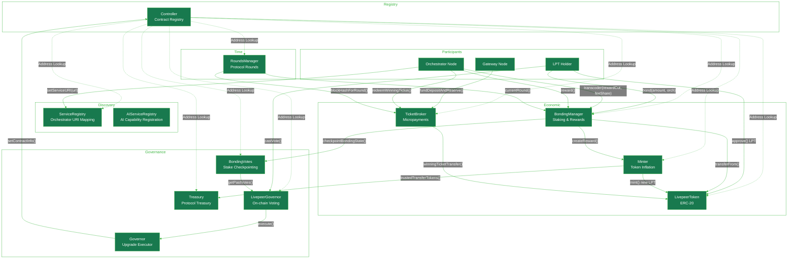
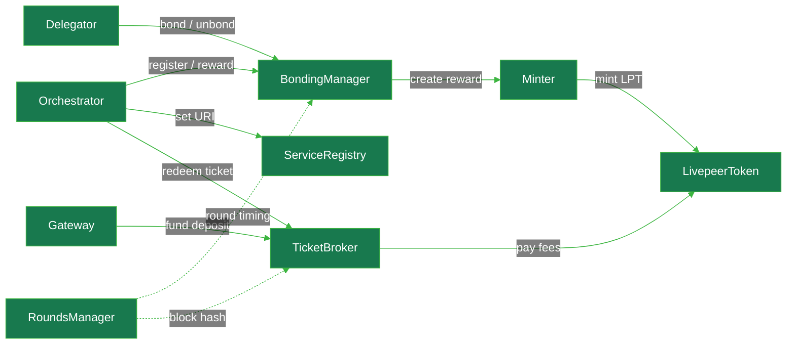
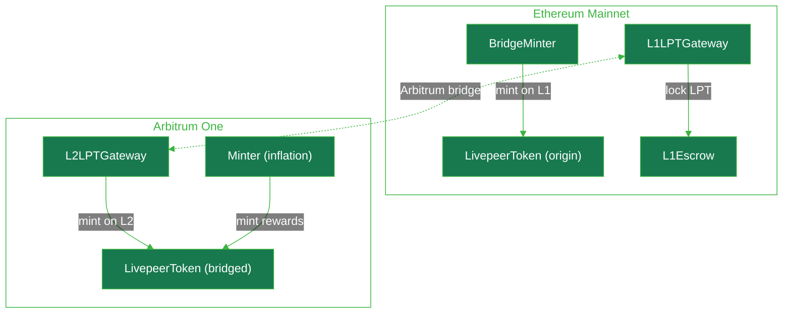
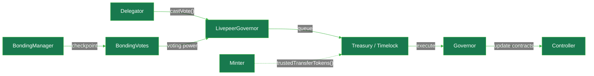

{/*
VERIFICATION LOG — 28 March 2026
Sources: Blockscout MCP (Arbitrum One chain 42161), GitHub livepeer/protocol delta branch, livepeer/governor-scripts

Errors corrected from previous version:
1. Governor functions: Transaction[] → Update memory (correct Solidity type from Governor.sol source)
2. Governor: added cancel(Update memory _update) — exists in source, was missing
3. Governor: removed stale "Last active Aug 2025" — Governor executed on 19 March 2026 (BondingManager V11 upgrade)
4. BondingManager: added public checkpointBondingState(address _account) — external function in source
5. BondingManager: added transferBond() — public function used in practice, was missing
6. BondingManager: claimEarnings — added note that _endRound is unused; earnings always claimed to current round
7. TicketBroker: WinningTicketRedeemed is correct but WinningTicketTransfer is also emitted (ETH movement) — both documented
8. TicketBroker: getSender() → getSenderInfo() — correct function name from source
9. TicketBroker: getReserve() → getReserveInfo() — correct function name from source
10. TicketBroker: added fundDepositAndReserveFor() — separate public function exists in source
11. L1 Gateway Badge: "gren" → "green" (typo fix)
12. Controller: removed static "20 transactions" count — Controller is actively used in every round
13. BondingManager V11 target note: added unverified source note

Enhancements added:
- Slashing note in BondingManager (disabled via governance)
- Both TicketBroker events documented
- BondingManager _endRound clarification
*/}

import { CustomDivider } from '/snippets/components/elements/spacing/Divider.jsx'
import { LinkArrow, DoubleIconLink, LinkIcon } from '/snippets/components/elements/links/Links.jsx'
import { Subtitle, CopyText } from '/snippets/components/elements/text/Text.jsx'
import { CenteredContainer, BorderedBox } from '/snippets/components/wrappers/containers/Containers.jsx'
import { ScrollableDiagram } from '/snippets/components/displays/diagrams/ZoomableDiagram.jsx'
import { contractAddresses } from '/snippets/data/contract-addresses/contractAddressesData.jsx'
import { CustomCardTitle } from '/snippets/components/elements/text/CustomCardTitle.jsx'
import { AddressLinks } from '/snippets/components/elements/links/Links.jsx'
import { LazyLoad } from '/snippets/components/wrappers/containers/LazyLoad.jsx'
import { ArbitrumIcon, ArbitrumSVG, LivepeerIcon, LivepeerSVG } from '/snippets/components/elements/icons/Icons.jsx'
import { SolidityEmbed } from '/snippets/components/integrators/embeds/DataEmbed.jsx'
import { FunctionField } from '/snippets/components/displays/response-fields/ResponseField.jsx'

{/* ADDRESS EXTRACTIONS — sourced from contractAddressesData; no addresses hardcoded below */}
export const arb = contractAddresses.meta.explorerUrls.arbiscan
export const eth = contractAddresses.meta.explorerUrls.etherscan

export const controller = contractAddresses.arbitrumOne.current.find(c => c.name === 'Controller')?.address
export const bondingManagerProxy = contractAddresses.arbitrumOne.current.find(c => c.name === 'BondingManager' && c.type === 'proxy')?.address
export const bondingManagerTarget = contractAddresses.arbitrumOne.current.find(c => c.name === 'BondingManager' && c.type === 'target')?.address
export const ticketBrokerProxy = contractAddresses.arbitrumOne.current.find(c => c.name === 'TicketBroker' && c.type === 'proxy')?.address
export const ticketBrokerTarget = contractAddresses.arbitrumOne.current.find(c => c.name === 'TicketBroker' && c.type === 'target')?.address
export const roundsManagerProxy = contractAddresses.arbitrumOne.current.find(c => c.name === 'RoundsManager' && c.type === 'proxy')?.address
export const roundsManagerTarget = contractAddresses.arbitrumOne.current.find(c => c.name === 'RoundsManager' && c.type === 'target')?.address
export const minter = contractAddresses.arbitrumOne.current.find(c => c.name === 'Minter')?.address
export const serviceRegistryProxy = contractAddresses.arbitrumOne.current.find(c => c.name === 'ServiceRegistry' && c.type === 'proxy')?.address
export const serviceRegistryTarget = contractAddresses.arbitrumOne.current.find(c => c.name === 'ServiceRegistry' && c.type === 'target')?.address
export const aiServiceRegistry = contractAddresses.arbitrumOne.current.find(c => c.name === 'AIServiceRegistry')?.address
export const lptArb = contractAddresses.arbitrumOne.current.find(c => c.name === 'LivepeerToken')?.address
export const lptEth = contractAddresses.ethereumMainnet.current.find(c => c.name === 'LivepeerToken')?.address

{/* NOTE Bridgeminter is at https://github.com/livepeer/protocol/blob/streamflow/contracts/token/BridgeMinter.sol*/}
export const bridgeMinter = contractAddresses.ethereumMainnet.current.find(c => c.name === 'BridgeMinter')?.address
export const l2Gateway = contractAddresses.arbitrumOne.current.find(c => c.name === 'L2LPTGateway')?.address
export const l1Gateway = contractAddresses.ethereumMainnet.current.find(c => c.name === 'L1LPTGateway')?.address
export const l1Escrow = contractAddresses.ethereumMainnet.current.find(c => c.name === 'L1Escrow')?.address
export const bondingVotesProxy = contractAddresses.arbitrumOne.current.find(c => c.name === 'BondingVotes' && c.type === 'proxy')?.address
export const bondingVotesTarget = contractAddresses.arbitrumOne.current.find(c => c.name === 'BondingVotes' && c.type === 'target')?.address
export const governor = contractAddresses.arbitrumOne.current.find(c => c.name === 'Governor')?.address
export const livepeerGovernorProxy = contractAddresses.arbitrumOne.current.find(c => c.name === 'LivepeerGovernor' && c.type === 'proxy')?.address
export const livepeerGovernorTarget = contractAddresses.arbitrumOne.current.find(c => c.name === 'LivepeerGovernor' && c.type === 'target')?.address
export const treasury = contractAddresses.arbitrumOne.current.find(c => c.name === 'Treasury')?.address
export const l2Migrator = contractAddresses.arbitrumOne.current.find(c => c.name === 'L2Migrator' && c.type === 'proxy')?.address
export const merkleSnapshot = contractAddresses.arbitrumOne.current.find(c => c.name === 'MerkleSnapshot')?.address
export const lastVerifiedDate = contractAddresses.meta.lastVerified || "Pending"

{/* Status helper: builds status string from enriched meta fields */}
export const statusOf = (name, type, chain) => {
  const c = contractAddresses[chain || 'arbitrumOne'].current.find(e => e.name === name && (!type || e.type === type))
  if (!c?.meta) return "Verified · Active"
  const m = c.meta
  const parts = []
  if (c.verified) parts.push("Verified")
  if (m.holderCount) parts.push(`${m.holderCount} holders`)
  if (m.transactionCount && m.transactionCount < 1000) parts.push(`~${m.transactionCount} transactions`)
  if (m.statusLabel) parts.push(m.statusLabel)
  if (m.deployedAt && m.statusLabel !== 'Active') parts.push(`Deployed ${m.deployedAt}`)
  if (m.deployedBy) parts.push(`Deployed by ${m.deployedBy}`)
  if (m.lastActiveDate && m.statusLabel !== 'Active') parts.push(`Last active ${m.lastActiveDate}`)
  if (m.blockscoutLabel && m.blockscoutLabel !== name) parts.push(`"${m.blockscoutLabel}" on Blockscout`)
  if (m.notes) parts.push(m.notes)
  if (m.registeredInController) parts.push("Registered in Controller")
  return parts.join(" · ") || "Active"
}

<Tip>
  Addresses on this page are automatically updated via a Github Action workflow.  
   Data is sourced from the canonical <DoubleIconLink label="governor-scripts" href="https://github.com/livepeer/governor-scripts" iconRightColor="var(--hero-text)"/> and verified on-chain.   
   Last verified: {lastVerifiedDate} 
</Tip>

<Columns cols={2}>
  <Card
    href="https://github.com/livepeer/governor-scripts/blob/master/updates/addresses.js"
    icon="github"
    title={<>Livepeer Contract Addresses    <Badge color="green"> Canonical Code </Badge></>}
    horizontal
  />
  <Card
    href="https://arbiscan.io/accounts/label/livepeer"
    icon="cubes"
    title={<>Livepeer Contracts Arbiscan    <Badge color="green"> On-chain Canonical </Badge></>}
    horizontal
  />
  <Card title="Solidity Protocol Contracts" icon="github" href="https://github.com/livepeer/protocol/tree/delta/contracts" horizontal />
  <Card title="Solidity LPT Bridge Contracts" icon="github" href="https://github.com/livepeer/arbitrum-lpt-bridge/tree/main/contracts" horizontal />
</Columns>

<CustomDivider />

Livepeer uses a system of Ethereum smart contracts to permissionlessly govern its decentralised network.

The [Livepeer Protocol](https://github.com/livepeer/protocol/tree/delta) <LivepeerIcon size={12} color="var(--accent)"/> is deployed on [Arbitrum One](https://arbiscan.io/accounts/label/livepeer) <ArbitrumIcon size={14} color="var(--arbitrum)"/> and uses these contracts to govern:

- Livepeer Token (LPT) ownership and delegation
- Staking and selection of active orchestrators
- Distribution of inflationary rewards and fees to participants
- Time-based progression of the protocol through rounds
- Payment processing through a probabilistic micropayment system

## Livepeer Contracts

There are three categories of contracts in the Livepeer Protocol:

1. **[Core Protocol Contracts](#core-protocol-contracts)** – staking, payments, round progression, and service discovery
2. **[Token and Utility Contracts](#token-and-utility-contracts)** – the LPT token and bridge infrastructure
3. **[Governance Contracts](#governance-contracts)** – on-chain voting, proposal execution, and treasury management
4. **[Migration Contracts](#migration-contracts)** – historical Confluence upgrade contracts, migration complete

<LazyLoad>
<ScrollableDiagram title="Contract Interaction Architecture" maxHeight="1000px" maxWidth="100%" showControls={true}>

</ScrollableDiagram>
</LazyLoad>

<CustomDivider style={{marginBottom: "-2rem"}} />

## Core Protocol Contracts

The core protocol contracts manage staking, delegation, reward distribution, round progression, payment processing, and service discovery. The Controller serves as the central registry – upgrading a contract means registering a new target implementation address via the Controller, while the proxy address remains stable.

---

#### **Controller** <Subtitle text="Contract Registry" />
<Badge color="blue">
  Arbitrum One
</Badge>
The Controller is the central registry for all protocol contracts. Every other contract resolves peer contract addresses by calling `getContract(keccak256("<n>"))` on the Controller. Upgrades are applied by registering a new implementation address under the same name hash – the proxy addresses never change.

<Accordion  title={<CustomCardTitle variant="accordion" icon={<ArbitrumIcon color="var(--arbitrum)" />} title="Controller"/>} >
  <AddressLinks
  address={controller}
  blockchainHref={`${arb}${controller}`}
  githubHref="https://github.com/livepeer/protocol/blob/delta/contracts/Controller.sol"
/>
{/* CHANGELOG PIPELINE UPDATE */}
<Icon icon="check" color="var(--text)"/> _{statusOf("Controller")}_

**Purpose**:

- Central address registry for all protocol contracts
- Enables contract upgrades while keeping proxy addresses stable
- Provides `pause()`/`unpause()` for emergency system-wide halts
- Owner is the Governor contract – all upgrades must go through governance

**Key functions** (from `Controller.sol`):

<FunctionField name="getContract" returns="address" params={["bytes32 _id"]}>
  Look up a registered contract by keccak256 name hash
</FunctionField>
<FunctionField name="getContractInfo" returns="(address, bytes20)" params={["bytes32 _id"]}>
  Returns address and git commit hash
</FunctionField>
<FunctionField name="setContractInfo" params={["bytes32 _id", "address _contractAddress", "bytes20 _gitCommitHash"]}>
  Register or update a contract; callable by owner (Governor) only
</FunctionField>
<FunctionField name="pause">
  Halt all contracts that check `controller.paused()`
</FunctionField>
<FunctionField name="unpause">
  Resume all contracts that check `controller.paused()`
</FunctionField>
<FunctionField name="updateController" params={["bytes32 _id", "address _controller"]}>
  Update the Controller reference in a registered contract
</FunctionField>

**Contract**

<SolidityEmbed
  url="https://raw.githubusercontent.com/livepeer/protocol/delta/contracts/Controller.sol"
  title={<DoubleIconLink label="Controller.sol"/>}
  filename="Controller.sol"
/>

</Accordion>

#### **BondingManager** <Subtitle text="Staking and Delegation" />
<Badge color="blue">
  Arbitrum One
</Badge>
The BondingManager is the most critical economic contract in the protocol. It manages the active orchestrator pool as a sorted doubly-linked list, handles all LPT bonding and unbonding, and distributes inflationary rewards and fees each round.

The `feeShare` in the protocol is defined as: **the percentage of fees paid to delegators by the transcoder (orchestrator)**. It is not the gateway's cut – it is the orchestrator's share of fees that they pass on to their delegators.

Source: `BondingManager.sol` includes this as struct comment: "// % of fees paid to delegators by transcoder".

<Accordion title={<CustomCardTitle variant="accordion" icon={<ArbitrumIcon color="var(--arbitrum)" />} title="BondingManager" />}>
  **Address (Arbitrum One)**:
  <AddressLinks address={bondingManagerProxy} blockchainHref={`${arb}${bondingManagerProxy}`} githubHref="https://github.com/livepeer/protocol/blob/delta/contracts/bonding/BondingManager.sol" />
  {/* CHANGELOG PIPELINE UPDATE */}
<Icon icon="check" color="var(--text)"/> _{statusOf("BondingManager", "proxy")}_

  {/* Current target (V11, deployed 16 Feb 2026): 0x4bA7E7531Ab56bC8d78dB4FDc88D21F621f34BB4
      Confirmed via Controller.getContract(keccak256("BondingManagerTarget")) on-chain 18 Mar 2026.
      Source code not yet verified on Blockscout — SolidityEmbed below shows delta branch source which should match. */}

**Purpose**:

- Manages the active orchestrator pool (sorted by stake using SortedDoublyLL)
- Handles `bond()`, `unbond()`, and `withdrawStake()` for all delegators
- Distributes inflationary LPT rewards to orchestrators and their delegators each round
- Manages the unbonding period – delegators must wait `unbondingPeriod` rounds before withdrawing
- Tracks per-round earnings pools for each orchestrator
- Calls `checkpointBondingState()` on BondingVotes on every state change for governance weight
- Since Delta upgrade: sends `treasuryRewardCutRate` fraction of each reward to Treasury; contributions halt automatically when treasury balance exceeds `treasuryBalanceCeiling`

<Info>
  **Slashing:** `slashTranscoder()` exists in the contract but is currently inoperative: the Verifier role is set to the null address (`0x000...`). Slashing could be re-enabled via governance by configuring the Verifier role and making necessary compatibility updates. It is out of scope for current audits.
</Info>

**Key functions** (from `BondingManager.sol`, `delta` branch):

<FunctionField name="bond" params={["uint256 _amount", "address _to"]}>
  Delegate LPT stake to an orchestrator
</FunctionField>
<FunctionField name="unbond" params={["uint256 _amount"]}>
  Begin withdrawal; creates an unbonding lock, starts the unbonding period
</FunctionField>
<FunctionField name="rebond" params={["uint256 _unbondingLockId"]}>
  Cancel unbonding and re-bond stake to current delegate
</FunctionField>
<FunctionField name="rebondFromUnbonded" params={["address _to", "uint256 _unbondingLockId"]}>
  Re-bond to a new orchestrator from unbonded state
</FunctionField>
<FunctionField name="withdrawStake" params={["uint256 _unbondingLockId"]}>
  Complete withdrawal after unbonding period expires
</FunctionField>
<FunctionField name="withdrawFees" params={["address payable _recipient", "uint256 _amount"]}>
  Withdraw accumulated ETH fees to a recipient address
</FunctionField>
<FunctionField name="transcoder" params={["uint256 _rewardCut", "uint256 _feeShare"]}>
  Register as an orchestrator or update parameters; `_rewardCut` is % of reward kept by orchestrator; `_feeShare` is % of fees passed to delegators
</FunctionField>
<FunctionField name="reward">
  Called by active orchestrators each round to mint inflationary LPT and distribute to earnings pool
</FunctionField>
<FunctionField name="claimEarnings" params={["uint256 _endRound"]}>
  Claim accumulated rewards and fees. Note: `_endRound` is unused; earnings are always claimed through the current round regardless of the value passed.
</FunctionField>
<FunctionField name="checkpointBondingState" params={["address _account"]}>
  Publicly callable function to fix a stale voting power checkpoint for any account. Useful for operators after an inconsistent state.
</FunctionField>
<FunctionField name="transferBond" params={["address _delegator", "uint256 _amount", "address _oldDelegateNewPosPrev", "address _oldDelegateNewPosNext", "address _newDelegateNewPosPrev", "address _newDelegateNewPosNext"]}>
  Transfer ownership of a bond (or portion) to a new delegator. Used for stake migrations between wallets.
</FunctionField>
<FunctionField name="pendingStake" returns="uint256" params={["address _addr", "uint256 _endRound"]}>
  Returns unclaimed pending stake for a delegator through the current round
</FunctionField>
<FunctionField name="pendingFees" returns="uint256" params={["address _addr", "uint256 _endRound"]}>
  Returns unclaimed pending ETH fees for a delegator through the current round
</FunctionField>
<FunctionField name="getTranscoder" params={["address _transcoder"]}>
  Returns orchestrator state: lastRewardRound, rewardCut, feeShare, activationRound, deactivationRound, cumulativeRewards, cumulativeFees, lastFeeRound
</FunctionField>
<FunctionField name="getDelegator" params={["address _delegator"]}>
  Returns delegator state: bondedAmount, fees, delegateAddress, delegatedAmount, startRound, lastClaimRound, nextUnbondingLockId
</FunctionField>

**Contract**

<SolidityEmbed
  url="https://raw.githubusercontent.com/livepeer/protocol/delta/contracts/bonding/BondingManager.sol"
  title={<DoubleIconLink label="BondingManager.sol"/>}
  filename="BondingManager.sol"
/>

</Accordion>

#### **TicketBroker** <Subtitle text="Probabilistic Micropayments" />
<Badge color="blue">
  Arbitrum One
</Badge>
The TicketBroker implements Livepeer's off-chain probabilistic micropayment (PM) system. Gateways pre-fund a deposit and reserve on-chain; they send lottery tickets to orchestrators off-chain with each transcoding job. Orchestrators redeem winning tickets on-chain to claim payment. This amortises per-segment payment costs across many tickets.

<Accordion title={<CustomCardTitle variant="accordion" icon={<ArbitrumIcon color="var(--arbitrum)" />} title="TicketBroker" />}>
  **Address (Arbitrum One)**:
  <AddressLinks address={ticketBrokerProxy} blockchainHref={`${arb}${ticketBrokerProxy}`} githubHref="https://github.com/livepeer/protocol/blob/delta/contracts/pm/TicketBroker.sol" />
  {/* CHANGELOG PIPELINE UPDATE */}
<Icon icon="check" color="var(--text)"/> _{statusOf("TicketBroker", "proxy")}_

**Purpose**:

- Holds gateway ETH deposits and reserves
- Validates and settles winning probabilistic payment tickets
- Manages the unlock period before gateways can withdraw funds
- Tracks claimed reserves per orchestrator per round to prevent over-redemption
- Emits `WinningTicketRedeemed` (ticket redemption attempt) and `WinningTicketTransfer` (ETH actually moved) events used for on-chain payment monitoring

**Key functions** (from `MixinTicketBrokerCore.sol`):

<FunctionField name="fundDeposit">
  Gateway adds ETH to deposit (payable)
</FunctionField>
<FunctionField name="fundReserve">
  Gateway adds ETH to reserve (payable)
</FunctionField>
<FunctionField name="fundDepositAndReserve" params={["uint256 _depositAmount", "uint256 _reserveAmount"]}>
  Fund both deposit and reserve in one call (payable); msg.value must equal the sum of both amounts
</FunctionField>
<FunctionField name="fundDepositAndReserveFor" params={["address _addr", "uint256 _depositAmount", "uint256 _reserveAmount"]}>
  Fund deposit and reserve on behalf of another address (payable)
</FunctionField>
<FunctionField name="redeemWinningTicket" params={["Ticket memory _ticket", "bytes memory _sig", "uint256 _recipientRand"]}>
  Orchestrator redeems a winning ticket; transfers ETH to fee pool via BondingManager. Emits both `WinningTicketTransfer` and `WinningTicketRedeemed`.
</FunctionField>
<FunctionField name="unlock">
  Gateway initiates the withdrawal unlock period; emits `Unlock`
</FunctionField>
<FunctionField name="cancelUnlock">
  Gateway cancels an in-progress unlock; emits `UnlockCancelled`
</FunctionField>
<FunctionField name="withdraw">
  Gateway withdraws all deposit and reserve after unlock period; emits `Withdrawal`
</FunctionField>
<FunctionField name="getSenderInfo" returns="(Sender memory sender, ReserveInfo memory reserve)" params={["address _sender"]}>
  Returns full sender state: deposit amount, withdrawRound, and reserve info
</FunctionField>
<FunctionField name="isUnlockInProgress" returns="bool" params={["address _sender"]}>
  Returns whether a sender has an unlock in progress
</FunctionField>

**Contract**

<SolidityEmbed
  url="https://raw.githubusercontent.com/livepeer/protocol/delta/contracts/pm/TicketBroker.sol"
  title={<DoubleIconLink label="TicketBroker.sol"/>}
  filename="TicketBroker.sol"
/>

</Accordion>

#### **RoundsManager** <Subtitle text="Protocol Time Management" />
<Badge color="blue">
  Arbitrum One
</Badge>
The RoundsManager defines the protocol's time unit. A round is a fixed number of Arbitrum blocks. The current round must be initialised before orchestrators can call `reward()`. It stores per-round block hashes used as randomness for ticket validation.

<Accordion title={<CustomCardTitle variant="accordion" icon={<ArbitrumIcon color="var(--arbitrum)" />} title="RoundsManager" />}>
  **Address (Arbitrum One)**:
  <AddressLinks address={roundsManagerProxy} blockchainHref={`${arb}${roundsManagerProxy}`} githubHref="https://github.com/livepeer/protocol/blob/delta/contracts/rounds/RoundsManager.sol" />
  {/* CHANGELOG PIPELINE UPDATE */}
<Icon icon="check" color="var(--text)"/> _{statusOf("RoundsManager", "proxy")}_

**Purpose**:

- Tracks the current round number and round length in blocks
- Stores block hashes per round for ticket randomness (used by TicketBroker)
- Enforces the round lock period – orchestrators cannot change parameters during the lock window at end of each round
- `initializeRound()` must be called at the start of each new round before reward calls proceed

**Key functions** (from `RoundsManager.sol`):

<FunctionField name="initializeRound">
  Initialise a new round; callable by any address; updates block hash store and lip upgrade rounds
</FunctionField>
<FunctionField name="currentRound" returns="uint256">
  Returns current round number
</FunctionField>
<FunctionField name="currentRoundInitialized" returns="bool">
  Returns whether the current round has been initialised
</FunctionField>
<FunctionField name="currentRoundLocked" returns="bool">
  Returns whether the current round is in its lock period
</FunctionField>
<FunctionField name="blockHashForRound" returns="bytes32" params={["uint256 _round"]}>
  Returns the stored block hash for a given round
</FunctionField>
<FunctionField name="roundLength" returns="uint256">
  Returns round length in blocks
</FunctionField>
<FunctionField name="roundLockAmount" returns="uint256">
  Returns lock period as a percentage of round length (MathUtils percPoint)
</FunctionField>

**Contract**

<SolidityEmbed
  url="https://raw.githubusercontent.com/livepeer/protocol/delta/contracts/rounds/RoundsManager.sol"
  title={<DoubleIconLink label="RoundsManager.sol"/>}
  filename="RoundsManager.sol"
/>

</Accordion>

#### **Minter** <Subtitle text="Token Inflation" />
<Badge color="blue">
  Arbitrum One
</Badge>
The Minter controls LPT token inflation. Each round it calculates the mintable token supply based on the configured inflation rate. Since the Delta upgrade (LIP-91), a configurable fraction of each round's reward is minted to the Treasury rather than solely to orchestrators and delegators.

<Accordion title={<CustomCardTitle variant="accordion" icon={<ArbitrumIcon color="var(--arbitrum)" />} title="Minter" />}>
  **Address (Arbitrum One)**:
  <AddressLinks address={minter} blockchainHref={`${arb}${minter}`} githubHref="https://github.com/livepeer/protocol/blob/delta/contracts/token/Minter.sol" />
  {/* CHANGELOG PIPELINE UPDATE */}
<Icon icon="check" color="var(--text)"/> _{statusOf("Minter")}_

**Purpose**:

- Manages LPT token inflation schedule
- Calculates mintable tokens per round based on current `inflation` rate and total LPT supply
- Adjusts inflation up or down each round based on actual bonding rate vs `targetBondingRate`
- Called by BondingManager during orchestrator `reward()` calls – not called directly
- Holds ETH received from TicketBroker redemptions and disburses to orchestrators

**Key functions** (from `Minter.sol`):

<FunctionField name="createReward" returns="uint256" params={["uint256 _fracNum", "uint256 _fracDenom"]}>
  Called only by BondingManager; mints a fraction of mintable tokens for the round as a reward
</FunctionField>
<FunctionField name="trustedTransferTokens" params={["address _to", "uint256 _amount"]}>
  Transfer LPT to an address; callable by BondingManager only
</FunctionField>
<FunctionField name="trustedBurnTokens" params={["uint256 _amount"]}>
  Burn LPT; callable by BondingManager only
</FunctionField>
<FunctionField name="trustedWithdrawETH" params={["address payable _to", "uint256 _amount"]}>
  Withdraw ETH to an address; callable by BondingManager only
</FunctionField>
<FunctionField name="depositETH">
  Receive ETH from TicketBroker on ticket redemption (payable)
</FunctionField>
<FunctionField name="currentMintableTokens" returns="uint256">
  Returns LPT mintable in the current round
</FunctionField>
<FunctionField name="currentMintedTokens" returns="uint256">
  Returns LPT already minted in the current round
</FunctionField>
<FunctionField name="inflation" returns="uint256">
  Returns current inflation rate as a MathUtils percPoint value
</FunctionField>
<FunctionField name="inflationChange" returns="uint256">
  Returns per-round inflation adjustment amount
</FunctionField>
<FunctionField name="targetBondingRate" returns="uint256">
  Returns the target bonding rate that inflation adjusts towards
</FunctionField>

**Contract**

<SolidityEmbed
  url="https://raw.githubusercontent.com/livepeer/protocol/delta/contracts/token/Minter.sol"
  title={<DoubleIconLink label="Minter.sol"/>}
  filename="Minter.sol"
/>

</Accordion>

#### **ServiceRegistry** <Subtitle text="Orchestrator Discovery" />
<Badge color="blue">
  Arbitrum One
</Badge>
The ServiceRegistry stores each orchestrator's publicly advertised HTTPS service URI on-chain. Gateway nodes query this registry during network initialisation to discover orchestrators. Each update emits a `ServiceURIUpdate` event that off-chain indexers track.

<Accordion title={<CustomCardTitle variant="accordion" icon={<ArbitrumIcon color="var(--arbitrum)" />} title="ServiceRegistry" />}>
  **Address (Arbitrum One)**:
  <AddressLinks address={serviceRegistryProxy} blockchainHref={`${arb}${serviceRegistryProxy}`} githubHref="https://github.com/livepeer/protocol/blob/delta/contracts/ServiceRegistry.sol" />
  {/* CHANGELOG PIPELINE UPDATE */}
<Icon icon="check" color="var(--text)"/> _{statusOf("ServiceRegistry", "proxy")}_

**Purpose**:

- Allows orchestrators to register and update their service endpoint URIs
- Enables gateway nodes to discover orchestrators when using `-network arbitrum-one-mainnet`
- Not used when a gateway specifies `-orchAddr` directly

**Key functions** (from `ServiceRegistry.sol`):

<FunctionField name="setServiceURI" params={["string calldata _serviceURI"]}>
  Orchestrator registers or updates their HTTPS endpoint; emits `ServiceURIUpdate(address indexed _addr, string _serviceURI)`
</FunctionField>
<FunctionField name="getServiceURI" returns="string" params={["address _addr"]}>
  Returns the registered URI for a given orchestrator address
</FunctionField>

**Contract**

<SolidityEmbed
  url="https://raw.githubusercontent.com/livepeer/protocol/delta/contracts/ServiceRegistry.sol"
  title={<DoubleIconLink label="ServiceRegistry.sol"/>}
  filename="ServiceRegistry.sol"
/>

</Accordion>

#### **AIServiceRegistry** <Subtitle text="AI Capability Registration" />
<Badge color="blue">
  Arbitrum One
</Badge>
A standalone ServiceRegistry for AI subnet orchestrators. Detached from the Controller – its address is hardcoded in go-livepeer (`starter.go`) rather than resolved dynamically. Deployed by a different deployer than the main protocol contracts.

<Accordion title={<CustomCardTitle variant="accordion" icon={<ArbitrumIcon color="var(--arbitrum)" />} title="AIServiceRegistry" />}>
  **Address (Arbitrum One)**:
  <AddressLinks address={aiServiceRegistry} blockchainHref={`${arb}${aiServiceRegistry}`} githubHref="https://github.com/livepeer/protocol/blob/delta/contracts/ServiceRegistry.sol" />
  {/* CHANGELOG PIPELINE UPDATE */}
<Icon icon="check" color="var(--text)"/> _{statusOf("AIServiceRegistry")}_

**Purpose**:

- Stores service URI and capability metadata for AI-enabled orchestrators
- Used when a node is started with `-aiServiceRegistry` flag
- Same interface as ServiceRegistry (`setServiceURI`, `getServiceURI`)
</Accordion>

<CustomDivider style={{margin: "0 0 -2rem 0"}} />

## Token and Utility Contracts

The LivepeerToken contract originates on Ethereum Mainnet and is bridged to Arbitrum One via paired gateway contracts, with a BridgeMinter handling L1 mint operations.
All active protocol operations use the Arbitrum One representation.
LPT must be bridged before it can be staked, delegated, or used for payments.
<Info>
Livepeer moved from Ethereum Mainnet to Arbitrum One in 2022 (the Confluence upgrade) to increase throughput and reduce fees.

On Ethereum Mainnet, only the `LivepeerToken` and `BridgeMinter` contracts remain operational. All other Ethereum Mainnet protocol contracts are paused.
</Info>

---

#### **LivepeerToken (LPT)** <Subtitle text="ERC-20 Token" />
<Badge color="green">
  Ethereum Mainnet (origin)
</Badge>

The LivepeerToken is the native protocol token. It is an ERC-20 with AccessControl-based MINTER_ROLE and BURNER_ROLE. The canonical token contract lives on Ethereum Mainnet; a bridged representation exists on Arbitrum One.

<Accordion title={<CustomCardTitle variant="accordion" icon={<LivepeerIcon color="var(--accent)" size={13} />} title="LivepeerToken" />}>
  **Address (Arbitrum One)**:
  <AddressLinks address={lptArb} blockchainHref={`${arb}${lptArb}`} githubHref="https://github.com/livepeer/arbitrum-lpt-bridge/blob/main/contracts/L2/token/LivepeerToken.sol" />
  {/* CHANGELOG PIPELINE UPDATE */}
<Icon icon="check" color="var(--text)"/> _{statusOf("LivepeerToken")}_

**Address (Ethereum Mainnet)**:

  <AddressLinks address={lptEth} blockchainHref={`${eth}${lptEth}`} githubHref="https://github.com/livepeer/protocol/blob/master/contracts/token/LivepeerToken.sol" />
  {/* CHANGELOG PIPELINE UPDATE */}
<Icon icon="check" color="var(--text)"/> _{statusOf("LivepeerToken", null, "ethereumMainnet")}_

**Purpose**:

- ERC-20 token used for bonding, staking, gateway payment reserves, and governance voting weight
- `approve()` must be called before bonding or funding deposits
- On Arbitrum One: minted by Minter (inflationary rewards) and by the bridge (inflows from L1)

**Key functions** (from `LivepeerToken.sol`, inherits [OpenZeppelin](https://docs.openzeppelin.com/contracts/5.x/api/token/erc20) ERC20 + ERC20Permit + ERC20Burnable + AccessControl):

<FunctionField name="transfer / transferFrom / approve / balanceOf / totalSupply / allowance">
  Standard ERC-20 interface
</FunctionField>
<FunctionField name="permit" params={["..."]}>
  EIP-2612 gasless approval
</FunctionField>
<FunctionField name="mint" params={["address _to", "uint256 _amount"]}>
  Callable only by MINTER_ROLE (Minter contract on Arbitrum, BridgeMinter on L1)
</FunctionField>
<FunctionField name="burn" params={["uint256 _amount"]}>
  Callable only by BURNER_ROLE
</FunctionField>

**Contract**

<SolidityEmbed
  url="https://raw.githubusercontent.com/livepeer/arbitrum-lpt-bridge/main/contracts/L2/token/LivepeerToken.sol"
  title={<DoubleIconLink label="LivepeerToken.sol (L2)"/>}
  filename="LivepeerToken.sol"
/>

</Accordion>

#### **BridgeMinter** <Subtitle text="L1 Bridge Minting" />

<Badge color="green">Ethereum Mainnet</Badge>

Holds MINTER_ROLE on the L1 LivepeerToken. Called by the bridge when LPT is transferred from Arbitrum back to Ethereum Mainnet, minting the corresponding L1 LPT.

<Info>
  `BridgeMinter.sol` is an Ethereum Mainnet contract predating the Delta upgrade.
   See <DoubleIconLink label="BridgeMinter.sol" href="https://github.com/livepeer/protocol/blob/streamflow/contracts/token/BridgeMinter.sol"/> on the `streamflow` branch of `livepeer/protocol`
</Info>

<Accordion title={<CustomCardTitle variant="accordion" icon={<Icon icon="ethereum" color="var(--hero-text)"/>} title="BridgeMinter" />}>
  **Address (Ethereum Mainnet)**:
  <AddressLinks address={bridgeMinter} blockchainHref={`${eth}${bridgeMinter}`} githubHref="https://github.com/livepeer/protocol/blob/streamflow/contracts/token/BridgeMinter.sol" />
  <Icon icon="check" color="var(--text)"/> _{statusOf("BridgeMinter", null, "ethereumMainnet")}_

**Purpose**:

- Holds MINTER_ROLE on the L1 LivepeerToken contract
- Called exclusively by L1LPTGateway when LPT is bridged from Arbitrum back to Ethereum Mainnet
- Also callable by L1Migrator for migration operations (`withdrawETHToL1Migrator`, `withdrawLPTToL1Migrator`)
- Registered with the Ethereum Mainnet Controller (`0xF96D54E490317c557A967ABfA5d6e33006BE69b3`)

**Key functions** (from `BridgeMinter.sol`, `streamflow` branch):

<FunctionField name="bridgeMint" params={["address _to", "uint256 _amount"]}>
  Mint LPT to an address; callable by L1LPTGateway only
</FunctionField>
<FunctionField name="withdrawETHToL1Migrator" returns="uint256">
  Send contract ETH balance to L1Migrator; callable by L1Migrator only
</FunctionField>
<FunctionField name="withdrawLPTToL1Migrator" returns="uint256">
  Send contract LPT balance to L1Migrator; callable by L1Migrator only
</FunctionField>
<FunctionField name="migrateToNewMinter" params={["address _newMinterAddr"]}>
  Transfer token ownership and balances to a new Minter; callable by Controller owner only
</FunctionField>
<FunctionField name="depositETH" returns="bool">
  Accept ETH deposits; required for migration compatibility with older Minter implementations (payable)
</FunctionField>

**Contract**

<SolidityEmbed
  url="https://raw.githubusercontent.com/livepeer/protocol/streamflow/contracts/token/BridgeMinter.sol"
  title={<DoubleIconLink label="BridgeMinter.sol"/>}
  filename="BridgeMinter.sol"
/>

</Accordion>

#### **L1 LPTGateway / L2 LPTGateway** <Subtitle text="Token Bridge" />
<Badge color="green">
  Ethereum Mainnet
</Badge>
<Badge color="blue">
  Arbitrum One
</Badge>
Paired bridge gateway contracts on Ethereum Mainnet (L1) and Arbitrum One (L2). LPT bridged L1→L2 is locked in L1Escrow; LPT bridged L2→L1 is released from escrow or minted via BridgeMinter. Based on the Dai bridge architecture.

<Accordion title={<CustomCardTitle variant="accordion" icon={<ArbitrumIcon color="var(--arbitrum)" />} title="Bridge Gateways" />}>
  **L2LPTGateway (Arbitrum One)**:
  <AddressLinks address={l2Gateway} blockchainHref={`${arb}${l2Gateway}`} githubHref="https://github.com/livepeer/arbitrum-lpt-bridge/blob/main/contracts/L2/gateway/L2LPTGateway.sol" />
  {/* CHANGELOG PIPELINE UPDATE */}
<Icon icon="check" color="var(--text)"/> _{statusOf("L2LPTGateway")}_

**L1LPTGateway (Ethereum Mainnet)**:

  <AddressLinks address={l1Gateway} blockchainHref={`${eth}${l1Gateway}`} githubHref="https://github.com/livepeer/arbitrum-lpt-bridge/blob/main/contracts/L1/gateway/L1LPTGateway.sol" />
  {/* CHANGELOG PIPELINE UPDATE */}
<Icon icon="check" color="var(--text)"/> _{statusOf("L1LPTGateway", null, "ethereumMainnet")}_

**L1Escrow (Ethereum Mainnet)**:

  <AddressLinks address={l1Escrow} blockchainHref={`${eth}${l1Escrow}`} githubHref="https://github.com/livepeer/arbitrum-lpt-bridge/blob/main/contracts/L1/escrow/L1Escrow.sol" />
  {/* CHANGELOG PIPELINE UPDATE */}
<Icon icon="check" color="var(--text)"/> _{statusOf("L1Escrow", null, "ethereumMainnet")}_

**Contract**

<SolidityEmbed
  url="https://raw.githubusercontent.com/livepeer/arbitrum-lpt-bridge/main/contracts/L2/gateway/L2LPTGateway.sol"
  title={<DoubleIconLink label="L2LPTGateway.sol"/>}
  filename="L2LPTGateway.sol"
/>

</Accordion>

#### **LivepeerTokenFaucet** <Subtitle text="Test Token Distribution" />
<Badge color="surface">Testnet Deployments</Badge>

<Info>
The LivepeerTokenFaucet is a non-production deploy-time convenience contract.
  There is currently no active public testnet on Arbitrum or Ethereum.
  You can run your own testnet using the full deploy script at [deploy/deploy_contracts.ts](https://github.com/livepeer/protocol/blob/streamflow/deploy/deploy_contracts.ts)
</Info>

A deploy-time convenience contract that distributes test LPT in local and testnet environments.
It deploys automatically via [`deploy_contracts.ts`](https://github.com/livepeer/protocol/blob/delta/deploy/deploy_contracts.ts) when targeting any non-production network, seeded with `genesis.crowdSupply` worth of test LPT.
  It is never deployed on `mainnet` or `arbitrumMainnet`.

<Accordion title={<CustomCardTitle variant="accordion" icon={<Icon icon="dev" color="var(--text)"/>} title="LivepeerTokenFaucet" />} >

**Purpose**:

- Distributes test LPT to developers running a local Livepeer stack
- Enforces a per-address rate limit via `requestWait` (in hours) between requests
- Whitelist addresses bypass the rate limit entirely
- Seeded at deploy time with `genesis.crowdSupply`; never exists on mainnet or Arbitrum One mainnet

**Key functions** (from `LivepeerTokenFaucet.sol`):

<FunctionField name="request">
  Request test LPT; transfers `requestAmount` to caller. Requires either whitelisted status or that `requestWait` hours have elapsed since last request.
</FunctionField>
<FunctionField name="addToWhitelist" params={["address _addr"]}>
  Add an address to the rate-limit bypass whitelist; callable by owner only
</FunctionField>
<FunctionField name="removeFromWhitelist" params={["address _addr"]}>
  Remove an address from the whitelist; callable by owner only
</FunctionField>

**Contract**

<SolidityEmbed
  url="https://raw.githubusercontent.com/livepeer/protocol/delta/contracts/token/LivepeerTokenFaucet.sol"
  title={<DoubleIconLink label="LivepeerTokenFaucet.sol"/>}
  filename="LivepeerTokenFaucet.sol"
/>

</Accordion>

<CustomDivider />

## Governance Contracts

The Delta upgrade ([LIP-89](https://github.com/livepeer/LIPs/blob/master/LIPs/LIP-89.md), [LIP-91](https://github.com/livepeer/LIPs/blob/master/LIPs/LIP-91.md) - October 2023) introduced full on-chain governance alongside the [Livepeer Treasury](/v2/about/livepeer-protocol/treasury). The governance system consists of four contracts working together: BondingVotes checkpoints voting power, LivepeerGovernor manages proposal voting, Treasury holds protocol funds, and Governor executes approved upgrades.

---

#### **BondingVotes** <Subtitle text="Voting Power Checkpointing" />
<Badge color="blue">
  Arbitrum One
</Badge>
BondingVotes implements the ERC-5805 votes interface, storing per-round stake checkpoints for every delegator and orchestrator. The LivepeerGovernor queries it to determine voting power at proposal creation time. Checkpoints are written automatically by BondingManager on every bond, unbond, reward, and earnings claim.

<Accordion title={<CustomCardTitle variant="accordion" icon={<ArbitrumIcon color="var(--arbitrum)" />} title="BondingVotes" />}>
  **Address (Arbitrum One)**:
  <AddressLinks address={bondingVotesProxy} blockchainHref={`${arb}${bondingVotesProxy}`} githubHref="https://github.com/livepeer/protocol/blob/delta/contracts/bonding/BondingVotes.sol" />
  {/* CHANGELOG PIPELINE UPDATE */}
<Icon icon="check" color="var(--text)"/> _{statusOf("BondingVotes", "proxy")}_

**Purpose**:

- Stores per-round stake checkpoints for every participant
- Implements ERC-5805 (`getPastVotes`, `getPastTotalSupply`) used by LivepeerGovernor
- Checkpoints are written by BondingManager – not called directly by users
- Supports delegator vote overrides: a delegator can override their orchestrator's vote

**Key functions** (from `BondingVotes.sol`, `delta` branch):

<FunctionField name="checkpointBondingState" params={["address _owner", "uint256 _startRound", "uint256 _bondedAmount", "address _delegateAddress", "uint256 _delegatedAmount", "uint256 _lastClaimRound", "uint256 _lastRewardRound"]}>
  Called by BondingManager to checkpoint stake state; not callable directly by users
</FunctionField>
<FunctionField name="checkpointTotalActiveStake" params={["uint256 _totalStake", "uint256 _round"]}>
  Checkpoint total active stake; called by BondingManager
</FunctionField>
<FunctionField name="getPastVotes" returns="uint256" params={["address _account", "uint256 _round"]}>
  Returns voting power for an account at the start of a given round
</FunctionField>
<FunctionField name="getPastTotalSupply" returns="uint256" params={["uint256 _round"]}>
  Returns total voting power (active stake) at a given round
</FunctionField>
<FunctionField name="hasCheckpoint" returns="bool" params={["address _account"]}>
  Returns whether an account has any checkpointed stake
</FunctionField>

**Contract**

<SolidityEmbed
  url="https://raw.githubusercontent.com/livepeer/protocol/delta/contracts/bonding/BondingVotes.sol"
  title={<DoubleIconLink label="BondingVotes.sol"/>}
  filename="BondingVotes.sol"
/>

</Accordion>

#### **Governor** <Subtitle text="Protocol Upgrade Executor" />
<Badge color="blue">
  Arbitrum One
</Badge>
The original upgrade execution contract. Holds the owner role on the Controller. Executes protocol upgrades (contract address updates, parameter changes) via a staged update queue with a configurable block delay.

<Accordion title={<CustomCardTitle variant="accordion" icon={<ArbitrumIcon color="var(--arbitrum)" />} title="Governor" />}>
  **Address (Arbitrum One)**:
  <AddressLinks address={governor} blockchainHref={`${arb}${governor}`} githubHref="https://github.com/livepeer/protocol/blob/delta/contracts/governance/Governor.sol" />
  {/* CHANGELOG PIPELINE UPDATE */}
<Icon icon="check" color="var(--text)"/> _{statusOf("Governor")}_

**Purpose**:

- Owns the Controller contract – only address that can call `setContractInfo()`
- Executes protocol upgrade transactions after governance approval
- Enforces a staged execution queue with a mandatory block-number delay

**Key functions** (from `Governor.sol`):

<FunctionField name="stage" params={["Update memory _update", "uint256 _delay"]}>
  Queue a batch of upgrade transactions with a delay in blocks; callable by owner only; emits `UpdateStaged`
</FunctionField>
<FunctionField name="execute" params={["Update memory _update"]}>
  Execute a queued update after its block delay has elapsed; emits `UpdateExecuted`
</FunctionField>
<FunctionField name="cancel" params={["Update memory _update"]}>
  Cancel a staged update; callable by owner only; emits `UpdateCancelled`
</FunctionField>

The `Update` struct contains: `address[] target`, `uint256[] value`, `bytes[] data`, `uint256 nonce`.

`owner` is a public state variable (not a function) returning the current owner address.

**Contract**

<SolidityEmbed
  url="https://raw.githubusercontent.com/livepeer/protocol/delta/contracts/governance/Governor.sol"
  title={<DoubleIconLink label="Governor.sol"/>}
  filename="Governor.sol"
/>

</Accordion>

#### **LivepeerGovernor** <Subtitle text="On-Chain Voting" />
<Badge color="blue">
  Arbitrum One
</Badge>
Implements [OpenZeppelin](https://docs.openzeppelin.com/contracts/5.x/api/governance)'s upgradeable Governor framework adapted for Livepeer's stake-weighted voting. Voting power equals bonded LPT as recorded by BondingVotes at proposal creation time. Supports GovernorCountingOverridable – delegators can override their orchestrator's vote on any proposal.

<Accordion title={<CustomCardTitle variant="accordion" icon={<ArbitrumIcon color="var(--arbitrum)" />} title="LivepeerGovernor" />}>
  **Address (Arbitrum One)**:
  <AddressLinks address={livepeerGovernorProxy} blockchainHref={`${arb}${livepeerGovernorProxy}`} githubHref="https://github.com/livepeer/protocol/blob/delta/contracts/treasury/LivepeerGovernor.sol" />
  {/* CHANGELOG PIPELINE UPDATE */}
<Icon icon="check" color="var(--text)"/> _{statusOf("LivepeerGovernor", "proxy")}_

**Purpose**:

- On-chain voting for protocol proposals, weighted by bonded LPT stake
- Delegators can override their orchestrator's vote (GovernorCountingOverridable)
- Passed proposals execute through the Treasury timelock, then through the Governor to the Controller
- `bumpGovernorVotesTokenAddress()` must be called if BondingVotes address ever changes

**Key functions** (from `LivepeerGovernor.sol`, `delta` branch):

<FunctionField name="initialize" params={["uint256 _initialVotingDelay", "uint256 _initialVotingPeriod", "uint256 _initialProposalThreshold", "uint256 _initialQuorumNumerator", "TimelockControllerUpgradeable _timelock", "address _controller"]}>
  One-time initialisation via proxy
</FunctionField>
<FunctionField name="propose" returns="uint256" params={["address[] memory targets", "uint256[] memory values", "bytes[] memory calldatas", "string memory description"]}>
  Submit a new governance proposal; returns proposalId
</FunctionField>
<FunctionField name="castVote" returns="uint256" params={["uint256 proposalId", "uint8 support"]}>
  Cast a vote (0=Against, 1=For, 2=Abstain)
</FunctionField>
<FunctionField name="castVoteWithReason" returns="uint256" params={["uint256 proposalId", "uint8 support", "string calldata reason"]}>
  Vote with explanation
</FunctionField>
<FunctionField name="queue" returns="uint256" params={["address[] memory targets", "uint256[] memory values", "bytes[] memory calldatas", "bytes32 descriptionHash"]}>
  Queue a passed proposal into the timelock
</FunctionField>
<FunctionField name="execute" returns="uint256" params={["address[] memory targets", "uint256[] memory values", "bytes[] memory calldatas", "bytes32 descriptionHash"]}>
  Execute a queued proposal after timelock delay
</FunctionField>
<FunctionField name="quorumDenominator" returns="uint256">
  Returns `MathUtils.PERC_DIVISOR` (the quorum denominator)
</FunctionField>
<FunctionField name="bumpGovernorVotesTokenAddress">
  Update the internal BondingVotes reference if its address has changed
</FunctionField>

**Contract**

<SolidityEmbed
  url="https://raw.githubusercontent.com/livepeer/protocol/delta/contracts/treasury/LivepeerGovernor.sol"
  title={<DoubleIconLink label="LivepeerGovernor.sol"/>}
  filename="LivepeerGovernor.sol"
/>

</Accordion>

#### **Treasury** <Subtitle text="Protocol Treasury" />
<Badge color="blue">
  Arbitrum One
</Badge>
An [OpenZeppelin](https://docs.openzeppelin.com/contracts/5.x/api/governance#TimelockController) TimelockControllerUpgradeable that holds the protocol's on-chain treasury. A configurable percentage of each round's inflationary LPT rewards is directed here by the Minter. All disbursements require a passed LivepeerGovernor proposal. Automatic contributions halt when the treasury balance exceeds `treasuryBalanceCeiling` (configured in BondingManager).

<Accordion title={<CustomCardTitle variant="accordion" icon={<ArbitrumIcon color="var(--arbitrum)" />} title="Treasury" />}>
  **Address (Arbitrum One)**:
  <AddressLinks address={treasury} blockchainHref={`${arb}${treasury}`} githubHref="https://github.com/livepeer/protocol/blob/delta/contracts/treasury/Treasury.sol" />
  {/* CHANGELOG PIPELINE UPDATE */}
<Icon icon="check" color="var(--text)"/> _{statusOf("Treasury")}_

**Purpose**:

- Receives a fraction of each round's inflationary LPT rewards (rate set by `treasuryRewardCutRate` in BondingManager)
- Governed entirely by LivepeerGovernor – all disbursements require a passed proposal
- Implements TimelockController – all operations have a mandatory delay between queue and execution
- Contributions automatically halt when LPT balance exceeds `treasuryBalanceCeiling`
- Funds Special Purpose Entities (SPEs) and ecosystem grants via governance proposals

**Key functions** ([OpenZeppelin](https://docs.openzeppelin.com/contracts/5.x/api/governance#TimelockController)) TimelockControllerUpgradeable):

<FunctionField name="schedule" params={["address target", "uint256 value", "bytes calldata data", "bytes32 predecessor", "bytes32 salt", "uint256 delay"]}>
  Schedule an operation; callable by proposer role (LivepeerGovernor)
</FunctionField>
<FunctionField name="execute" params={["address target", "uint256 value", "bytes calldata payload", "bytes32 predecessor", "bytes32 salt"]}>
  Execute a ready operation; callable by executor role
</FunctionField>
<FunctionField name="cancel" params={["bytes32 id"]}>
  Cancel a pending operation; callable by canceller role
</FunctionField>
<FunctionField name="isOperation" returns="bool" params={["bytes32 id"]}>
  Check if an operation exists
</FunctionField>
<FunctionField name="isOperationReady" returns="bool" params={["bytes32 id"]}>
  Check if an operation is past its delay and ready to execute
</FunctionField>
<FunctionField name="getMinDelay" returns="uint256">
  Returns the minimum delay for all operations
</FunctionField>

**Contract**

<SolidityEmbed
  url="https://raw.githubusercontent.com/livepeer/protocol/delta/contracts/treasury/Treasury.sol"
  title={<DoubleIconLink label="Treasury.sol"/>}
  filename="Treasury.sol"
/>

</Accordion>

<CustomDivider />

## Migration Contracts

The [Confluence upgrade (2022)](https://medium.com/livepeer-blog/the-confluence-upgrade-is-live-3b6b342ea71e) migrated the Livepeer protocol from Ethereum Mainnet to Arbitrum One.
These contracts facilitated that migration.
 The migration is complete - no new migrations are possible - but both contracts remain registered in the Controller.
<Info> L2Migrator continues to process pending `claimStake` calls from participants who have not yet claimed their migrated stake as of March 2026.</Info>

#### **L2Migrator** <Subtitle text="Stake Migration" />
<Badge color="blue">
  Arbitrum One
</Badge>

Facilitated the migration of bonded stake and delegations from Ethereum Mainnet to Arbitrum One during the Confluence upgrade. Participants who migrated on L1 claim their Arbitrum-side stake by calling `claimStake()` here. The contract still holds residual ETH and continues to receive `claimStake` calls from participants who have not yet claimed.

<Accordion title={<CustomCardTitle variant="accordion" icon={<ArbitrumIcon color="var(--arbitrum)" />} title="L2Migrator" />}>
  **Address (Arbitrum One)**:
  <AddressLinks address={l2Migrator} blockchainHref={`${arb}${l2Migrator}`} githubHref="https://github.com/livepeer/protocol/blob/delta/contracts/L2/L2Migrator.sol" />
  <Icon icon="check" color="var(--text)"/> _{statusOf("L2Migrator", "proxy")}_

**Purpose**:

- Receives cross-chain migration messages from the L1Migrator via the Arbitrum bridge
- Allows participants to claim their migrated bonded stake on Arbitrum One via `claimStake()`
- Allows delegators to claim migrated delegations via `claimDelegatorStake()`
- Holds residual ETH from migration fee payments; no new migrations are possible

**Key functions**:

<FunctionField name="claimStake" params={["address _delegate", "uint256 _stake", "uint256 _fees", "address[] calldata _delegators", "uint256[] calldata _delegatorStakes"]}>
  Claim migrated stake on Arbitrum One; callable by participants who completed an L1 migration
</FunctionField>
<FunctionField name="finalizeMigrateDelegator" params={["address _l1Addr", "address _l2Addr", "address _delegate", "uint256 _stake", "uint256 _fees"]}>
  Finalise a delegator migration initiated on L1; called via the bridge
</FunctionField>

</Accordion>

#### **MerkleSnapshot** <Subtitle text="Migration Proof Verification" />
<Badge color="blue">
  Arbitrum One
</Badge>

Stores Merkle roots used to verify stake snapshots taken at the time of the Confluence migration. Used internally by L2Migrator to validate migration claims. No activity since deployment — its role was fulfilled during the migration window.

<Accordion title={<CustomCardTitle variant="accordion" icon={<ArbitrumIcon color="var(--arbitrum)" />} title="MerkleSnapshot" />}>
  **Address (Arbitrum One)**:
  <AddressLinks address={merkleSnapshot} blockchainHref={`${arb}${merkleSnapshot}`} githubHref="https://github.com/livepeer/protocol/blob/delta/contracts/snapshots/MerkleSnapshot.sol" />
  <Icon icon="check" color="var(--text)"/> _{statusOf("MerkleSnapshot")}_

**Purpose**:

- Stores Merkle root snapshots (keyed by snapshot ID) set at migration time
- Provides `verify()` for L2Migrator to validate that a claimed stake amount was included in the original snapshot
- Read-only in practice; `setSnapshot()` is callable only by the Controller owner and has not been called since the migration

**Key functions** (from `MerkleSnapshot.sol`):

<FunctionField name="verify" returns="bool" params={["bytes32 _id", "bytes32[] calldata _proof", "bytes32 _leaf"]}>
  Verify a Merkle proof against a stored snapshot root
</FunctionField>
<FunctionField name="setSnapshot" params={["bytes32 _id", "bytes32 _root"]}>
  Store a Merkle root for a given snapshot ID; callable by Controller owner only
</FunctionField>

**Contract**

<SolidityEmbed
  url="https://raw.githubusercontent.com/livepeer/protocol/delta/contracts/snapshots/MerkleSnapshot.sol"
  title={<DoubleIconLink label="MerkleSnapshot.sol"/>}
  filename="MerkleSnapshot.sol"
/>

</Accordion>

<CustomDivider style={{margin: "-0.5rem 0 -2rem 0"}}/>

## Full Address Reference

For the complete list of all current and historical contract addresses across Arbitrum One and Ethereum Mainnet, including all historical target/implementation versions, see the [Contract Addresses](/v2/about/resources/contract-addresses) reference page.

<Icon icon="check" color="var(--text)"/> Last Verified {lastVerifiedDate}

<Card
    href="/v2/about/resources/contract-addresses"
    icon="file-code"
    title={<> Contract Address Reference Page · Livepeer Docs   <Badge color="surface"> <><Icon icon="user-robot" color="var(--text)"/> Automatically Updated </></Badge></>}
    horizontal
    arrow
/>
<Columns cols={2}>
  <Card
    href="https://github.com/livepeer/governor-scripts/blob/master/updates/addresses.js"
    icon="github"
    title={<>Livepeer Contract Addresses    <Badge color="green"> Canonical Code </Badge></>}
    horizontal
  />
  <Card
    href="https://arbiscan.io/accounts/label/livepeer"
    icon="cubes"
    title={<>Livepeer Contracts Arbiscan    <Badge color="green"> On-chain Canonical </Badge></>}
    horizontal
  />
</Columns>

<CustomDivider style={{margin: "0 0 -2rem 0"}} />

## Related Pages

<Columns cols={2}>
  <Card title={<CustomCardTitle icon="coins" title="Livepeer Token" />} href="/v2/about/livepeer-protocol/livepeer-token" horizontal arrow>
    LPT token mechanics, supply, minting, and the role of the token in the protocol.
  </Card>
  <Card title={<CustomCardTitle icon="vault" title="Treasury" />} href="/v2/about/livepeer-protocol/treasury" horizontal arrow>
    On-chain treasury, funding proposals, SPEs, and the treasury balance ceiling.
  </Card>
  <Card title={<CustomCardTitle icon="landmark" title="Governance" />} href="/v2/about/livepeer-protocol/governance-model" horizontal arrow>
    On-chain voting, proposal lifecycle, and delegator vote overrides.
  </Card>
  <Card title={<CustomCardTitle icon="chart-line" title="Economics" />} href="/v2/about/livepeer-protocol/economics" horizontal arrow>
    Inflation model, bonding rate targets, reward distribution, and fee economics.
  </Card>
</Columns>
