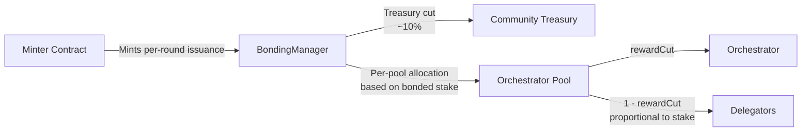
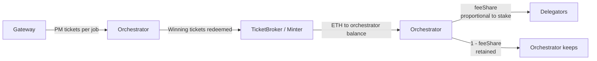
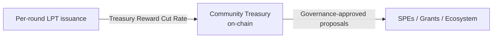

Two distinct token flows drive delegator returns: LPT issued through inflation, and ETH collected from network usage. They originate differently, flow through different contracts, and represent different economic signals.

---

## LPT inflation flow

**Step by step:**

1. At the start of each round, an active orchestrator calls `Reward()` on the BondingManager
2. BondingManager calls the Minter contract, which calculates the round's inflation allocation and mints new LPT
3. A Treasury Reward Cut Rate (currently ~10% — [verify live](/v2/delegators/resources/reference/protocol-parameters)) is diverted directly to the Community Treasury
4. The remaining LPT is allocated to the orchestrator's pool, proportional to their share of total bonded stake
5. Within the pool, the orchestrator retains their `rewardCut` percentage; the rest is distributed to delegators proportional to their bonded stake

**If the orchestrator does not call `Reward()` in a round:** nothing is minted for that pool. The allocation is not deferred — it is permanently forfeit.

---

## ETH fee flow

**Step by step:**

1. Gateways submit jobs (transcoding, AI inference) to orchestrators and pay using probabilistic micropayment (PM) tickets
2. Orchestrators redeem winning tickets through the TicketBroker contract, which releases ETH held in escrow
3. ETH accumulates in the orchestrator's on-chain balance
4. When the orchestrator calls `Reward()`, fee revenue is distributed: the orchestrator's `feeShare` percentage goes to delegators proportional to their stake; the remainder stays with the orchestrator

**Fee revenue is demand-driven.** An orchestrator with no routed jobs earns no fees to distribute.

---

## The dual-token model

Livepeer uses two tokens for two distinct economic purposes:

| Token | Source | Economic role |
|---|---|---|
| **LPT** | Protocol inflation (minted each round) | Supply-side incentive — rewards participants for securing the network |
| **ETH** | Gateway payments for real work | Demand-side signal — rewards productive capacity utilisation |

LPT inflation creates a baseline incentive regardless of network demand. ETH fees grow as actual network usage grows — they represent genuine revenue from services rendered. For long-term delegators, tracking fee revenue trends per orchestrator reflects the health of the network more accurately than LPT inflation alone.

---

## Treasury flow

The Community Treasury is funded by the Treasury Reward Cut Rate — the percentage of per-round LPT issuance diverted before distribution to participants.

Treasury funds are held in the Community Treasury contract and disbursed only through proposals that pass the full LivepeerGovernor voting process (proposal → vote → quorum → timelock → execution).

The Treasury Reward Cut Rate directly reduces the pool available to orchestrators and delegators each round. See [Protocol Parameters](/v2/delegators/resources/reference/protocol-parameters) for the current rate.

---

<CardGroup cols={2}>
  <Card title="Delegation Economics" icon="chart-line" href="/v2/delegators/delegation/delegation-economics" arrow>
    How the above flows translate into your specific return — formulas and worked examples.
  </Card>
  <Card title="Treasury Overview" icon="vault" href="/v2/delegators/guides/treasury/overview" arrow>
    How treasury funds are governed and disbursed.
  </Card>
</CardGroup>
