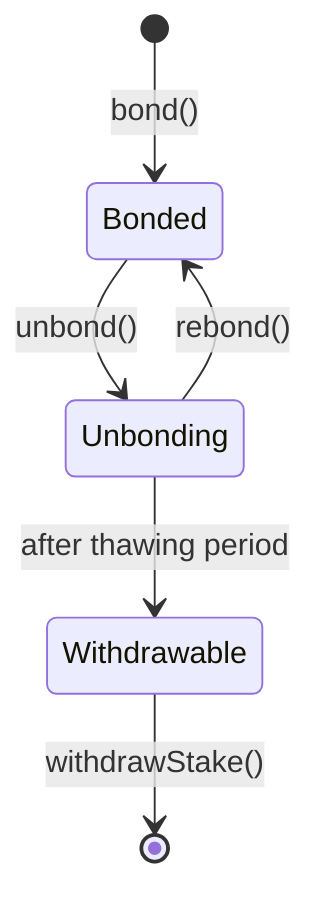

Once you have delegated, your LPT accumulates rewards automatically. This page covers how to manage your position: claim and compound earnings, move to a different orchestrator, and exit when you are ready.

---

## How rewards accumulate

Rewards accrue without any action on your part. Each round, when your orchestrator calls `Reward()`, the BondingManager updates the reward accounting for the entire pool. Your pending balance grows automatically.

These rewards sit in the contract against your account — not in your wallet. To access them (either to compound or withdraw), you must claim them.

<Note>
  If your orchestrator does not call `Reward()` in a round, no rewards are distributed for that round. Check the Explorer periodically to confirm consistent reward calls. See [Choose an Orchestrator](/v2/delegators/delegation/choose-an-orchestrator#step-2-check-reward-call-history) for how to read this history.
</Note>

---

## Claim timing — read before you claim anything {#claim-timing}

<Warning>
  **Claiming before your orchestrator calls `Reward()` for the current round forfeits that round's rewards and fees entirely.**

  When you call `claimEarnings`, the contract records your `lastClaimRound` as the current round. If `Reward()` has not yet been called for that round, future reward calculations skip it — the contract will not retroactively credit you.

  **Claim at the end of a round, after your orchestrator has already called `Reward()` — not at the beginning.**

  This behaviour is confirmed by Livepeer Foundation Engineering. The Livepeer Explorer is adding a warning to surface this timing risk in the UI. Check [explorer.livepeer.org](https://explorer.livepeer.org) for the current state of this indicator before claiming.
</Warning>

---

## Claiming earnings

Claiming moves accrued rewards into your bonded balance. From there you can compound (leave them bonded) or initiate withdrawal.

### Via the Livepeer Explorer

1. Go to [explorer.livepeer.org](https://explorer.livepeer.org) and connect your wallet
2. Navigate to your account page
3. Click **Claim Earnings**
4. Sign the transaction — gas cost is a few cents on Arbitrum One

After claiming, your bonded balance increases by the claimed amount.

### How often should you claim?

You do not forfeit rewards by waiting to claim — they accumulate in contract state indefinitely. The downside of waiting is that unclaimed rewards do not compound. The longer they remain unclaimed, the more compounding potential you forego.

On Arbitrum One, gas costs for claiming are negligible. Claim as often as makes sense relative to the amount accrued and your compounding goals.

---

## Compound: rebond your rewards

After claiming, your bonded balance includes both your original stake and your new rewards. Leaving them in the contract means they compound from the next round — your larger bonded balance earns a proportionally larger share of each future round's rewards.

To withdraw the reward portion instead, initiate unbonding on the amount you want to exit. See [Unbond and withdraw](#unbond-and-withdraw) below.

---

## Switch orchestrators (redelegation)

If your orchestrator's performance changes — missed reward calls, a commission increase, dropping out of the active set — you can redelegate to a different orchestrator without going through the unbonding process.

### How to redelegate

1. Go to [explorer.livepeer.org](https://explorer.livepeer.org) and connect your wallet
2. Navigate to the new orchestrator's profile
3. Click **Delegate**
4. Sign the transaction — this reassigns your stake attribution

Redelegation takes effect in the next round. Your bonded balance does not change — only the orchestrator your stake points to.

<Warning>
  Claim any pending earnings before redelegating. Earnings accrued from your current orchestrator should be claimed first to ensure accounting is correct before the attribution change.
</Warning>

### When to switch

- Your orchestrator has missed two or more consecutive reward calls
- They have raised their commission to an unacceptable level
- They have dropped out of the active set with no sign of returning
- You want to support a smaller, more recently active orchestrator for network health

---

## Unbond and withdraw {#unbond-and-withdraw}

To fully exit delegation and return LPT to your wallet, you go through a two-step process.

### Step 1 — Initiate unbonding

1. Go to [explorer.livepeer.org](https://explorer.livepeer.org) and connect your wallet
2. Navigate to your account page
3. Click **Undelegate** (or **Unbond**)
4. Enter the amount — partial unbonding is supported; the remainder stays bonded and earning
5. Sign the transaction

Your stake enters the unbonding state. It stops earning rewards from this point.

### Step 2 — Wait for the thawing period

During this period, your LPT remains in the BondingManager contract. You cannot accelerate the wait. You can cancel by calling `rebond()` — this returns your stake to bonded status without needing to restart the Approve and Bond cycle.

<Info>
  The unbonding period is a governance-controlled parameter. See [Protocol Parameters](/v2/delegators/resources/reference/protocol-parameters) for the current value, verified against the BondingManager contract on Arbitrum One.
</Info>

### Step 3 — Withdraw

Once the thawing period completes, return to your account in the Explorer and click **Withdraw**. This sends your LPT from the contract back to your connected wallet.

<Tip>
  If you are switching orchestrators rather than fully exiting, use redelegation. Redelegation avoids the thawing period and keeps your stake earning throughout.
</Tip>

---

## Monitor your position

Check the Explorer periodically — especially before claiming and whenever you hear about changes to your orchestrator's status.

### Signals to watch for

<AccordionGroup>

<Accordion title="Reward call rate drops">
  If your orchestrator goes from 30/30 rounds to 25/30 or lower, investigate. Check their Discord presence, the Explorer history, and the Livepeer [#orchestrators](https://discord.gg/livepeer) channel. A structural decline rather than a one-off incident warrants redelegation.
</Accordion>

<Accordion title="Commission settings change">
  Commission changes take effect the next round. If `rewardCut` rises significantly or `feeShare` falls, evaluate whether the new terms are still competitive. Redelegation is free of an unbonding penalty.
</Accordion>

<Accordion title="Orchestrator drops out of the active set">
  If their bonded stake falls below the top 100, they exit the active set. You earn no inflation rewards while they are inactive. Redelegate promptly.
</Accordion>

<Accordion title="Governance proposal that affects your returns">
  LIPs that modify inflation rate, unbonding period, treasury allocation, or active set size directly affect delegator economics. Proposals are visible in the Explorer governance section. Your bonded stake gives you voting power — use it.
</Accordion>

</AccordionGroup>

---

## Governance

Your bonded LPT gives you voting weight on Livepeer Improvement Proposals. Decisions include inflation parameter changes, treasury allocations, protocol upgrades, and active set size.

To vote, connect your wallet in the Explorer and navigate to the governance section. Your vote is proportional to your bonded balance at the block the proposal was created. You can override your orchestrator's vote with your own on any proposal — see [Governance Processes](/v2/delegators/guides/governance/processes) for how vote detachment works.

---

## Frequently asked questions

<AccordionGroup>

<Accordion title="Do I lose pending rewards if I redelegate?">
  No. Pending unclaimed rewards are tracked against your account, not your orchestrator. They remain claimable after redelegation. Claim before redelegating as a precaution to keep the accounting clean.
</Accordion>

<Accordion title="Can I unbond while still earning rewards?">
  The moment you call `unbond()`, your stake exits the earning state. You earn no rewards during the thawing period. If you want to continue earning while deciding whether to exit, stay bonded and redelegate if your orchestrator's performance drops.
</Accordion>

<Accordion title="Can I change my mind during the unbonding period?">
  Yes. Call `rebond()` during the thawing period to return your stake to bonded status. This cancels the unbonding and attributes your stake back to the last orchestrator you delegated to.
</Accordion>

<Accordion title="Can I partially unbond?">
  Yes. Unbond a specific amount rather than your entire balance. The unbonded portion enters the thawing period; the remainder stays bonded and continues earning.
</Accordion>

<Accordion title="What happens to my delegation if I want to bridge LPT back to Ethereum mainnet?">
  Unbond and withdraw on Arbitrum One first. Bonded LPT cannot be bridged directly — it must be in a liquid, wallet-held state before bridging.
</Accordion>

<Accordion title="Is there a minimum delegation amount?">
  No protocol-enforced minimum. Very small delegations earn returns so small that claiming gas costs may outweigh the benefit. Assess based on current network parameters visible in the Explorer.
</Accordion>

</AccordionGroup>

---

<CardGroup cols={2}>
  <Card title="Choose an Orchestrator" icon="list-check" href="/v2/delegators/delegation/choose-an-orchestrator" arrow>
    Evaluate and select a different orchestrator before redelegating.
  </Card>
  <Card title="Delegation Economics" icon="chart-line" href="/v2/delegators/delegation/delegation-economics" arrow>
    How reward formulas work and what rewardCut and feeShare mean for your returns.
  </Card>
  <Card title="Governance Processes" icon="landmark" href="/v2/delegators/guides/governance/processes" arrow>
    How to vote on proposals and override your orchestrator's position.
  </Card>
  <Card title="Protocol Parameters" icon="sliders" href="/v2/delegators/resources/reference/protocol-parameters" arrow>
    Current unbonding period and other live governance-controlled values.
  </Card>
</CardGroup>
