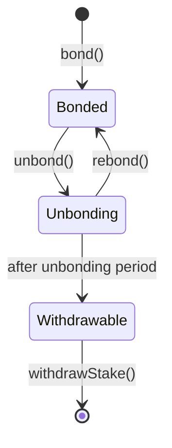

import { MathInline, MathBlock } from '/snippets/components/elements/math/Math.jsx'

Delegation returns are driven by a small set of on-chain mechanics: rounds, active-set selection, reward calls, and earnings checkpoints. Understanding those moving parts explains why orchestrator reliability matters as much as headline commission.

## Rounds

A round is the protocol's accounting unit. Livepeer uses rounds to:

- elect the active set
- update inflation-related state
- determine when orchestrators can mint that round's rewards
- snapshot bonded stake for governance

Reader-facing shorthand is still "about one day per round", but the exact cadence depends on chain timing. Use the Explorer for the current round and countdown rather than relying on any fixed hourly estimate.

## The active set

Only active orchestrators can earn inflation rewards for a round. If your orchestrator drops out of the active set, your stake stays bonded but does not earn round rewards until they return or you redelegate.

<Info>
  The active-set size is governance-controlled. Current public Livepeer product surfaces still describe the active set as 100 orchestrators, but if you need an operationally exact value, re-check `numActiveTranscoders()` directly before automating against it.
</Info>

## The `reward()` call

Every active orchestrator has to submit `reward()` on-chain each round. That call is what causes the protocol to mint and account for that round's inflationary LPT for the orchestrator's pool.

If the orchestrator misses the call:

- no inflation reward is minted for that pool for that round
- the missed round does not get backfilled later
- delegators in that pool permanently miss that round's inflation

That is why a reliable reward-call history is a first-order delegator signal.

## How delegation is accounted for

When delegator <MathInline latex={String.raw`D`} /> bonds to orchestrator <MathInline latex={String.raw`O`} />, the orchestrator's effective stake becomes:

<MathBlock latex={String.raw`B_O = B_{self,O} + \sum_D b_{D,O}`} />

That total stake is what matters for active-set ranking and reward allocation. Your tokens remain yours, but your stake weight is attributed to the orchestrator you selected.

## Reward accounting

At the protocol level, inflation available to an orchestrator's pool for round <MathInline latex={String.raw`t`} /> is proportional to that pool's share of total bonded stake:

<MathBlock latex={String.raw`R_O = R_t \cdot \frac{B_O}{B_T}`} />

Your share of that pool's delegator rewards is then determined by your share of the pool after the orchestrator's `rewardCut`:

<MathBlock latex={String.raw`R_{D,O} = R_O (1 - c_O) \cdot \frac{b_{D,O}}{B_O}`} />

The protocol tracks this through cumulative reward accounting rather than updating every delegator record every round.

## Claim timing matters

`claimEarnings()` moves accrued earnings into your bonded balance. The protocol also triggers that accounting path when you bond more, unbond, rebond, or redelegate.

The critical edge case is timing:

- if you claim after your orchestrator has already called `reward()` for the current round, accounting includes that round
- if you claim before your orchestrator has called `reward()` for the current round, you can skip that round's reward accounting entirely

As of 6 April 2026, the Explorer warning for this behaviour is still not fully shipped in production UI terms because Explorer PR `#613` remains open. Do not rely on the interface to catch the timing for you.

## Governance checkpoints

Bonded stake is also checkpointed for governance. The BondingVotes contract records stake snapshots so proposal voting power is based on stake at proposal creation time rather than whatever a wallet bonded later.

That prevents last-minute stake moves from distorting proposal outcomes.

## State lifecycle

## Related pages

<CardGroup cols={2}>
  <Card title="Protocol Parameters" icon="sliders" href="/v2/delegators/resources/reference/protocol-parameters" arrow>
    Exact governance-controlled values that shape delegation behaviour.
  </Card>
  <Card title="Delegation Economics" icon="chart-line" href="/v2/delegators/delegation/delegation-economics" arrow>
    See how the protocol mechanics translate into reader-facing reward outcomes.
  </Card>
  <Card title="Manage Your Delegation" icon="gauge" href="/v2/delegators/delegation/manage-your-delegation" arrow>
    Claim, compound, redelegate, unbond, and withdraw with the protocol edge cases in mind.
  </Card>
  <Card title="Contract Addresses" icon="file-contract" href="/v2/delegators/resources/reference/contracts" arrow>
    Canonical deployed addresses for the contracts named on this page.
  </Card>
</CardGroup>

## References

- [Livepeer protocol repository](https://github.com/livepeer/protocol)
- [Livepeer Explorer](https://explorer.livepeer.org)
