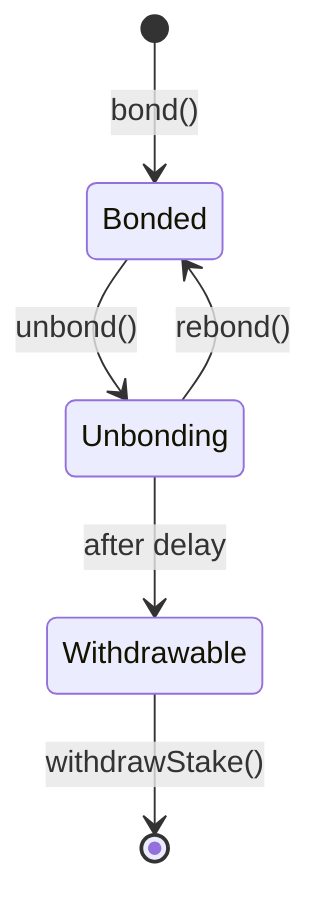

Once you have delegated, the work shifts from "open the position" to "manage it without losing avoidable rewards". Claims, compounding, redelegation, unbonding, and exit.

## Rewards accrue automatically

If your orchestrator is active and keeps calling `reward()`, your pending earnings update automatically in protocol state. You do not need to manually "collect every round" for accrual to happen.

What you do need to manage is:

- when to checkpoint those earnings with `claimEarnings()`
- whether to stay with the same orchestrator
- when to redelegate or exit

## Claim your earnings

From [Livepeer Explorer](https://explorer.livepeer.org):

1. Connect your wallet
2. Open your account page
3. Click **Claim Earnings**
4. Sign the transaction

### Claim timing warning

<Warning>
  As of 6 April 2026, Explorer PR `#613` is still open, so do not assume the UI will warn you before a badly timed claim.

  The protocol records `lastClaimRound` when `claimEarnings()` executes. If your orchestrator has not yet called `reward()` for the current round when you claim, you can skip that round's rewards and fees entirely.

  Safe default: claim late in the round, after your orchestrator has already called `reward()` for that round.
</Warning>

## Compound your position

Claiming updates your bonded balance so future rewards are earned on a larger base. If you intend to remain delegated, compounding is usually the default path.

The protocol does not force a claim schedule. Choose a cadence that makes sense for:

- the size of your position
- how often you want to check the operator
- the small gas cost of interacting on Arbitrum

## Redelegate when the operator stops being the right choice

Redelegation is the "change operators without fully exiting" path.

Use it if:

- the operator starts missing reward calls
- commission terms become unattractive
- the operator drops out of the active set
- you want to move away from an over-concentrated operator

<Warning>
  Redelegation also triggers earnings checkpointing. If you move at the start of a round before your current operator has called `reward()`, you can create the same skipped-round problem described above.
</Warning>

## Unbond and withdraw if you want liquid tokens back

Full exit is a different path from redelegation.

### Exit flow

1. Initiate unbonding from your Explorer account page
2. Wait through the unbonding period
3. Return and withdraw once the position is withdrawable

As of 6 April 2026, the on-chain unbonding period is `7` rounds.

## Monitor your position

At minimum, keep an eye on:

- active or inactive status
- reward-call consistency
- `rewardCut` changes
- `feeShare` changes
- governance proposals that affect delegator economics

## Frequently asked questions

<AccordionGroup>
  <Accordion title="Do I lose earnings if I redelegate?">
    Earnings are accounted against your delegator position rather than abandoned with the old orchestrator. The operational risk is timing, not loss of ownership.
  </Accordion>
  <Accordion title="Can I partially unbond?">
    Yes. Part of the balance can enter unbonding while the rest remains bonded.
  </Accordion>
  <Accordion title="Can I rebond during the unbonding period?">
    Yes. Rebonding cancels the exit path and returns that position to bonded status.
  </Accordion>
  <Accordion title="Can bonded LPT be bridged directly?">
    No. You must unbond and withdraw first.
  </Accordion>
  <Accordion title="Is there a minimum delegation amount?">
    There is no protocol-enforced minimum. The practical question is whether the position size justifies the effort of managing it.
  </Accordion>
</AccordionGroup>

<CardGroup cols={2}>
  <Card title="Protocol Parameters" icon="sliders" href="/v2/delegators/resources/reference/protocol-parameters" arrow>
    Confirm the current unbonding period and governance-controlled values before acting on them.
  </Card>
  <Card title="Choose an Orchestrator" icon="list-check" href="./choose-an-orchestrator" arrow>
    Re-check operator quality if you are thinking about redelegating.
  </Card>
  <Card title="Delegation Economics" icon="chart-line" href="./delegation-economics" arrow>
    Review the reward model when you are comparing "stay" versus "move" decisions.
  </Card>
  <Card title="Livepeer Explorer" icon="compass" href="https://explorer.livepeer.org" arrow>
    Use the live account surface for claims, redelegation, and unbonding actions.
  </Card>
</CardGroup>
