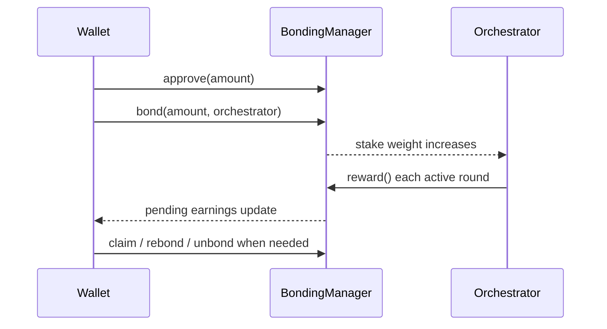

Delegation is the process of bonding your LPT to a single orchestrator so your stake helps secure the network, earns a share of rewards, and carries voting weight in governance. This page is the section router: use it to identify your starting point and go to the correct next page.

## Which situation is yours?

<CardGroup cols={2}>
  <Card title="I need the mental model first" icon="circle-question" href="/v2/delegators/delegation/about-delegation" arrow>
    Start here if you want to understand what bonding actually means, what risk you are taking, and why unbonded LPT gets diluted over time.
  </Card>
  <Card title="My LPT is still on Ethereum" icon="bridge" href="/v2/delegators/delegation/bridge-lpt-to-arbitrum" arrow>
    You cannot delegate from Ethereum mainnet. Move or acquire LPT on Arbitrum One first.
  </Card>
  <Card title="I am choosing an orchestrator" icon="list-check" href="/v2/delegators/delegation/choose-an-orchestrator" arrow>
    Compare active-set status, reward-call reliability, commission settings, and concentration before you bond.
  </Card>
  <Card title="I am ready to execute the transaction" icon="play" href="/v2/delegators/delegation/delegate-your-lpt" arrow>
    Follow the end-to-end tutorial for the wallet flow, approval, bond transaction, and confirmation checks.
  </Card>
  <Card title="I want to understand the numbers" icon="chart-line" href="/v2/delegators/delegation/delegation-economics" arrow>
    See how inflation rewards, fee sharing, treasury allocation, and reward-call reliability shape real delegator outcomes.
  </Card>
  <Card title="I already delegated and need next actions" icon="gauge" href="/v2/delegators/delegation/manage-your-delegation" arrow>
    Claim, compound, redelegate, unbond, withdraw, and monitor your position.
  </Card>
</CardGroup>

## Key facts before you start

<AccordionGroup>
  <Accordion title="Your LPT is bonded to a contract, not handed to an orchestrator">
    Bonded LPT sits in the BondingManager contract on Arbitrum One. The orchestrator does not take custody of your tokens.
  </Accordion>
  <Accordion title="One wallet can only delegate to one orchestrator at a time">
    If you want to split across operators, use separate wallets. From one address, the entire bonded position points to one orchestrator.
  </Accordion>
  <Accordion title="Exiting is slower than switching">
    Redelegation is the fast path for changing operators. Full exit requires unbonding and then waiting through the protocol's unbonding period before withdrawal.
  </Accordion>
  <Accordion title="The main operational risk is missed rewards, not orchestrator custody">
    Slashing is not currently active on Livepeer mainnet. The more immediate delegator risk is choosing an orchestrator that misses reward calls or changes terms unfavourably.
  </Accordion>
</AccordionGroup>

## Delegation in one diagram

## Live tools and references

<CardGroup cols={2}>
  <Card title="Livepeer Explorer" icon="compass" href="https://explorer.livepeer.org" arrow>
    The primary delegation interface for orchestrator selection, staking actions, and account monitoring.
  </Card>
  <Card title="Protocol Parameters" icon="sliders" href="/v2/delegators/resources/reference/protocol-parameters" arrow>
    Check the current unbonding period, governance thresholds, and other values before acting on them.
  </Card>
  <Card title="Contract Addresses" icon="file-contract" href="/v2/delegators/resources/reference/contracts" arrow>
    Look up the canonical deployed contracts used by the staking and governance flows.
  </Card>
  <Card title="Delegators Glossary" icon="books" href="/v2/delegators/resources/glossary" arrow>
    Confirm Livepeer-specific terms such as fee share, reward cut, rounds, and vote detachment.
  </Card>
</CardGroup>
