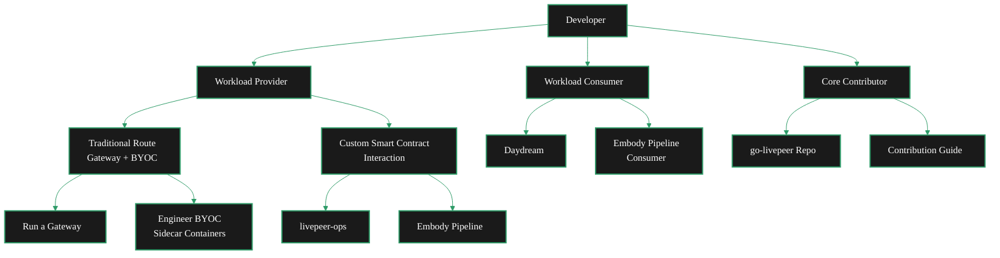

Livepeer offers multiple paths for developers depending on how you want to engage with the network. Whether you're bringing compute workloads, consuming existing AI pipelines, or contributing to the core Go implementation, there's a clear path for you.

## Pick Your Path

<Columns cols={3}>
  <Card title="Workload Provider" icon="server" href="#path-1-workload-provider" arrow>
    Bring your own compute workloads to the Livepeer network by running a gateway or interacting with smart contracts directly.
  </Card>
  <Card title="Workload Consumer" icon="wand-magic-sparkles" href="#path-2-workload-consumer" arrow>
    Consume existing pipeline workloads running on the Livepeer network — no infrastructure setup required.
  </Card>
  <Card title="Core Contributor" icon="code-branch" href="#path-3-core-contributor" arrow>
    Contribute directly to go-livepeer, the Go implementation that powers the Livepeer network.
  </Card>
</Columns>

---

---

## Path 1: Workload Provider

As a **Workload Provider**, you bring compute workloads to the Livepeer network. You define what gets processed — whether that's an AI inference pipeline, a video transcoding job, or something entirely custom — and route it through Livepeer's orchestrator network.

There are two approaches depending on your needs.

### Option A: Traditional Route (Gateway + BYOC)

The standard path runs your own gateway and uses BYOC (Bring Your Own Container) sidecar containers alongside the go-livepeer main container.

<Steps>
  <Step title="Run your own gateway" icon="tower-broadcast">
    Set up a Livepeer gateway node that routes workloads to orchestrators on the network.

    <Card title="Gateway Quickstart" icon="rocket" href="/v2/gateways/run-a-gateway/quickstart/quickstart-a-gateway" arrow horizontal>
      Get your gateway node running in minutes.
    </Card>
  </Step>
  <Step title="Engineer your BYOC containers" icon="docker">
    Build sidecar containers that run alongside the go-livepeer main container. BYOC lets you define custom workloads that orchestrators execute on their GPUs.

    <Card title="BYOC Documentation" icon="boxes" href="/v2/developers/ai-pipelines/byoc" arrow horizontal>
      Learn how to build and deploy BYOC sidecar containers.
    </Card>
  </Step>
  <Step title="Deploy workloads through your gateway" icon="arrow-up-right-from-square">
    Once your gateway is running and your BYOC containers are built, deploy your workloads to the network through your gateway.

    <Card title="AI Pipelines Overview" icon="brain-circuit" href="/v2/developers/ai-pipelines/overview" arrow horizontal>
      Understand the full AI pipeline architecture.
    </Card>
  </Step>
</Steps>

### Option B: Custom Smart Contract Interaction

If you want more control, you can interact with Livepeer's smart contracts directly — bypassing the standard gateway flow to build custom orchestration logic.

<Columns cols={2}>
  <Card title="livepeer-ops" icon="github" href="https://github.com/its-DeFine/livepeer-ops" arrow>
    Infrastructure tooling for deploying and managing Livepeer workloads with custom smart contract interactions.
  </Card>
  <Card title="Embody Pipeline" icon="github" href="https://github.com/its-DeFine/Unreal_Vtuber" arrow>
    A reference implementation showing how to build a custom pipeline that interacts with Livepeer contracts directly.
  </Card>
</Columns>

<Tip>
  You're not limited to these two options. Providers can fork livepeer-ops, extend the Embody pipeline, or build entirely custom implementations. The smart contract interface is open — use it however fits your architecture.
</Tip>

---

## Path 2: Workload Consumer

As a **Workload Consumer**, you use existing pipeline workloads that are already running on the Livepeer network. You don't need to set up infrastructure or deploy containers — you connect to available pipelines and consume their output.

### Available Pipelines

<Columns cols={2}>
  <Card title="Daydream (DaS Scope)" icon="wand-sparkles" href="#">
    Consume Daydream pipeline workloads on the Livepeer network.
    <Note>Link coming soon</Note>
  </Card>
  <Card title="Embody Pipeline" icon="user-robot" href="#">
    Consume Embody pipeline workloads for real-time avatar and VTuber applications.
    <Note>Link coming soon</Note>
  </Card>
</Columns>

---

## Path 3: Core Contributor

As a **Core Contributor**, you work directly on go-livepeer — the Go implementation that powers gateways, orchestrators, and the protocol itself. This path is for developers who want to improve the network at the infrastructure level.

<Columns cols={2}>
  <Card title="go-livepeer" icon="github" href="https://github.com/livepeer/go-livepeer" arrow>
    The official Go implementation of the Livepeer protocol. Clone the repo and start exploring.
  </Card>
  <Card title="Contribution Guide" icon="book-open" href="/v2/developers/guides-and-resources/contribution-guide" arrow>
    Guidelines for contributing to Livepeer — coding standards, PR process, and how to get your changes merged.
  </Card>
</Columns>
