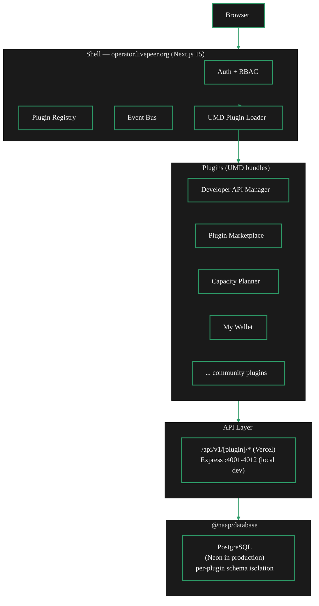

import { LinkArrow } from '/snippets/components/elements/links/Links.jsx'
import { StyledTable, TableRow, TableCell } from '/snippets/components/displays/tables/Tables.jsx'
import { CustomDivider } from '/snippets/components/elements/spacing/Divider.jsx'
import { ScrollableDiagram } from '/snippets/components/displays/diagrams/ScrollableDiagram.jsx'
import { CenteredContainer } from '/snippets/components/wrappers/containers/Containers.jsx'

<CenteredContainer style={{ width: '90%' }}>
  <Tip>NaaP (Network as a Platform) is the live Livepeer network portal at operator.livepeer.org. It is a micro-frontend shell that loads independent plugins at runtime - each plugin owns its own UI, backend, and database. You can use the platform today and build plugins with the `@naap/plugin-sdk` CLI.</Tip>
</CenteredContainer>

<iframe
  src="https://operator.livepeer.org/docs"
  title="NaaP developer documentation"
  width="100%"
  height="600px"
  style={{ borderRadius: '8px', border: '1px solid var(--border)' }}
></iframe>

<CustomDivider />

NaaP is an official Livepeer project maintained in the [`livepeer/naap`](https://github.com/livepeer/naap) repository. The platform is live at [operator.livepeer.org](https://operator.livepeer.org), with full developer documentation at [operator.livepeer.org/docs](https://operator.livepeer.org/docs).

The platform gives operators, developers, and governance participants a single interface for managing Livepeer infrastructure. It is extensible by design: any team can build and publish a plugin that inherits auth, navigation, theming, and database infrastructure from the shell.

<Warning>
  NaaP is in active beta development. Breaking changes to the plugin SDK may occur between releases. Check the [NaaP changelog](https://operator.livepeer.org/docs/community/changelog) before upgrading.
</Warning>

<CustomDivider />

## How NaaP works

NaaP is a micro-frontend architecture. The shell application is a Next.js 15 host. Plugins are compiled to UMD bundles and loaded at runtime via a plugin registry. Each plugin gets a `ShellContext` object on mount - this is the entire interface between a plugin and the platform.

The shell provides these services to every plugin via `ShellContext`:

```typescript
interface ShellContext {
  auth: IAuthService;           // Authentication and authorisation
  navigate: NavigateFunction;   // Client-side navigation
  eventBus: IEventBus;          // Inter-plugin communication
  theme: IThemeService;         // Theme management
  notifications: INotificationService; // Toast notifications
  integrations: IIntegrationService;   // AI, storage, email
  logger: ILoggerService;       // Structured logging
  permissions: IPermissionService;     // Permission checking
  tenant?: ITenantService;      // Tenant context
  team?: ITeamContext;          // Team context
}
```

Plugins own a full vertical slice: frontend React components, backend API logic, and an isolated PostgreSQL schema within the shared database. In production (Vercel), plugin backends run as Next.js API route handlers at `/api/v1/[plugin-name]/*`. In local development, the shell proxies the same routes to standalone Express backends on ports 4001-4012.

The following diagram shows the complete request flow from browser to database.

<ScrollableDiagram title="NaaP request flow" maxHeight="480px">

</ScrollableDiagram>

<CustomDivider middleText="Current plugins" />

## Installed plugins

NaaP ships with 12 plugins covering developer, operator, monitoring, and governance use cases. The Plugin Marketplace plugin manages installation of additional community plugins.

<StyledTable variant="bordered">
  <thead>
    <TableRow header>
      <TableCell header>Plugin</TableCell>
      <TableCell header>Category</TableCell>
      <TableCell header>What it does</TableCell>
    </TableRow>
  </thead>
  <tbody>
    <TableRow>
      <TableCell>**Plugin Marketplace**</TableCell>
      <TableCell>Core</TableCell>
      <TableCell>Discover, install, and manage plugins within the shell</TableCell>
    </TableRow>
    <TableRow>
      <TableCell>**Developer API Manager**</TableCell>
      <TableCell>Developer</TableCell>
      <TableCell>Create and manage API keys, browse AI model listings, configure gateway connections, monitor usage quotas. Integrates with pymthouse as a billing provider via OAuth.</TableCell>
    </TableRow>
    <TableRow>
      <TableCell>**Plugin Publisher**</TableCell>
      <TableCell>Developer</TableCell>
      <TableCell>Validate, publish, and manage plugins in the NaaP marketplace</TableCell>
    </TableRow>
    <TableRow>
      <TableCell>**Capacity Planner**</TableCell>
      <TableCell>Monitoring</TableCell>
      <TableCell>Plan and monitor compute capacity across Livepeer node infrastructure</TableCell>
    </TableRow>
    <TableRow>
      <TableCell>**My Dashboard**</TableCell>
      <TableCell>Analytics</TableCell>
      <TableCell>Embedded analytics dashboards sourced via the Dashboard Data Provider pattern</TableCell>
    </TableRow>
    <TableRow>
      <TableCell>**My Wallet**</TableCell>
      <TableCell>Finance</TableCell>
      <TableCell>MetaMask wallet integration and LPT staking operations</TableCell>
    </TableRow>
    <TableRow>
      <TableCell>**Daydream Video**</TableCell>
      <TableCell>Media</TableCell>
      <TableCell>Real-time AI video generation via the Livepeer AI subnet</TableCell>
    </TableRow>
    <TableRow>
      <TableCell>**Community Hub**</TableCell>
      <TableCell>Social</TableCell>
      <TableCell>Community forum and discussion for Livepeer network participants</TableCell>
    </TableRow>
  </tbody>
</StyledTable>

<CustomDivider middleText="Building a plugin" />

## Building a plugin

NaaP has full tooling for plugin development and publishing. If you are building a network tool - a monitoring dashboard, a governance interface, an AI pipeline manager - shipping it as a NaaP plugin gives you shared auth, navigation, and database infrastructure with zero setup.

**Install the CLI and scaffold a plugin:**

```bash
npm install -g @naap/plugin-sdk
naap-plugin create my-plugin
naap-plugin dev
```

The dev server hot-reloads your plugin inside the shell at `http://localhost:3000`. The `start.sh` script manages the full platform locally:

```bash
git clone https://github.com/livepeer/naap.git && cd naap && ./bin/start.sh
```

First run handles everything: dependency installation, PostgreSQL via Docker, schema creation, `.env` generation, plugin bundle builds, and platform start. Subsequent starts take 6-8 seconds.

**Every plugin declares a `plugin.json` manifest:**

```json
{
  "id": "my-plugin",
  "name": "My Plugin",
  "version": "0.1.0",
  "category": "developer",
  "permissions": ["network:read"]
}
```

Plugins access shell services through the SDK hooks:

```typescript
import { useShell, useAuth, useEventBus } from '@naap/plugin-sdk';

export function MyPlugin() {
  const { navigate, notifications } = useShell();
  const { user } = useAuth();
  const eventBus = useEventBus();
  // ...
}
```

All plugin API calls go through `/api/v1/my-plugin/*` using the standard response envelope:

```typescript
// Success: { success: true, data: T, meta?: { page, limit, total } }
// Error:   { success: false, error: { code, message } }
```

NaaP also ships AI prompt templates for building plugins without writing boilerplate. The [Prompts section](https://operator.livepeer.org/docs/prompts/how-to-use) in the NaaP docs covers 8 templates covering frontend plugins, full-stack apps, UI design, testing, and publishing - paste them into any AI assistant.

Full development guides are at [operator.livepeer.org/docs/guides/your-first-plugin](https://operator.livepeer.org/docs/guides/your-first-plugin). The SDK hooks reference is at [operator.livepeer.org/docs/api-reference/sdk-hooks](https://operator.livepeer.org/docs/api-reference/sdk-hooks).

<CustomDivider middleText="Resources" />

## Resources

<StyledTable variant="bordered">
  <thead>
    <TableRow header>
      <TableCell header>Resource</TableCell>
      <TableCell header>Link</TableCell>
    </TableRow>
  </thead>
  <tbody>
    <TableRow>
      <TableCell>**Live platform**</TableCell>
      <TableCell>[operator.livepeer.org](https://operator.livepeer.org)</TableCell>
    </TableRow>
    <TableRow>
      <TableCell>**Developer docs**</TableCell>
      <TableCell>[operator.livepeer.org/docs](https://operator.livepeer.org/docs)</TableCell>
    </TableRow>
    <TableRow>
      <TableCell>**Quickstart**</TableCell>
      <TableCell>[operator.livepeer.org/docs/getting-started/quickstart](https://operator.livepeer.org/docs/getting-started/quickstart)</TableCell>
    </TableRow>
    <TableRow>
      <TableCell>**SDK hooks reference**</TableCell>
      <TableCell>[operator.livepeer.org/docs/api-reference/sdk-hooks](https://operator.livepeer.org/docs/api-reference/sdk-hooks)</TableCell>
    </TableRow>
    <TableRow>
      <TableCell>**AI prompt templates**</TableCell>
      <TableCell>[operator.livepeer.org/docs/prompts/how-to-use](https://operator.livepeer.org/docs/prompts/how-to-use)</TableCell>
    </TableRow>
    <TableRow>
      <TableCell>**GitHub repository**</TableCell>
      <TableCell>[github.com/livepeer/naap](https://github.com/livepeer/naap)</TableCell>
    </TableRow>
    <TableRow>
      <TableCell>**Changelog**</TableCell>
      <TableCell>[operator.livepeer.org/docs/community/changelog](https://operator.livepeer.org/docs/community/changelog)</TableCell>
    </TableRow>
  </tbody>
</StyledTable>

<CustomDivider />

## Related pages

<CardGroup cols={2}>
  <Card title="pymthouse" icon="shield-check" href="/v2/developers/guides/pymthouse" arrow horizontal>
    Identity, billing, and payment signing infrastructure. Integrates with NaaP's Developer API Manager as a billing provider via OAuth.
  </Card>
  <Card title="AI authentication guide" icon="key" href="/v2/developers/guides/ai/authentication" arrow horizontal>
    Set up API authentication for AI inference requests in your Livepeer application.
  </Card>
  <Card title="Builder opportunities" icon="hammer" href="/v2/developers/guides/opportunities/overview" arrow horizontal>
    Explore grants, RFPs, and open-source contribution paths for ecosystem builders.
  </Card>
  <Card title="Governance and Foundation" icon="landmark" href="/v2/community/livepeer-community/governance-and-foundation" arrow horizontal>
    Governance structures and treasury mechanisms that fund Livepeer ecosystem projects.
  </Card>
</CardGroup>
