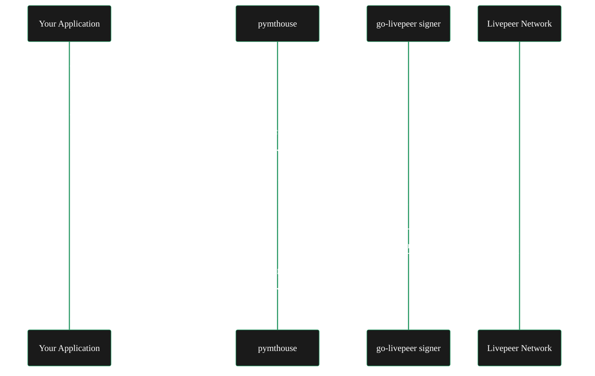

import { LinkArrow } from '/snippets/components/elements/links/Links.jsx'
import { StyledTable, TableRow, TableCell } from '/snippets/components/displays/tables/Tables.jsx'
import { CustomDivider } from '/snippets/components/elements/spacing/Divider.jsx'
import { CenteredContainer } from '/snippets/components/wrappers/containers/Containers.jsx'

<CenteredContainer style={{ width: '90%' }}>
  <Tip>pymthouse is a community-built backend layer that gives your Livepeer-powered app OIDC identity, usage-based billing, and a managed payment signer - without building any of that infrastructure yourself.</Tip>
</CenteredContainer>

---

Building a multi-tenant AI video application on Livepeer means solving three infrastructure problems before you write a single line of product code: authenticating your users, metering their usage, and signing probabilistic micropayment tickets on their behalf. pymthouse solves all three as a hosted or self-hosted service.

pymthouse is a community project by John ([@eliteprox](https://github.com/eliteprox)), an active Livepeer orchestrator operator and go-livepeer contributor. The platform is open source, self-hostable, and free to use during beta.

<Warning>
  pymthouse is a community ecosystem project, not an official Livepeer Foundation product. It is in active beta development. Verify compatibility with the current go-livepeer release before deploying to production.
</Warning>

<CustomDivider middleText="What pymthouse does" />

## Core capabilities

pymthouse provides three integrated services that Livepeer application developers would otherwise build from scratch.

**Identity and authentication** - pymthouse runs a full OpenID Connect (OIDC) provider. Your application registers as an OIDC client, and pymthouse issues scoped short-lived tokens for your end users. This implements RFC 8693 token exchange, meaning it slots into existing OAuth 2.0 flows. Admin authentication uses `next-auth` with Google, GitHub, or Bearer token options.

**Multi-tenant billing** - Each developer application on pymthouse gets its own isolated OIDC client namespace, user registry, and billing plan. Plans are configurable as free, subscription, or usage-based. The Builder API lets you provision users and record usage against per-user ledgers, denominated in wei to match the on-chain payment unit and avoid floating-point precision loss.

**Remote payment signing** - pymthouse proxies signing operations to a `go-livepeer` signer sidecar. Your application calls one endpoint; pymthouse authenticates the caller, signs the Livepeer probabilistic micropayment ticket, records usage, and returns the result. The audit trail is maintained in the usage ledger.

The following diagram shows the request flow for a typical user-initiated AI inference call routed through pymthouse.



<CustomDivider middleText="Architecture" />

## System architecture

pymthouse is built on Next.js (App Router) with a PostgreSQL database managed via Drizzle ORM. The `go-livepeer` remote signer runs as a Docker sidecar or external service, communicating with pymthouse over a local HTTP API.

<StyledTable variant="bordered">
  <thead>
    <TableRow header>
      <TableCell header>Component</TableCell>
      <TableCell header>Technology</TableCell>
      <TableCell header>Responsibility</TableCell>
    </TableRow>
  </thead>
  <tbody>
    <TableRow>
      <TableCell>**Web app**</TableCell>
      <TableCell>Next.js 16 (App Router)</TableCell>
      <TableCell>Dashboard, OIDC endpoints, Builder API, Usage API</TableCell>
    </TableRow>
    <TableRow>
      <TableCell>**Database**</TableCell>
      <TableCell>PostgreSQL via Drizzle ORM</TableCell>
      <TableCell>App registry, user ledger, usage records, signer config</TableCell>
    </TableRow>
    <TableRow>
      <TableCell>**Signer**</TableCell>
      <TableCell>go-livepeer remote signer (Docker)</TableCell>
      <TableCell>Probabilistic micropayment ticket signing and orchestrator communication</TableCell>
    </TableRow>
    <TableRow>
      <TableCell>**Token security**</TableCell>
      <TableCell>PBKDF2-SHA256 + server-side pepper</TableCell>
      <TableCell>Bearer token and API key hashing at rest</TableCell>
    </TableRow>
  </tbody>
</StyledTable>

The recommended deployment splits the Next.js app to Vercel and the `go-livepeer` signer to a container host (Railway, Render, or Fly.io). A `Dockerfile.signer`, `railway.json`, and `render.yaml` are included in the repository for each target.

<CustomDivider middleText="API surface" />

## Key API endpoints

pymthouse exposes four API surfaces. All use OAuth 2.0 client credentials (RFC 6749) for machine authentication.

**OIDC endpoints** at `/api/v1/oidc` - Standard OpenID Connect discovery, JWKS, authorisation, token, and UserInfo endpoints. Use the discovery document (`/.well-known/openid-configuration`) in production integrations to avoid path drift between versions.

**Builder API** at `/api/v1/apps/{clientId}/users` - Confidential client API for provisioning end users, minting short-lived scoped tokens, and managing user attributes within a specific app namespace.

**Usage API** at `/api/v1/apps/{clientId}/usage` - Read-only, tenant-scoped endpoint for billing dashboards and per-user cost attribution. Monetary totals are returned as decimal strings of wei - parse with a BigInt-capable library.

**Signer proxy** - Accepts signed inference or transcoding requests, forwards to the `go-livepeer` signer, and writes usage records on each call.

<CustomDivider middleText="Getting started" />

## Getting started

pymthouse is available as a hosted service (free during beta) and as a self-hosted open-source deployment.

**Hosted** - Create an account at [pymthouse.com](https://pymthouse.com), register your application in the dashboard, and integrate the Builder API. Time to first token is under five minutes.

**Self-hosted** - Clone the repository, configure environment variables (see `.env.example`), run database migrations, seed OIDC signing keys, and start the `go-livepeer` signer sidecar. Full deployment instructions are in `DEPLOYMENT.md` and `docs/vercel-deployment.md`.

The OIDC seed command initialises JWT signing keys required before any token issuance:

```bash
npm run oidc:seed
```

After seeding, register application clients through the dashboard or the credentials endpoint:

```
/api/v1/apps/{clientId}/credentials
```

Full integration documentation is at [docs.pymthouse.com](https://docs.pymthouse.com).

<CustomDivider middleText="Resources" />

## Resources

<StyledTable variant="bordered">
  <thead>
    <TableRow header>
      <TableCell header>Resource</TableCell>
      <TableCell header>Link</TableCell>
    </TableRow>
  </thead>
  <tbody>
    <TableRow>
      <TableCell>**Live platform**</TableCell>
      <TableCell>[pymthouse.com](https://pymthouse.com)</TableCell>
    </TableRow>
    <TableRow>
      <TableCell>**Documentation**</TableCell>
      <TableCell>[docs.pymthouse.com](https://docs.pymthouse.com)</TableCell>
    </TableRow>
    <TableRow>
      <TableCell>**GitHub repository**</TableCell>
      <TableCell>[github.com/eliteprox/pymthouse](https://github.com/eliteprox/pymthouse)</TableCell>
    </TableRow>
    <TableRow>
      <TableCell>**DeepWiki (AI repo analysis)**</TableCell>
      <TableCell>[deepwiki.com/eliteprox/pymthouse](https://deepwiki.com/eliteprox/pymthouse)</TableCell>
    </TableRow>
    <TableRow>
      <TableCell>**Marketplace**</TableCell>
      <TableCell>[pymthouse.com/marketplace](https://pymthouse.com/marketplace)</TableCell>
    </TableRow>
  </tbody>
</StyledTable>

<CustomDivider />

## Related pages

<CardGroup cols={2}>
  <Card title="AI authentication guide" icon="key" href="/v2/developers/guides/ai/authentication" arrow horizontal>
    Set up API authentication for AI inference requests in your Livepeer application.
  </Card>
  <Card title="Production checklist" icon="list-check" href="/v2/developers/guides/ai/production-checklist" arrow horizontal>
    Review the operational checks before moving an AI integration into production traffic.
  </Card>
  <Card title="NaaP - Network as a Platform" icon="grid-2" href="/v2/developers/guides/naap" arrow horizontal>
    Plugin-based network portal for developers and operators building on Livepeer AI compute.
  </Card>
  <Card title="Builder opportunities" icon="hammer" href="/v2/developers/guides/opportunities/overview" arrow horizontal>
    Explore grants, RFPs, and open-source contribution paths for ecosystem builders.
  </Card>
</CardGroup>
