# Persona Routing × Infrastructure Map

**Project:** Livepeer docs-v2
**Branch:** `docs-v2-dev`
**Date:** 22 April 2026
**Scope:** Map every developer persona to the infrastructure they touch, inventory every Livepeer infrastructure component so nothing is orphaned, and identify what is missing.

Diagrams are split by layer so each is legible at normal zoom. Items flagged "needs verification" are checkable against the cited source.

---

## Part 1 — Persona routing

Seven separate diagrams. One per persona, plus one summary diagram showing the convergence point.

### 1.1 Persona A — Rapid Integrator

Frontend or fullstack developer building with Studio or Daydream hosted APIs. Largest cohort.

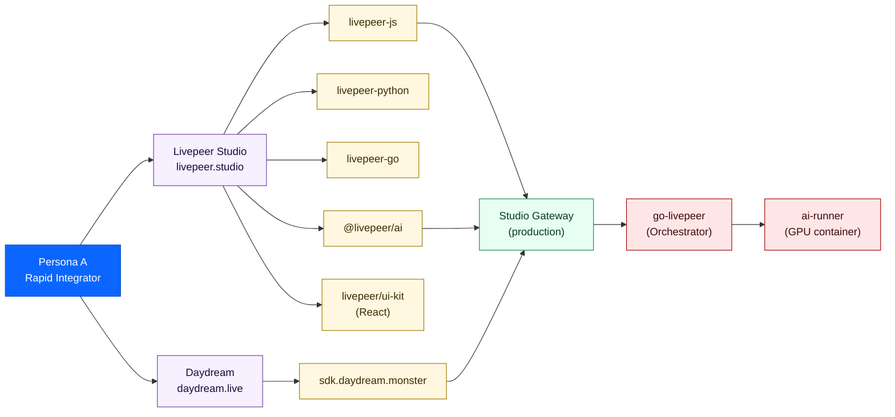

**Activation moment:** first successful API call.
**Key disambiguation need:** Studio vs Daydream vs network API.

---

### 1.2 Persona B1 — Gateway Runner (graduated)

Persona A who scaled, now self-hosting a gateway for cost and control.

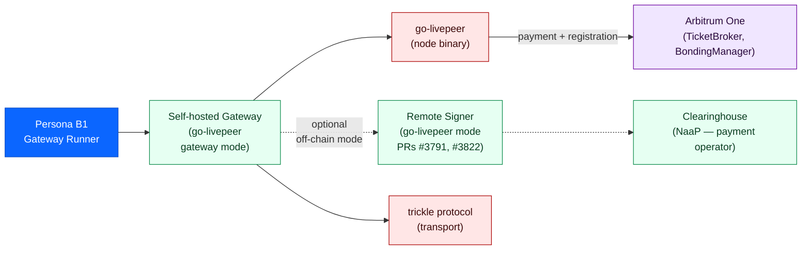

**Activation moment:** first job routed through their self-hosted gateway.
**Key decision:** "should I run a gateway?" — not "how" (that's the Gateways tab).

---

### 1.3 Persona B2 — ComfyStream / Pipeline Developer

ML or Python developer building real-time AI video pipelines. Primary AI subnet growth driver per Messari.

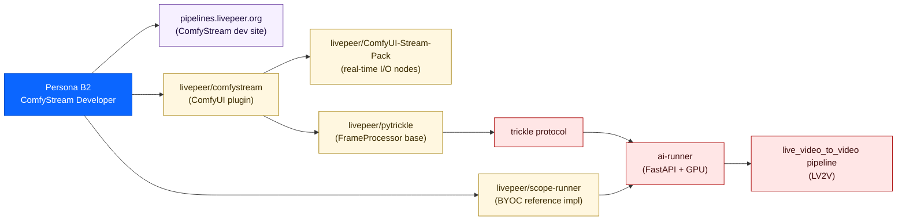

**Activation moment:** first real-time pipeline running via ComfyStream.

---

### 1.4 Persona C — ComfyUI Creative / VTuber Builder

ComfyUI node-graph user. Creative technologist. Often Windows. RunPod-native.

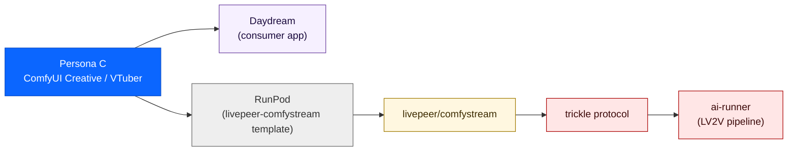

**Activation moment:** first real-time AI effect on live video using their ComfyUI workflow.
**Documented gap:** no RunPod-first path in Livepeer docs.

---

### 1.5 Persona D — OSS Core Builder

Protocol or go-livepeer contributor. Go, Solidity, Python.

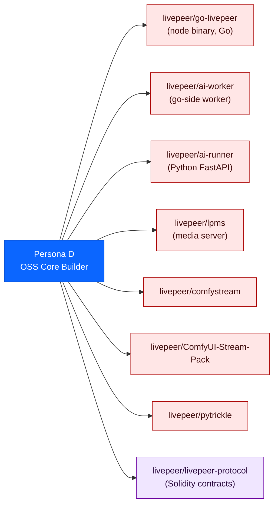

**Activation moment:** first merged PR or approved treasury proposal.

---

### 1.6 Persona E — SDK / Alt-Gateway Builder *(currently no docs surface)*

Active in `#local-gateways`. Building Python, browser, mobile, or embedded gateway implementations using the remote signer architecture.

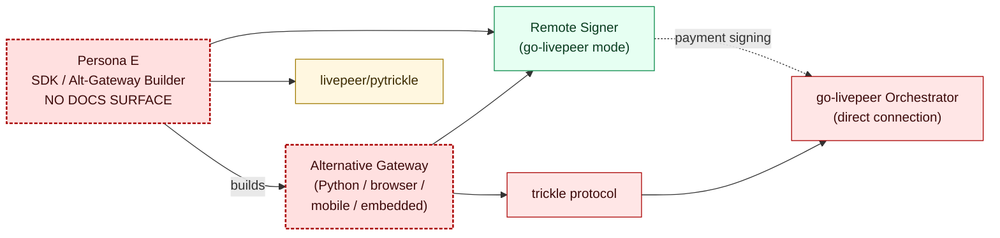

**Architectural rationale (verifiable in `Remote_signers.md`, line 25):** *"writing an implementation of a Livepeer gateway requires deep familiarity with the Livepeer probabilistic micropayments mechanism. Very few developers actually understand PM in enough detail to implement correctly, which is one reason that go-livepeer is the only extant gateway implementation."*

**The remote signer was designed to enable this persona. The docs do not surface it.**

---

### 1.7 Persona F — Agent-Runtime Developer *(emerging — no docs surface)*

Storyboard's `@livepeer/agent` runtime treats Livepeer as one of several swappable inference providers in an agent backend.

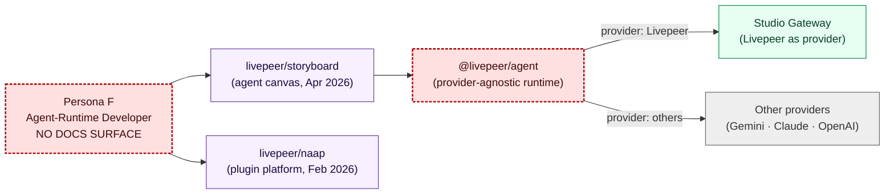

---

### 1.8 The convergence point — all paths lead to go-livepeer

Every persona's traffic eventually executes against `go-livepeer` and `ai-runner`. The diagram below removes SDK and product layers and shows just the convergence.

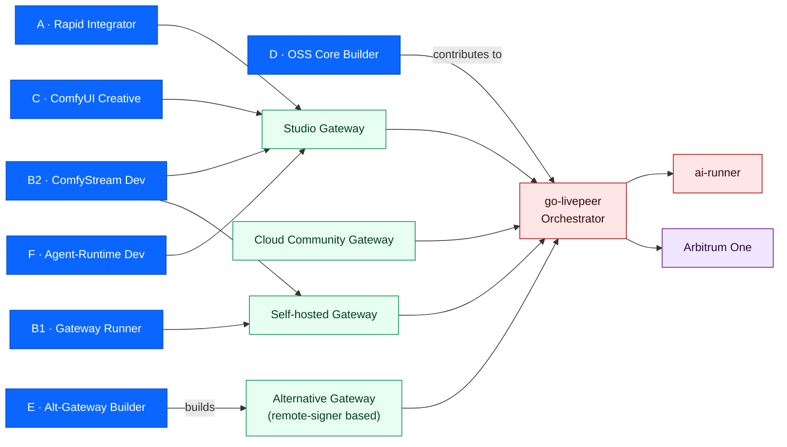

---

## Part 2 — Infrastructure inventory (no orphans)

Eleven separate diagrams. One per layer.

### 2.1 Hosted products & access surfaces

```mermaid
flowchart TB
  Studio["livepeer/studio<br/>Studio (TS)<br/>video + AI hosted product"]:::core
  Daydream["daydream.live<br/>real-time AI video API"]:::core
  Pipelines["pipelines.livepeer.org<br/>ComfyStream developer site"]:::core
  Storyboard["livepeer/storyboard<br/>agent canvas (Apr 2026)"]:::new
  NaaP["livepeer/naap<br/>plugin platform (Feb 2026)<br/>12 plugins"]:::new
  Explorer["explorer.livepeer.org<br/>livepeer/explorer"]:::core
  DevHub["livepeer.org/dev-hub"]:::core

  classDef core fill:#f6f0ff,stroke:#6b3fa0,color:#1a0a3d
  classDef new fill:#fffae6,stroke:#a07a00,color:#3d2c00,stroke-dasharray: 4 2
```

---

### 2.2 SDKs, libraries, frontends

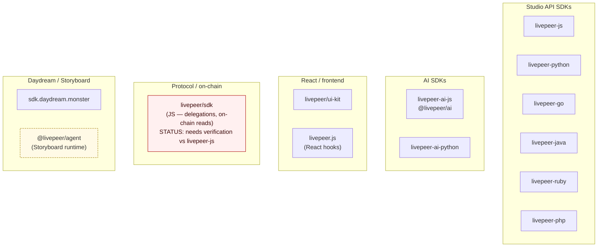

**Note on `livepeer/sdk`:** the protocol JS SDK exists but its active status relative to `livepeer-js` is unconfirmed. Verifiable by reading the README on each repo and checking last-commit dates.

---

### 2.3 Gateway layer

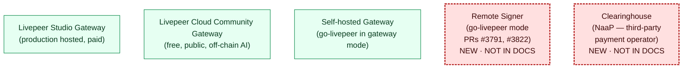

---

### 2.4 Protocol & node runtime

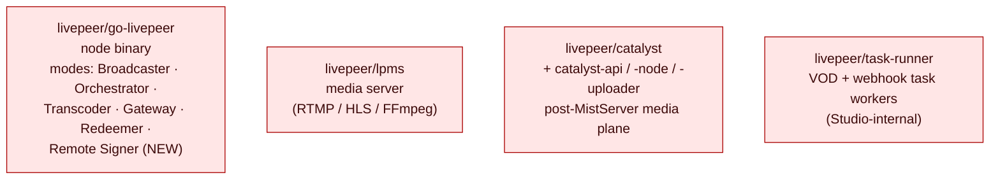

**`go-livepeer` mode list (verifiable in `cmd/livepeer/starter/starter.go`):** Broadcaster, Orchestrator, Transcoder, Gateway, Redeemer, plus the new Remote Signer mode added in PRs #3791/#3822.

---

### 2.5 AI runtime & pipelines

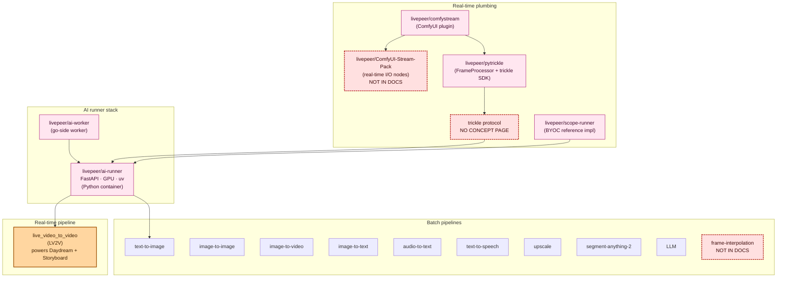

**Verifiable claim — pipeline count:** the `runner/src/runner/pipelines/` folder in `livepeer/ai-runner` lists 11 pipelines: audio-to-text, image-to-image, image-to-text, image-to-video, LLM, segment-anything-2, text-to-image, text-to-speech, upscale, frame-interpolation, and live_video_to_video. The Daydream API page implies 9. Storyboard claims 40+ models via BYOC. **These numbers do not reconcile.**

---

### 2.6 On-chain — Arbitrum One (Delta-era contracts)

Authoritative addresses from `Livepeer_Contract_Address_Verification__File_A_Is_Authoritative_and_File_B_Is_Unreliable.md` and cross-referenced against `docs.livepeer.org/references/contract-addresses` and Arbiscan.

```mermaid
flowchart TB
  Ctrl["Controller<br/>0xD8E8...606ee4"]:::chain

  subgraph staking["Staking + bonding"]
    BM["BondingManager (Proxy)<br/>0x35Bc...453e40"]:::chain
    BV["BondingVotes (Proxy)<br/>0x0B9C...8169A"]:::chain
    RM["RoundsManager (Proxy)<br/>0xdd6f...cc39f"]:::chain
  end

  subgraph payment["Payment"]
    TB["TicketBroker (Proxy)<br/>0xa8bB...e41B"]:::chain
  end

  subgraph token["Token"]
    LPT["LivepeerToken<br/>0x289b...A839"]:::chain
    Minter["Minter<br/>0xc20D...27252"]:::chain
  end

  subgraph governance["Governance + treasury"]
    Gov["Governor<br/>0xD9dE...736a6"]:::chain
    LGov["LivepeerGovernor (Proxy)<br/>0xcFE4...6aa0"]:::chain
    Treasury["Treasury<br/>0xf82C...8E8C4"]:::chain
  end

  subgraph registry["Registry"]
    SR["ServiceRegistry (Proxy)<br/>0xC92d...7431"]:::chain
    AISR["AIServiceRegistry (Target)<br/>0x04C0...34C5<br/>NOT IN DOCS"]:::missing
  end

  subgraph migration["L1 / L2 migration"]
    L2M["L2Migrator (Proxy)<br/>0x148D...2085"]:::chain
    L2GW["L2LPTGateway<br/>0x6D24...D318"]:::chain
  end

  Ctrl --> BM & BV & RM & TB & Minter & SR & AISR & L2M & L2GW & Gov & LGov & Treasury
  LPT --- Minter

  classDef chain fill:#f0e6ff,stroke:#6b00a0,color:#2a0a3d
  classDef missing fill:#ffe0e0,stroke:#a00,color:#3d0a0a,stroke-dasharray: 4 2,stroke-width:2px
```

---

### 2.7 On-chain — Ethereum L1

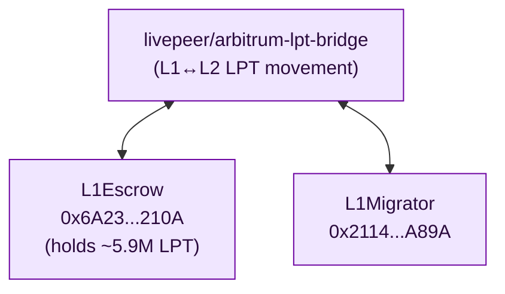

---

### 2.8 Observability & data

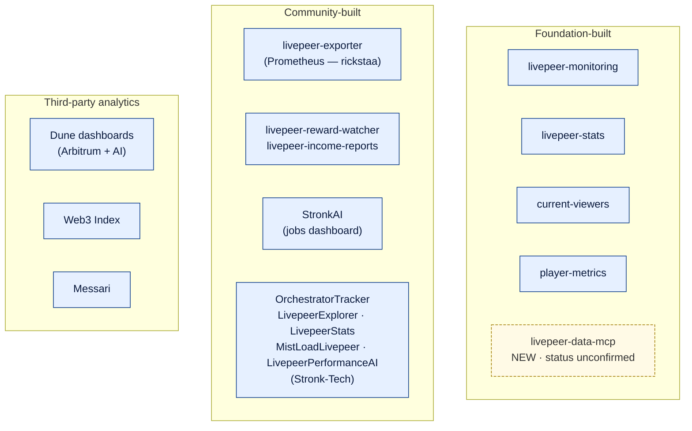

---

### 2.9 Governance, ops, community

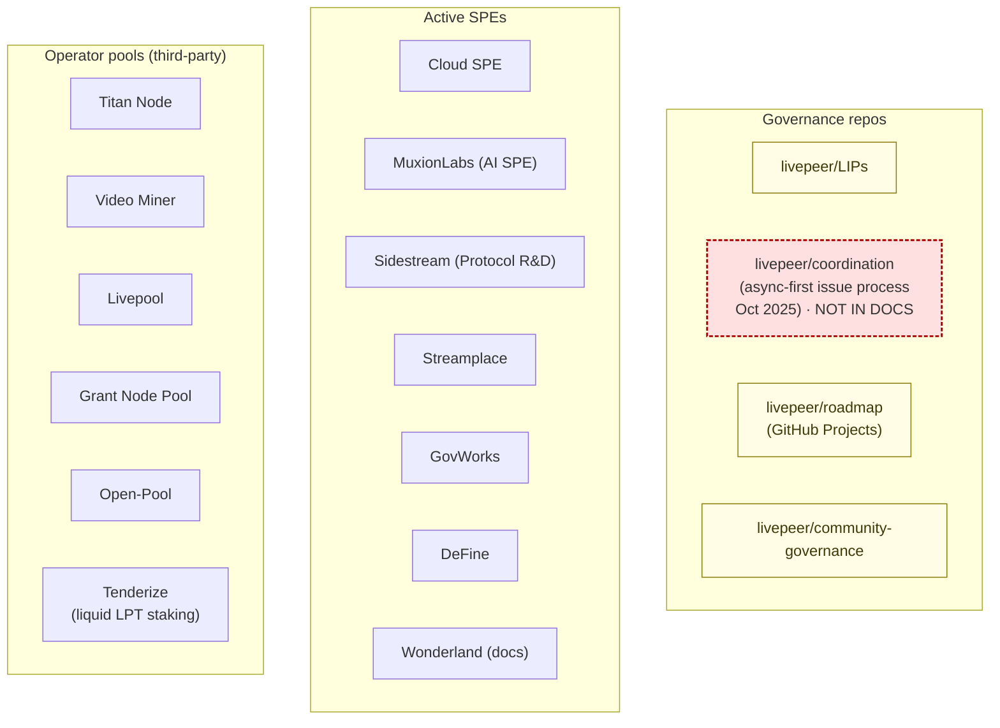

---

### 2.10 Documentation surface

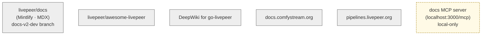

---

### 2.11 External infrastructure developers depend on

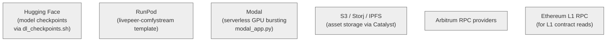

---

## Part 3 — What is missing

Three categories: missing personas, missing or under-documented infrastructure, missing connective tissue.

### 3.1 Missing personas (no docs surface)

**Persona E — SDK / Alt-Gateway Builder.** Most active cohort in `#local-gateways`. The remote signer architecture (PRs #3791, #3822) was designed specifically to enable them. Verifiable in `Remote_signers.md`: *"writing an implementation of a Livepeer gateway requires deep familiarity with the Livepeer probabilistic micropayments mechanism. Very few developers actually understand PM in enough detail to implement correctly, which is one reason that go-livepeer is the only extant gateway implementation."*

**Persona F — Agent-Runtime Developer.** Storyboard's `@livepeer/agent` runtime treats Livepeer as one of several swappable inference providers. Pre-canonical-docs persona but the cohort the Foundation's Storyboard investment implies.

### 3.2 Missing or under-documented infrastructure

Each item below is a component that exists, is referenced in canonical sources, and has no dedicated documentation surface.

| Component | Status | Verifiable in |
|-----------|--------|---------------|
| Trickle protocol | One-line mention in `oss-stack.mdx`. No concept page, no glossary entry. | Transport between every real-time AI workload and `ai-runner`. Source: `pytrickle` README, `ai-runner.md`. |
| `pytrickle` | Reference page exists but no concept-level treatment. The `FrameProcessor` interface equivalence with ComfyStream is buried. | `oss-stack.mdx`, `pytrickle` README. |
| `ai-worker` vs `ai-runner` distinction | Conflated. `ai-worker` is the go-side worker; `ai-runner` is the Python container. | Repo READMEs. |
| `lpms` | Listed in `oss-stack.mdx` once. No dedicated treatment. | Repo README. |
| Catalyst stack (catalyst-api, -node, -uploader) | Not in any concept page. | Repo READMEs, "Livepeer in 2026" report. |
| `task-runner` | Not in any concept page. | Repo README. |
| Remote Signer mode | Not in docs at all. | `Remote_signers.md`, PRs #3791, #3822. |
| Clearinghouse role | Defined in remote signer doc. Not in docs. | `Remote_signers.md`. |
| `livepeer/coordination` repo and async issue process | Material change to network coordination. Not in docs. | Repo README, "Livepeer in 2026" report. |
| `livepeer/scope-runner` | Reference for custom AI pipelines. Linked from one place. | `ai-runner.md`. |
| LV2V (`live_video_to_video.py`) as a pipeline | The biggest pipeline file. No dedicated treatment as a pipeline type. | `ai-runner` repo. |
| `AIServiceRegistry` contract | On-chain, in the verified contract list. Not mentioned. | Verified contract list. |
| `livepeer/sdk` (protocol JS SDK) | Distinct from Studio SDK. Not in Developer reference. **Active status itself unconfirmed** — verifiable by checking last-commit date on the repo. | Repo. |
| Frame-interpolation pipeline | In `ai-runner` source. Not documented. | `ai-runner/runner/src/runner/pipelines/`. |
| `ComfyUI-Stream-Pack` | 20-star repo. Not in any concept page. | Repo README. |
| `livepeer-data-mcp` | Not surfaced. **Production status unconfirmed** — verifiable by checking the repo. | Repo. |
| Java/Ruby/PHP SDKs | Listed in references but absent from `navigator.mdx`'s SDK column. A JVM/Rails/Laravel developer would conclude no support exists. | Speakeasy SDK output. |
| `room` namespace deprecation | Live video rooms cut from SDK. No migration guidance for affected developers. | "Livepeer in 2026" report. |

### 3.3 Missing connective tissue

These are missing relationships between things that exist.

**The graduation path is in prose, not visual.** Heroku → AWS → own DC analogy in `running-a-gateway.mdx` and the Network Vision blog. No diagram showing the four stages with infrastructure exposure at each. The persona routing diagrams in Part 1 are a candidate.

**Studio API key conflation.** `guides/ai/authentication.mdx` treats the Studio API key as the AI API key. The Livepeer Cloud Community Gateway is documented in `developer-stack.mdx` as an alternative. The two pages contradict each other implicitly.

**Off-chain vs on-chain gateway distinction.** `running-a-gateway.mdx` covers it. Nothing else does. Navigator says "On-chain / off-chain payment mode" without explanation.

**Persona ownership of repos.** `oss-stack.mdx` "Where to start contributing" maps repos to contribution intent. No equivalent for "which repos do I integrate against as Persona A vs Persona B2 vs Persona F."

**Operator pools, SPEs, third-party tooling absent from Developer view.** Stronk-Tech, livepeer-exporter, Dune dashboards. Treated as Operator concerns. They cross over for any production developer.

**Contract list not surfaced for developers.** Authoritative list in `v2/resources/references/contract-addresses.mdx`. No link from Developers concepts. A developer building on-chain integration has no path in.

**The pipeline count discrepancy.** `developer-stack.mdx` implies 9 pipelines. `navigator.mdx` lists 9 batch pipelines. `ai-runner` source has 11. Storyboard claims 40+ models. Three different answers to "what can Livepeer do?"

### 3.4 Implications for the IA restructure

Three components need to be named in the persona model and IA before any page is written:

- Trickle protocol (concept page).
- Remote Signer + Clearinghouse (concept page).
- `ai-worker` / `ai-runner` distinction (explicit in `oss-stack.mdx` and any architecture diagram).

Personas E and F need to be added to the persona model with documented entry surfaces, navigator paths, and concept pages — or explicitly subsumed under existing personas with documented reasoning. The current model under-serves both.

Once those are settled, the persona-routing diagrams in Part 1 become candidates for the developer-stack concept page, and the layered infrastructure diagrams in Part 2 become candidates for `oss-stack.mdx`.

---

## Items needing verification

Each is independently checkable against a named source.

- **`livepeer/sdk` active status** — read the README and check last-commit date.
- **`livepeer.js` vs `livepeer/ui-kit` overlap** — read both READMEs. Existing REVIEW flag in `oss-stack.mdx`.
- **`livepeer-data-mcp` and AI Compute MCP servers status** — read repo, check for production deployment indicators.
- **`AIServiceRegistry` usage** — check `cmd/livepeer/starter/starter.go` and AI subnet pages for whether it's referenced in production code paths or staged.
- **40+ models claim from Storyboard** — read Storyboard README and the BYOC orchestrator config for the actual model list.
- **`room` namespace migration** — check the SDK changelog.
- **Catalyst stack as primary media plane** — read `catalyst` repo README and check whether `lpms` is wrapped or replaced.
- **`task-runner` developer relevance** — check whether Studio webhooks docs reference it.

---

*End of document.*
