# What this needs to do

## identify risks

- identify downstream and upstream dependencies - what flow on effects does changing these scripts have?

## Decide on a framework architecture

- Consolidate and framework better
- some scripts need to trigger both AI canonical and then convert to mdx human readable docs.
- where do artefacts belong? in repo
- where do configs belong? in repo
- where do needed references belong? in repo
- where is the canonical source for this script
- are these in the script frontmatter?

## Decide on needed Dispatchers grouping concerns

- what dispatchers do we need?

Dispatchers needed: what dispatchers do we need? -> both reviewer & remediator dispatcher pipelines

**SCRATCHPAD ONLY **

- frontmatter (pages)
  - page taxonomy [needs: framework-canonical ]
  - SEO [needs improvement - should look term up on google and/or use glossary lists]
  - Naming - of page, + description & sidebar title [needs? some guide]
  - ??
- basic issues (better name?)
  - link checks / fixes [both internal & external - in components and imports?]
  - not rendering (mdx issue) or 404 [using pupeteer & mint tooling ? ]
  - correct component props [needs component-index lp and mintlify]
  - correct import paths [for components, composables etc]
- content issues basic
  - copy, naming, banned words, terminology?, voice.. ? [needs frameworks, derivation prompts / guides, banned words, examples]
  - spelling [uk english]
  - em-dashes
  - grammar [needs ? ]
  - basic formatting (headers, ) [needs template/framework of essentials + page taxonomy structure examples]
- information issues [usefulness, wrong information for voice used, wrong industry terms? clashes in frontmatter to information?]
  - eg. is quickstart not quick?
  - is a page being narrative not factual?
- information issues [varacity & staleness?]
  - source checking, -> especially on high factual need pages & references -> these should probably be automations
  - update checking pieplines
- page structure issues [journey? length..? ]
  - length too long for best practice - restyle or split.
  - all components, no prose?
  - all text no breakup of it?
- style & UX issues
  - component choice,
  - missing mandated items,
  - strayed from template,
  - mermaid styling and viewability
  - too many of the same component
- style & UX refinements
  - a level up one.

## How should we approach this?

- completely new scripts?
- audit & update old ones?

---

### For backlog

dispatchers

- frontmatter components, scripts, templates, data, other
- ***

---

# Script Pipeline Architecture Plan — v3

## Checks Pipeline: Requirements, Dispatcher Taxonomy, Canonical Sources

---

## Worktree

All work runs on a dedicated git worktree branched from `docs-v2-dev`. Nothing lands on `docs-v2-dev` until each dispatcher is approved.

```
git worktree add ../Docs-v2-dev-scripts-pipeline scripts/checks-pipeline
```

**Merge cadence:** After each dispatcher's implementation checkpoint is approved (`go` / `ok` / `proceed`), that dispatcher's scripts merge back to `docs-v2-dev` immediately. Each dispatcher merges independently — not all at once at the end. Step 9 (master pipeline) merges last.

---

## Context

154 scripts, no dispatcher, no shared output contract, multiple schema drifts. This plan maps what each dispatcher actually **needs to function** before designing implementation. The primary output is: a dispatcher architecture with concern × type separation, a requirements map per dispatcher, a canonical source inventory, and a list of missing files that must be created before scripts can work correctly.

---

## 1. Risk Identification

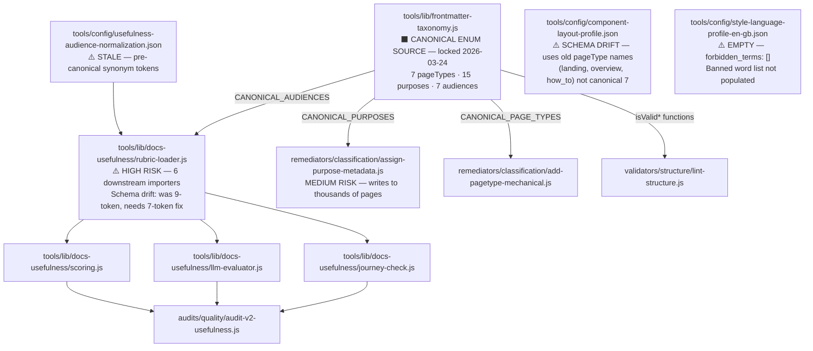

### Pre-flight required before touching rubric-loader.js

Run: `grep -r "audience:" v2/ | grep -vE "orchestrator|gateway|developer|delegator|builder|founder|community"` — confirm no deprecated tokens in live frontmatter before updating AUDIENCE_ENUM.

---

## 2. Dispatcher Taxonomy — Concern × Type

Every dispatcher operates on two axes:

**Concern** — what domain does it govern?
**Type** — what does it do when it finds an issue?

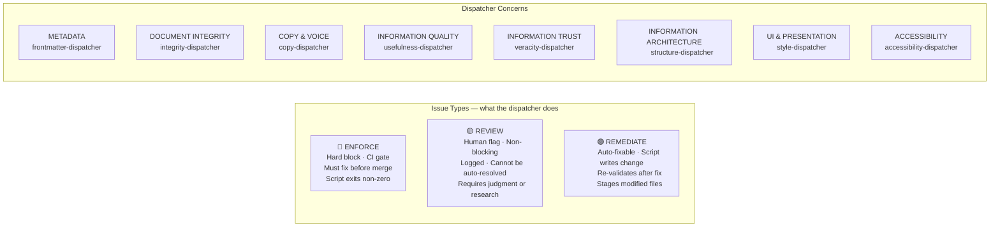

### Dispatcher matrix

| Dispatcher                 | Concern                  | Enforce examples                                           | Review examples                                                          | Remediate examples                                 |
| -------------------------- | ------------------------ | ---------------------------------------------------------- | ------------------------------------------------------------------------ | -------------------------------------------------- |
| `frontmatter-dispatcher`   | METADATA                 | Missing required field, invalid enum                       | SEO title quality                                                        | Migrate deprecated value, infer missing field      |
| `integrity-dispatcher`     | DOCUMENT INTEGRITY       | MDX parse error, 404, broken anchor                        | External link rot                                                        | Fix spelling, remove em-dashes                     |
| `copy-dispatcher`          | COPY & VOICE             | Banned word (CI mode), heading > 8 words, question heading | Voice register mismatch, undefined jargon                                | Replace banned construction, UK English correction |
| `usefulness-dispatcher`    | INFORMATION QUALITY      | (none — all advisory)                                      | Rubric score below threshold, wrong register, quickstart too long        | (none — requires human rewrite)                    |
| `veracity-dispatcher`      | INFORMATION TRUST        | REVIEW: flag in published content, veracityStatus conflict | Stale lastVerified, uncited claim                                        | (none — human-only)                                |
| `structure-dispatcher`     | INFORMATION ARCHITECTURE | File not in docs.json, dead-end page                       | Journey gap, page too long for pageType                                  | Sync docs.json paths                               |
| `style-dispatcher`         | UI & PRESENTATION        | Unapproved component used, required section missing        | Wrong component choice, template drift, mermaid non-compliant            | Repair component metadata                          |
| `accessibility-dispatcher` | ACCESSIBILITY            | Image missing alt text, empty link text                    | Generic link text ("here"), heading level skip, table without header row | Add alt="" to decorative images                    |

---

## 3. Requirements per Dispatcher

Each dispatcher's checks, the type of each check, and the **canonical source** that defines what "correct" means.

### 3.1 `frontmatter-dispatcher` — METADATA

| Check                                             | Type      | Canonical source                                               | Status                                      |
| ------------------------------------------------- | --------- | -------------------------------------------------------------- | ------------------------------------------- |
| All 10 required fields present                    | ENFORCE   | `tools/lib/frontmatter-taxonomy.js`                            | ✅ Exists                                   |
| pageType is a valid canonical value               | ENFORCE   | `tools/lib/frontmatter-taxonomy.js` (7 types)                  | ✅ Exists                                   |
| purpose is a valid canonical value                | ENFORCE   | `tools/lib/frontmatter-taxonomy.js` (15 values)                | ✅ Exists                                   |
| audience is a valid canonical value               | ENFORCE   | `tools/lib/frontmatter-taxonomy.js` (7 tokens)                 | ✅ Exists                                   |
| veracityStatus present when status=current        | ENFORCE   | `tools/lib/frontmatter-taxonomy.js`                            | ✅ Exists                                   |
| Deprecated pageType/purpose/audience value in use | REMEDIATE | `tools/lib/frontmatter-taxonomy.js` deprecated alias maps      | ✅ Exists                                   |
| pageType–purpose combination is allowed           | ENFORCE   | `tools/lib/frontmatter-taxonomy.js` PAGE_TYPE_ALLOWED_PURPOSES | ✅ Exists                                   |
| SEO title length and quality                      | REVIEW    | SEO rules file                                                 | ❌ MISSING                                  |
| SEO description present and not thin              | REVIEW    | SEO rules file                                                 | ❌ MISSING                                  |
| File/slug naming convention compliance            | ENFORCE   | v2/ naming conventions file                                    | ❌ MISSING (v2/ only; docs-guide has rules) |

**Remediator needs:** logic from `add-pagetype-mechanical.js` + `assign-purpose-metadata.js` (consolidated)

---

### 3.2 `integrity-dispatcher` — DOCUMENT INTEGRITY

| Check                           | Type      | Canonical source                                 | Status                                               |
| ------------------------------- | --------- | ------------------------------------------------ | ---------------------------------------------------- |
| MDX parses without error        | ENFORCE   | MDX parser (Mintlify rendering rules)            | ✅ `check-mdx-safe-markdown.js`                      |
| Internal links resolve (no 404) | ENFORCE   | `docs.json` routing                              | ✅ `check-anchor-usage.js` + `docs.json`             |
| Anchors resolve within page     | ENFORCE   | page heading manifest                            | ✅ `check-anchor-usage.js`                           |
| Snippet imports resolve         | ENFORCE   | file system                                      | ✅ `check-mdx-safe-markdown.js`                      |
| External links reachable        | REVIEW    | network (cannot auto-fix)                        | ✅ exists — needs type flag                          |
| TODO/TBD in published content   | ENFORCE   | pattern: `TODO\|TBD` in text                     | ✅ `lint-structure.js` (currently mixed in)          |
| Spelling errors                 | REMEDIATE | `tools/config/cspell.json` + UK dict             | ✅ `repair-spelling.js`                              |
| Em-dash in content              | REMEDIATE | `tools/config/style-language-profile-en-gb.json` | ⚠️ FILE EXISTS but `forbidden_terms: []` — **EMPTY** |
| Banned punctuation              | REMEDIATE | `tools/config/style-language-profile-en-gb.json` | ⚠️ Same — empty                                      |
| Grammar (UK English)            | REVIEW    | `check-grammar-en-gb.js`                         | ✅ exists — complex, not auto-fixable                |

**Critical blocker:** `style-language-profile-en-gb.json` has `forbidden_terms: []`. Banned terms/punctuation list must be populated from `checks.mdx` Cat 2 + CLAUDE.md before this dispatcher can enforce anything.

---

### 3.3 `copy-dispatcher` — COPY & VOICE

| Check                                                 | Type      | Canonical source                                                                            | Status                                            |
| ----------------------------------------------------- | --------- | ------------------------------------------------------------------------------------------- | ------------------------------------------------- |
| Banned words absent                                   | ENFORCE   | `checks.mdx` Cat 2 list + CLAUDE.md banned words section                                    | ⚠️ In prose only — not in machine-readable config |
| Banned constructions absent                           | REVIEW    | `checks.mdx` Cat 2 constructions table                                                      | ⚠️ In prose only                                  |
| Non-UK English spellings                              | REMEDIATE | `tools/config/style-language-profile-en-gb.json` + `cspell.json`                            | ⚠️ style profile empty                            |
| Heading length ≤ 8 words, ≥ 3 words                   | ENFORCE   | `checks.mdx` Cat 3 + CLAUDE.md heading rules                                                | ⚠️ In prose only                                  |
| Heading is not a question                             | ENFORCE   | `checks.mdx` Cat 3                                                                          | ⚠️ In prose only                                  |
| Heading not generic (Introduction, Overview, Summary) | REVIEW    | `checks.mdx` Cat 3 forbidden label list                                                     | ⚠️ In prose only                                  |
| Domain terms defined at first use                     | REVIEW    | `audits/content/data/discovered-terms.json` + `generators/content/data/glossary-terms.json` | ✅ Terms inventory exists                         |
| Voice register matches declared audience              | REVIEW    | `workspace/plan/active/CONTENT-WRITING/Prompts/voice-rules.md`                              | ✅ Exists (2/7 audiences fully specified)         |
| Prose restates table/diagram (delete)                 | REVIEW    | heading rules — pattern-based                                                               | needs pattern definition                          |
| Self-referential opener ("This page...")              | ENFORCE   | banned construction list                                                                    | ⚠️ In prose only                                  |

**Critical blocker:** Nearly all copy rules are defined in prose (`checks.mdx`, CLAUDE.md) and not in any machine-readable config. The `style-language-profile-en-gb.json` must be populated before this dispatcher can function.

---

### 3.4 `usefulness-dispatcher` — INFORMATION QUALITY

| Check                                                 | Type   | Canonical source                                                               | Status                                                        |
| ----------------------------------------------------- | ------ | ------------------------------------------------------------------------------ | ------------------------------------------------------------- |
| Rubric score ≥ threshold by pageType                  | REVIEW | `tools/config/usefulness-rubric.json` + `tools/lib/docs-usefulness/scoring.js` | ✅ Exists (but rubric uses old pageType names — schema drift) |
| Page length within bounds for pageType                | REVIEW | Length thresholds (embedded in `usefulness-rubric.json`)                       | ⚠️ Embedded, not standalone config                            |
| Quickstart ≤ max words (is it actually quick?)        | REVIEW | `usefulness-rubric.json` how_to tier thresholds                                | ⚠️ Old pageType names; how_to ≠ instruction                   |
| Page register matches declared purpose                | REVIEW | `usefulness-rubric.json` LLM tier 2 prompts                                    | ✅ Exists (requires LLM call)                                 |
| pageType fidelity (concept acts like a concept?)      | REVIEW | `usefulness-rubric.json` + LLM evaluation                                      | ✅ Exists (requires LLM call)                                 |
| Audience signal clear (reader knows this is for them) | REVIEW | `usefulness-rubric.json` tier 2                                                | ✅ Exists (LLM)                                               |

**Schema drift blocker:** `usefulness-rubric.json` uses old pageType names (`landing`, `overview`, `how_to`, `reference`, `tutorial`) not the canonical 7. Must be migrated before this dispatcher produces accurate scores.

**All items are REVIEW** — usefulness failures require human rewrite decisions. No auto-remediation.

---

### 3.5 `veracity-dispatcher` — INFORMATION TRUST

| Check                                               | Type    | Canonical source                                                     | Status                                      |
| --------------------------------------------------- | ------- | -------------------------------------------------------------------- | ------------------------------------------- |
| No `REVIEW:` flags in published content             | ENFORCE | pattern: `REVIEW:` in MDX text                                       | ✅ pattern known; needs dedicated validator |
| `veracityStatus: verified` but REVIEW flags present | ENFORCE | frontmatter field + text scan                                        | ⚠️ No script cross-checks both              |
| `lastVerified` not stale (≤ 365 days)               | REVIEW  | `accuracy-source-registry.json` (freshness thresholds: 365-730 days) | ✅ Config exists                            |
| Claims are citable to Tier A/B source               | REVIEW  | `accuracy-source-registry.json` + `accuracy-source-weights.json`     | ✅ Config exists                            |
| Source URLs still resolve                           | REVIEW  | network check                                                        | ✅ pattern known                            |
| No deprecated API references                        | REVIEW  | (needs API version registry — MISSING)                               | ❌ MISSING                                  |
| Numbers are real (not invented)                     | REVIEW  | Livepeer Explorer, Arbiscan (external links)                         | ✅ Pattern defined in CLAUDE.md             |

**All items are REVIEW or ENFORCE** — no auto-remediation possible; human research required.

---

### 3.6 `structure-dispatcher` — INFORMATION ARCHITECTURE

| Check                                     | Type      | Canonical source                                         | Status                                  |
| ----------------------------------------- | --------- | -------------------------------------------------------- | --------------------------------------- |
| File in v2/ exists in docs.json           | ENFORCE   | `docs.json`                                              | ✅ `check-docs-path-sync.js`            |
| File in docs.json exists on disk          | ENFORCE   | `docs.json` + filesystem                                 | ✅ `check-docs-path-sync.js`            |
| Dead-end page (no next/routing card)      | ENFORCE   | `docs.json` routing graph                                | ⚠️ No dead-end detector script          |
| Orphan page (not reachable from nav)      | ENFORCE   | `docs.json` routing graph                                | ⚠️ No orphan detector                   |
| Journey continuity (Phase N leads to N+1) | REVIEW    | `tab-map.mdx`                                            | ❌ tab-map.mdx DOES NOT EXIST — blocker |
| Page too long for pageType                | REVIEW    | Length thresholds (embedded in `usefulness-rubric.json`) | ⚠️ Not standalone; old pageType names   |
| File naming convention compliant          | ENFORCE   | v2/ naming conventions                                   | ❌ MISSING                              |
| Workspace file TTL expired                | REVIEW    | convention (workspace files > 90 days old)               | ⚠️ No config; convention only           |
| Docs.json path sync                       | REMEDIATE | `docs.json` + `sync-docs-paths.js`                       | ✅ Exists                               |

---

### 3.7 `style-dispatcher` — UI & PRESENTATION

| Check                                               | Type    | Canonical source                                                                                                               | Status                                                                 |
| --------------------------------------------------- | ------- | ------------------------------------------------------------------------------------------------------------------------------ | ---------------------------------------------------------------------- |
| Component is on approved list                       | ENFORCE | `docs-guide/config/component-registry.json` (117 LP components) + `docs-guide/contributing/mintlify.mdx` (Mintlify components) | ✅ Both exist                                                          |
| Component props are correct                         | REVIEW  | `docs-guide/config/component-registry.json` prop schema + Mintlify docs (external)                                             | ⚠️ LP registry exists; Mintlify props need local schema                |
| Required sections present for pageType              | ENFORCE | `tools/config/component-layout-profile.json`                                                                                   | ⚠️ EXISTS but uses old pageType names (landing, how_to) — SCHEMA DRIFT |
| Mandated template components present                | ENFORCE | `tools/config/component-layout-profile.json`                                                                                   | ⚠️ Same schema drift                                                   |
| Forbidden pattern absent (e.g., nested code blocks) | ENFORCE | `tools/config/component-layout-profile.json`                                                                                   | ⚠️ Same schema drift                                                   |
| Component choice appropriate for content            | REVIEW  | `v2/orchestrators/_workspace/canonical/Frameworks.mdx` template specs                                                          | ✅ Frameworks.mdx                                                      |
| Template drift (strayed from pageType template)     | REVIEW  | `Frameworks.mdx` + `component-layout-profile.json`                                                                             | ⚠️ Drift possible given schema mismatch                                |
| Mermaid block parses                                | ENFORCE | MDX parser                                                                                                                     | ✅ `check-mdx-safe-markdown.js`                                        |
| Mermaid styling compliant                           | REVIEW  | Mermaid rules config                                                                                                           | ❌ MISSING                                                             |
| Mermaid is viewable (not too dense)                 | REVIEW  | Mermaid rules config                                                                                                           | ❌ MISSING                                                             |
| Component icon is from approved icon-map            | ENFORCE | `snippets/data/reference-maps/icon-map.jsx` + `tools/config/icon-word-map.json`                                                | ⚠️ icon-map exists but only 78/365 icons mapped — must complete        |
| Icon choice matches semantic context of component   | REVIEW  | `tools/config/icon-word-map.json` keyword→icon mapping                                                                         | ❌ icon-word-map MISSING                                               |
| pageType default icon used correctly                | REVIEW  | `snippets/data/reference-maps/icon-map.jsx` pageType defaults table                                                            | ✅ Data exists                                                         |

**Schema drift blocker:** `component-layout-profile.json` maps to old pageType names. Must be migrated to canonical 7 before this dispatcher produces correct results.

---

### 3.8 `accessibility-dispatcher` — ACCESSIBILITY

| Check                                                               | Type      | Canonical source                                              | Status            |
| ------------------------------------------------------------------- | --------- | ------------------------------------------------------------- | ----------------- |
| Images have alt text (non-empty)                                    | ENFORCE   | `tools/config/wcag-rules.json` (WCAG 1.1.1 Success Criterion) | ❌ Config MISSING |
| Links have descriptive text (not "here", "click here", "read more") | ENFORCE   | `tools/config/wcag-rules.json` (WCAG 2.4.4)                   | ❌ Config MISSING |
| Heading levels do not skip (H2→H4 without H3)                       | ENFORCE   | `tools/config/wcag-rules.json` (WCAG 1.3.1)                   | ❌ Config MISSING |
| Tables have a header row                                            | ENFORCE   | `tools/config/wcag-rules.json` (WCAG 1.3.1)                   | ❌ Config MISSING |
| Decorative images have alt="" (empty, not absent)                   | REMEDIATE | `tools/config/wcag-rules.json` (WCAG 1.1.1)                   | ❌ Config MISSING |
| Link text is specific enough in context                             | REVIEW    | `tools/config/wcag-rules.json` generic-text list              | ❌ Config MISSING |
| Code blocks have language attribute                                 | REVIEW    | `tools/config/wcag-rules.json` (screen reader benefit)        | ❌ Config MISSING |
| No content flashes or auto-play media (component pattern)           | REVIEW    | `tools/config/wcag-rules.json` (WCAG 2.3.1)                   | ❌ Config MISSING |

**Critical blocker:** `tools/config/wcag-rules.json` does not exist. All WCAG rules are pattern-based (no external service needed for static MDX checks) but the ruleset must be co-designed before any scripts are built.

**All ENFORCE checks are static pattern scans** — no external accessibility service required. REMEDIATE scope is limited to mechanically fixable patterns (empty alt vs. absent alt; decorative image markers).

---

## 4. Canonical Sources — Full Location Map

| Requirement                                       | Canonical location                                                                                        | Status                                  |
| ------------------------------------------------- | --------------------------------------------------------------------------------------------------------- | --------------------------------------- |
| pageType, purpose, audience, veracityStatus enums | `tools/lib/frontmatter-taxonomy.js`                                                                       | ✅ Locked                               |
| Deprecated value alias maps                       | `tools/lib/frontmatter-taxonomy.js`                                                                       | ✅ Locked                               |
| pageType → allowed purposes                       | `tools/lib/frontmatter-taxonomy.js` PAGE_TYPE_ALLOWED_PURPOSES                                            | ✅ Locked                               |
| Taxonomy definitions (human-readable)             | `v2/orchestrators/_workspace/canonical/Frameworks.mdx`                                                    | ✅ Locked                               |
| Voice rules per audience                          | `workspace/plan/active/CONTENT-WRITING/Prompts/voice-rules.md`                                            | ✅ Exists (2/7 complete)                |
| UK English style rules                            | `tools/config/style-language-profile-en-gb.json`                                                          | ⚠️ Exists, `forbidden_terms: []` EMPTY  |
| Spelling dictionary                               | `tools/config/cspell.json`                                                                                | ✅ Exists                               |
| Banned words / constructions                      | `checks.mdx` Cat 2 + `.claude/CLAUDE.md`                                                                  | ⚠️ Prose only — not machine-readable    |
| Heading rules                                     | `checks.mdx` Cat 3 + `.claude/CLAUDE.md`                                                                  | ⚠️ Prose only                           |
| Domain terminology                                | `audits/content/data/discovered-terms.json` (5,689 terms) + `generators/content/data/glossary-terms.json` | ✅ Exists                               |
| Usefulness rubric + scoring                       | `tools/config/usefulness-rubric.json` + `tools/lib/docs-usefulness/scoring.js`                            | ⚠️ Exists, uses old pageType names      |
| Usefulness journeys                               | `tools/config/usefulness-journeys.json`                                                                   | ✅ Exists                               |
| LLM evaluation tiers                              | `tools/config/usefulness-llm-tiers.json`                                                                  | ✅ Exists                               |
| Audience normalization synonyms                   | `tools/config/usefulness-audience-normalization.json`                                                     | ⚠️ Stale pre-canonical tokens           |
| Accuracy source tiers and weights                 | `tools/config/accuracy-source-registry.json` + `tools/config/accuracy-source-weights.json`                | ✅ Exists                               |
| Component list (Livepeer)                         | `docs-guide/config/component-registry.json` (117 components)                                              | ✅ Auto-generated                       |
| Component list (Mintlify)                         | `docs-guide/contributing/mintlify.mdx` (reference guide)                                                  | ✅ Exists (prose, not schema)           |
| Component props (Mintlify)                        | (external Mintlify docs)                                                                                  | ❌ No local schema                      |
| Component layout by pageType                      | `tools/config/component-layout-profile.json`                                                              | ⚠️ Exists, old pageType names           |
| Routing and navigation                            | `docs.json`                                                                                               | ✅ Source of truth                      |
| Tab journey mappings                              | `v2/orchestrators/_workspace/canonical/tab-map.mdx`                                                       | ❌ DOES NOT EXIST                       |
| Page length thresholds                            | Embedded in `usefulness-rubric.json`                                                                      | ⚠️ Embedded, not standalone             |
| File/slug naming conventions                      | `docs-guide/policies/docs-guide-structure-policy.mdx` (docs-guide only)                                   | ⚠️ Partial — v2/ pages not covered      |
| Mermaid styling rules                             | —                                                                                                         | ❌ MISSING                              |
| WCAG accessibility rules                          | `tools/config/wcag-rules.json`                                                                            | ❌ MISSING                              |
| Icon semantic map (all icons)                     | `snippets/data/reference-maps/icon-map.jsx`                                                               | ⚠️ Exists but incomplete (78/365 icons) |
| Icon word→concept map                             | `tools/config/icon-word-map.json`                                                                         | ❌ MISSING                              |
| SEO rules                                         | —                                                                                                         | ❌ MISSING                              |
| API version registry                              | —                                                                                                         | ❌ MISSING                              |
| Script registry / metadata                        | `tools/config/script-registry.json`                                                                       | ✅ Exists                               |
| Shared report output library                      | —                                                                                                         | ❌ MISSING (`pipeline-report.js`)       |

---

## 5. Missing Canonical Files — Must Create Before Scripts Work

These are blockers. Dispatchers depending on them will produce incorrect or incomplete results until they exist.

| Missing file                                                    | Blocks                                           | Priority | Notes                                                                                                                                                        |
| --------------------------------------------------------------- | ------------------------------------------------ | -------- | ------------------------------------------------------------------------------------------------------------------------------------------------------------ |
| `tools/config/style-language-profile-en-gb.json` population     | `integrity-dispatcher`, `copy-dispatcher`        | **P0**   | File exists but `forbidden_terms: []` — populate from `checks.mdx` Cat 2 + CLAUDE.md banned words list                                                       |
| `tools/config/component-layout-profile.json` pageType migration | `style-dispatcher`                               | **P0**   | File exists; migrate old names (`landing→navigation`, `overview→concept`, `how_to→instruction`, etc.) to canonical 7                                         |
| `tools/config/usefulness-rubric.json` pageType migration        | `usefulness-dispatcher`                          | **P1**   | File exists; same old→new pageType name migration                                                                                                            |
| `tools/config/content-rules.json` (new)                         | `copy-dispatcher`, `integrity-dispatcher`        | **P1**   | Extract banned words, banned constructions, heading rules from `checks.mdx` + CLAUDE.md into machine-readable JSON                                           |
| `tools/config/page-length-thresholds.json` (new)                | `structure-dispatcher`, `usefulness-dispatcher`  | **P1**   | Extract length thresholds from `usefulness-rubric.json` (word count min/max per pageType) into standalone config                                             |
| `tools/config/slug-naming-conventions.json` (new)               | `frontmatter-dispatcher`, `structure-dispatcher` | **P1**   | Define slug/filename rules for v2/ pages (currently only docs-guide rules exist)                                                                             |
| `tools/config/mintlify-component-schema.json` (new)             | `style-dispatcher`                               | **P2**   | Local schema of Mintlify component props — derived from `docs-guide/contributing/mintlify.mdx` + Mintlify docs                                               |
| `tools/config/mermaid-style-rules.json` (new)                   | `style-dispatcher`                               | **P2**   | Mermaid viewability rules: max nodes, required theme, colour source                                                                                          |
| `tools/config/wcag-rules.json` (new)                            | `accessibility-dispatcher`                       | **P2**   | WCAG success criteria mapped to static MDX checks: alt text, link text, heading levels, table headers, generic text list                                     |
| `tools/config/icon-word-map.json` (new)                         | `style-dispatcher`                               | **P2**   | Keyword→icon mapping for consistent icon use; derived from `snippets/data/reference-maps/icon-map.jsx` (currently 78/365 icons mapped — must complete first) |
| `tools/config/seo-rules.json` (new)                             | `frontmatter-dispatcher`                         | **P3**   | SEO rules for docs pages: title length, description quality; SEO external lookup is backlog                                                                  |
| `v2/orchestrators/_workspace/canonical/tab-map.mdx`             | `structure-dispatcher`                           | **P1**   | Journey mapping — Phase 4 pipeline blocker; human must create                                                                                                |
| `tools/lib/pipeline-report.js` (new)                            | All dispatchers                                  | **P0**   | Shared output library — normalise all issue JSON to `{file, dispatcher, cat, type, severity, check_id, message}`                                             |

---

## 6. Dispatcher Architecture

```mermaid
flowchart TB
    subgraph MASTER["content-pipeline.js — Master Dispatcher"]
        MODE["--mode: check | dry-run | fix"]
        SCOPE["--scope: file | tab | staged | full"]
        FORMAT["--format: json | mdx | both"]
    end

    MASTER --> T1

    subgraph T1["Tier 1 — ENFORCE (structural blockers)"]
        D1["frontmatter-dispatcher.js
        concern: METADATA
        enforce: missing fields, invalid enums
        remediate: deprecated values, infer missing"]
        D2["integrity-dispatcher.js
        concern: DOCUMENT INTEGRITY
        enforce: MDX parse, 404, broken anchors
        remediate: spelling, em-dashes"]
        D6A["structure-dispatcher.js (nav checks only)
        concern: IA
        enforce: file not in docs.json, dead-ends"]
    end

    T1 -->|"ALL PASS"| T2
    T1 -->|"ANY ENFORCE FAIL"| HALT["❌ HALT + report
    Fix structural issues before content review"]

    subgraph T2["Tier 2 — REVIEW + REMEDIATE (quality flags)"]
        D3["copy-dispatcher.js
        concern: COPY & VOICE
        enforce: banned words (CI), question headings
        review: voice register, jargon, constructions
        remediate: UK English, heading fixes"]
        D7["style-dispatcher.js
        concern: UI & PRESENTATION
        enforce: unapproved component, missing required section, bad icon
        review: component props, template drift, mermaid, icon semantic match
        remediate: component metadata repair, decorative alt="""]
        D8["accessibility-dispatcher.js
        concern: ACCESSIBILITY
        enforce: missing alt text, empty link text, heading skip, no table header
        review: generic link text, unlabelled code blocks
        remediate: add alt='' to decorative images"]
        D6B["structure-dispatcher.js (journey checks)
        concern: IA
        review: journey gaps, page length
        remediate: docs.json sync"]
    end

    T2 --> T3

    subgraph T3["Tier 3 — REVIEW only (information quality + trust)"]
        D4["usefulness-dispatcher.js
        concern: INFORMATION QUALITY
        review: rubric score, register, pageType fidelity
        remediate: none"]
        D5["veracity-dispatcher.js
        concern: INFORMATION TRUST
        enforce: REVIEW flags in published content
        review: stale sources, uncited claims
        remediate: none"]
    end

    T3 --> OUT

    subgraph OUT["Output — both always generated"]
        JSON["workspace/reports/content-pipeline/report.json
        {file, dispatcher, cat, type, severity, check_id, message}"]
        MDX["workspace/reports/content-pipeline/report.mdx
        Human-readable — grouped by dispatcher + page"]
    end
```

### Each dispatcher follows the same pattern internally

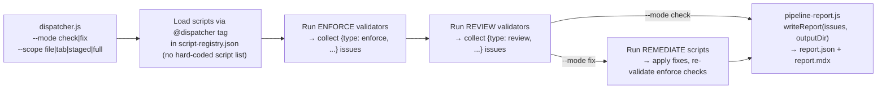

---

## 7. Framework Architecture

### Artefact and config locations

| What                                | Location                                            | Rule                                                                      |
| ----------------------------------- | --------------------------------------------------- | ------------------------------------------------------------------------- |
| Generated reports (JSON + MDX)      | `workspace/reports/<dispatcher-name>/`              | One directory per dispatcher; both formats always written                 |
| Canonical enum configs              | `tools/config/`                                     | All machine-readable rules live here; prose definitions in canonical .mdx |
| Dispatcher scripts                  | `operations/scripts/dispatch/content/`              | Alongside existing `dispatch/governance/`                                 |
| Validator scripts                   | `operations/scripts/validators/content/<concern>/`  | Existing pattern; concern-based subdirectory                              |
| Remediator scripts                  | `operations/scripts/remediators/content/<concern>/` | Existing pattern                                                          |
| Content framework references        | `v2/orchestrators/_workspace/canonical/`            | Content artefacts — not code                                              |
| Script canonical source declaration | JSDoc `@dispatcher` + `@canonical` tags             | Machine-discoverable via `script-registry.json`                           |

### Dual output pattern

Every dispatcher always writes two formats:

1. `report.json` — structured, consumed by CI, AI agents, aggregators
2. `report.mdx` — human-readable, consumed by Alison, review sessions, Mintlify preview

No script should emit only `console.log`. All must call `pipeline-report.js writeReport()`.

---

## 8. New Scripts — Full Inventory

All files below are **new**. No existing scripts are modified. Existing scripts continue to operate unchanged in parallel.

Each script shows: **Staging path** (written first, in `workspace/scripts-pipeline/`) → **Final path** (moved here at checkpoint approval, registered in `script-registry.json`).

### Shared infrastructure (Step 1)

Configs go directly to `tools/config/` (no staging needed — they are data, not scripts). The shared library goes to `tools/lib/`.

| New file                                      | Type    | Purpose                                                                                                            |
| --------------------------------------------- | ------- | ------------------------------------------------------------------------------------------------------------------ |
| `tools/lib/pipeline-report.js`                | Library | `normaliseIssue()`, `writeReport(issues, dir)` — shared output contract; writes `report.json` + `report.mdx`       |
| `tools/config/content-rules.json`             | Config  | Machine-readable banned words, banned constructions, heading rules — sourced from `checks.mdx` Cat 2-3 + CLAUDE.md |
| `tools/config/page-length-thresholds.json`    | Config  | Word count min/max per canonical pageType (sourced from `usefulness-rubric.json` existing values)                  |
| `tools/config/slug-naming-conventions.json`   | Config  | v2/ filename and slug rules — new; docs-guide rules already exist in `docs-guide-structure-policy.mdx`             |
| `tools/config/mintlify-component-schema.json` | Config  | Mintlify component prop schema — derived from `docs-guide/contributing/mintlify.mdx`                               |
| `tools/config/mermaid-style-rules.json`       | Config  | Mermaid viewability rules: max nodes, required theme, colour source                                                |

Build order reflects dependency solidity (most complete canonical sources first). Staging path → Final path shown for each script.

### Dispatcher 1 — `frontmatter-dispatcher` (Step 2)

Staging: `workspace/scripts-pipeline/` → Final: `operations/scripts/<type>/content/<niche>/`

| Script                                              | @type      | @niche         | Issue type       | What it does                                                                                               |
| --------------------------------------------------- | ---------- | -------------- | ---------------- | ---------------------------------------------------------------------------------------------------------- |
| `validate-frontmatter.js`                           | validator  | structure      | ENFORCE + REVIEW | All 10 required fields, canonical enums, veracityStatus consistency, pageType–purpose allowed combinations |
| `check-purpose-rubric-sync.js`                      | validator  | structure      | ENFORCE          | All 15 `CANONICAL_PURPOSES` have a `purposeToRubricPurpose()` mapping — fails loudly on gaps               |
| `repair-frontmatter-taxonomy.js`                    | remediator | classification | REMEDIATE        | Migrates deprecated values to canonical; infers and adds missing fields                                    |
| `frontmatter-dispatcher.js`                         | dispatch   | content        | Dispatcher       | check/dry-run/fix modes; reports to `workspace/reports/frontmatter/`                                       |
| `docs-guide/dispatchers/_template-dispatcher.mdx`   | —          | —              | —                | **Documentation template** (Sub-task 2a — agreed before any scripts built; all subsequent docs follow it)  |
| `docs-guide/dispatchers/frontmatter-dispatcher.mdx` | —          | —              | —                | First usage doc built from agreed template                                                                 |

### Dispatcher 2 — `veracity-dispatcher` (Step 3)

Staging: `workspace/scripts-pipeline/` → Final: `operations/scripts/<type>/content/veracity/`

| Script                                           | @type     | @niche   | Issue type       | What it does                                                                                                                                                 |
| ------------------------------------------------ | --------- | -------- | ---------------- | ------------------------------------------------------------------------------------------------------------------------------------------------------------ |
| `validate-veracity-status.js`                    | validator | veracity | ENFORCE + REVIEW | ENFORCE: `REVIEW:` flags in published content; `veracityStatus: verified` + REVIEW flags conflict. REVIEW: `veracityStatus: unverified` on `status: current` |
| `validate-source-freshness.js`                   | validator | veracity | REVIEW           | `lastVerified` vs. `accuracy-source-registry.json` thresholds (365-730 days)                                                                                 |
| `veracity-dispatcher.js`                         | dispatch  | content  | Dispatcher       | Check only — no remediation; reports to `workspace/reports/veracity/`                                                                                        |
| `docs-guide/dispatchers/veracity-dispatcher.mdx` | —         | —        | —                | Usage documentation                                                                                                                                          |

### Dispatcher 3 — `structure-dispatcher` (Step 4)

Staging: `workspace/scripts-pipeline/` → Final: `operations/scripts/<type>/content/structure/` and `remediators/content/repair/`

| Script                                            | @type      | @niche    | Issue type | What it does                                                                             |
| ------------------------------------------------- | ---------- | --------- | ---------- | ---------------------------------------------------------------------------------------- |
| `validate-nav-integrity.js`                       | validator  | structure | ENFORCE    | docs.json ↔ filesystem sync; orphan files; ghost nav entries; dead-end pages             |
| `validate-nav-journeys.js`                        | validator  | structure | REVIEW     | Journey continuity (degrades gracefully without tab-map.mdx); page length vs. thresholds |
| `repair-nav-paths.js`                             | remediator | repair    | REMEDIATE  | Syncs docs.json path entries where filename exists but path reference is wrong           |
| `structure-dispatcher.js`                         | dispatch   | content   | Dispatcher | Tier 1 (nav integrity) + Tier 2 (journey); reports to `workspace/reports/structure/`     |
| `docs-guide/dispatchers/structure-dispatcher.mdx` | —          | —         | —          | Usage documentation                                                                      |

### Dispatcher 4 — `integrity-dispatcher` (Step 5)

Requires Design Checkpoint 5a first (`style-language-profile-en-gb.json` population).
Staging: `workspace/scripts-pipeline/` → Final: `operations/scripts/<type>/content/` (new `integrity` niche)

| Script                                            | @type      | @niche    | Issue type       | What it does                                                                              |
| ------------------------------------------------- | ---------- | --------- | ---------------- | ----------------------------------------------------------------------------------------- |
| `validate-mdx-integrity.js`                       | validator  | structure | ENFORCE          | MDX parse errors, snippet imports, TODO/TBD in published content                          |
| `validate-links.js`                               | validator  | structure | ENFORCE + REVIEW | Internal links (ENFORCE); anchors (ENFORCE); external links (REVIEW)                      |
| `repair-common-patterns.js`                       | remediator | repair    | REMEDIATE        | Em-dashes → hyphen; spelling via cspell; uses `content-rules.json` for banned punctuation |
| `integrity-dispatcher.js`                         | dispatch   | content   | Dispatcher       | Tier 1 — blocks on MDX/404; reports to `workspace/reports/integrity/`                     |
| `docs-guide/dispatchers/integrity-dispatcher.mdx` | —          | —         | —                | Usage documentation                                                                       |

### Dispatcher 5 — `usefulness-dispatcher` (Step 6)

Requires Design Checkpoint 6a first (`usefulness-rubric.json` pageType mapping decisions).
Staging: `workspace/scripts-pipeline/` → Final: `operations/scripts/<type>/content/quality/`

| Script                                             | @type     | @niche  | Issue type | What it does                                                                           |
| -------------------------------------------------- | --------- | ------- | ---------- | -------------------------------------------------------------------------------------- |
| `validate-page-usefulness.js`                      | validator | quality | REVIEW     | Rubric scoring (reads existing `scoring.js` output); register check; pageType fidelity |
| `validate-page-length.js`                          | validator | quality | REVIEW     | Word count vs. `page-length-thresholds.json`; too-long (split) and too-short (thin)    |
| `usefulness-dispatcher.js`                         | dispatch  | content | Dispatcher | Check only — no remediation; Tier 3; reports to `workspace/reports/usefulness/`        |
| `docs-guide/dispatchers/usefulness-dispatcher.mdx` | —         | —       | —          | Usage documentation                                                                    |

### Dispatcher 6 — `copy-dispatcher` (Step 7)

Requires Design Checkpoint 7a first (`content-rules.json` full co-design).
Staging: `workspace/scripts-pipeline/` → Final: `operations/scripts/<type>/content/copy/`

| Script                                       | @type      | @niche  | Issue type       | What it does                                                                                                          |
| -------------------------------------------- | ---------- | ------- | ---------------- | --------------------------------------------------------------------------------------------------------------------- |
| `validate-voice-copy.js`                     | validator  | copy    | ENFORCE + REVIEW | Banned words (ENFORCE in CI), banned constructions (REVIEW), self-referential openers — all from `content-rules.json` |
| `validate-headings.js`                       | validator  | copy    | ENFORCE + REVIEW | 3-6 word rule, no questions, no generic labels, domain-anchor rule — from `content-rules.json`                        |
| `repair-copy-patterns.js`                    | remediator | style   | REMEDIATE        | UK English corrections (cspell); pattern-replaceable banned constructions                                             |
| `copy-dispatcher.js`                         | dispatch   | content | Dispatcher       | Tier 2; reports to `workspace/reports/copy/`                                                                          |
| `docs-guide/dispatchers/copy-dispatcher.mdx` | —          | —       | —                | Usage documentation                                                                                                   |

### Dispatcher 7 — `style-dispatcher` (Step 8)

Requires Design Checkpoints 8a + 8b + 8c first (`component-layout-profile.json` mapping, `mintlify-component-schema.json`, and `icon-word-map.json` co-design including completing the icon-map to full coverage).
Staging: `workspace/scripts-pipeline/` → Final: `operations/scripts/<type>/content/style/` (new niche)

| Script                                        | @type      | @niche  | Issue type       | What it does                                                                                                                                                                   |
| --------------------------------------------- | ---------- | ------- | ---------------- | ------------------------------------------------------------------------------------------------------------------------------------------------------------------------------ |
| `validate-components.js`                      | validator  | style   | ENFORCE + REVIEW | Approved component list (`component-registry.json` + `mintlify-component-schema.json`); props correctness                                                                      |
| `validate-template-compliance.js`             | validator  | style   | ENFORCE + REVIEW | Required sections + mandated items per pageType; template drift                                                                                                                |
| `validate-mermaid.js`                         | validator  | style   | ENFORCE + REVIEW | MDX parse (ENFORCE); theme + viewability vs. `mermaid-style-rules.json` (REVIEW)                                                                                               |
| `validate-icon-usage.js`                      | validator  | style   | ENFORCE + REVIEW | Icon in approved icon-map (ENFORCE); semantic keyword→icon match via `icon-word-map.json` (REVIEW); wraps output of existing `audit-icon-usage.js` into pipeline report format |
| `repair-component-metadata.js`                | remediator | library | REMEDIATE        | Component display names, import path corrections                                                                                                                               |
| `style-dispatcher.js`                         | dispatch   | content | Dispatcher       | Tier 2; reports to `workspace/reports/style/`                                                                                                                                  |
| `docs-guide/dispatchers/style-dispatcher.mdx` | —          | —       | —                | Usage documentation                                                                                                                                                            |

### Dispatcher 8 — `accessibility-dispatcher` (Step 9)

Requires Design Checkpoint 9a first (`wcag-rules.json` — which WCAG success criteria to enforce vs. review in static MDX context).
Staging: `workspace/scripts-pipeline/` → Final: `operations/scripts/<type>/content/accessibility/` (new niche)

| Script                                                | @type      | @niche        | Issue type       | What it does                                                                                                                                                                                                                            |
| ----------------------------------------------------- | ---------- | ------------- | ---------------- | --------------------------------------------------------------------------------------------------------------------------------------------------------------------------------------------------------------------------------------- |
| `validate-wcag-static.js`                             | validator  | accessibility | ENFORCE + REVIEW | Images without alt (ENFORCE); empty link text (ENFORCE); heading level skips (ENFORCE); tables without header row (ENFORCE); generic link text "here/click here" (REVIEW); unlabelled code blocks (REVIEW) — all from `wcag-rules.json` |
| `repair-accessibility-patterns.js`                    | remediator | accessibility | REMEDIATE        | Adds `alt=""` to decorative images (images with no descriptive context); pattern-safe only                                                                                                                                              |
| `accessibility-dispatcher.js`                         | dispatch   | content       | Dispatcher       | Tier 2; reports to `workspace/reports/accessibility/`                                                                                                                                                                                   |
| `docs-guide/dispatchers/accessibility-dispatcher.mdx` | —          | —             | —                | Usage documentation                                                                                                                                                                                                                     |

### Master dispatcher (Step 10)

| Script                                        | @type    | @niche  | What it does                                                                                            |
| --------------------------------------------- | -------- | ------- | ------------------------------------------------------------------------------------------------------- |
| `content-pipeline.js`                         | dispatch | content | Runs all 8 in tier order; aggregates to `workspace/reports/content-pipeline/report.json` + `report.mdx` |
| `docs-guide/dispatchers/content-pipeline.mdx` | —        | —       | Master usage doc — references all 8 dispatcher docs                                                     |

### Backlog (not in this build)

| Item                           | Notes                                                                                      |
| ------------------------------ | ------------------------------------------------------------------------------------------ |
| SEO external lookup (Google)   | `frontmatter-dispatcher` v2 — requires Search Console or Suggest API                       |
| API version registry           | `veracity-dispatcher` — tracks deprecated API versions                                     |
| `repo-artefacts-dispatcher.js` | Governs components, scripts, templates, data files — separate concern                      |
| `process-pipeline.js`          | Tracks my-process.mdx production phases 1–9 per tab — separate concern from quality checks |

---

## 9. Implementation Approach

### All new scripts — no modifications to existing code

Every file created in this build is a **new script**. Existing scripts (`lint-structure.js`, `rubric-loader.js`, etc.) are not touched. The new dispatcher architecture runs alongside the existing scripts independently. This preserves existing behaviour, allows the new pipeline to be validated in isolation, and avoids downstream regressions during development.

Config files (`style-language-profile-en-gb.json`, `component-layout-profile.json`, etc.) are also not modified. New parallel configs are created alongside existing ones.

### Temporary staging folder

New scripts are written to a staging area first — **not** directly into `operations/scripts/`. This keeps them isolated during development and makes the checkpoint review clean.

**Staging location:** `workspace/scripts-pipeline/<type>/<concern>/`

At each dispatcher's implementation checkpoint, approved scripts move from staging to their final `operations/scripts/<type>/<concern>/<niche>/` location and are registered in `tools/config/script-registry.json`.

### SCRIPT-GOVERNANCE framework — all scripts must follow

Every new script follows the standards in `workspace/plan/active/SCRIPT-GOVERNANCE/script-framework.md`:

**File path:** `<type>/<concern>/<niche>/script-name.js`
Valid types: `audit`, `generator`, `validator`, `remediator`, `dispatch`, `automation`
Valid concerns: `content`, `components`, `governance`, `ai`

**JSDoc header — 11 required tags (in order):**

```js
/**
 * @script      script-name
 * @type        validator
 * @concern     content
 * @niche       structure
 * @purpose     qa:content-quality
 * @description One-line description, no line breaks.
 * @mode        read-only
 * @pipeline    trigger → inputs → outputs [→ dependants]
 * @scope       staged, v2-content
 * @usage       node operations/scripts/validators/content/structure/script-name.js [flags]
 * @policy      (requirement IDs or empty)
 */
```

**Scaffold tool:** `node operations/scripts/generators/governance/scaffold/new-script.js --path <path>` — generates the JSDoc stub. Run this first, then fill in the tags.

**Registry:** Every script gets an entry in `tools/config/script-registry.json` with all 12 fields (path, name, type, concern, niche, purpose, description, mode, pipeline, scope, usage, policy, status).

### Script-level check-in protocol

**Before each individual script is written**, present in chat:

1. Script name and final destination path (in staging and in production)
2. What it does — plain English, no jargon
3. Inputs: what flags it accepts, what files it reads, what configs it requires
4. Outputs: JSON schema shape + MDX report summary format
5. What canonical sources it reads from and what decisions are embedded in its logic
6. The `@pipeline` arrow-notation string for the JSDoc

**Wait for explicit approval before writing the script.**

This is separate from the dispatcher-level checkpoint. Every script within a dispatcher gets its own check-in.

### Checkpoint protocol — two types

#### Design checkpoint (before building, co-design with Alison)

When a script depends on a config that requires editorial decisions — what rules go in it, how content is categorised — a design checkpoint runs first:

1. **PRESENT** in chat: draft config contents, what each rule enforces, alternatives considered
2. **WAIT** for Alison's input — rules may be added, removed, or modified
3. **CONFIRM** final version in chat before it is written to the file
4. **WRITE** config only after explicit approval

Design checkpoints occur before: `content-rules.json`, `slug-naming-conventions.json`, `mermaid-style-rules.json`, `mintlify-component-schema.json`, `page-length-thresholds.json`, and all pageType migration decisions (`component-layout-profile.json` mapping, `usefulness-rubric.json` mapping).

#### Implementation checkpoint (after each dispatcher is built)

After each dispatcher is complete and tested:

1. **STOP** — no further code is written
2. **TEST** — run `node operations/tests/run-all.js` in the worktree + run the dispatcher against a sample file (specified in the checkpoint)
3. **REPORT IN CHAT** — full details presented:
   - Every new file created (path + one-sentence purpose)
   - Every config created (path + what it defines)
   - What each check does (enforce / review / remediate), what it needs to run, and sample output
   - Any issues or anomalies found during testing
4. **WAIT** — no work proceeds until explicit human approval (`go`, `ok`, `proceed`)

---

## 10. Implementation Order

### Step 0 — Worktree setup

Create worktree on new branch `scripts/checks-pipeline`.

### Step 1 — Shared infrastructure (no dispatcher yet)

**→ DESIGN CHECKPOINT 1a: Content rules co-design**
Present draft `content-rules.json` (banned words, banned constructions, heading rules — sourced from `checks.mdx` + CLAUDE.md). Alison reviews, adds, removes, or modifies rules. Approved version written only after sign-off.

**→ DESIGN CHECKPOINT 1b: Page structure rules co-design**
Present draft `page-length-thresholds.json` (min/max word counts per canonical pageType), `slug-naming-conventions.json` (v2/ filename rules), and `mermaid-style-rules.json`. Same design-then-approve flow.

**→ DESIGN CHECKPOINT 1c: Component schema co-design**
Present draft `mintlify-component-schema.json` (props per Mintlify component, derived from `mintlify.mdx`). Review for completeness and correctness.

**→ DESIGN CHECKPOINT 1d: pageType migration decisions**
Present the full proposed old→new pageType mapping for `component-layout-profile.json` and `usefulness-rubric.json` (e.g., `landing→navigation`, `how_to→instruction`). Confirm each mapping before migration configs are written.

After all design checkpoints approved, write:

- `tools/config/content-rules.json`
- `tools/config/page-length-thresholds.json`
- `tools/config/slug-naming-conventions.json`
- `tools/config/mintlify-component-schema.json`
- `tools/config/mermaid-style-rules.json`
- `tools/lib/pipeline-report.js`

**Pre-flight grep** — confirm no deprecated audience tokens in v2/ frontmatter.

**→ IMPLEMENTATION CHECKPOINT 1: Infrastructure review** — present all created files, full contents, and what each enforces before any dispatcher is built.

---

### Dispatcher build order — solid dependencies first

Dispatchers are built in order of how complete their canonical sources already are. Dispatchers that depend on configs requiring design checkpoints (content-rules.json, mintlify-component-schema.json, etc.) come after those whose sources are already locked.

| Build order | Dispatcher                 | Why first                                                                                                               | Design checkpoint needed?                    |
| ----------- | -------------------------- | ----------------------------------------------------------------------------------------------------------------------- | -------------------------------------------- |
| 1           | `frontmatter-dispatcher`   | `frontmatter-taxonomy.js` fully locked — all enums, validations, and aliases are complete                               | No — canonical source exists                 |
| 2           | `veracity-dispatcher`      | `accuracy-source-registry.json` + `accuracy-source-weights.json` exist; REVIEW flag detection is pattern-only           | No — configs exist                           |
| 3           | `structure-dispatcher`     | `docs.json` is the source of truth; nav integrity is algorithmic; journey checks degrade gracefully if tab-map missing  | No for nav; REVIEW only for journeys         |
| 4           | `integrity-dispatcher`     | cspell + MDX parser exist; blocked only on `style-language-profile-en-gb.json` being populated                          | Yes — for em-dash/banned punctuation rules   |
| 5           | `usefulness-dispatcher`    | `usefulness-rubric.json` exists; needs pageType name migration only                                                     | Yes — for old→new pageType mapping decisions |
| 6           | `copy-dispatcher`          | Depends on `content-rules.json` which needs full co-design                                                              | Yes — content-rules.json co-design           |
| 7           | `style-dispatcher`         | Depends on `component-layout-profile.json` migration + `mintlify-component-schema.json` + `icon-word-map.json` creation | Yes — all three need design sign-off         |
| 8           | `accessibility-dispatcher` | All checks are static pattern scans; only dependency is `wcag-rules.json` which is new                                  | Yes — wcag-rules.json co-design              |

---

### Step 2 — `frontmatter-dispatcher.js` ← DISPATCHER 1

**Sub-task 2a (first) — documentation template**
Before any scripts are built: draft and agree the template for all dispatcher usage docs. This template becomes the canonical pattern for every subsequent dispatcher doc. The template covers: purpose, canonical sources used, full flag/mode/scope reference, check-by-check table (enforce/review/remediate), sample JSON + MDX output, common issues and resolutions.

Presented in chat → agreed → written to `docs-guide/dispatchers/_template-dispatcher.mdx`.

New scripts + documentation:

- `validators/content/structure/validate-frontmatter.js`
- `remediators/content/classification/repair-frontmatter-taxonomy.js`
- `validators/content/structure/check-purpose-rubric-sync.js`
- `dispatch/content/frontmatter-dispatcher.js`
- `docs-guide/dispatchers/frontmatter-dispatcher.mdx` ← first usage doc (based on agreed template)

**→ IMPLEMENTATION CHECKPOINT 2: Frontmatter dispatcher review**
On approval: merge `scripts/checks-pipeline` → `docs-v2-dev`.

---

### Step 3 — `veracity-dispatcher.js` ← DISPATCHER 2

New scripts + documentation:

- `validators/content/veracity/validate-veracity-status.js`
- `validators/content/veracity/validate-source-freshness.js`
- `dispatch/content/veracity-dispatcher.js`
- `docs-guide/dispatchers/veracity-dispatcher.mdx`

**→ IMPLEMENTATION CHECKPOINT 3: Veracity dispatcher review**
On approval: merge `scripts/checks-pipeline` → `docs-v2-dev`.

---

### Step 4 — `structure-dispatcher.js` ← DISPATCHER 3

New scripts + documentation:

- `validators/content/structure/validate-nav-integrity.js`
- `validators/content/structure/validate-nav-journeys.js`
- `remediators/content/structure/repair-nav-paths.js`
- `dispatch/content/structure-dispatcher.js`
- `docs-guide/dispatchers/structure-dispatcher.mdx`

**→ IMPLEMENTATION CHECKPOINT 4: Structure dispatcher review**
On approval: merge `scripts/checks-pipeline` → `docs-v2-dev`.

---

### Step 5 — `integrity-dispatcher.js` ← DISPATCHER 4

Requires design checkpoint for `style-language-profile-en-gb.json` population before scripts are built.

**→ DESIGN CHECKPOINT 5a: integrity rules** (banned punctuation, em-dash policy, spelling scope)

New scripts + documentation:

- `validators/content/integrity/validate-mdx-integrity.js`
- `validators/content/integrity/validate-links.js`
- `remediators/content/integrity/repair-common-patterns.js`
- `dispatch/content/integrity-dispatcher.js`
- `docs-guide/dispatchers/integrity-dispatcher.mdx`

**→ IMPLEMENTATION CHECKPOINT 5: Integrity dispatcher review**
On approval: merge `scripts/checks-pipeline` → `docs-v2-dev`.

---

### Step 6 — `usefulness-dispatcher.js` ← DISPATCHER 5

Requires design checkpoint for `usefulness-rubric.json` pageType name migration decisions.

**→ DESIGN CHECKPOINT 6a: usefulness rubric pageType mapping** (old names → canonical 7)

New scripts + documentation:

- `validators/content/usefulness/validate-page-usefulness.js`
- `validators/content/usefulness/validate-page-length.js`
- `dispatch/content/usefulness-dispatcher.js`
- `docs-guide/dispatchers/usefulness-dispatcher.mdx`

**→ IMPLEMENTATION CHECKPOINT 6: Usefulness dispatcher review**
On approval: merge `scripts/checks-pipeline` → `docs-v2-dev`.

---

### Step 7 — `copy-dispatcher.js` ← DISPATCHER 6

Requires design checkpoint for `content-rules.json` (the full banned words + constructions + heading rules list).

**→ DESIGN CHECKPOINT 7a: content-rules.json co-design** (banned words, banned constructions, heading rules)

New scripts + documentation:

- `validators/content/copy/validate-voice-copy.js`
- `validators/content/copy/validate-headings.js`
- `remediators/content/copy/repair-copy-patterns.js`
- `dispatch/content/copy-dispatcher.js`
- `docs-guide/dispatchers/copy-dispatcher.mdx`

**→ IMPLEMENTATION CHECKPOINT 7: Copy dispatcher review**
On approval: merge `scripts/checks-pipeline` → `docs-v2-dev`.

---

### Step 8 — `style-dispatcher.js` ← DISPATCHER 7

Requires design checkpoints for `component-layout-profile.json` migration + `mintlify-component-schema.json` creation.

**→ DESIGN CHECKPOINT 8a: component-layout-profile.json pageType migration**
**→ DESIGN CHECKPOINT 8b: mintlify-component-schema.json** (Mintlify component props schema)

New scripts + documentation:

- `validators/content/style/validate-components.js`
- `validators/content/style/validate-template-compliance.js`
- `validators/content/style/validate-mermaid.js`
- `remediators/content/style/repair-component-metadata.js`
- `dispatch/content/style-dispatcher.js`
- `docs-guide/dispatchers/style-dispatcher.mdx`

**→ IMPLEMENTATION CHECKPOINT 8: Style dispatcher review**
On approval: merge `scripts/checks-pipeline` → `docs-v2-dev`.

---

### Step 9 — `accessibility-dispatcher.js` ← DISPATCHER 8

Requires design checkpoint for `wcag-rules.json` (which WCAG criteria to enforce vs. review for static MDX).

**→ DESIGN CHECKPOINT 9a: wcag-rules.json co-design** (which WCAG 2.1 success criteria map to static MDX pattern checks; generic-text list; decorative image detection policy)

New scripts + documentation:

- `validators/content/accessibility/validate-wcag-static.js`
- `remediators/content/accessibility/repair-accessibility-patterns.js`
- `dispatch/content/accessibility-dispatcher.js`
- `docs-guide/dispatchers/accessibility-dispatcher.mdx`

**→ IMPLEMENTATION CHECKPOINT 9: Accessibility dispatcher review**
On approval: merge `scripts/checks-pipeline` → `docs-v2-dev`.

---

### Step 10 — `content-pipeline.js` ← MASTER DISPATCHER

New script + documentation:

- `dispatch/content/content-pipeline.js`
- `docs-guide/dispatchers/content-pipeline.mdx` ← usage documentation (master — references all 8 dispatcher docs)

**→ IMPLEMENTATION CHECKPOINT 10: Full pipeline review — run against one complete tab before merge**
On approval: merge `scripts/checks-pipeline` → `docs-v2-dev`. Update `script-registry.json` with `@dispatcher` tags for all new scripts.

---

## 11. Verification

Each implementation checkpoint includes a test run. These are the acceptance criteria:

| Stage                        | Test                                                                                                                     | Pass condition                                                                                          |
| ---------------------------- | ------------------------------------------------------------------------------------------------------------------------ | ------------------------------------------------------------------------------------------------------- |
| Checkpoint 1 (infra)         | Present all config file contents in chat                                                                                 | Alison approves each config before any script is built                                                  |
| Checkpoint 2 (frontmatter)   | `node frontmatter-dispatcher.js --mode check --tab orchestrators`                                                        | Structured JSON produced, zero crashes, ENFORCE flags are real issues (verified against known-bad page) |
| Checkpoint 3 (veracity)      | `node veracity-dispatcher.js --mode check --file v2/orchestrators/guides/operator-considerations/operator-rationale.mdx` | Produces REVIEW flags for known REVIEW: markers in that file                                            |
| Checkpoint 4 (structure)     | `node structure-dispatcher.js --mode check --full`                                                                       | Detects known orphan/dead-end pages; docs.json sync accurate                                            |
| Checkpoint 5 (integrity)     | `node integrity-dispatcher.js --mode check --file [known-broken-mdx]`                                                    | Catches MDX parse error; zero false positives on clean pages                                            |
| Checkpoint 6 (usefulness)    | `node usefulness-dispatcher.js --mode check --tab orchestrators`                                                         | Rubric scores match expected range for known-good pages                                                 |
| Checkpoint 7 (copy)          | `node copy-dispatcher.js --mode check --file [page with known banned word]`                                              | Flags banned word; misses nothing obvious                                                               |
| Checkpoint 8 (style)         | `node style-dispatcher.js --mode check --file [page with known component issue]`                                         | Flags unapproved component or missing mandated section                                                  |
| Checkpoint 9 (accessibility) | `node accessibility-dispatcher.js --mode check --file [page with known missing alt text]`                                | Flags missing alt text; zero false positives on fully-compliant page                                    |
| Checkpoint 10 (master)       | `node content-pipeline.js --mode check --file v2/orchestrators/guides/operator-considerations/operator-rationale.mdx`    | Full Cat 1–9 report in both JSON and MDX; all 8 dispatchers run in tier order                           |
| Post-merge                   | `node operations/tests/run-all.js`                                                                                       | All tests pass; existing scripts unaffected                                                             |

---

# Script Pipeline Architecture Plan — v3

## Checks Pipeline: Requirements, Dispatcher Taxonomy, Canonical Sources

---

## Context

154 scripts, no dispatcher, no shared output contract, multiple schema drifts. This plan maps what each dispatcher actually **needs to function** before designing implementation. The primary output is: a dispatcher architecture with concern × type separation, a requirements map per dispatcher, a canonical source inventory, and a list of missing files that must be created before scripts can work correctly.

---

## 1. Risk Identification


### Pre-flight required before touching rubric-loader.js

Run: `grep -r "audience:" v2/ | grep -vE "orchestrator|gateway|developer|delegator|builder|founder|community"` — confirm no deprecated tokens in live frontmatter before updating AUDIENCE_ENUM.

---

## 2. Dispatcher Taxonomy — Concern × Type

Every dispatcher operates on two axes:

**Concern** — what domain does it govern?
**Type** — what does it do when it finds an issue?

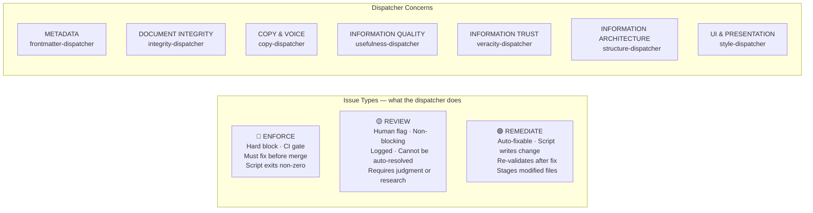

### Dispatcher matrix

| Dispatcher               | Concern                  | Enforce examples                                           | Review examples                                                   | Remediate examples                                 |
| ------------------------ | ------------------------ | ---------------------------------------------------------- | ----------------------------------------------------------------- | -------------------------------------------------- |
| `frontmatter-dispatcher` | METADATA                 | Missing required field, invalid enum                       | SEO title quality                                                 | Migrate deprecated value, infer missing field      |
| `integrity-dispatcher`   | DOCUMENT INTEGRITY       | MDX parse error, 404, broken anchor                        | External link rot                                                 | Fix spelling, remove em-dashes                     |
| `copy-dispatcher`        | COPY & VOICE             | Banned word (CI mode), heading > 8 words, question heading | Voice register mismatch, undefined jargon                         | Replace banned construction, UK English correction |
| `usefulness-dispatcher`  | INFORMATION QUALITY      | (none — all advisory)                                      | Rubric score below threshold, wrong register, quickstart too long | (none — requires human rewrite)                    |
| `veracity-dispatcher`    | INFORMATION TRUST        | REVIEW: flag in published content, veracityStatus conflict | Stale lastVerified, uncited claim                                 | (none — human-only)                                |
| `structure-dispatcher`   | INFORMATION ARCHITECTURE | File not in docs.json, dead-end page                       | Journey gap, page too long for pageType                           | Sync docs.json paths                               |
| `style-dispatcher`       | UI & PRESENTATION        | Unapproved component used, required section missing        | Wrong component choice, template drift, mermaid non-compliant     | Repair component metadata                          |

---

## 3. Requirements per Dispatcher

Each dispatcher's checks, the type of each check, and the **canonical source** that defines what "correct" means.

### 3.1 `frontmatter-dispatcher` — METADATA

| Check                                             | Type      | Canonical source                                               | Status                                      |
| ------------------------------------------------- | --------- | -------------------------------------------------------------- | ------------------------------------------- |
| All 10 required fields present                    | ENFORCE   | `tools/lib/frontmatter-taxonomy.js`                            | ✅ Exists                                   |
| pageType is a valid canonical value               | ENFORCE   | `tools/lib/frontmatter-taxonomy.js` (7 types)                  | ✅ Exists                                   |
| purpose is a valid canonical value                | ENFORCE   | `tools/lib/frontmatter-taxonomy.js` (15 values)                | ✅ Exists                                   |
| audience is a valid canonical value               | ENFORCE   | `tools/lib/frontmatter-taxonomy.js` (7 tokens)                 | ✅ Exists                                   |
| veracityStatus present when status=current        | ENFORCE   | `tools/lib/frontmatter-taxonomy.js`                            | ✅ Exists                                   |
| Deprecated pageType/purpose/audience value in use | REMEDIATE | `tools/lib/frontmatter-taxonomy.js` deprecated alias maps      | ✅ Exists                                   |
| pageType–purpose combination is allowed           | ENFORCE   | `tools/lib/frontmatter-taxonomy.js` PAGE_TYPE_ALLOWED_PURPOSES | ✅ Exists                                   |
| SEO title length and quality                      | REVIEW    | SEO rules file                                                 | ❌ MISSING                                  |
| SEO description present and not thin              | REVIEW    | SEO rules file                                                 | ❌ MISSING                                  |
| File/slug naming convention compliance            | ENFORCE   | v2/ naming conventions file                                    | ❌ MISSING (v2/ only; docs-guide has rules) |

**Remediator needs:** logic from `add-pagetype-mechanical.js` + `assign-purpose-metadata.js` (consolidated)

---

### 3.2 `integrity-dispatcher` — DOCUMENT INTEGRITY

| Check                           | Type      | Canonical source                                 | Status                                               |
| ------------------------------- | --------- | ------------------------------------------------ | ---------------------------------------------------- |
| MDX parses without error        | ENFORCE   | MDX parser (Mintlify rendering rules)            | ✅ `check-mdx-safe-markdown.js`                      |
| Internal links resolve (no 404) | ENFORCE   | `docs.json` routing                              | ✅ `check-anchor-usage.js` + `docs.json`             |
| Anchors resolve within page     | ENFORCE   | page heading manifest                            | ✅ `check-anchor-usage.js`                           |
| Snippet imports resolve         | ENFORCE   | file system                                      | ✅ `check-mdx-safe-markdown.js`                      |
| External links reachable        | REVIEW    | network (cannot auto-fix)                        | ✅ exists — needs type flag                          |
| TODO/TBD in published content   | ENFORCE   | pattern: `TODO\|TBD` in text                     | ✅ `lint-structure.js` (currently mixed in)          |
| Spelling errors                 | REMEDIATE | `tools/config/cspell.json` + UK dict             | ✅ `repair-spelling.js`                              |
| Em-dash in content              | REMEDIATE | `tools/config/style-language-profile-en-gb.json` | ⚠️ FILE EXISTS but `forbidden_terms: []` — **EMPTY** |
| Banned punctuation              | REMEDIATE | `tools/config/style-language-profile-en-gb.json` | ⚠️ Same — empty                                      |
| Grammar (UK English)            | REVIEW    | `check-grammar-en-gb.js`                         | ✅ exists — complex, not auto-fixable                |

**Critical blocker:** `style-language-profile-en-gb.json` has `forbidden_terms: []`. Banned terms/punctuation list must be populated from `checks.mdx` Cat 2 + CLAUDE.md before this dispatcher can enforce anything.

---

### 3.3 `copy-dispatcher` — COPY & VOICE

| Check                                                 | Type      | Canonical source                                                                            | Status                                            |
| ----------------------------------------------------- | --------- | ------------------------------------------------------------------------------------------- | ------------------------------------------------- |
| Banned words absent                                   | ENFORCE   | `checks.mdx` Cat 2 list + CLAUDE.md banned words section                                    | ⚠️ In prose only — not in machine-readable config |
| Banned constructions absent                           | REVIEW    | `checks.mdx` Cat 2 constructions table                                                      | ⚠️ In prose only                                  |
| Non-UK English spellings                              | REMEDIATE | `tools/config/style-language-profile-en-gb.json` + `cspell.json`                            | ⚠️ style profile empty                            |
| Heading length ≤ 8 words, ≥ 3 words                   | ENFORCE   | `checks.mdx` Cat 3 + CLAUDE.md heading rules                                                | ⚠️ In prose only                                  |
| Heading is not a question                             | ENFORCE   | `checks.mdx` Cat 3                                                                          | ⚠️ In prose only                                  |
| Heading not generic (Introduction, Overview, Summary) | REVIEW    | `checks.mdx` Cat 3 forbidden label list                                                     | ⚠️ In prose only                                  |
| Domain terms defined at first use                     | REVIEW    | `audits/content/data/discovered-terms.json` + `generators/content/data/glossary-terms.json` | ✅ Terms inventory exists                         |
| Voice register matches declared audience              | REVIEW    | `workspace/plan/active/CONTENT-WRITING/Prompts/voice-rules.md`                              | ✅ Exists (2/7 audiences fully specified)         |
| Prose restates table/diagram (delete)                 | REVIEW    | heading rules — pattern-based                                                               | needs pattern definition                          |
| Self-referential opener ("This page...")              | ENFORCE   | banned construction list                                                                    | ⚠️ In prose only                                  |

**Critical blocker:** Nearly all copy rules are defined in prose (`checks.mdx`, CLAUDE.md) and not in any machine-readable config. The `style-language-profile-en-gb.json` must be populated before this dispatcher can function.

---

### 3.4 `usefulness-dispatcher` — INFORMATION QUALITY

| Check                                                 | Type   | Canonical source                                                               | Status                                                        |
| ----------------------------------------------------- | ------ | ------------------------------------------------------------------------------ | ------------------------------------------------------------- |
| Rubric score ≥ threshold by pageType                  | REVIEW | `tools/config/usefulness-rubric.json` + `tools/lib/docs-usefulness/scoring.js` | ✅ Exists (but rubric uses old pageType names — schema drift) |
| Page length within bounds for pageType                | REVIEW | Length thresholds (embedded in `usefulness-rubric.json`)                       | ⚠️ Embedded, not standalone config                            |
| Quickstart ≤ max words (is it actually quick?)        | REVIEW | `usefulness-rubric.json` how_to tier thresholds                                | ⚠️ Old pageType names; how_to ≠ instruction                   |
| Page register matches declared purpose                | REVIEW | `usefulness-rubric.json` LLM tier 2 prompts                                    | ✅ Exists (requires LLM call)                                 |
| pageType fidelity (concept acts like a concept?)      | REVIEW | `usefulness-rubric.json` + LLM evaluation                                      | ✅ Exists (requires LLM call)                                 |
| Audience signal clear (reader knows this is for them) | REVIEW | `usefulness-rubric.json` tier 2                                                | ✅ Exists (LLM)                                               |

**Schema drift blocker:** `usefulness-rubric.json` uses old pageType names (`landing`, `overview`, `how_to`, `reference`, `tutorial`) not the canonical 7. Must be migrated before this dispatcher produces accurate scores.

**All items are REVIEW** — usefulness failures require human rewrite decisions. No auto-remediation.

---

### 3.5 `veracity-dispatcher` — INFORMATION TRUST

| Check                                               | Type    | Canonical source                                                     | Status                                      |
| --------------------------------------------------- | ------- | -------------------------------------------------------------------- | ------------------------------------------- |
| No `REVIEW:` flags in published content             | ENFORCE | pattern: `REVIEW:` in MDX text                                       | ✅ pattern known; needs dedicated validator |
| `veracityStatus: verified` but REVIEW flags present | ENFORCE | frontmatter field + text scan                                        | ⚠️ No script cross-checks both              |
| `lastVerified` not stale (≤ 365 days)               | REVIEW  | `accuracy-source-registry.json` (freshness thresholds: 365-730 days) | ✅ Config exists                            |
| Claims are citable to Tier A/B source               | REVIEW  | `accuracy-source-registry.json` + `accuracy-source-weights.json`     | ✅ Config exists                            |
| Source URLs still resolve                           | REVIEW  | network check                                                        | ✅ pattern known                            |
| No deprecated API references                        | REVIEW  | (needs API version registry — MISSING)                               | ❌ MISSING                                  |
| Numbers are real (not invented)                     | REVIEW  | Livepeer Explorer, Arbiscan (external links)                         | ✅ Pattern defined in CLAUDE.md             |

**All items are REVIEW or ENFORCE** — no auto-remediation possible; human research required.

---

### 3.6 `structure-dispatcher` — INFORMATION ARCHITECTURE

| Check                                     | Type      | Canonical source                                         | Status                                  |
| ----------------------------------------- | --------- | -------------------------------------------------------- | --------------------------------------- |
| File in v2/ exists in docs.json           | ENFORCE   | `docs.json`                                              | ✅ `check-docs-path-sync.js`            |
| File in docs.json exists on disk          | ENFORCE   | `docs.json` + filesystem                                 | ✅ `check-docs-path-sync.js`            |
| Dead-end page (no next/routing card)      | ENFORCE   | `docs.json` routing graph                                | ⚠️ No dead-end detector script          |
| Orphan page (not reachable from nav)      | ENFORCE   | `docs.json` routing graph                                | ⚠️ No orphan detector                   |
| Journey continuity (Phase N leads to N+1) | REVIEW    | `tab-map.mdx`                                            | ❌ tab-map.mdx DOES NOT EXIST — blocker |
| Page too long for pageType                | REVIEW    | Length thresholds (embedded in `usefulness-rubric.json`) | ⚠️ Not standalone; old pageType names   |
| File naming convention compliant          | ENFORCE   | v2/ naming conventions                                   | ❌ MISSING                              |
| Workspace file TTL expired                | REVIEW    | convention (workspace files > 90 days old)               | ⚠️ No config; convention only           |
| Docs.json path sync                       | REMEDIATE | `docs.json` + `sync-docs-paths.js`                       | ✅ Exists                               |

---

### 3.7 `style-dispatcher` — UI & PRESENTATION

| Check                                               | Type    | Canonical source                                                                                                               | Status                                                                 |
| --------------------------------------------------- | ------- | ------------------------------------------------------------------------------------------------------------------------------ | ---------------------------------------------------------------------- |
| Component is on approved list                       | ENFORCE | `docs-guide/config/component-registry.json` (117 LP components) + `docs-guide/contributing/mintlify.mdx` (Mintlify components) | ✅ Both exist                                                          |
| Component props are correct                         | REVIEW  | `docs-guide/config/component-registry.json` prop schema + Mintlify docs (external)                                             | ⚠️ LP registry exists; Mintlify props need local schema                |
| Required sections present for pageType              | ENFORCE | `tools/config/component-layout-profile.json`                                                                                   | ⚠️ EXISTS but uses old pageType names (landing, how_to) — SCHEMA DRIFT |
| Mandated template components present                | ENFORCE | `tools/config/component-layout-profile.json`                                                                                   | ⚠️ Same schema drift                                                   |
| Forbidden pattern absent (e.g., nested code blocks) | ENFORCE | `tools/config/component-layout-profile.json`                                                                                   | ⚠️ Same schema drift                                                   |
| Component choice appropriate for content            | REVIEW  | `v2/orchestrators/_workspace/canonical/Frameworks.mdx` template specs                                                          | ✅ Frameworks.mdx                                                      |
| Template drift (strayed from pageType template)     | REVIEW  | `Frameworks.mdx` + `component-layout-profile.json`                                                                             | ⚠️ Drift possible given schema mismatch                                |
| Mermaid block parses                                | ENFORCE | MDX parser                                                                                                                     | ✅ `check-mdx-safe-markdown.js`                                        |
| Mermaid styling compliant                           | REVIEW  | Mermaid rules config                                                                                                           | ❌ MISSING                                                             |
| Mermaid is viewable (not too dense)                 | REVIEW  | Mermaid rules config                                                                                                           | ❌ MISSING                                                             |

**Schema drift blocker:** `component-layout-profile.json` maps to old pageType names. Must be migrated to canonical 7 before this dispatcher produces correct results.

---

## 4. Canonical Sources — Full Location Map

| Requirement                                       | Canonical location                                                                                        | Status                                 |
| ------------------------------------------------- | --------------------------------------------------------------------------------------------------------- | -------------------------------------- |
| pageType, purpose, audience, veracityStatus enums | `tools/lib/frontmatter-taxonomy.js`                                                                       | ✅ Locked                              |
| Deprecated value alias maps                       | `tools/lib/frontmatter-taxonomy.js`                                                                       | ✅ Locked                              |
| pageType → allowed purposes                       | `tools/lib/frontmatter-taxonomy.js` PAGE_TYPE_ALLOWED_PURPOSES                                            | ✅ Locked                              |
| Taxonomy definitions (human-readable)             | `v2/orchestrators/_workspace/canonical/Frameworks.mdx`                                                    | ✅ Locked                              |
| Voice rules per audience                          | `workspace/plan/active/CONTENT-WRITING/Prompts/voice-rules.md`                                            | ✅ Exists (2/7 complete)               |
| UK English style rules                            | `tools/config/style-language-profile-en-gb.json`                                                          | ⚠️ Exists, `forbidden_terms: []` EMPTY |
| Spelling dictionary                               | `tools/config/cspell.json`                                                                                | ✅ Exists                              |
| Banned words / constructions                      | `checks.mdx` Cat 2 + `.claude/CLAUDE.md`                                                                  | ⚠️ Prose only — not machine-readable   |
| Heading rules                                     | `checks.mdx` Cat 3 + `.claude/CLAUDE.md`                                                                  | ⚠️ Prose only                          |
| Domain terminology                                | `audits/content/data/discovered-terms.json` (5,689 terms) + `generators/content/data/glossary-terms.json` | ✅ Exists                              |
| Usefulness rubric + scoring                       | `tools/config/usefulness-rubric.json` + `tools/lib/docs-usefulness/scoring.js`                            | ⚠️ Exists, uses old pageType names     |
| Usefulness journeys                               | `tools/config/usefulness-journeys.json`                                                                   | ✅ Exists                              |
| LLM evaluation tiers                              | `tools/config/usefulness-llm-tiers.json`                                                                  | ✅ Exists                              |
| Audience normalization synonyms                   | `tools/config/usefulness-audience-normalization.json`                                                     | ⚠️ Stale pre-canonical tokens          |
| Accuracy source tiers and weights                 | `tools/config/accuracy-source-registry.json` + `tools/config/accuracy-source-weights.json`                | ✅ Exists                              |
| Component list (Livepeer)                         | `docs-guide/config/component-registry.json` (117 components)                                              | ✅ Auto-generated                      |
| Component list (Mintlify)                         | `docs-guide/contributing/mintlify.mdx` (reference guide)                                                  | ✅ Exists (prose, not schema)          |
| Component props (Mintlify)                        | (external Mintlify docs)                                                                                  | ❌ No local schema                     |
| Component layout by pageType                      | `tools/config/component-layout-profile.json`                                                              | ⚠️ Exists, old pageType names          |
| Routing and navigation                            | `docs.json`                                                                                               | ✅ Source of truth                     |
| Tab journey mappings                              | `v2/orchestrators/_workspace/canonical/tab-map.mdx`                                                       | ❌ DOES NOT EXIST                      |
| Page length thresholds                            | Embedded in `usefulness-rubric.json`                                                                      | ⚠️ Embedded, not standalone            |
| File/slug naming conventions                      | `docs-guide/policies/docs-guide-structure-policy.mdx` (docs-guide only)                                   | ⚠️ Partial — v2/ pages not covered     |
| Mermaid styling rules                             | —                                                                                                         | ❌ MISSING                             |
| SEO rules                                         | —                                                                                                         | ❌ MISSING                             |
| API version registry                              | —                                                                                                         | ❌ MISSING                             |
| Script registry / metadata                        | `tools/config/script-registry.json`                                                                       | ✅ Exists                              |
| Shared report output library                      | —                                                                                                         | ❌ MISSING (`pipeline-report.js`)      |

---

## 5. Missing Canonical Files — Must Create Before Scripts Work

These are blockers. Dispatchers depending on them will produce incorrect or incomplete results until they exist.

| Missing file                                                    | Blocks                                           | Priority | Notes                                                                                                                |
| --------------------------------------------------------------- | ------------------------------------------------ | -------- | -------------------------------------------------------------------------------------------------------------------- |
| `tools/config/style-language-profile-en-gb.json` population     | `integrity-dispatcher`, `copy-dispatcher`        | **P0**   | File exists but `forbidden_terms: []` — populate from `checks.mdx` Cat 2 + CLAUDE.md banned words list               |
| `tools/config/component-layout-profile.json` pageType migration | `style-dispatcher`                               | **P0**   | File exists; migrate old names (`landing→navigation`, `overview→concept`, `how_to→instruction`, etc.) to canonical 7 |
| `tools/config/usefulness-rubric.json` pageType migration        | `usefulness-dispatcher`                          | **P1**   | File exists; same old→new pageType name migration                                                                    |
| `tools/config/content-rules.json` (new)                         | `copy-dispatcher`, `integrity-dispatcher`        | **P1**   | Extract banned words, banned constructions, heading rules from `checks.mdx` + CLAUDE.md into machine-readable JSON   |
| `tools/config/page-length-thresholds.json` (new)                | `structure-dispatcher`, `usefulness-dispatcher`  | **P1**   | Extract length thresholds from `usefulness-rubric.json` (word count min/max per pageType) into standalone config     |
| `tools/config/slug-naming-conventions.json` (new)               | `frontmatter-dispatcher`, `structure-dispatcher` | **P1**   | Define slug/filename rules for v2/ pages (currently only docs-guide rules exist)                                     |
| `tools/config/mintlify-component-schema.json` (new)             | `style-dispatcher`                               | **P2**   | Local schema of Mintlify component props — derived from `docs-guide/contributing/mintlify.mdx` + Mintlify docs       |
| `tools/config/mermaid-style-rules.json` (new)                   | `style-dispatcher`                               | **P2**   | Mermaid viewability rules: max nodes, required theme, colour source                                                  |
| `tools/config/seo-rules.json` (new)                             | `frontmatter-dispatcher`                         | **P3**   | SEO rules for docs pages: title length, description quality; SEO external lookup is backlog                          |
| `v2/orchestrators/_workspace/canonical/tab-map.mdx`             | `structure-dispatcher`                           | **P1**   | Journey mapping — Phase 4 pipeline blocker; human must create                                                        |
| `tools/lib/pipeline-report.js` (new)                            | All dispatchers                                  | **P0**   | Shared output library — normalise all issue JSON to `{file, dispatcher, cat, type, severity, check_id, message}`     |

---

## 6. Dispatcher Architecture

```mermaid
flowchart TB
    subgraph MASTER["content-pipeline.js — Master Dispatcher"]
        MODE["--mode: check | dry-run | fix"]
        SCOPE["--scope: file | tab | staged | full"]
        FORMAT["--format: json | mdx | both"]
    end

    MASTER --> T1

    subgraph T1["Tier 1 — ENFORCE (structural blockers)"]
        D1["frontmatter-dispatcher.js
        concern: METADATA
        enforce: missing fields, invalid enums
        remediate: deprecated values, infer missing"]
        D2["integrity-dispatcher.js
        concern: DOCUMENT INTEGRITY
        enforce: MDX parse, 404, broken anchors
        remediate: spelling, em-dashes"]
        D6A["structure-dispatcher.js (nav checks only)
        concern: IA
        enforce: file not in docs.json, dead-ends"]
    end

    T1 -->|"ALL PASS"| T2
    T1 -->|"ANY ENFORCE FAIL"| HALT["❌ HALT + report
    Fix structural issues before content review"]

    subgraph T2["Tier 2 — REVIEW + REMEDIATE (quality flags)"]
        D3["copy-dispatcher.js
        concern: COPY & VOICE
        enforce: banned words (CI), question headings
        review: voice register, jargon, constructions
        remediate: UK English, heading fixes"]
        D7["style-dispatcher.js
        concern: UI & PRESENTATION
        enforce: unapproved component, missing required section
        review: component props, template drift, mermaid
        remediate: component metadata repair"]
        D6B["structure-dispatcher.js (journey checks)
        concern: IA
        review: journey gaps, page length
        remediate: docs.json sync"]
    end

    T2 --> T3

    subgraph T3["Tier 3 — REVIEW only (information quality + trust)"]
        D4["usefulness-dispatcher.js
        concern: INFORMATION QUALITY
        review: rubric score, register, pageType fidelity
        remediate: none"]
        D5["veracity-dispatcher.js
        concern: INFORMATION TRUST
        enforce: REVIEW flags in published content
        review: stale sources, uncited claims
        remediate: none"]
    end

    T3 --> OUT

    subgraph OUT["Output — both always generated"]
        JSON["workspace/reports/content-pipeline/report.json
        {file, dispatcher, cat, type, severity, check_id, message}"]
        MDX["workspace/reports/content-pipeline/report.mdx
        Human-readable — grouped by dispatcher + page"]
    end
```

### Each dispatcher follows the same pattern internally


---

## 7. Framework Architecture

### Artefact and config locations

| What                                | Location                                            | Rule                                                                      |
| ----------------------------------- | --------------------------------------------------- | ------------------------------------------------------------------------- |
| Generated reports (JSON + MDX)      | `workspace/reports/<dispatcher-name>/`              | One directory per dispatcher; both formats always written                 |
| Canonical enum configs              | `tools/config/`                                     | All machine-readable rules live here; prose definitions in canonical .mdx |
| Dispatcher scripts                  | `operations/scripts/dispatch/content/`              | Alongside existing `dispatch/governance/`                                 |
| Validator scripts                   | `operations/scripts/validators/content/<concern>/`  | Existing pattern; concern-based subdirectory                              |
| Remediator scripts                  | `operations/scripts/remediators/content/<concern>/` | Existing pattern                                                          |
| Content framework references        | `v2/orchestrators/_workspace/canonical/`            | Content artefacts — not code                                              |
| Script canonical source declaration | JSDoc `@dispatcher` + `@canonical` tags             | Machine-discoverable via `script-registry.json`                           |

### Dual output pattern

Every dispatcher always writes two formats:

1. `report.json` — structured, consumed by CI, AI agents, aggregators
2. `report.mdx` — human-readable, consumed by Alison, review sessions, Mintlify preview

No script should emit only `console.log`. All must call `pipeline-report.js writeReport()`.

---

## 8. New Scripts — Full Inventory

All files below are **new**. No existing scripts are modified. Existing scripts continue to operate unchanged in parallel.

Each script shows: **Staging path** (written first, in `workspace/scripts-pipeline/`) → **Final path** (moved here at checkpoint approval, registered in `script-registry.json`).

### Shared infrastructure (Step 1)

Configs go directly to `tools/config/` (no staging needed — they are data, not scripts). The shared library goes to `tools/lib/`.

| New file                                      | Type    | Purpose                                                                                                            |
| --------------------------------------------- | ------- | ------------------------------------------------------------------------------------------------------------------ |
| `tools/lib/pipeline-report.js`                | Library | `normaliseIssue()`, `writeReport(issues, dir)` — shared output contract; writes `report.json` + `report.mdx`       |
| `tools/config/content-rules.json`             | Config  | Machine-readable banned words, banned constructions, heading rules — sourced from `checks.mdx` Cat 2-3 + CLAUDE.md |
| `tools/config/page-length-thresholds.json`    | Config  | Word count min/max per canonical pageType (sourced from `usefulness-rubric.json` existing values)                  |
| `tools/config/slug-naming-conventions.json`   | Config  | v2/ filename and slug rules — new; docs-guide rules already exist in `docs-guide-structure-policy.mdx`             |
| `tools/config/mintlify-component-schema.json` | Config  | Mintlify component prop schema — derived from `docs-guide/contributing/mintlify.mdx`                               |
| `tools/config/mermaid-style-rules.json`       | Config  | Mermaid viewability rules: max nodes, required theme, colour source                                                |

Build order reflects dependency solidity (most complete canonical sources first). Staging path → Final path shown for each script.

### Dispatcher 1 — `frontmatter-dispatcher` (Step 2)

Staging: `workspace/scripts-pipeline/` → Final: `operations/scripts/<type>/content/<niche>/`

| Script                                              | @type      | @niche         | Issue type       | What it does                                                                                               |
| --------------------------------------------------- | ---------- | -------------- | ---------------- | ---------------------------------------------------------------------------------------------------------- |
| `validate-frontmatter.js`                           | validator  | structure      | ENFORCE + REVIEW | All 10 required fields, canonical enums, veracityStatus consistency, pageType–purpose allowed combinations |
| `check-purpose-rubric-sync.js`                      | validator  | structure      | ENFORCE          | All 15 `CANONICAL_PURPOSES` have a `purposeToRubricPurpose()` mapping — fails loudly on gaps               |
| `repair-frontmatter-taxonomy.js`                    | remediator | classification | REMEDIATE        | Migrates deprecated values to canonical; infers and adds missing fields                                    |
| `frontmatter-dispatcher.js`                         | dispatch   | content        | Dispatcher       | check/dry-run/fix modes; reports to `workspace/reports/frontmatter/`                                       |
| `docs-guide/dispatchers/_template-dispatcher.mdx`   | —          | —              | —                | **Documentation template** (Sub-task 2a — agreed before any scripts built; all subsequent docs follow it)  |
| `docs-guide/dispatchers/frontmatter-dispatcher.mdx` | —          | —              | —                | First usage doc built from agreed template                                                                 |

### Dispatcher 2 — `veracity-dispatcher` (Step 3)

Staging: `workspace/scripts-pipeline/` → Final: `operations/scripts/<type>/content/veracity/`

| Script                                           | @type     | @niche   | Issue type       | What it does                                                                                                                                                 |
| ------------------------------------------------ | --------- | -------- | ---------------- | ------------------------------------------------------------------------------------------------------------------------------------------------------------ |
| `validate-veracity-status.js`                    | validator | veracity | ENFORCE + REVIEW | ENFORCE: `REVIEW:` flags in published content; `veracityStatus: verified` + REVIEW flags conflict. REVIEW: `veracityStatus: unverified` on `status: current` |
| `validate-source-freshness.js`                   | validator | veracity | REVIEW           | `lastVerified` vs. `accuracy-source-registry.json` thresholds (365-730 days)                                                                                 |
| `veracity-dispatcher.js`                         | dispatch  | content  | Dispatcher       | Check only — no remediation; reports to `workspace/reports/veracity/`                                                                                        |
| `docs-guide/dispatchers/veracity-dispatcher.mdx` | —         | —        | —                | Usage documentation                                                                                                                                          |

### Dispatcher 3 — `structure-dispatcher` (Step 4)

Staging: `workspace/scripts-pipeline/` → Final: `operations/scripts/<type>/content/structure/` and `remediators/content/repair/`

| Script                                            | @type      | @niche    | Issue type | What it does                                                                             |
| ------------------------------------------------- | ---------- | --------- | ---------- | ---------------------------------------------------------------------------------------- |
| `validate-nav-integrity.js`                       | validator  | structure | ENFORCE    | docs.json ↔ filesystem sync; orphan files; ghost nav entries; dead-end pages             |
| `validate-nav-journeys.js`                        | validator  | structure | REVIEW     | Journey continuity (degrades gracefully without tab-map.mdx); page length vs. thresholds |
| `repair-nav-paths.js`                             | remediator | repair    | REMEDIATE  | Syncs docs.json path entries where filename exists but path reference is wrong           |
| `structure-dispatcher.js`                         | dispatch   | content   | Dispatcher | Tier 1 (nav integrity) + Tier 2 (journey); reports to `workspace/reports/structure/`     |
| `docs-guide/dispatchers/structure-dispatcher.mdx` | —          | —         | —          | Usage documentation                                                                      |

### Dispatcher 4 — `integrity-dispatcher` (Step 5)

Requires Design Checkpoint 5a first (`style-language-profile-en-gb.json` population).
Staging: `workspace/scripts-pipeline/` → Final: `operations/scripts/<type>/content/` (new `integrity` niche)

| Script                                            | @type      | @niche    | Issue type       | What it does                                                                              |
| ------------------------------------------------- | ---------- | --------- | ---------------- | ----------------------------------------------------------------------------------------- |
| `validate-mdx-integrity.js`                       | validator  | structure | ENFORCE          | MDX parse errors, snippet imports, TODO/TBD in published content                          |
| `validate-links.js`                               | validator  | structure | ENFORCE + REVIEW | Internal links (ENFORCE); anchors (ENFORCE); external links (REVIEW)                      |
| `repair-common-patterns.js`                       | remediator | repair    | REMEDIATE        | Em-dashes → hyphen; spelling via cspell; uses `content-rules.json` for banned punctuation |
| `integrity-dispatcher.js`                         | dispatch   | content   | Dispatcher       | Tier 1 — blocks on MDX/404; reports to `workspace/reports/integrity/`                     |
| `docs-guide/dispatchers/integrity-dispatcher.mdx` | —          | —         | —                | Usage documentation                                                                       |

### Dispatcher 5 — `usefulness-dispatcher` (Step 6)

Requires Design Checkpoint 6a first (`usefulness-rubric.json` pageType mapping decisions).
Staging: `workspace/scripts-pipeline/` → Final: `operations/scripts/<type>/content/quality/`

| Script                                             | @type     | @niche  | Issue type | What it does                                                                           |
| -------------------------------------------------- | --------- | ------- | ---------- | -------------------------------------------------------------------------------------- |
| `validate-page-usefulness.js`                      | validator | quality | REVIEW     | Rubric scoring (reads existing `scoring.js` output); register check; pageType fidelity |
| `validate-page-length.js`                          | validator | quality | REVIEW     | Word count vs. `page-length-thresholds.json`; too-long (split) and too-short (thin)    |
| `usefulness-dispatcher.js`                         | dispatch  | content | Dispatcher | Check only — no remediation; Tier 3; reports to `workspace/reports/usefulness/`        |
| `docs-guide/dispatchers/usefulness-dispatcher.mdx` | —         | —       | —          | Usage documentation                                                                    |

### Dispatcher 6 — `copy-dispatcher` (Step 7)

Requires Design Checkpoint 7a first (`content-rules.json` full co-design).
Staging: `workspace/scripts-pipeline/` → Final: `operations/scripts/<type>/content/copy/`

| Script                                       | @type      | @niche  | Issue type       | What it does                                                                                                          |
| -------------------------------------------- | ---------- | ------- | ---------------- | --------------------------------------------------------------------------------------------------------------------- |
| `validate-voice-copy.js`                     | validator  | copy    | ENFORCE + REVIEW | Banned words (ENFORCE in CI), banned constructions (REVIEW), self-referential openers — all from `content-rules.json` |
| `validate-headings.js`                       | validator  | copy    | ENFORCE + REVIEW | 3-6 word rule, no questions, no generic labels, domain-anchor rule — from `content-rules.json`                        |
| `repair-copy-patterns.js`                    | remediator | style   | REMEDIATE        | UK English corrections (cspell); pattern-replaceable banned constructions                                             |
| `copy-dispatcher.js`                         | dispatch   | content | Dispatcher       | Tier 2; reports to `workspace/reports/copy/`                                                                          |
| `docs-guide/dispatchers/copy-dispatcher.mdx` | —          | —       | —                | Usage documentation                                                                                                   |

### Dispatcher 7 — `style-dispatcher` (Step 8)

Requires Design Checkpoints 8a + 8b first (`component-layout-profile.json` mapping + `mintlify-component-schema.json`).
Staging: `workspace/scripts-pipeline/` → Final: `operations/scripts/<type>/content/style/` (new niche)

| Script                                        | @type      | @niche  | Issue type       | What it does                                                                                              |
| --------------------------------------------- | ---------- | ------- | ---------------- | --------------------------------------------------------------------------------------------------------- |
| `validate-components.js`                      | validator  | style   | ENFORCE + REVIEW | Approved component list (`component-registry.json` + `mintlify-component-schema.json`); props correctness |
| `validate-template-compliance.js`             | validator  | style   | ENFORCE + REVIEW | Required sections + mandated items per pageType; template drift                                           |
| `validate-mermaid.js`                         | validator  | style   | ENFORCE + REVIEW | MDX parse (ENFORCE); theme + viewability vs. `mermaid-style-rules.json` (REVIEW)                          |
| `repair-component-metadata.js`                | remediator | library | REMEDIATE        | Component display names, import path corrections                                                          |
| `style-dispatcher.js`                         | dispatch   | content | Dispatcher       | Tier 2; reports to `workspace/reports/style/`                                                             |
| `docs-guide/dispatchers/style-dispatcher.mdx` | —          | —       | —                | Usage documentation                                                                                       |

### Master dispatcher (Step 9)

| Script                                        | @type    | @niche  | What it does                                                                                            |
| --------------------------------------------- | -------- | ------- | ------------------------------------------------------------------------------------------------------- |
| `content-pipeline.js`                         | dispatch | content | Runs all 7 in tier order; aggregates to `workspace/reports/content-pipeline/report.json` + `report.mdx` |
| `docs-guide/dispatchers/content-pipeline.mdx` | —        | —       | Master usage doc — references all 7 dispatcher docs                                                     |

### Backlog (not in this build)

| Item                           | Notes                                                                                      |
| ------------------------------ | ------------------------------------------------------------------------------------------ |
| SEO external lookup (Google)   | `frontmatter-dispatcher` v2 — requires Search Console or Suggest API                       |
| API version registry           | `veracity-dispatcher` — tracks deprecated API versions                                     |
| `repo-artefacts-dispatcher.js` | Governs components, scripts, templates, data files — separate concern                      |
| `process-pipeline.js`          | Tracks my-process.mdx production phases 1–9 per tab — separate concern from quality checks |

---

## 9. Implementation Approach

### All new scripts — no modifications to existing code

Every file created in this build is a **new script**. Existing scripts (`lint-structure.js`, `rubric-loader.js`, etc.) are not touched. The new dispatcher architecture runs alongside the existing scripts independently. This preserves existing behaviour, allows the new pipeline to be validated in isolation, and avoids downstream regressions during development.

Config files (`style-language-profile-en-gb.json`, `component-layout-profile.json`, etc.) are also not modified. New parallel configs are created alongside existing ones.

### Worktree

All work runs on a new git worktree branched from `docs-v2-dev`. The worktree is isolated — no changes land on the main working branch until the full pipeline passes human review.

```
git worktree add ../Docs-v2-dev-scripts-pipeline scripts/checks-pipeline
```

### Temporary staging folder

New scripts are written to a staging area first — **not** directly into `operations/scripts/`. This keeps them isolated during development and makes the checkpoint review clean.

**Staging location:** `workspace/scripts-pipeline/<type>/<concern>/`

At each dispatcher's implementation checkpoint, approved scripts move from staging to their final `operations/scripts/<type>/<concern>/<niche>/` location and are registered in `tools/config/script-registry.json`.

### SCRIPT-GOVERNANCE framework — all scripts must follow

Every new script follows the standards in `workspace/plan/active/SCRIPT-GOVERNANCE/script-framework.md`:

**File path:** `<type>/<concern>/<niche>/script-name.js`
Valid types: `audit`, `generator`, `validator`, `remediator`, `dispatch`, `automation`
Valid concerns: `content`, `components`, `governance`, `ai`

**JSDoc header — 11 required tags (in order):**

```js
/**
 * @script      script-name
 * @type        validator
 * @concern     content
 * @niche       structure
 * @purpose     qa:content-quality
 * @description One-line description, no line breaks.
 * @mode        read-only
 * @pipeline    trigger → inputs → outputs [→ dependants]
 * @scope       staged, v2-content
 * @usage       node operations/scripts/validators/content/structure/script-name.js [flags]
 * @policy      (requirement IDs or empty)
 */
```

**Scaffold tool:** `node operations/scripts/generators/governance/scaffold/new-script.js --path <path>` — generates the JSDoc stub. Run this first, then fill in the tags.

**Registry:** Every script gets an entry in `tools/config/script-registry.json` with all 12 fields (path, name, type, concern, niche, purpose, description, mode, pipeline, scope, usage, policy, status).

### Script-level check-in protocol

**Before each individual script is written**, present in chat:

1. Script name and final destination path (in staging and in production)
2. What it does — plain English, no jargon
3. Inputs: what flags it accepts, what files it reads, what configs it requires
4. Outputs: JSON schema shape + MDX report summary format
5. What canonical sources it reads from and what decisions are embedded in its logic
6. The `@pipeline` arrow-notation string for the JSDoc

**Wait for explicit approval before writing the script.**

This is separate from the dispatcher-level checkpoint. Every script within a dispatcher gets its own check-in.

### Checkpoint protocol — two types

#### Design checkpoint (before building, co-design with Alison)

When a script depends on a config that requires editorial decisions — what rules go in it, how content is categorised — a design checkpoint runs first:

1. **PRESENT** in chat: draft config contents, what each rule enforces, alternatives considered
2. **WAIT** for Alison's input — rules may be added, removed, or modified
3. **CONFIRM** final version in chat before it is written to the file
4. **WRITE** config only after explicit approval

Design checkpoints occur before: `content-rules.json`, `slug-naming-conventions.json`, `mermaid-style-rules.json`, `mintlify-component-schema.json`, `page-length-thresholds.json`, and all pageType migration decisions (`component-layout-profile.json` mapping, `usefulness-rubric.json` mapping).

#### Implementation checkpoint (after each dispatcher is built)

After each dispatcher is complete and tested:

1. **STOP** — no further code is written
2. **TEST** — run `node operations/tests/run-all.js` in the worktree + run the dispatcher against a sample file (specified in the checkpoint)
3. **REPORT IN CHAT** — full details presented:
   - Every new file created (path + one-sentence purpose)
   - Every config created (path + what it defines)
   - What each check does (enforce / review / remediate), what it needs to run, and sample output
   - Any issues or anomalies found during testing
4. **WAIT** — no work proceeds until explicit human approval (`go`, `ok`, `proceed`)

---

## 10. Implementation Order

### Step 0 — Worktree setup

Create worktree on new branch `scripts/checks-pipeline`.

### Step 1 — Shared infrastructure (no dispatcher yet)

**→ DESIGN CHECKPOINT 1a: Content rules co-design**
Present draft `content-rules.json` (banned words, banned constructions, heading rules — sourced from `checks.mdx` + CLAUDE.md). Alison reviews, adds, removes, or modifies rules. Approved version written only after sign-off.

**→ DESIGN CHECKPOINT 1b: Page structure rules co-design**
Present draft `page-length-thresholds.json` (min/max word counts per canonical pageType), `slug-naming-conventions.json` (v2/ filename rules), and `mermaid-style-rules.json`. Same design-then-approve flow.

**→ DESIGN CHECKPOINT 1c: Component schema co-design**
Present draft `mintlify-component-schema.json` (props per Mintlify component, derived from `mintlify.mdx`). Review for completeness and correctness.

**→ DESIGN CHECKPOINT 1d: pageType migration decisions**
Present the full proposed old→new pageType mapping for `component-layout-profile.json` and `usefulness-rubric.json` (e.g., `landing→navigation`, `how_to→instruction`). Confirm each mapping before migration configs are written.

After all design checkpoints approved, write:

- `tools/config/content-rules.json`
- `tools/config/page-length-thresholds.json`
- `tools/config/slug-naming-conventions.json`
- `tools/config/mintlify-component-schema.json`
- `tools/config/mermaid-style-rules.json`
- `tools/lib/pipeline-report.js`

**Pre-flight grep** — confirm no deprecated audience tokens in v2/ frontmatter.

**→ IMPLEMENTATION CHECKPOINT 1: Infrastructure review** — present all created files, full contents, and what each enforces before any dispatcher is built.

---

### Dispatcher build order — solid dependencies first

Dispatchers are built in order of how complete their canonical sources already are. Dispatchers that depend on configs requiring design checkpoints (content-rules.json, mintlify-component-schema.json, etc.) come after those whose sources are already locked.

| Build order | Dispatcher               | Why first                                                                                                              | Design checkpoint needed?                    |
| ----------- | ------------------------ | ---------------------------------------------------------------------------------------------------------------------- | -------------------------------------------- |
| 1           | `frontmatter-dispatcher` | `frontmatter-taxonomy.js` fully locked — all enums, validations, and aliases are complete                              | No — canonical source exists                 |
| 2           | `veracity-dispatcher`    | `accuracy-source-registry.json` + `accuracy-source-weights.json` exist; REVIEW flag detection is pattern-only          | No — configs exist                           |
| 3           | `structure-dispatcher`   | `docs.json` is the source of truth; nav integrity is algorithmic; journey checks degrade gracefully if tab-map missing | No for nav; REVIEW only for journeys         |
| 4           | `integrity-dispatcher`   | cspell + MDX parser exist; blocked only on `style-language-profile-en-gb.json` being populated                         | Yes — for em-dash/banned punctuation rules   |
| 5           | `usefulness-dispatcher`  | `usefulness-rubric.json` exists; needs pageType name migration only                                                    | Yes — for old→new pageType mapping decisions |
| 6           | `copy-dispatcher`        | Depends on `content-rules.json` which needs full co-design                                                             | Yes — content-rules.json co-design           |
| 7           | `style-dispatcher`       | Depends on `component-layout-profile.json` migration + `mintlify-component-schema.json` creation                       | Yes — both need design sign-off              |

---

### Step 2 — `frontmatter-dispatcher.js` ← DISPATCHER 1

**Sub-task 2a (first) — documentation template**
Before any scripts are built: draft and agree the template for all dispatcher usage docs. This template becomes the canonical pattern for every subsequent dispatcher doc. The template covers: purpose, canonical sources used, full flag/mode/scope reference, check-by-check table (enforce/review/remediate), sample JSON + MDX output, common issues and resolutions.

Presented in chat → agreed → written to `docs-guide/dispatchers/_template-dispatcher.mdx`.

New scripts + documentation:

- `validators/content/structure/validate-frontmatter.js`
- `remediators/content/classification/repair-frontmatter-taxonomy.js`
- `validators/content/structure/check-purpose-rubric-sync.js`
- `dispatch/content/frontmatter-dispatcher.js`
- `docs-guide/dispatchers/frontmatter-dispatcher.mdx` ← first usage doc (based on agreed template)

**→ IMPLEMENTATION CHECKPOINT 2: Frontmatter dispatcher review**

---

### Step 3 — `veracity-dispatcher.js` ← DISPATCHER 2

New scripts + documentation:

- `validators/content/veracity/validate-veracity-status.js`
- `validators/content/veracity/validate-source-freshness.js`
- `dispatch/content/veracity-dispatcher.js`
- `docs-guide/dispatchers/veracity-dispatcher.mdx`

**→ IMPLEMENTATION CHECKPOINT 3: Veracity dispatcher review**

---

### Step 4 — `structure-dispatcher.js` ← DISPATCHER 3

New scripts + documentation:

- `validators/content/structure/validate-nav-integrity.js`
- `validators/content/structure/validate-nav-journeys.js`
- `remediators/content/structure/repair-nav-paths.js`
- `dispatch/content/structure-dispatcher.js`
- `docs-guide/dispatchers/structure-dispatcher.mdx`

**→ IMPLEMENTATION CHECKPOINT 4: Structure dispatcher review**

---

### Step 5 — `integrity-dispatcher.js` ← DISPATCHER 4

Requires design checkpoint for `style-language-profile-en-gb.json` population before scripts are built.

**→ DESIGN CHECKPOINT 5a: integrity rules** (banned punctuation, em-dash policy, spelling scope)

New scripts + documentation:

- `validators/content/integrity/validate-mdx-integrity.js`
- `validators/content/integrity/validate-links.js`
- `remediators/content/integrity/repair-common-patterns.js`
- `dispatch/content/integrity-dispatcher.js`
- `docs-guide/dispatchers/integrity-dispatcher.mdx`

**→ IMPLEMENTATION CHECKPOINT 5: Integrity dispatcher review**

---

### Step 6 — `usefulness-dispatcher.js` ← DISPATCHER 5

Requires design checkpoint for `usefulness-rubric.json` pageType name migration decisions.

**→ DESIGN CHECKPOINT 6a: usefulness rubric pageType mapping** (old names → canonical 7)

New scripts + documentation:

- `validators/content/usefulness/validate-page-usefulness.js`
- `validators/content/usefulness/validate-page-length.js`
- `dispatch/content/usefulness-dispatcher.js`
- `docs-guide/dispatchers/usefulness-dispatcher.mdx`

**→ IMPLEMENTATION CHECKPOINT 6: Usefulness dispatcher review**

---

### Step 7 — `copy-dispatcher.js` ← DISPATCHER 6

Requires design checkpoint for `content-rules.json` (the full banned words + constructions + heading rules list).

**→ DESIGN CHECKPOINT 7a: content-rules.json co-design** (banned words, banned constructions, heading rules)

New scripts + documentation:

- `validators/content/copy/validate-voice-copy.js`
- `validators/content/copy/validate-headings.js`
- `remediators/content/copy/repair-copy-patterns.js`
- `dispatch/content/copy-dispatcher.js`
- `docs-guide/dispatchers/copy-dispatcher.mdx`

**→ IMPLEMENTATION CHECKPOINT 7: Copy dispatcher review**

---

### Step 8 — `style-dispatcher.js` ← DISPATCHER 7

Requires design checkpoints for `component-layout-profile.json` migration + `mintlify-component-schema.json` creation.

**→ DESIGN CHECKPOINT 8a: component-layout-profile.json pageType migration**
**→ DESIGN CHECKPOINT 8b: mintlify-component-schema.json** (Mintlify component props schema)

New scripts + documentation:

- `validators/content/style/validate-components.js`
- `validators/content/style/validate-template-compliance.js`
- `validators/content/style/validate-mermaid.js`
- `remediators/content/style/repair-component-metadata.js`
- `dispatch/content/style-dispatcher.js`
- `docs-guide/dispatchers/style-dispatcher.mdx`

**→ IMPLEMENTATION CHECKPOINT 8: Style dispatcher review**

---

### Step 9 — `content-pipeline.js` ← MASTER DISPATCHER

New script + documentation:

- `dispatch/content/content-pipeline.js`
- `docs-guide/dispatchers/content-pipeline.mdx` ← usage documentation (master — references all 7 dispatcher docs)

**→ IMPLEMENTATION CHECKPOINT 9: Full pipeline review — run against one complete tab before any merge**

---

### Step 10 — Merge to docs-v2-dev

After Checkpoint 9 approval: merge worktree branch. Update `script-registry.json` with new `@dispatcher` tags for all new scripts.

---

## 11. Verification

Each implementation checkpoint includes a test run. These are the acceptance criteria:

| Stage                      | Test                                                                                                                     | Pass condition                                                                                          |
| -------------------------- | ------------------------------------------------------------------------------------------------------------------------ | ------------------------------------------------------------------------------------------------------- |
| Checkpoint 1 (infra)       | Present all config file contents in chat                                                                                 | Alison approves each config before any script is built                                                  |
| Checkpoint 2 (frontmatter) | `node frontmatter-dispatcher.js --mode check --tab orchestrators`                                                        | Structured JSON produced, zero crashes, ENFORCE flags are real issues (verified against known-bad page) |
| Checkpoint 3 (veracity)    | `node veracity-dispatcher.js --mode check --file v2/orchestrators/guides/operator-considerations/operator-rationale.mdx` | Produces REVIEW flags for known REVIEW: markers in that file                                            |
| Checkpoint 4 (structure)   | `node structure-dispatcher.js --mode check --full`                                                                       | Detects known orphan/dead-end pages; docs.json sync accurate                                            |
| Checkpoint 5 (integrity)   | `node integrity-dispatcher.js --mode check --file [known-broken-mdx]`                                                    | Catches MDX parse error; zero false positives on clean pages                                            |
| Checkpoint 6 (usefulness)  | `node usefulness-dispatcher.js --mode check --tab orchestrators`                                                         | Rubric scores match expected range for known-good pages                                                 |
| Checkpoint 7 (copy)        | `node copy-dispatcher.js --mode check --file [page with known banned word]`                                              | Flags banned word; misses nothing obvious                                                               |
| Checkpoint 8 (style)       | `node style-dispatcher.js --mode check --file [page with known component issue]`                                         | Flags unapproved component or missing mandated section                                                  |
| Checkpoint 9 (master)      | `node content-pipeline.js --mode check --file v2/orchestrators/guides/operator-considerations/operator-rationale.mdx`    | Full Cat 1–9 report in both JSON and MDX; all 7 dispatchers run in tier order                           |
| Post-merge                 | `node operations/tests/run-all.js`                                                                                       | All tests pass; existing scripts unaffected                                                             |

---

# Script Pipeline Architecture Plan — v3

## Checks Pipeline: Requirements, Dispatcher Taxonomy, Canonical Sources

---

## Context

154 scripts, no dispatcher, no shared output contract, multiple schema drifts. This plan maps what each dispatcher actually **needs to function** before designing implementation. The primary output is: a dispatcher architecture with concern × type separation, a requirements map per dispatcher, a canonical source inventory, and a list of missing files that must be created before scripts can work correctly.

---

## 1. Risk Identification


### Pre-flight required before touching rubric-loader.js

Run: `grep -r "audience:" v2/ | grep -vE "orchestrator|gateway|developer|delegator|builder|founder|community"` — confirm no deprecated tokens in live frontmatter before updating AUDIENCE_ENUM.

---

## 2. Dispatcher Taxonomy — Concern × Type

Every dispatcher operates on two axes:

**Concern** — what domain does it govern?
**Type** — what does it do when it finds an issue?


### Dispatcher matrix

| Dispatcher               | Concern                  | Enforce examples                                           | Review examples                                                   | Remediate examples                                 |
| ------------------------ | ------------------------ | ---------------------------------------------------------- | ----------------------------------------------------------------- | -------------------------------------------------- |
| `frontmatter-dispatcher` | METADATA                 | Missing required field, invalid enum                       | SEO title quality                                                 | Migrate deprecated value, infer missing field      |
| `integrity-dispatcher`   | DOCUMENT INTEGRITY       | MDX parse error, 404, broken anchor                        | External link rot                                                 | Fix spelling, remove em-dashes                     |
| `copy-dispatcher`        | COPY & VOICE             | Banned word (CI mode), heading > 8 words, question heading | Voice register mismatch, undefined jargon                         | Replace banned construction, UK English correction |
| `usefulness-dispatcher`  | INFORMATION QUALITY      | (none — all advisory)                                      | Rubric score below threshold, wrong register, quickstart too long | (none — requires human rewrite)                    |
| `veracity-dispatcher`    | INFORMATION TRUST        | REVIEW: flag in published content, veracityStatus conflict | Stale lastVerified, uncited claim                                 | (none — human-only)                                |
| `structure-dispatcher`   | INFORMATION ARCHITECTURE | File not in docs.json, dead-end page                       | Journey gap, page too long for pageType                           | Sync docs.json paths                               |
| `style-dispatcher`       | UI & PRESENTATION        | Unapproved component used, required section missing        | Wrong component choice, template drift, mermaid non-compliant     | Repair component metadata                          |

---

## 3. Requirements per Dispatcher

Each dispatcher's checks, the type of each check, and the **canonical source** that defines what "correct" means.

### 3.1 `frontmatter-dispatcher` — METADATA

| Check                                             | Type      | Canonical source                                               | Status                                      |
| ------------------------------------------------- | --------- | -------------------------------------------------------------- | ------------------------------------------- |
| All 10 required fields present                    | ENFORCE   | `tools/lib/frontmatter-taxonomy.js`                            | ✅ Exists                                   |
| pageType is a valid canonical value               | ENFORCE   | `tools/lib/frontmatter-taxonomy.js` (7 types)                  | ✅ Exists                                   |
| purpose is a valid canonical value                | ENFORCE   | `tools/lib/frontmatter-taxonomy.js` (15 values)                | ✅ Exists                                   |
| audience is a valid canonical value               | ENFORCE   | `tools/lib/frontmatter-taxonomy.js` (7 tokens)                 | ✅ Exists                                   |
| veracityStatus present when status=current        | ENFORCE   | `tools/lib/frontmatter-taxonomy.js`                            | ✅ Exists                                   |
| Deprecated pageType/purpose/audience value in use | REMEDIATE | `tools/lib/frontmatter-taxonomy.js` deprecated alias maps      | ✅ Exists                                   |
| pageType–purpose combination is allowed           | ENFORCE   | `tools/lib/frontmatter-taxonomy.js` PAGE_TYPE_ALLOWED_PURPOSES | ✅ Exists                                   |
| SEO title length and quality                      | REVIEW    | SEO rules file                                                 | ❌ MISSING                                  |
| SEO description present and not thin              | REVIEW    | SEO rules file                                                 | ❌ MISSING                                  |
| File/slug naming convention compliance            | ENFORCE   | v2/ naming conventions file                                    | ❌ MISSING (v2/ only; docs-guide has rules) |

**Remediator needs:** logic from `add-pagetype-mechanical.js` + `assign-purpose-metadata.js` (consolidated)

---

### 3.2 `integrity-dispatcher` — DOCUMENT INTEGRITY

| Check                           | Type      | Canonical source                                 | Status                                               |
| ------------------------------- | --------- | ------------------------------------------------ | ---------------------------------------------------- |
| MDX parses without error        | ENFORCE   | MDX parser (Mintlify rendering rules)            | ✅ `check-mdx-safe-markdown.js`                      |
| Internal links resolve (no 404) | ENFORCE   | `docs.json` routing                              | ✅ `check-anchor-usage.js` + `docs.json`             |
| Anchors resolve within page     | ENFORCE   | page heading manifest                            | ✅ `check-anchor-usage.js`                           |
| Snippet imports resolve         | ENFORCE   | file system                                      | ✅ `check-mdx-safe-markdown.js`                      |
| External links reachable        | REVIEW    | network (cannot auto-fix)                        | ✅ exists — needs type flag                          |
| TODO/TBD in published content   | ENFORCE   | pattern: `TODO\|TBD` in text                     | ✅ `lint-structure.js` (currently mixed in)          |
| Spelling errors                 | REMEDIATE | `tools/config/cspell.json` + UK dict             | ✅ `repair-spelling.js`                              |
| Em-dash in content              | REMEDIATE | `tools/config/style-language-profile-en-gb.json` | ⚠️ FILE EXISTS but `forbidden_terms: []` — **EMPTY** |
| Banned punctuation              | REMEDIATE | `tools/config/style-language-profile-en-gb.json` | ⚠️ Same — empty                                      |
| Grammar (UK English)            | REVIEW    | `check-grammar-en-gb.js`                         | ✅ exists — complex, not auto-fixable                |

**Critical blocker:** `style-language-profile-en-gb.json` has `forbidden_terms: []`. Banned terms/punctuation list must be populated from `checks.mdx` Cat 2 + CLAUDE.md before this dispatcher can enforce anything.

---

### 3.3 `copy-dispatcher` — COPY & VOICE

| Check                                                 | Type      | Canonical source                                                                            | Status                                            |
| ----------------------------------------------------- | --------- | ------------------------------------------------------------------------------------------- | ------------------------------------------------- |
| Banned words absent                                   | ENFORCE   | `checks.mdx` Cat 2 list + CLAUDE.md banned words section                                    | ⚠️ In prose only — not in machine-readable config |
| Banned constructions absent                           | REVIEW    | `checks.mdx` Cat 2 constructions table                                                      | ⚠️ In prose only                                  |
| Non-UK English spellings                              | REMEDIATE | `tools/config/style-language-profile-en-gb.json` + `cspell.json`                            | ⚠️ style profile empty                            |
| Heading length ≤ 8 words, ≥ 3 words                   | ENFORCE   | `checks.mdx` Cat 3 + CLAUDE.md heading rules                                                | ⚠️ In prose only                                  |
| Heading is not a question                             | ENFORCE   | `checks.mdx` Cat 3                                                                          | ⚠️ In prose only                                  |
| Heading not generic (Introduction, Overview, Summary) | REVIEW    | `checks.mdx` Cat 3 forbidden label list                                                     | ⚠️ In prose only                                  |
| Domain terms defined at first use                     | REVIEW    | `audits/content/data/discovered-terms.json` + `generators/content/data/glossary-terms.json` | ✅ Terms inventory exists                         |
| Voice register matches declared audience              | REVIEW    | `workspace/plan/active/CONTENT-WRITING/Prompts/voice-rules.md`                              | ✅ Exists (2/7 audiences fully specified)         |
| Prose restates table/diagram (delete)                 | REVIEW    | heading rules — pattern-based                                                               | needs pattern definition                          |
| Self-referential opener ("This page...")              | ENFORCE   | banned construction list                                                                    | ⚠️ In prose only                                  |

**Critical blocker:** Nearly all copy rules are defined in prose (`checks.mdx`, CLAUDE.md) and not in any machine-readable config. The `style-language-profile-en-gb.json` must be populated before this dispatcher can function.

---

### 3.4 `usefulness-dispatcher` — INFORMATION QUALITY

| Check                                                 | Type   | Canonical source                                                               | Status                                                        |
| ----------------------------------------------------- | ------ | ------------------------------------------------------------------------------ | ------------------------------------------------------------- |
| Rubric score ≥ threshold by pageType                  | REVIEW | `tools/config/usefulness-rubric.json` + `tools/lib/docs-usefulness/scoring.js` | ✅ Exists (but rubric uses old pageType names — schema drift) |
| Page length within bounds for pageType                | REVIEW | Length thresholds (embedded in `usefulness-rubric.json`)                       | ⚠️ Embedded, not standalone config                            |
| Quickstart ≤ max words (is it actually quick?)        | REVIEW | `usefulness-rubric.json` how_to tier thresholds                                | ⚠️ Old pageType names; how_to ≠ instruction                   |
| Page register matches declared purpose                | REVIEW | `usefulness-rubric.json` LLM tier 2 prompts                                    | ✅ Exists (requires LLM call)                                 |
| pageType fidelity (concept acts like a concept?)      | REVIEW | `usefulness-rubric.json` + LLM evaluation                                      | ✅ Exists (requires LLM call)                                 |
| Audience signal clear (reader knows this is for them) | REVIEW | `usefulness-rubric.json` tier 2                                                | ✅ Exists (LLM)                                               |

**Schema drift blocker:** `usefulness-rubric.json` uses old pageType names (`landing`, `overview`, `how_to`, `reference`, `tutorial`) not the canonical 7. Must be migrated before this dispatcher produces accurate scores.

**All items are REVIEW** — usefulness failures require human rewrite decisions. No auto-remediation.

---

### 3.5 `veracity-dispatcher` — INFORMATION TRUST

| Check                                               | Type    | Canonical source                                                     | Status                                      |
| --------------------------------------------------- | ------- | -------------------------------------------------------------------- | ------------------------------------------- |
| No `REVIEW:` flags in published content             | ENFORCE | pattern: `REVIEW:` in MDX text                                       | ✅ pattern known; needs dedicated validator |
| `veracityStatus: verified` but REVIEW flags present | ENFORCE | frontmatter field + text scan                                        | ⚠️ No script cross-checks both              |
| `lastVerified` not stale (≤ 365 days)               | REVIEW  | `accuracy-source-registry.json` (freshness thresholds: 365-730 days) | ✅ Config exists                            |
| Claims are citable to Tier A/B source               | REVIEW  | `accuracy-source-registry.json` + `accuracy-source-weights.json`     | ✅ Config exists                            |
| Source URLs still resolve                           | REVIEW  | network check                                                        | ✅ pattern known                            |
| No deprecated API references                        | REVIEW  | (needs API version registry — MISSING)                               | ❌ MISSING                                  |
| Numbers are real (not invented)                     | REVIEW  | Livepeer Explorer, Arbiscan (external links)                         | ✅ Pattern defined in CLAUDE.md             |

**All items are REVIEW or ENFORCE** — no auto-remediation possible; human research required.

---

### 3.6 `structure-dispatcher` — INFORMATION ARCHITECTURE

| Check                                     | Type      | Canonical source                                         | Status                                  |
| ----------------------------------------- | --------- | -------------------------------------------------------- | --------------------------------------- |
| File in v2/ exists in docs.json           | ENFORCE   | `docs.json`                                              | ✅ `check-docs-path-sync.js`            |
| File in docs.json exists on disk          | ENFORCE   | `docs.json` + filesystem                                 | ✅ `check-docs-path-sync.js`            |
| Dead-end page (no next/routing card)      | ENFORCE   | `docs.json` routing graph                                | ⚠️ No dead-end detector script          |
| Orphan page (not reachable from nav)      | ENFORCE   | `docs.json` routing graph                                | ⚠️ No orphan detector                   |
| Journey continuity (Phase N leads to N+1) | REVIEW    | `tab-map.mdx`                                            | ❌ tab-map.mdx DOES NOT EXIST — blocker |
| Page too long for pageType                | REVIEW    | Length thresholds (embedded in `usefulness-rubric.json`) | ⚠️ Not standalone; old pageType names   |
| File naming convention compliant          | ENFORCE   | v2/ naming conventions                                   | ❌ MISSING                              |
| Workspace file TTL expired                | REVIEW    | convention (workspace files > 90 days old)               | ⚠️ No config; convention only           |
| Docs.json path sync                       | REMEDIATE | `docs.json` + `sync-docs-paths.js`                       | ✅ Exists                               |

---

### 3.7 `style-dispatcher` — UI & PRESENTATION

| Check                                               | Type    | Canonical source                                                                                                               | Status                                                                 |
| --------------------------------------------------- | ------- | ------------------------------------------------------------------------------------------------------------------------------ | ---------------------------------------------------------------------- |
| Component is on approved list                       | ENFORCE | `docs-guide/config/component-registry.json` (117 LP components) + `docs-guide/contributing/mintlify.mdx` (Mintlify components) | ✅ Both exist                                                          |
| Component props are correct                         | REVIEW  | `docs-guide/config/component-registry.json` prop schema + Mintlify docs (external)                                             | ⚠️ LP registry exists; Mintlify props need local schema                |
| Required sections present for pageType              | ENFORCE | `tools/config/component-layout-profile.json`                                                                                   | ⚠️ EXISTS but uses old pageType names (landing, how_to) — SCHEMA DRIFT |
| Mandated template components present                | ENFORCE | `tools/config/component-layout-profile.json`                                                                                   | ⚠️ Same schema drift                                                   |
| Forbidden pattern absent (e.g., nested code blocks) | ENFORCE | `tools/config/component-layout-profile.json`                                                                                   | ⚠️ Same schema drift                                                   |
| Component choice appropriate for content            | REVIEW  | `v2/orchestrators/_workspace/canonical/Frameworks.mdx` template specs                                                          | ✅ Frameworks.mdx                                                      |
| Template drift (strayed from pageType template)     | REVIEW  | `Frameworks.mdx` + `component-layout-profile.json`                                                                             | ⚠️ Drift possible given schema mismatch                                |
| Mermaid block parses                                | ENFORCE | MDX parser                                                                                                                     | ✅ `check-mdx-safe-markdown.js`                                        |
| Mermaid styling compliant                           | REVIEW  | Mermaid rules config                                                                                                           | ❌ MISSING                                                             |
| Mermaid is viewable (not too dense)                 | REVIEW  | Mermaid rules config                                                                                                           | ❌ MISSING                                                             |

**Schema drift blocker:** `component-layout-profile.json` maps to old pageType names. Must be migrated to canonical 7 before this dispatcher produces correct results.

---

## 4. Canonical Sources — Full Location Map

| Requirement                                       | Canonical location                                                                                        | Status                                 |
| ------------------------------------------------- | --------------------------------------------------------------------------------------------------------- | -------------------------------------- |
| pageType, purpose, audience, veracityStatus enums | `tools/lib/frontmatter-taxonomy.js`                                                                       | ✅ Locked                              |
| Deprecated value alias maps                       | `tools/lib/frontmatter-taxonomy.js`                                                                       | ✅ Locked                              |
| pageType → allowed purposes                       | `tools/lib/frontmatter-taxonomy.js` PAGE_TYPE_ALLOWED_PURPOSES                                            | ✅ Locked                              |
| Taxonomy definitions (human-readable)             | `v2/orchestrators/_workspace/canonical/Frameworks.mdx`                                                    | ✅ Locked                              |
| Voice rules per audience                          | `workspace/plan/active/CONTENT-WRITING/Prompts/voice-rules.md`                                            | ✅ Exists (2/7 complete)               |
| UK English style rules                            | `tools/config/style-language-profile-en-gb.json`                                                          | ⚠️ Exists, `forbidden_terms: []` EMPTY |
| Spelling dictionary                               | `tools/config/cspell.json`                                                                                | ✅ Exists                              |
| Banned words / constructions                      | `checks.mdx` Cat 2 + `.claude/CLAUDE.md`                                                                  | ⚠️ Prose only — not machine-readable   |
| Heading rules                                     | `checks.mdx` Cat 3 + `.claude/CLAUDE.md`                                                                  | ⚠️ Prose only                          |
| Domain terminology                                | `audits/content/data/discovered-terms.json` (5,689 terms) + `generators/content/data/glossary-terms.json` | ✅ Exists                              |
| Usefulness rubric + scoring                       | `tools/config/usefulness-rubric.json` + `tools/lib/docs-usefulness/scoring.js`                            | ⚠️ Exists, uses old pageType names     |
| Usefulness journeys                               | `tools/config/usefulness-journeys.json`                                                                   | ✅ Exists                              |
| LLM evaluation tiers                              | `tools/config/usefulness-llm-tiers.json`                                                                  | ✅ Exists                              |
| Audience normalization synonyms                   | `tools/config/usefulness-audience-normalization.json`                                                     | ⚠️ Stale pre-canonical tokens          |
| Accuracy source tiers and weights                 | `tools/config/accuracy-source-registry.json` + `tools/config/accuracy-source-weights.json`                | ✅ Exists                              |
| Component list (Livepeer)                         | `docs-guide/config/component-registry.json` (117 components)                                              | ✅ Auto-generated                      |
| Component list (Mintlify)                         | `docs-guide/contributing/mintlify.mdx` (reference guide)                                                  | ✅ Exists (prose, not schema)          |
| Component props (Mintlify)                        | (external Mintlify docs)                                                                                  | ❌ No local schema                     |
| Component layout by pageType                      | `tools/config/component-layout-profile.json`                                                              | ⚠️ Exists, old pageType names          |
| Routing and navigation                            | `docs.json`                                                                                               | ✅ Source of truth                     |
| Tab journey mappings                              | `v2/orchestrators/_workspace/canonical/tab-map.mdx`                                                       | ❌ DOES NOT EXIST                      |
| Page length thresholds                            | Embedded in `usefulness-rubric.json`                                                                      | ⚠️ Embedded, not standalone            |
| File/slug naming conventions                      | `docs-guide/policies/docs-guide-structure-policy.mdx` (docs-guide only)                                   | ⚠️ Partial — v2/ pages not covered     |
| Mermaid styling rules                             | —                                                                                                         | ❌ MISSING                             |
| SEO rules                                         | —                                                                                                         | ❌ MISSING                             |
| API version registry                              | —                                                                                                         | ❌ MISSING                             |
| Script registry / metadata                        | `tools/config/script-registry.json`                                                                       | ✅ Exists                              |
| Shared report output library                      | —                                                                                                         | ❌ MISSING (`pipeline-report.js`)      |

---

## 5. Missing Canonical Files — Must Create Before Scripts Work

These are blockers. Dispatchers depending on them will produce incorrect or incomplete results until they exist.

| Missing file                                                    | Blocks                                           | Priority | Notes                                                                                                                |
| --------------------------------------------------------------- | ------------------------------------------------ | -------- | -------------------------------------------------------------------------------------------------------------------- |
| `tools/config/style-language-profile-en-gb.json` population     | `integrity-dispatcher`, `copy-dispatcher`        | **P0**   | File exists but `forbidden_terms: []` — populate from `checks.mdx` Cat 2 + CLAUDE.md banned words list               |
| `tools/config/component-layout-profile.json` pageType migration | `style-dispatcher`                               | **P0**   | File exists; migrate old names (`landing→navigation`, `overview→concept`, `how_to→instruction`, etc.) to canonical 7 |
| `tools/config/usefulness-rubric.json` pageType migration        | `usefulness-dispatcher`                          | **P1**   | File exists; same old→new pageType name migration                                                                    |
| `tools/config/content-rules.json` (new)                         | `copy-dispatcher`, `integrity-dispatcher`        | **P1**   | Extract banned words, banned constructions, heading rules from `checks.mdx` + CLAUDE.md into machine-readable JSON   |
| `tools/config/page-length-thresholds.json` (new)                | `structure-dispatcher`, `usefulness-dispatcher`  | **P1**   | Extract length thresholds from `usefulness-rubric.json` (word count min/max per pageType) into standalone config     |
| `tools/config/slug-naming-conventions.json` (new)               | `frontmatter-dispatcher`, `structure-dispatcher` | **P1**   | Define slug/filename rules for v2/ pages (currently only docs-guide rules exist)                                     |
| `tools/config/mintlify-component-schema.json` (new)             | `style-dispatcher`                               | **P2**   | Local schema of Mintlify component props — derived from `docs-guide/contributing/mintlify.mdx` + Mintlify docs       |
| `tools/config/mermaid-style-rules.json` (new)                   | `style-dispatcher`                               | **P2**   | Mermaid viewability rules: max nodes, required theme, colour source                                                  |
| `tools/config/seo-rules.json` (new)                             | `frontmatter-dispatcher`                         | **P3**   | SEO rules for docs pages: title length, description quality; SEO external lookup is backlog                          |
| `v2/orchestrators/_workspace/canonical/tab-map.mdx`             | `structure-dispatcher`                           | **P1**   | Journey mapping — Phase 4 pipeline blocker; human must create                                                        |
| `tools/lib/pipeline-report.js` (new)                            | All dispatchers                                  | **P0**   | Shared output library — normalise all issue JSON to `{file, dispatcher, cat, type, severity, check_id, message}`     |

---

## 6. Dispatcher Architecture


### Each dispatcher follows the same pattern internally


---

## 7. Framework Architecture

### Artefact and config locations

| What                                | Location                                            | Rule                                                                      |
| ----------------------------------- | --------------------------------------------------- | ------------------------------------------------------------------------- |
| Generated reports (JSON + MDX)      | `workspace/reports/<dispatcher-name>/`              | One directory per dispatcher; both formats always written                 |
| Canonical enum configs              | `tools/config/`                                     | All machine-readable rules live here; prose definitions in canonical .mdx |
| Dispatcher scripts                  | `operations/scripts/dispatch/content/`              | Alongside existing `dispatch/governance/`                                 |
| Validator scripts                   | `operations/scripts/validators/content/<concern>/`  | Existing pattern; concern-based subdirectory                              |
| Remediator scripts                  | `operations/scripts/remediators/content/<concern>/` | Existing pattern                                                          |
| Content framework references        | `v2/orchestrators/_workspace/canonical/`            | Content artefacts — not code                                              |
| Script canonical source declaration | JSDoc `@dispatcher` + `@canonical` tags             | Machine-discoverable via `script-registry.json`                           |

### Dual output pattern

Every dispatcher always writes two formats:

1. `report.json` — structured, consumed by CI, AI agents, aggregators
2. `report.mdx` — human-readable, consumed by Alison, review sessions, Mintlify preview

No script should emit only `console.log`. All must call `pipeline-report.js writeReport()`.

---

## 8. Script Recommendations

### P0 — Required before any dispatcher works

| Action       | File                                             | What changes                                                                                                                                              |
| ------------ | ------------------------------------------------ | --------------------------------------------------------------------------------------------------------------------------------------------------------- |
| **POPULATE** | `tools/config/style-language-profile-en-gb.json` | Add `forbidden_terms`, `forbidden_constructions`, `banned_words` arrays from `checks.mdx` Cat 2 + CLAUDE.md                                               |
| **MIGRATE**  | `tools/config/component-layout-profile.json`     | Update pageType keys: `landing→navigation`, `overview→concept`, `how_to→instruction`, `reference→reference`, `tutorial→tutorial` (map all 10 old → 7 new) |
| **MIGRATE**  | `tools/config/usefulness-rubric.json`            | Same old→new pageType name migration                                                                                                                      |
| **NEW**      | `tools/lib/pipeline-report.js`                   | Shared output library: `normaliseIssue()`, `writeReport(issues, dir)` → writes both `report.json` and `report.mdx`                                        |
| **NEW**      | `tools/config/content-rules.json`                | Machine-readable banned words, banned constructions, heading rules — extracted from `checks.mdx` + CLAUDE.md                                              |

### P1 — Fix schema drift + add missing validators

| Action     | File                                                                            | What changes                                                                                                         |
| ---------- | ------------------------------------------------------------------------------- | -------------------------------------------------------------------------------------------------------------------- |
| **UPDATE** | `tools/lib/docs-usefulness/rubric-loader.js`                                    | Remove hardcoded AUDIENCE_ENUM; derive from `CANONICAL_AUDIENCES` (pre-flight grep first)                            |
| **UPDATE** | `tools/config/usefulness-audience-normalization.json`                           | Update synonyms to 7-token canonical set                                                                             |
| **UPDATE** | `remediators/classification/assign-purpose-metadata.js`                         | Align heuristics to canonical 15 purposes; remove rubric-internal labels from written output                         |
| **UPDATE** | `remediators/classification/add-pagetype-mechanical.js`                         | Verify `overview→concept+pageVariant:overview` fix; add JSON output                                                  |
| **NEW**    | `tools/config/page-length-thresholds.json`                                      | Extract from `usefulness-rubric.json` word count min/max per canonical pageType                                      |
| **NEW**    | `tools/config/slug-naming-conventions.json`                                     | Define v2/ slug and filename rules                                                                                   |
| **NEW**    | `validators/content/structure/validate-frontmatter.js`                          | Consolidated Cat 1 validator — all 10 fields, canonical enums, veracityStatus cross-check; uses `pipeline-report.js` |
| **NEW**    | `remediators/content/classification/repair-frontmatter-taxonomy.js`             | Unified repair: migrate deprecated values + infer missing fields                                                     |
| **SPLIT**  | `validators/content/structure/lint-structure.js` → `validate-structure.js`      | Extract Cat 1 to `validate-frontmatter.js`; keep Cat 3+4                                                             |
| **NEW**    | `validators/content/veracity/validate-veracity-status.js`                       | Cross-check `veracityStatus` vs. REVIEW flags + lastVerified                                                         |
| **NEW**    | `validators/content/structure/validate-nav-journeys.js`                         | Dead-end + orphan detection using `docs.json` routing graph                                                          |
| **EXTEND** | `validators/content/structure/check-double-headers.js` → `validate-headings.js` | Add: 3-6 word rule, no questions, no generic labels (uses `content-rules.json`)                                      |

### P2 — Output contract + dispatcher wiring

| Action     | File                                                        | What changes                                                                   |
| ---------- | ----------------------------------------------------------- | ------------------------------------------------------------------------------ |
| **UPDATE** | `validators/content/copy/lint-copy.js`                      | Add `--json` flag → `pipeline-report.js` output                                |
| **UPDATE** | `validators/content/copy/lint-patterns.js`                  | Add `--json` flag; audit overlap with lint-copy.js                             |
| **UPDATE** | `validators/content/structure/check-anchor-usage.js`        | Add `--json` flag                                                              |
| **UPDATE** | `validators/content/structure/check-mdx-safe-markdown.js`   | Add `--json` flag                                                              |
| **UPDATE** | `audits/content/quality/docs-fact-registry.js`              | Structured JSON output via `pipeline-report.js`                                |
| **NEW**    | `tools/config/mintlify-component-schema.json`               | Local Mintlify component prop schema (from mintlify.mdx)                       |
| **NEW**    | `tools/config/mermaid-style-rules.json`                     | Mermaid viewability rules: max nodes, required theme                           |
| **NEW**    | `validators/content/structure/check-mermaid-blocks.js`      | Validate mermaid blocks: parse, theme compliance                               |
| **UPDATE** | `tools/config/component-layout-profile.json`                | Add `@dispatcher: style` reference tag                                         |
| **NEW**    | `validators/content/structure/check-purpose-rubric-sync.js` | Runtime guard: all 15 CANONICAL_PURPOSES have purposeToRubricPurpose() mapping |

### P3 — Dispatchers (new entry points)

| Action  | File                                         | Purpose                                                       |
| ------- | -------------------------------------------- | ------------------------------------------------------------- |
| **NEW** | `dispatch/content/frontmatter-dispatcher.js` | METADATA — check + fix; Tier 1                                |
| **NEW** | `dispatch/content/integrity-dispatcher.js`   | DOCUMENT INTEGRITY — check + fix; Tier 1                      |
| **NEW** | `dispatch/content/copy-dispatcher.js`        | COPY & VOICE — check + fix; Tier 2                            |
| **NEW** | `dispatch/content/style-dispatcher.js`       | UI & PRESENTATION — check + fix; Tier 2                       |
| **NEW** | `dispatch/content/structure-dispatcher.js`   | IA — check + fix; Tier 1 (nav) + Tier 2 (journey)             |
| **NEW** | `dispatch/content/usefulness-dispatcher.js`  | INFORMATION QUALITY — check only; Tier 3                      |
| **NEW** | `dispatch/content/veracity-dispatcher.js`    | INFORMATION TRUST — check only (enforce REVIEW flags); Tier 3 |
| **NEW** | `dispatch/content/content-pipeline.js`       | Master — runs all 7 in tier order                             |

### Backlog (future)

| Item                           | Notes                                                                          |
| ------------------------------ | ------------------------------------------------------------------------------ |
| SEO external lookup (Google)   | `frontmatter-dispatcher` v2 — requires Search Console or Suggest API           |
| API version registry           | `veracity-dispatcher` — tracks deprecated API versions                         |
| `repo-artefacts-dispatcher.js` | Governs components, scripts, templates, data files                             |
| `process-pipeline.js`          | Tracks my-process.mdx phases 1–9 per tab; separate concern from quality checks |

---

## 9. Implementation Order

1. **P0 config fixes first** — populate `style-language-profile-en-gb.json`, migrate `component-layout-profile.json` + `usefulness-rubric.json` to canonical pageType names, create `content-rules.json`, create `pipeline-report.js`
2. **Pre-flight grep** — confirm no deprecated audience tokens in v2/ frontmatter
3. **Fix schema drift** — `rubric-loader.js` + `usefulness-audience-normalization.json`
4. **Frontmatter consolidation** — `validate-frontmatter.js` + `repair-frontmatter-taxonomy.js` + split `lint-structure.js`
5. **Missing validators** — `validate-veracity-status.js`, `validate-nav-journeys.js`, `validate-headings.js`, `check-purpose-rubric-sync.js`
6. **Output contract** — update 5 existing validators to emit JSON via `pipeline-report.js`
7. **P2 configs** — `mintlify-component-schema.json`, `mermaid-style-rules.json`, `page-length-thresholds.json`, `slug-naming-conventions.json`
8. **Dispatcher entry points** — frontmatter first (narrowest scope), then integrity, copy, style, structure, usefulness, veracity
9. **Master pipeline** — `content-pipeline.js`
10. **Add `@dispatcher` JSDoc tags** to all scripts via `script-registry.json` update

---

## 10. Verification

- After config migrations: run `audit-v2-usefulness.js` on 10 known-good Orchestrators pages — scores stable within ±5 points
- After `validate-frontmatter.js`: run against all 70 Orchestrators IA-mapped pages — zero schema-drift false positives
- After `frontmatter-dispatcher.js` (`--mode check --tab orchestrators`): structured JSON report, zero crashes, ENFORCE issues are real issues
- After all dispatchers: `content-pipeline.js --mode check --file v2/orchestrators/guides/operator-considerations/operator-rationale.mdx` produces full Cat 1–9 report in both JSON and MDX
- Run `node operations/tests/run-all.js` after each P0 and P1 step

---

# Script Pipeline Architecture Plan — v2

## Checks Pipeline Consolidation: Risk, Architecture, Dispatchers

---

## Context

`script-pipeline-index.mdx` documents 26+ tools mapped against `checks.mdx` Cat 1–9. No single dispatcher exists. 154 scripts operate independently with mismatched output formats, stale enums, and overlapping concerns. This plan answers four questions before any code is written:

1. What breaks downstream if we change these scripts?
2. Where do artefacts, configs, and references live in the repo?
3. What dispatchers do we need, and what concerns do they group?
4. New scripts or audit + update existing?

---

## 1. Risk Identification — Dependency Graph & Flow-On Effects

### Upstream → Downstream chain

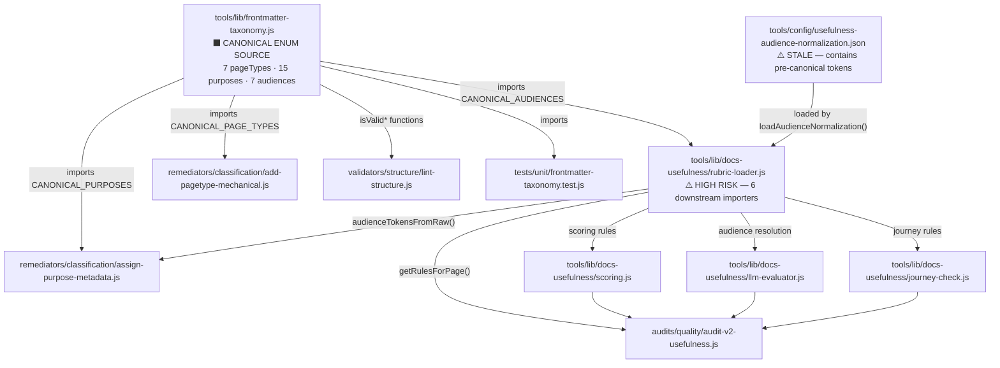

### Risk classification

| Change                                            | Risk       | Affected downstream                                                            | Failure mode                                                                                                                             |
| ------------------------------------------------- | ---------- | ------------------------------------------------------------------------------ | ---------------------------------------------------------------------------------------------------------------------------------------- |
| Fix `rubric-loader.js` AUDIENCE_ENUM (9→7 tokens) | **HIGH**   | `scoring.js`, `llm-evaluator.js`, `journey-check.js`, `audit-v2-usefulness.js` | Silent score regression if deprecated tokens appear in live frontmatter — audit frontmatter first to confirm no deprecated tokens in use |
| Fix `usefulness-audience-normalization.json`      | **MEDIUM** | `rubric-loader.js` → 6 scripts                                                 | Stale synonym entries cause `unknown` fallback, not crash — regression is scoring drift not breakage                                     |
| Fix `assign-purpose-metadata.js` heuristics       | **MEDIUM** | All pages it processes                                                         | Wrong purpose written to thousands of files — dry-run on sample before applying at scale                                                 |
| Split `lint-structure.js`                         | **LOW**    | CLI tool (no library importers)                                                | Script renamed/split — update any docs referencing the old filename                                                                      |
| Fix `add-pagetype-mechanical.js` overview alias   | **LOW**    | Pages currently assigned `pageType: overview`                                  | Already partially fixed in rule 10; verify before extending                                                                              |
| Add new dispatchers                               | **NONE**   | Nothing — purely additive                                                      | N/A                                                                                                                                      |
| Add new validator scripts                         | **NONE**   | Nothing — purely additive                                                      | N/A                                                                                                                                      |

### Required pre-flight before any change to rubric-loader.js

Run: `grep -r "audience:" v2/ | grep -v "orchestrator\|gateway\|developer\|delegator\|builder\|founder\|community"` — confirms no deprecated tokens in live frontmatter. If any found, migrate them first.

---

## 2. Framework Architecture Decisions

### Where things live in the repo

| Artefact type                | Current location                         | Recommended location                             | Reason                                            |
| ---------------------------- | ---------------------------------------- | ------------------------------------------------ | ------------------------------------------------- |
| Generated reports (JSON)     | `workspace/reports/repo-ops/` mixed      | `workspace/reports/<dispatcher-name>/`           | Each dispatcher owns its report directory         |
| Generated reports (MDX)      | scattered                                | `workspace/reports/<dispatcher-name>/report.mdx` | Human-readable companion alongside JSON           |
| Canonical enum configs       | `tools/config/`                          | `tools/config/` — keep                           | Already established, works                        |
| Dispatcher-specific configs  | none                                     | `tools/config/<dispatcher-name>/`                | Co-locate config with the dispatcher that uses it |
| Script canonical source      | JSDoc headers                            | JSDoc headers — keep                             | Already migrated (SCRIPT-GOVERNANCE Task 7)       |
| Content framework references | `v2/orchestrators/_workspace/canonical/` | — keep                                           | These are content artefacts, not code             |
| Script library utilities     | `tools/lib/`                             | `tools/lib/` — keep                              | Already established                               |

### Dual output pattern — AI canonical → MDX human readable

Some scripts need to emit two formats from one run. Pattern already exists in repo (generate-docs-guide-indexes.js, generate-script-registry.js). Standardise it:

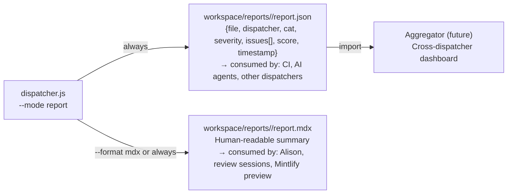

**Rule:** Every dispatcher always writes JSON. MDX is either generated by the same script (`--format mdx`) or by a paired `generate-<name>-report-mdx.js` if the conversion is complex.

### Script canonical source — JSDoc @dispatcher tag

Each script already has JSDoc headers (SCRIPT-GOVERNANCE Task 7). Add one new tag: `@dispatcher` — declares which dispatcher this script belongs to. This makes the dispatcher catalog machine-discoverable.

```js
/**
 * @pipeline content
 * @concern validate
 * @dispatcher frontmatter
 * @canonical tools/lib/frontmatter-taxonomy.js
 */
```

The dispatcher reads its execution manifest by scanning for `@dispatcher: <name>` across the script registry — no hard-coded script list in the dispatcher itself.

---

## 3. Dispatchers — Grouping by Concern

### Decision: 7 functional dispatchers + 1 existing governance pipeline

The checks.mdx 9 categories map to 7 functional dispatchers. These are action-oriented names (what you're checking), not audit-category names (what the rubric calls it):

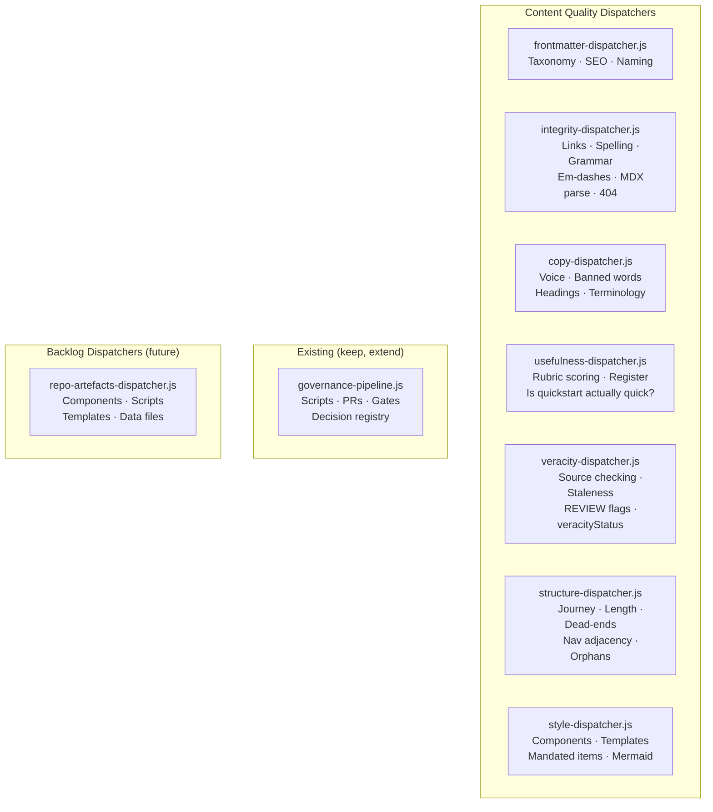

### Dispatcher → Checks.mdx category mapping

| Dispatcher                  | Checks.mdx Cat                      | Scripts (check)                                                                                     | Scripts (remediate)                                                       |
| --------------------------- | ----------------------------------- | --------------------------------------------------------------------------------------------------- | ------------------------------------------------------------------------- |
| `frontmatter-dispatcher.js` | Cat 1                               | `validate-frontmatter.js` (NEW)                                                                     | `repair-frontmatter-taxonomy.js` (NEW)                                    |
| `integrity-dispatcher.js`   | Cat 8 + Cat 2 (spelling/grammar/em) | `check-mdx-safe-markdown.js`, `check-anchor-usage.js`, `check-grammar-en-gb.js`, `lint-patterns.js` | `repair-mdx-safe-markdown.js`, `repair-spelling.js`                       |
| `copy-dispatcher.js`        | Cat 2 + Cat 3                       | `lint-copy.js`, `check-double-headers.js` → `validate-headings.js`                                  | `style-and-language-homogenizer-en-gb.js`, `repair-ownerless-language.js` |
| `usefulness-dispatcher.js`  | Cat 4                               | `audit-v2-usefulness.js`, `lint-structure.js` → `validate-structure.js`                             | (advisory flags only — no auto-repair)                                    |
| `veracity-dispatcher.js`    | Cat 6                               | `docs-fact-registry.js`, `validate-veracity-status.js` (NEW)                                        | (human-only — flags for review)                                           |
| `structure-dispatcher.js`   | Cat 4 + Cat 7                       | `check-docs-path-sync.js`, `validate-nav-journeys.js` (NEW)                                         | `sync-docs-paths.js`                                                      |
| `style-dispatcher.js`       | Cat 5                               | `component-layout-governance.js`, `check-component-health.js`, `check-mdx-component-scope.js`       | `repair-component-metadata.js`                                            |
| `governance-pipeline.js`    | Cat 9                               | `audit-script-inventory.js`, `check-pr-template.js`                                                 | `repair-script-inventory.js`                                              |

### Dispatcher architecture (single dispatcher pattern, all 7 share it)

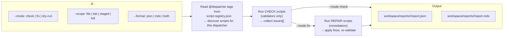

### Combined pipeline dispatcher (master entry point)

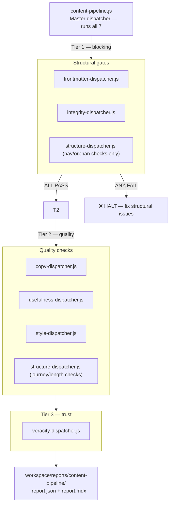

---

## 4. Approach Decision — New vs. Audit + Update

### Rule

**Audit and update existing scripts unless** the script's core logic is wrong (not just stale). Create new scripts only for:

- Dispatcher entry points (none exist)
- Genuinely missing validators (`validate-frontmatter.js`, `validate-veracity-status.js`, `validate-nav-journeys.js`)
- Shared output library (`pipeline-report.js`)

**Do not rewrite working scripts.** Update them to: (a) import from canonical sources, (b) emit structured JSON output alongside existing console output.

---

## 5. Script Recommendations — Full Table

### Priority 1: Fix schema drift (do first — everything else depends on it)

| Action     | File                                                    | What changes                                                                                                                    | Risk                               | Depends on                                             |
| ---------- | ------------------------------------------------------- | ------------------------------------------------------------------------------------------------------------------------------- | ---------------------------------- | ------------------------------------------------------ |
| **UPDATE** | `tools/lib/docs-usefulness/rubric-loader.js`            | Remove hardcoded 9-token AUDIENCE_ENUM; derive from `CANONICAL_AUDIENCES`                                                       | HIGH — pre-flight audit required   | Pre-flight: grep for deprecated audience tokens in v2/ |
| **UPDATE** | `tools/config/usefulness-audience-normalization.json`   | Update synonym mappings to 7-token canonical set; remove stale entries (e.g., `gpu-provider`, `lpt-holder` if not in canonical) | MEDIUM                             | rubric-loader.js fix                                   |
| **UPDATE** | `remediators/classification/assign-purpose-metadata.js` | Align fallback heuristics to canonical 15 purposes (remove rubric-internal labels `how_to`, `landing` from written output)      | MEDIUM — dry-run on 10 pages first | frontmatter-taxonomy.js canonical list                 |
| **UPDATE** | `remediators/classification/add-pagetype-mechanical.js` | Verify rule 10 `overview` → `concept + pageVariant:overview` fix is complete; add structured JSON output                        | LOW                                | frontmatter-taxonomy.js                                |

### Priority 2: Output contract (required before dispatcher can aggregate)

| Action     | File                                                      | What changes                                                                                                                                          |
| ---------- | --------------------------------------------------------- | ----------------------------------------------------------------------------------------------------------------------------------------------------- |
| **NEW**    | `tools/lib/pipeline-report.js`                            | Shared library: `normaliseIssue({file, dispatcher, cat, severity, check_id, message})`, `writeReport(issues, outputDir)` — all validators import this |
| **UPDATE** | `validators/content/structure/lint-structure.js`          | Add `--json` flag that writes structured JSON alongside existing console output (no logic change)                                                     |
| **UPDATE** | `validators/content/copy/lint-copy.js`                    | Add `--json` flag                                                                                                                                     |
| **UPDATE** | `validators/content/copy/lint-patterns.js`                | Add `--json` flag                                                                                                                                     |
| **UPDATE** | `validators/content/structure/check-anchor-usage.js`      | Add `--json` flag                                                                                                                                     |
| **UPDATE** | `validators/content/structure/check-mdx-safe-markdown.js` | Add `--json` flag                                                                                                                                     |
| **UPDATE** | `audits/content/quality/docs-fact-registry.js`            | Update output to structured JSON `{page, claims[], status, sources[]}`                                                                                |

### Priority 3: Frontmatter consolidation (Cat 1 — core dispatcher)

| Action    | File                                                                | What changes                                                                                                                                                                       |
| --------- | ------------------------------------------------------------------- | ---------------------------------------------------------------------------------------------------------------------------------------------------------------------------------- |
| **NEW**   | `validators/content/structure/validate-frontmatter.js`              | Extract Cat 1 from `lint-structure.js`: all 10 required fields, canonical enum validation, `veracityStatus` check, deprecated value detection; emits JSON via `pipeline-report.js` |
| **NEW**   | `remediators/content/classification/repair-frontmatter-taxonomy.js` | Unified frontmatter repair: migrate deprecated values to canonical, infer and add missing fields using logic from `add-pagetype-mechanical.js` + `assign-purpose-metadata.js`      |
| **SPLIT** | `validators/content/structure/lint-structure.js`                    | Remove Cat 1 checks (now in `validate-frontmatter.js`); keep Cat 3 + Cat 4 structural checks only; rename to `validate-structure.js`                                               |
| **NEW**   | `validators/content/structure/check-purpose-rubric-sync.js`         | Runtime guard: verify all 15 `CANONICAL_PURPOSES` have a mapping in `purposeToRubricPurpose()`; fail loudly on gaps                                                                |

### Priority 4: Missing validators (gaps in current inventory)

| Action            | File                                                                            | Cat | What it checks                                                                                                              |
| ----------------- | ------------------------------------------------------------------------------- | --- | --------------------------------------------------------------------------------------------------------------------------- |
| **NEW**           | `validators/content/veracity/validate-veracity-status.js`                       | 6   | Cross-checks `veracityStatus` frontmatter vs. presence of `REVIEW:` flags and `lastVerified` staleness; flags inconsistency |
| **NEW**           | `validators/content/structure/validate-nav-journeys.js`                         | 7   | Dead-end detection: pages with no `next` cross-reference and no routing card; journey breaks                                |
| **EXTEND→RENAME** | `validators/content/structure/check-double-headers.js` → `validate-headings.js` | 3   | Add: 3-6 word length rule, domain-anchor rule, no question forms, 20/25 rubric scoring                                      |

### Priority 5: Dispatcher entry points (new files)

| Action  | File                                         | Purpose                                                             |
| ------- | -------------------------------------------- | ------------------------------------------------------------------- |
| **NEW** | `dispatch/content/frontmatter-dispatcher.js` | Cat 1 dispatcher — both `--mode check` and `--mode fix`             |
| **NEW** | `dispatch/content/integrity-dispatcher.js`   | Cat 8 + spelling/grammar — check and fix                            |
| **NEW** | `dispatch/content/copy-dispatcher.js`        | Cat 2 + Cat 3 — check and fix                                       |
| **NEW** | `dispatch/content/usefulness-dispatcher.js`  | Cat 4 — check only (advisory; no auto-repair)                       |
| **NEW** | `dispatch/content/veracity-dispatcher.js`    | Cat 6 — check only (human-review output)                            |
| **NEW** | `dispatch/content/structure-dispatcher.js`   | Cat 4 + Cat 7 — check and fix (nav sync only)                       |
| **NEW** | `dispatch/content/style-dispatcher.js`       | Cat 5 — check and fix                                               |
| **NEW** | `dispatch/content/content-pipeline.js`       | Master dispatcher — runs all 7, 3-tier execution, aggregated report |

### SEO improvement note (frontmatter dispatcher backlog)

User flagged: SEO needs improvement — should look up terms on Google. This requires an external API call (Search Console or Google's suggestions). This is a separate concern from static validation. Flag as **backlog item** for `frontmatter-dispatcher.js v2` — wire to `generate-seo.js` which already exists but may need external API integration.

### Style & UX — Mermaid styling

No existing script validates mermaid diagram viewability or styling. Flag as **new script** in `style-dispatcher.js` scope: `validators/content/structure/check-mermaid-blocks.js` — validates mermaid code blocks parse, use correct theme, aren't empty.

---

## 6. Files / Locations Summary

| What                  | Where                                             | Notes                                                      |
| --------------------- | ------------------------------------------------- | ---------------------------------------------------------- |
| Dispatcher scripts    | `operations/scripts/dispatch/content/`            | New subdirectory alongside existing `dispatch/governance/` |
| Report JSON           | `workspace/reports/<dispatcher-name>/report.json` | Per-dispatcher, per-run                                    |
| Report MDX            | `workspace/reports/<dispatcher-name>/report.mdx`  | Human-readable companion                                   |
| Configs               | `tools/config/`                                   | Keep existing pattern                                      |
| Enum canonical source | `tools/lib/frontmatter-taxonomy.js`               | Already established                                        |
| Script metadata       | JSDoc `@dispatcher` tag in each script header     | Machine-discoverable via `script-registry.json`            |
| Content frameworks    | `v2/orchestrators/_workspace/canonical/`          | Content artefacts — not code                               |

---

## 7. Implementation Order

1. **Pre-flight audit** — grep for deprecated audience tokens in `v2/`; confirm safe to update rubric-loader.js
2. **Fix schema drift** — `rubric-loader.js` + `usefulness-audience-normalization.json` (with regression test run)
3. **Create `pipeline-report.js` lib** — shared output contract; update 6 existing validators to use it
4. **Create `validate-frontmatter.js`** + `repair-frontmatter-taxonomy.js`
5. **Split `lint-structure.js`** → `validate-structure.js`
6. **Create missing validators** — `validate-veracity-status.js`, `validate-nav-journeys.js`, `validate-headings.js`
7. **Create `frontmatter-dispatcher.js`** first (smallest scope, highest value, Cat 1 is the gate for everything else)
8. **Create remaining dispatchers** in priority order: integrity → copy → structure → style → usefulness → veracity
9. **Create `content-pipeline.js`** master dispatcher
10. **Add `@dispatcher` JSDoc tag** to all scripts in the registry

---

## 8. Open Questions Before Implementation

| Question                                                                     | Options                                           | Recommendation                                                                         |
| ---------------------------------------------------------------------------- | ------------------------------------------------- | -------------------------------------------------------------------------------------- |
| Merge `lint-copy.js` + `lint-patterns.js`?                                   | Keep separate / merge to `validate-voice-copy.js` | Audit overlap first; merge only if >80% duplicate checks                               |
| `process-pipeline.js` (my-process.mdx phases) — same or separate dispatcher? | Same master / separate dispatcher                 | Separate — process pipeline is about production workflow state, not quality validation |
| SEO external API — include in frontmatter dispatcher?                        | Yes now / backlog                                 | Backlog — mark as v2 of frontmatter-dispatcher                                         |
| `content-pipeline.js` — should it be in `dispatch/content/` or root?         | Sub-dir / root                                    | Sub-dir, consistent with existing `dispatch/governance/pipelines/` pattern             |

---

## Verification Plan

- After rubric-loader.js fix: run `audit-v2-usefulness.js` on 10 known-good Orchestrators pages — scores should be stable (within ±5 points)
- After validate-frontmatter.js: run against all 70 Orchestrators IA-mapped pages — zero schema-drift errors
- After `frontmatter-dispatcher.js`: run `--mode check --tab orchestrators` — should produce clean structured JSON, zero crashes
- After all dispatchers: run `content-pipeline.js --mode check --file v2/orchestrators/guides/operator-considerations/operator-rationale.mdx` — produces full Cat 1–9 report
- Run `node operations/tests/run-all.js` after each stage

---

# Script Pipeline Architecture Plan v1

## Checks Pipeline Consolidation + Process Pipeline for my-process.mdx

---

## Context

`script-pipeline-index.mdx` (54KB) documents 26+ tools mapped against `checks.mdx` Cat 1–9 quality categories. The core problem is that these tools have no single dispatcher and share 5 root cause patterns that create silent failures. This plan designs the architecture to consolidate, fix, and wire everything into two purpose-built pipelines.

**Why now:** The veracity pass (Phase 7) and content review cycle require a reliable, runnable checks process. Currently running Cat 1 alone requires invoking 3 separate scripts with inconsistent output formats and stale enums.

---

## Root Cause Patterns (Cross-Script)

| #   | Pattern                           | Impact                                                                                                                                   | Affected Files                                                                                                                            |
| --- | --------------------------------- | ---------------------------------------------------------------------------------------------------------------------------------------- | ----------------------------------------------------------------------------------------------------------------------------------------- |
| 1   | **Schema drift**                  | Scripts maintain their own enum lists instead of importing from `frontmatter-taxonomy.js`                                                | `rubric-loader.js` (9-token audiences vs. 7-token canonical), `usefulness-audience-normalization.json` (stale tokens)                     |
| 2   | **Concern bleed**                 | Single scripts do validation + classification + reporting instead of one concern per file                                                | `lint-structure.js` (Cat 1 + Cat 3 + Cat 4 mixed), `add-pagetype-mechanical.js` + `assign-purpose-metadata.js` (overlapping repair logic) |
| 3   | **No structured output contract** | Scripts emit human-readable text, not structured JSON — pipeline aggregation is impossible                                               | Nearly all validators emit console.log not `{issues: [], score: n}`                                                                       |
| 4   | **No dispatcher**                 | 154 scripts, zero entry points for the 9-category checks pipeline                                                                        | All of `operations/scripts/`                                                                                                              |
| 5   | **Two-layer purpose translation** | `purposeToRubricPurpose()` maps canonical 15 purposes → 10 rubric-internal labels with no runtime sync check — silent data loss possible | `frontmatter-taxonomy.js` → `rubric-loader.js` → scoring                                                                                  |

---

## Two Pipelines Required

`checks.mdx` (Cat 1–9) and `my-process.mdx` (Phases 1–9) are **different concerns and need separate dispatchers**:

| Pipeline              | Concern                                      | Trigger                    | Runs                            |
| --------------------- | -------------------------------------------- | -------------------------- | ------------------------------- |
| `checks-pipeline.js`  | Quality validation — is the content correct? | Per-page, per-tab, CI gate | On any page at any time         |
| `process-pipeline.js` | Production workflow — are the phases done?   | Per-tab, human-driven      | During content production cycle |

They are **not alternatives** — `process-pipeline.js` calls `checks-pipeline.js` as a sub-step in Phases 7, 8, and 9 of my-process.mdx.

---

## Pipeline 1: `checks-pipeline.js`

### Dispatcher Architecture

```mermaid
flowchart TB
    subgraph ENTRY["dispatch/content/checks-pipeline.js"]
        MODE["--mode: report | fix | dry-run"]
        SCOPE["--scope: --file | --tab | --staged | --full"]
        CAT["--cat: 1-9 | all"]
    end

    ENTRY --> T1

    subgraph T1["TIER 1 — Structural (blocking)"]
        direction LR
        C1["Cat 1: Frontmatter & Taxonomy
        → validate-frontmatter.js (NEW)
        Checks: 10 required fields, canonical enums,
        veracityStatus, deprecated value detection"]

        C7["Cat 7: Navigation & IA
        → check-docs-path-sync.js (update)
        → validate-nav-journeys.js (NEW)
        Checks: docs.json sync, orphans,
        dead-end detection, file naming"]

        C8["Cat 8: Links & Rendering
        → check-mdx-safe-markdown.js
        → check-anchor-usage.js
        Checks: internal links, MDX parse,
        snippet imports, TODO/TBD in published"]
    end

    T1 -->|"ALL PASS"| T2
    T1 -->|"ANY FAIL"| HALT["❌ HALT
    Fix structural issues first.
    Output: checks-report.json (partial)"]

    subgraph T2["TIER 2 — Content Quality (advisory, non-blocking)"]
        direction LR
        C2["Cat 2: Voice & Copy
        → validate-voice-copy.js (MERGE lint-copy + lint-patterns)
        → check-grammar-en-gb.js
        Checks: banned words/constructions,
        UK English, hedging, register"]

        C3["Cat 3: Section Naming & Headings
        → validate-headings.js (EXTEND check-double-headers)
        Checks: 3-6 word rule, domain-anchor,
        no question forms, rubric 20/25 scoring"]

        C4["Cat 4: Page Structure
        → validate-structure.js (SPLIT from lint-structure)
        Checks: one purpose/audience, journey
        adjacency, prerequisites, scope clarity"]

        C5["Cat 5: Layout & Components
        → component-layout-governance.js (update)
        → check-component-health.js
        Checks: correct template by pageType,
        required sections, approved components"]
    end

    T2 -->|complete| T3
    T2 -->|"flags found"| CONTINUE["⚠️ Quality flags — continue to Tier 3
    (non-blocking: content is structurally sound)"]

    subgraph T3["TIER 3 — Trust & Governance"]
        direction LR
        C6["Cat 6: Veracity & Factual Accuracy
        → docs-fact-registry.js (update output format)
        → docs-page-research.js
        Checks: REVIEW flags, unverified claims,
        veracityStatus vs. field content"]

        C9["Cat 9: Process & Governance
        → audit-script-inventory.js
        → check-pr-template.js
        Checks: gate prerequisites,
        human sign-off, decision registry"]
    end

    T3 --> REPORT

    subgraph REPORT["Output"]
        JSON["checks-report.json
        {page, cat, severity, issues[], score}"]
        MD["checks-report.md
        Human-readable summary by category + page"]
    end
```

### Modes

| Mode             | Behaviour                                               |
| ---------------- | ------------------------------------------------------- |
| `--mode report`  | Validate only. No writes. Exit 0=clean, 2=issues found. |
| `--mode dry-run` | Preview repairs. No writes. Shows what would change.    |
| `--mode fix`     | Apply remediators, re-validate, stage changed files.    |

### Scope flags

| Flag                      | Scope                           |
| ------------------------- | ------------------------------- |
| `--file path/to/file.mdx` | Single page                     |
| `--tab orchestrators`     | All files in tab                |
| `--staged`                | Git-staged files only (CI hook) |
| `--full`                  | All v2/ MDX files               |

---

## Pipeline 2: `process-pipeline.js`

### Dispatcher Architecture

```mermaid
flowchart TD
    subgraph ENTRY["dispatch/content/process-pipeline.js"]
        TAB["--tab: orchestrators | gateways | developers | about | delegators"]
        PHASE["--phase: 1-9 | from-phase N | status"]
    end

    ENTRY --> STATUS["Read tab-status.md
    Determine current phase gate"]

    STATUS --> P1["Phase 1: Audience & Personas
    → prompts/audience-design-v5.md
    Output: orchestrators-audience-doc.md"]

    P1 --> P2["Phase 2: IA Structuring
    → prompts/structure-audit.md
    Output: tab-map.mdx (⚠️ DOES NOT EXIST — blocker)"]

    P2 --> P3["Phase 3: Content Mapping
    → content-pass.md (AUDIT mode)
    → generate-content-gap-reconciliation.js
    Output: [tab]-content-scan.md"]

    P3 --> P4["Phase 4: IA Page Structure
    → tab-map.mdx (requires Phase 2 output)
    Output: IA with journey mappings"]

    P4 --> P5["Phase 5: Research & Gaps
    → docs-page-research.js
    → docs-research-packet.js
    Output: research packs per section"]

    P5 --> P6["Phase 6: Voice & Terminology
    → voice-rules.md + Frameworks.mdx
    → Terminology lock (human gate)
    Output: terminology-lock.md"]

    P6 --> P7["Phase 7: Copy Review
    → checks-pipeline.js --cat 2,3,4
    Gate: human IA review + lock"]

    P7 --> P8["Phase 8: Layout
    → checks-pipeline.js --cat 5,8
    Gate: all Cat 2-4 flags resolved"]

    P8 --> P9["Phase 9: Human Review
    → checks-pipeline.js --full
    Gate: human sign-off"]

    P9 --> DONE["✅ Tab content pass complete
    Update tab-status.md"]
```

**Note:** `process-pipeline.js` does not run autonomously — it is a tracking and orchestration tool that tells the operator which prompt/script/check to run next, checks prerequisites, and updates `tab-status.md`. Human gate decisions remain human-only.

---

## Script Recommendations

### Cat 1 — Frontmatter & Taxonomy (highest priority)

| Action     | File                                                                | Change                                                                                                                                                                                                         | Root Cause Fixed                          |
| ---------- | ------------------------------------------------------------------- | -------------------------------------------------------------------------------------------------------------------------------------------------------------------------------------------------------------- | ----------------------------------------- |
| **NEW**    | `validators/content/structure/validate-frontmatter.js`              | Extract Cat 1 validation from `lint-structure.js`; add all 10 required fields check; add `veracityStatus` validation; emit structured JSON                                                                     | #2 concern bleed, #3 no output contract   |
| **NEW**    | `remediators/content/classification/repair-frontmatter-taxonomy.js` | Unified repair: merge `add-pagetype-mechanical.js` + `assign-purpose-metadata.js` logic; migrate deprecated values; infer missing fields                                                                       | #2 concern bleed                          |
| **UPDATE** | `tools/lib/docs-usefulness/rubric-loader.js`                        | Replace hardcoded 9-token AUDIENCE_ENUM with `import { CANONICAL_AUDIENCES } from '../frontmatter-taxonomy.js'`                                                                                                | #1 schema drift                           |
| **UPDATE** | `tools/config/usefulness-audience-normalization.json`               | Update all mappings to 7-token canonical set (founder, builder, developer, gateway, orchestrator, delegator, community); remove stale entries                                                                  | #1 schema drift                           |
| **UPDATE** | `remediators/content/classification/add-pagetype-mechanical.js`     | Verify `overview` alias fix is complete (rule 10 — maps to `concept` + `pageVariant: overview`); add runtime test for all 7 canonical pageTypes                                                                | #1 schema drift                           |
| **UPDATE** | `remediators/content/classification/assign-purpose-metadata.js`     | Align all fallback heuristics to canonical 15 purposes (some currently map to rubric-internal labels like `how_to`, `landing` which are not canonical); import CANONICAL_PURPOSES from frontmatter-taxonomy.js | #1 schema drift, #5 two-layer translation |
| **SPLIT**  | `validators/content/structure/lint-structure.js`                    | Remove Cat 1 checks (move to `validate-frontmatter.js`); keep only Cat 3 + Cat 4 structural checks; rename to `validate-structure.js`                                                                          | #2 concern bleed                          |
| **NEW**    | `validators/content/structure/check-purpose-rubric-sync.js`         | Runtime sync check: verify `purposeToRubricPurpose()` maps cover all 15 canonical purposes; fail loudly if any purpose falls through                                                                           | #5 two-layer translation                  |

### Cat 2 — Voice & Copy

| Action            | File                                      | Change                                                                                                                                                                |
| ----------------- | ----------------------------------------- | --------------------------------------------------------------------------------------------------------------------------------------------------------------------- |
| **AUDIT → MERGE** | `lint-copy.js` + `lint-patterns.js`       | Audit overlap before merging; if coverage is truly separate, keep both but add structured JSON output to each; if 80%+ overlapping, merge to `validate-voice-copy.js` |
| **UPDATE**        | `style-and-language-homogenizer-en-gb.js` | Sync banned words/constructions list with checks.mdx Cat 2 definitive list (currently may be ahead or behind)                                                         |

### Cat 3 — Section Naming & Headings

| Action              | File                                               | Change                                                                                                                                                   |
| ------------------- | -------------------------------------------------- | -------------------------------------------------------------------------------------------------------------------------------------------------------- |
| **EXTEND → RENAME** | `check-double-headers.js` → `validate-headings.js` | Add: 3-6 word length check, domain-anchor rule enforcement, no question forms, 20/25 rubric scoring, no generic labels (Introduction, Overview, Summary) |

### Cat 4 — Page Structure

| Action    | File                                          | Change                                                                                                                                        |
| --------- | --------------------------------------------- | --------------------------------------------------------------------------------------------------------------------------------------------- |
| **SPLIT** | `lint-structure.js` → `validate-structure.js` | After extracting Cat 1 to validate-frontmatter.js: keep one-purpose/audience rule, journey adjacency, dead-end detection, prerequisites check |

### Cat 5 — Layout & Components

| Action     | File                             | Change                                                                                                                                                    |
| ---------- | -------------------------------- | --------------------------------------------------------------------------------------------------------------------------------------------------------- |
| **UPDATE** | `component-layout-governance.js` | Encode pageType→required-template matrix from checks.mdx Cat 5; validate component matrix per pageType (concept, tutorial, guide, instruction, reference) |

### Cat 6 — Veracity

| Action      | File                                                      | Change                                                                                                                                                                             |
| ----------- | --------------------------------------------------------- | ---------------------------------------------------------------------------------------------------------------------------------------------------------------------------------- |
| **UPDATE**  | `docs-fact-registry.js`                                   | Update output format to structured JSON `{page, claims[], status, sources[]}` compatible with dispatcher report aggregation                                                        |
| **MISSING** | `validators/content/veracity/validate-veracity-status.js` | New: cross-check `veracityStatus` frontmatter value against presence of REVIEW flags and last-verified date; flag inconsistency (e.g., status=`verified` but REVIEW flags present) |

### Cat 7 — Navigation & IA

| Action     | File                                                    | Change                                                                                                                   |
| ---------- | ------------------------------------------------------- | ------------------------------------------------------------------------------------------------------------------------ |
| **UPDATE** | `check-docs-path-sync.js`                               | Extend: orphan detection (file exists but not in docs.json), file naming convention enforcement, workspace TTL check     |
| **NEW**    | `validators/content/structure/validate-nav-journeys.js` | Dead-end detection: pages with no next/previous cross-reference and no routing card; pages that break journey continuity |

### Cat 8 — Links & Rendering

| Action     | File                                                  | Change                                                                         |
| ---------- | ----------------------------------------------------- | ------------------------------------------------------------------------------ |
| **UPDATE** | `check-anchor-usage.js`, `check-mdx-safe-markdown.js` | Update to emit structured JSON (currently text output); no logic change needed |

### Cat 9 — Process & Governance

| Action              | File                                                | Change                                                  |
| ------------------- | --------------------------------------------------- | ------------------------------------------------------- |
| **ALREADY COVERED** | `audit-script-inventory.js`, `check-pr-template.js` | Wire to dispatcher output format; no major logic change |

### Dispatcher (New Files)

| Action  | File                                   | Purpose                                                                                                                                   |
| ------- | -------------------------------------- | ----------------------------------------------------------------------------------------------------------------------------------------- |
| **NEW** | `dispatch/content/checks-pipeline.js`  | Main Cat 1–9 dispatcher — 3-tier execution, structured report output                                                                      |
| **NEW** | `dispatch/content/process-pipeline.js` | my-process.mdx Phases 1–9 orchestrator — phase state tracking, gate prerequisites, delegates to checks-pipeline.js                        |
| **NEW** | `tools/lib/pipeline-report.js`         | Shared report aggregation library — normalises issue JSON from all validators to common schema `{file, cat, severity, message, check_id}` |

---

## Missing Scripts Not in Current Inventory

| Gap                                             | Recommended Script                  | Cat |
| ----------------------------------------------- | ----------------------------------- | --- |
| No `veracityStatus` validator                   | `validate-veracity-status.js`       | 6   |
| No journey dead-end detector                    | `validate-nav-journeys.js`          | 7   |
| No canonical purpose→rubric sync check          | `check-purpose-rubric-sync.js`      | 1   |
| No unified frontmatter repair (repair ≠ assign) | `repair-frontmatter-taxonomy.js`    | 1   |
| No pipeline report aggregator library           | `pipeline-report.js` (lib)          | All |
| No tab-map.mdx (Phase 4 pipeline blocker)       | `tab-map.mdx` (content, not script) | —   |

---

## Critical Files to Modify

| File                                                                               | Change Type                                              |
| ---------------------------------------------------------------------------------- | -------------------------------------------------------- |
| `tools/lib/docs-usefulness/rubric-loader.js`                                       | Update — fix audience enum drift                         |
| `tools/config/usefulness-audience-normalization.json`                              | Update — sync to 7-token canonical set                   |
| `operations/scripts/remediators/content/classification/add-pagetype-mechanical.js` | Update — verify overview fix, add structured output      |
| `operations/scripts/remediators/content/classification/assign-purpose-metadata.js` | Update — fix purpose heuristic alignment to canonical 15 |
| `operations/scripts/validators/content/structure/lint-structure.js`                | Split — extract Cat 1 to validate-frontmatter.js         |

---

## Implementation Order

1. **Fix schema drift first** (root cause #1): update `rubric-loader.js` + `usefulness-audience-normalization.json` — everything else builds on correct enums
2. **Create `pipeline-report.js` lib** — shared output contract all validators must conform to
3. **Create `validate-frontmatter.js`** — Cat 1 consolidation
4. **Split `lint-structure.js`** — Cat 1 extracted, Cat 3+4 kept
5. **Create `checks-pipeline.js` dispatcher** — wire Tier 1 first (Cat 1, 7, 8)
6. **Wire Tier 2** (Cat 2, 3, 4, 5) with existing scripts updated to structured output
7. **Wire Tier 3** (Cat 6, 9)
8. **Create `process-pipeline.js`** — phase tracking and gate checks

---

## Verification

- Run `checks-pipeline.js --mode report --tab orchestrators --cat 1` — should produce clean JSON with zero schema-drift errors after fixes
- Run `checks-pipeline.js --mode report --file v2/orchestrators/guides/operator-considerations/operator-rationale.mdx --cat all` — should produce structured report mapping issues to Cat 1-9
- Run `node operations/tests/run-all.js` after all script updates
- Validate `rubric-loader.js` audience enum against `frontmatter-taxonomy.js` canonical set programmatically
