{/* TODO:
Terminology Validation:
- Ensure the terminology and definitions used in this page is consistent with the resources/glossary terminology
Verify:
- Terminology is consistent with resources/glossary
*/}

import { GotoLink, LinkArrow } from '/snippets/components/elements/links/Links.jsx'
import { ScrollableDiagram } from '/snippets/components/displays/diagrams/ScrollableDiagram.jsx'
import { StyledSteps, StyledStep } from '/snippets/components/displays/steps/Steps.jsx'
import { FlexContainer } from '/snippets/components/wrappers/containers/Layout.jsx'
import { CustomDivider } from '/snippets/components/elements/spacing/Divider.jsx'
import { CustomCardTitle } from '/snippets/components/elements/text/Text.jsx'
import { Quote } from '/snippets/components/displays/quotes/Quote.jsx'
import { CenteredContainer } from '/snippets/components/wrappers/containers/Containers.jsx'
import { StyledTable } from '/snippets/components/displays/tables/Tables.jsx'

<CenteredContainer maxWidth="fit-content" margin="0 auto 2rem auto">
    <Card title={<CustomCardTitle icon="github" title="Go-Livepeer" style={{margin: "0 0.5rem -0.2rem 0"}} />} href="https://github.com/livepeer/go-livepeer" />
</CenteredContainer>

<Quote>
Gateways are essential infrastructure in the Livepeer network. They
provide the service coordination layer (routing & verification) that connects applications
to the decentralized GPU compute layer (DePIN). The requirements,
setup steps, and best practices for running a Gateway node.
</Quote>

<CustomDivider style={{margin: "0 0 -2rem 0"}} />

## Deployment

A **deployment** is the complete configuration of a Livepeer gateway, defined by three independent choices: operational mode, setup type, and node type.

This guide will walk through deployment of a gateway using `go-livepeer` and cover both on-chain and off-chain modes using Docker, Windows & Linux OS environments with node configurations for video, AI, and dual workloads.

<AccordionGroup>
  {/* <Accordion title="Deployment" icon="server">
    ## Deployment

    A **deployment** is the complete configuration of a Livepeer gateway, defined by three independent choices: operational mode, setup type, and node type. These axes are orthogonal - each can be selected independently of the others.

    <StyledTable variant="bordered">
    <thead>
        <TableRow header>
        <TableCell header>Axis</TableCell>
        <TableCell header>Options</TableCell>
        <TableCell header>What it decides</TableCell>
        </TableRow>
    </thead>
    <tbody>
        <TableRow>
        <TableCell>**Operational mode**</TableCell>
        <TableCell>On-chain / Off-chain</TableCell>
        <TableCell>How your gateway integrates with the Livepeer protocol - blockchain interaction, orchestrator discovery, payment settlement, ETH management</TableCell>
        </TableRow>
        <TableRow>
        <TableCell>**Setup type**</TableCell>
        <TableCell>go-livepeer / SDK / GWID / Hosted</TableCell>
        <TableCell>What software you run and how you install it</TableCell>
        </TableRow>
        <TableRow>
        <TableCell>**Node type**</TableCell>
        <TableCell>Video / AI / Dual</TableCell>
        <TableCell>What workloads your gateway routes</TableCell>
        </TableRow>
    </tbody>
    </StyledTable>
  </Accordion> */}
  <Accordion title={ Setup Type: <Icon icon="github" size={18} /> <LinkArrow label="go-livepeer" href="https://github.com/livepeer/go-livepeer" newline={false} /> } >
    ## Setup Type: `go-livepeer`
    The setup type determines what software you run and how you install it.
    The reference setup type is running the `go-livepeer` gateway software, whichcan be installed via source binary or Docker and is the recommended setup for most users as it provides the most features, stability, and compatibility with the Livepeer network.

    For alternative setup types see the [Gateway Setup Options](../guides/deployment-details/setup-options) page, which covers using the Livepeer SDK, running a gateway with a GWID, and using hosted gateway services.
  </Accordion>
  <Accordion title={ Operating System: <Icon icon="docker" size={18} /> Docker, <Icon icon="linux" size={18} /> Linux, <Icon icon="windows" size={18} /> Windows }>
    ## Operating System: Docker, Linux, Windows

    You can run a Livepeer gateway on either Linux or Windows, but Linux is recommended for production deployments due to better performance, stability, and compatibility with GPU drivers and containerization tools. Windows is suitable for development and testing.

    <StyledTable variant="bordered">
    <thead>
        <TableRow header>
        <TableCell header>Operating System</TableCell>
        <TableCell header>Pros</TableCell>
        <TableCell header>Cons</TableCell>
        </TableRow>
    </thead>
    <tbody>
        <TableRow>
        <TableCell>**Linux**</TableCell>
        <TableCell>- Better performance and stability - Native support for NVIDIA drivers and Docker - More widely used in production environments</TableCell>
        <TableCell>- Steeper learning curve for users familiar with Windows - Requires command-line interaction for setup and management</TableCell>
        </TableRow>
        <TableRow>
        <TableCell>**Windows**</TableCell>
        <TableCell>- Easier setup for users familiar with Windows - Suitable for development and testing</TableCell>
        <TableCell>- Potential performance issues with GPU workloads - Limited support for containerization tools like Docker - Not recommended for production deployments</TableCell>
        </TableRow>
    </tbody>
    </StyledTable>
  </Accordion>
  <Accordion title={ Operational Modes: <Icon icon="link" size={18} /> <strong>On-chain</strong>, <Icon icon="floppy-disk" size={18} /> <strong>Off-chain</strong> } >
    ## Operational Modes
    The operational mode determines how your gateway integrates with the Livepeer protocol.
    You can run a gateway both independently: <Icon icon="floppy-disk" size={18} /> <strong>Off-chain</strong> or connected to the blockchain-based Livepeer network: <Icon icon="link" size={18} /> <strong>On-chain</strong>.

    <Icon icon="floppy-disk" size={18} /> Off-chain
    - Run a gateway that operates independently of the blockchain. This is ideal for testing, development, and private deployments. Off-chain gateways do not interact with the blockchain for orchestrator discovery or payment settlement - they rely on manual configuration and external payment mechanisms.

    <Icon icon="link" size={18} /> On-chain
    - Run a gateway that is fully connected to the blockchain-based Livepeer network (on Arbitrum). On-chain gateways interact with the blockchain for orchestrator discovery, payment settlement, and ETH management.
  </Accordion>
  <Accordion title={ Node Types: <Badge color="blue"> Video </Badge> <Badge color="purple"> AI </Badge> <Badge color="green"> Dual </Badge> } >
    ## Node Types

    The node type determines the workloads your gateway can route.
    You can run a Gateway in the following node configurations:

    - <Badge color="blue"> Video Only </Badge> -> traditional transcoding services
    - <Badge color="purple"> AI Only </Badge> -> AI inference services
    - <Badge color="green"> Dual: AI & Video </Badge> -> both video transcoding and AI
    inference services
  </Accordion>
</AccordionGroup>

<CustomDivider style={{margin: "-1rem 0 -2rem 0"}} />

## Gateway Operator Journey

<Columns cols={2}>
<FlexContainer justify="center">
  <Mermaid
    chart={`%%{init: {'theme': 'base', 'themeVariables': { 'primaryColor': '#1a1a1a', 'primaryTextColor': '#fff', 'primaryBorderColor': '#2d9a67', 'lineColor': '#2d9a67', 'secondaryColor': '#0d0d0d', 'tertiaryColor': '#1a1a1a', 'background': '#0d0d0d', 'fontFamily': 'system-ui', 'clusterBkg': '#0d0d0d', 'clusterBorder': '#2d9a67' }}}%%
      flowchart TB
      subgraph check["Check"]
          A["Check network & hardware requirements"]
      end

      subgraph install["Install"]
          B["Install go-livepeer on your OS"]
      end

      subgraph configure["Configure"]
          C1["Configure AI, transcoding, or both"]
          C2["Configure pricing, funding, & regions"]
      end

      subgraph test["Test"]
          D["Test & troubleshoot"]
      end

      subgraph connect["Connect"]
          E1["Connect with orchestrators"]
          E2["Route jobs"]
      end

      subgraph monitor["Monitor"]
          F["Monitor & optimise"]
      end

      A --> B
      B --> C1
      C1 --> C2
      C2 --> D
      D --> E1
      E1 --> E2
      E2 --> F

      classDef default fill:#1a1a1a,color:#fff,stroke:#2d9a67,stroke-width:2px`}
  />
</FlexContainer>

<FlexContainer justify="center" marginTop="-2.5rem">
<StyledSteps>
  <StyledStep title="Check Requirements">
 Check hardware, network, and software requirements.  
    <GotoLink
      label="Requirements"
      relativePath="./prepare"
    />
  </StyledStep>
  <StyledStep title="Install Gateway">
 Install the Livepeer Gateway software.  
    <GotoLink
      label="Installation Guide"
      relativePath="./install"
    />
  </StyledStep>
  <StyledStep title="Configure Gateway">
 Configure transcoding options, models, pipelines & pricing  
    <GotoLink
      label="Configuration Guide"
      relativePath="./configure"
    />
  </StyledStep>
  <StyledStep title="Test Gatway">
 Price & publish offerings to the Marketplace.  
    <GotoLink
      label="Testing Guide"
      relativePath="./test"
    />
  </StyledStep>
  <StyledStep title="Connect Gatway">
 Connect with Orchestrators, price & route offerings in the Marketplace.  
    <GotoLink
      label="Connect to the Livepeer Network"
      relativePath="./connect"
  />
  </StyledStep>
    <StyledStep title="Monitor & Optimise">
 Monitor performance, optimise routing & service quality.  
    <GotoLink
      label="Monitor & Optimise your Gateway"
      relativePath="./monitor"
    />
  </StyledStep>
</StyledSteps>

</FlexContainer>
</Columns>

<CustomDivider style={{margin: "2rem 0"}} />

## Gateway Architecture

```mermaid
%%{init: {'theme': 'base', 'themeVariables': { 'primaryColor': '#1a1a1a', 'primaryTextColor': '#fff', 'primaryBorderColor': '#2d9a67', 'lineColor': '#2d9a67', 'secondaryColor': '#0d0d0d', 'tertiaryColor': '#1a1a1a', 'background': '#0d0d0d', 'fontFamily': 'system-ui' }}}%%
flowchart LR
    subgraph INPUT["Input Sources"]
        CAM["Camera / RTMP / WebRTC"]
        VID["Video File"]
        AIIN["AI Prompt / Model Request"]
    end

    GATEWAY["Gateway Node<br/>• Ingest (RTMP/HTTP/WebRTC)<br/>• Segment video<br/>• Queue + order jobs<br/>• AI pipeline routing<br/>• Orchestrator selection<br/>• Verification & receipts"]

    CAM -->|"Live stream"| GATEWAY
    VID -->|"VOD upload"| GATEWAY
    AIIN -->|"AI job request"| GATEWAY

    subgraph JOBS["Workflows"]
        VJ["Video Transcoding Job"]
        AIJ["AI Inference Job<br/>(Daydream / ComfyStream / BYOC)"]
    end

    GATEWAY --> VJ
    GATEWAY --> AIJ

    subgraph ORCH["Orchestrator Network (GPU Operators)"]
        O1["Orchestrator A<br/>GPU Pool"]
        O2["Orchestrator B<br/>GPU Pool"]
        O3["Orchestrator C<br/>GPU Pool"]
    end

    VJ -->|"Transcode segments"| O1
    VJ --> O2
    AIJ -->|"Run model / inference"| O1
    AIJ --> O3

    subgraph OUTPUTS["Outputs"]
        HLS["Adaptive Bitrate Video (HLS/LL-HLS)"]
        AIOUT["AI Frames / Stylized Video"]
    end

    O1 --> GATEWAY
    O2 --> GATEWAY
    O3 --> GATEWAY

    GATEWAY --> HLS
    GATEWAY --> AIOUT

    ETH[("Arbitrum Blockchain<br/>Payments • Tickets • Rewards")]
    GATEWAY --> ETH
    O1 --> ETH
    O2 --> ETH
    O3 --> ETH

    classDef default fill:#1a1a1a,color:#fff,stroke:#2d9a67,stroke-width:2px
    style INPUT fill:#0d0d0d,stroke:#2d9a67,stroke-width:1px
    style JOBS fill:#0d0d0d,stroke:#2d9a67,stroke-width:1px
    style ORCH fill:#0d0d0d,stroke:#2d9a67,stroke-width:1px
    style OUTPUTS fill:#0d0d0d,stroke:#2d9a67,stroke-width:1px

```

<ScrollableDiagram title="Dual Gateway Architecture: Video & AI Pipelines" maxHeight="600px">

</ScrollableDiagram>

## Related Pages

<Columns cols={2}>
    <Card
        title={<CustomCardTitle icon="cogs" title="Setup Options" style={{}} />}
        href="../guides/deployment-details/setup-options"
        horizontal
        arrow
        >
        Alternative setup options for running a gateway using the Livepeer SDK, GWID, or hosted services.
        <GotoLink
        label="Explore Gateway Setup Options"
        relativePath="../guides/deployment-details/setup-options"
        />
    </Card>
    <Card
        title={<CustomCardTitle icon="file-code" title="Gateway Tutorials" style={{}} />}
        href="../guides/tutorials/tutorials-resources"
        horizontal
        arrow
        >
        Looking for hands-on walkthroughs to run your first gateway and test it end to end?
         <GotoLink
        label="Browse Gateway Tutorials"
        relativePath="../guides/tutorials/tutorials-resources"
        />
    </Card>
    <Card
        title={<CustomCardTitle icon="hand-holding-dollar" title="Gateway Economics" style={{}} />}
        href="/v2/gateways/concepts/business-model"
        horizontal
        arrow
        >
        Looking for information on how gateways earn fees for services?
        <GotoLink
        label="Read the 'Gateway Economics' section"
        relativePath="../concepts/business-model"
        />
    </Card>
    <Card
        title={<CustomCardTitle icon="chart-line" title="AI Pipelines" style={{}} />}
        href="../guides/node-pipelines/ai-pipelines"
        horizontal
        arrow
        >
        Want to learn more about running AI workloads on Livepeer Gateways?
        <GotoLink
        label="Learn about AI Pipelines"
        relativePath="../guides/node-pipelines/ai-pipelines"
        />
    </Card>
</Columns>
