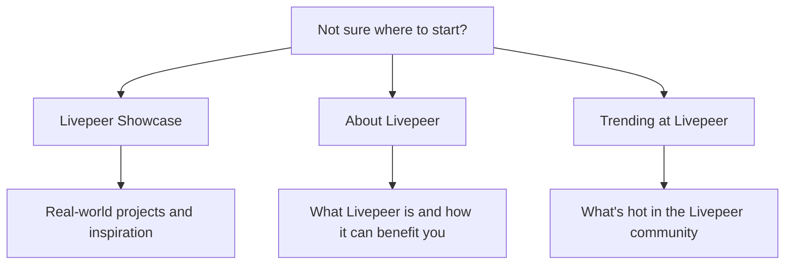

import { PreviewCallout } from '/snippets/components/domain/SHARED/previewCallouts.jsx'

<PreviewCallout />

Not sure where to start? We've got you covered. Here's a guide to help you find what you're looking for.

Just Browsing:

- [Livepeer Showcase](../project-showcase/showcase) - Check out real-world projects and get inspired.
- [About Livepeer](../../01_about/about-portal) - Learn what Livepeer is and how it can benefit you.

Want to use video AI in your project?

- [Livepeer AI Quickstart](../get-started/livepeer-ai-quickstart.mdx) - Get started with Livepeer AI in minutes.
- [Daydream](../03_developers/developer-platforms/daydream/daydream.mdx) - Learn more about Daydream, Livepeer's real-time AI video platform.
- [Platforms](../../010_products/products-portal) - Explore other Livepeer platforms and tools.

Want to stream or broadcast live video?

- [Stream Video Quickstart](../get-started/stream-video-quickstart.mdx) - Get started with Livepeer video streaming in minutes.
- [Livepeer Studio](https://livepeer.studio) - Try out Livepeer Studio, a hosted video platform.

Get more out of these docs:

- [Documentation Guide](../../07_resources/documentation-guide/style-guide) - Learn how to use these docs effectively.
- [Contribute to the Docs](../../07_resources/documentation-guide/contribute-to-the-docs) - Help improve these docs.

---

I'm a developer...
- I want to integrate realtime video or AI into my project
    - [Livepeer AI Quickstart](../get-started/livepeer-ai-quickstart.mdx) - Get started with Livepeer AI in minutes.
    - [Daydream](../../010_products/products/daydream/daydream) - Learn more about Daydream, Livepeer's real-time AI video platform.
- I want to create custom AI pipelines
    - [ComfyStream](../../03_developers/ai-inference-on-livepeer/ai-pipelines/comfystream) - Learn more about ComfyStream, Livepeer's AI pipeline platform.
    - [BYOC](../../03_developers/ai-inference-on-livepeer/ai-pipelines/byoc) - Learn more about Bring Your Own Compute, Livepeer's custom AI pipeline platform.
- I want to build a business on Livepeer
    - [Developer Hub](../../03_developers/developer-portal) - Learn more about building on Livepeer.
    - [Gateways](../../04_gateways/gateways-portal)
    - [Funding & Opportunities](../../03_developers/builder-opportunities/dev-programs) - Find Grants, RFPs & Other Opportunities

I'm a GPU provider...
- I want to earn from idle GPU compute
    - [Orchestrators](../../05_orchestrators/quickstart) - Learn more about running an orchestrator.
- I have a data centre
    - [Contact](mailto:hello@livepeer.org) - Contact us for a chat.

I'm a user/creator...
- I want to stream or broadcast live video or AI
    - [Daydream](../../010_products/products/daydream/daydream) - Learn more about Daydream, Livepeer's real-time AI video platform.
    -[Stream Video Quickstart](../get-started/stream-video-quickstart.mdx) - Get started with Livepeer video streaming in minutes.
    - [Livepeer Studio](https://livepeer.studio) - Try out Livepeer Studio, a hosted video platform.    

I'm a LPT holder...
- I want to delegate my LPT
    - [Delegators](../../06_lptoken/delegation/overview) - Learn more about delegating LPT.
- I want to vote
    - [Governance](../../06_lptoken/governance/overview) - Learn more about Livepeer governance.

I'm a company...
- I want to use Livepeer in my product
    - [Partner](../../03_developers/building-on-livepeer/partners) - Learn more about Livepeer partners.
    - [Contact](mailto:hello@livepeer.org) - Contact us for a chat.

I'm a researcher...
- I want to learn more about Livepeer
    - [Whitepaper](https://livepeer.org/whitepaper) - Learn more about the Livepeer network.
    - [Blog](https://blog.livepeer.org) - Read the latest news and articles about Livepeer.

## Journey Map

<Note> Founder Journey Map would be good, but probably doesn't belong here </Note>

