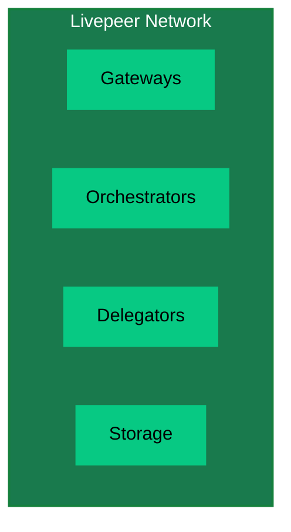
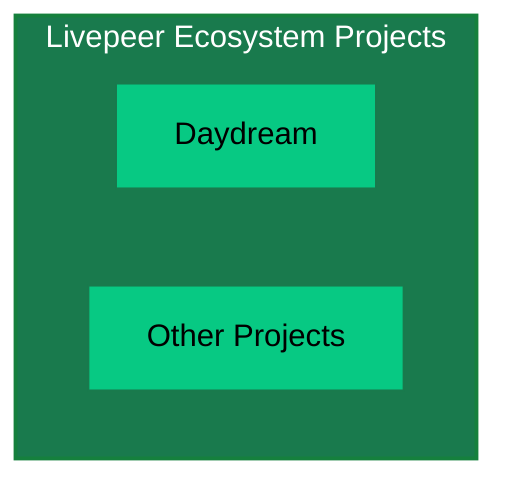
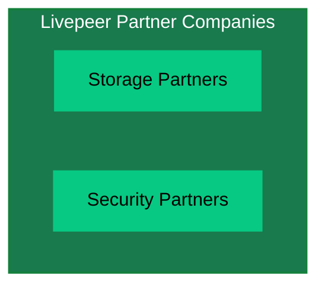
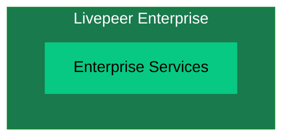

import { PreviewCallout } from '/snippets/components/domain/SHARED/previewCallouts.jsx'

<PreviewCallout />

import { LinkArrow } from '/snippets/components/primitives/links.jsx'
import { FrameQuote } from '/snippets/components/display/quote.jsx'

{/* The Livepeer ecosystem and how it works */}

{/* ## Livepeer Values

Livepeer is driven by a set of core values that guide its development, operations, and community interactions.

- **Innovation**: Embrace new ideas and technologies to stay ahead of the curve.
- **Collaboration**: Build with and for the community, fostering open dialogue and shared ownership.
- **Accessibility**: Make cutting-edge video and AI tools available to everyone, regardless of technical background.
- **Community**: Build with and for the community, fostering open dialogue and shared ownership.

With this in mind, Livepeer is dedicated not just to open, accessible architecture but also to a *contributive organisational structure*.  */}

## Livepeer Organisational Structure

Livepeer’s project structure has evolved to balance a focused core team with a growing community governance model. 
Several entities play distinct roles in Livepeer’s ecosystem: 
{/* - Livepeer Inc. 
- Livepeer Foundation
- Livepeer [DAO](https://en.wikipedia.org/wiki/Decentralized_autonomous_organization) (Decentralised Autonomous Organisation) (community governance)
- Special Purpose Entities (SPEs) */}

<div style={{ position: "relative" }}>
  <Columns cols={2}>
    <Card
      title="Livepeer Inc."
      icon="clapperboard-play"
      href="#livepeer-inc"
      arrow
    >
      Livepeer Inc is the original for-profit company behind the Livepeer protocol.
    </Card>
    <Card
      title="Livepeer Foundation"
      icon="handshake-angle"
      href="#livepeer-foundation"
      arrow
    >
      The Livepeer Foundation is a non-profit organisation that stewards the long-term vision, ecosystem growth, and core development of the Livepeer network.
    </Card>
    <Card
      title="Livepeer DAO"
      icon="chart-network"
      href="#livepeer-dao"
      arrow
    >
      The Livepeer DAO is a community-governed organisation that manages the Livepeer protocol and its treasury.
    </Card>
    <Card
      title="Special Purpose Entities (SPEs)"
      icon="shapes"
      href="#special-purpose-entities"
      arrow
    >
      Special Purpose Entities (SPEs) are mission-driven engineering or operational teams funded by the Livepeer ecosystem to deliver:
    </Card>
  </Columns>
  <style>{`
    @keyframes spin {
      from { transform: rotate(0deg); }
      to { transform: rotate(360deg); }
    }
  `}</style>
  <div style={{
    position: "absolute",
    top: "50%",
    left: "50%",
    transform: "translate(-50%, -50%)",
    zIndex: 10,
  }}>
    <div style={{
      backgroundColor: "var(--background)",
      borderRadius: "50%",
      padding: "0.5rem",
      animation: "spin 10s linear infinite",
    }}>
      <Icon icon="arrows-spin" size={50} color="var(--accent)" />
    </div>
  </div>
</div>

This section describes each and how they interrelate, including ownership of key products like Livepeer Studio and Daydream, 
strategic focuses, and insights from team members on their collaboration.

### Livepeer Inc.
Livepeer Inc is the original for-profit company behind the Livepeer protocol. Livepeer Inc built the core network infrastructure and continues to drive product development.

Livepeer Inc’s current focus is product-market fit (PMF) for the Livepeer network in the era of real-time AI video.

<Accordion title="Read more on Livepeer Inc.'s role and strategic focus" icon="book-open-reader">
  **Strategic Focus:**
- Livepeer Inc is laser-focused on demand generation and utility for the network, particularly in the AI video domain. Doug Petkanics (CEO) outlined that Inc’s core thesis is proving that builders will use Livepeer for AI-powered video applications because it’s the best option.
> “The team is focused, funded, and running hard at the next major milestone: unlocking product-market fit… as the leading infrastructure for realtime AI video.” 
> Doug Petkanics, CEO of Livepeer Inc.

**Role in Ecosystem:**
- Livepeer Inc acts as a pioneer and catalyst. By running a focused product strategy, Inc provides “proof of utility” for the network.
- Livepeer Inc. focuses on developing cutting-edge video products and core software to drive growth.

> “Livepeer Inc’s work is critical… by building products that generate real demand for the network, Inc provides proof of utility, inspiration, and compounding network effects (more demand → more usage → more infrastructure → more contributors)”
> Livepeer Inc. team

**Products:**
- [Livepeer Studio](https://livepeer.studio) (commercial API platform for developers)
- [Daydream](https://daydream.live) (real-time generative AI video app)
</Accordion>

### Livepeer Foundation
{/* The Livepeer Foundation is a non-profit organisation that stewards the long-term vision, ecosystem growth, and core development of the Livepeer network. 
It is owned and governed by its members, who have the ability to vote on proposals and make decisions about the direction of the organisation. */}
Launched in mid-2025, the <LinkArrow
  label="Livepeer Foundation (LF)"
  href="https://blog.livepeer.org/introducing-the-livepeer-foundation/"
  target="_blank"
  newline={false}
/> is a non-profit entity created to _“to steward the long-term vision, ecosystem growth, and core development of the network”_ complementing the work of Livepeer Inc.

{/* The Foundation represents a major step in Livepeer’s progressive decentralization. */}

{/* > “The Foundation represents a major step in Livepeer’s progressive decentralization, enabling broader participation and parallel progress to Livepeer Inc. By supporting and coordinating community-led projects, Livepeer's accelerates its growth.” */}
<FrameQuote
  author="Rich O’Grady"
  source="Launching the Livepeer Foundation"
  href="https://forum.livepeer.org/t/launching-the-livepeer-foundation/2849"
  frame={false}
>
"The LF’s role is to ensure that, over time, the Livepeer project builds a thriving ecosystem of founders, applications and gateways, and a highly-performant, secure network, truly accountable and governed by token holders." <br/>
</FrameQuote>
{/* <Icon icon="microphone" /> [Rich O’Grady](https://twitter.com/richogrady) - Livepeer Foundation Lead */}
<br/>
<br/>
<Accordion title="Read more on the Livepeer Foundation" icon="book-open-reader">
  **Leadership:**
  - The Livepeer Foundation is led by Rich O’Grady, however, it is governed governed through multi-stakeholder input.
  - Advisory Boards (small committees of experts from Inc, community, etc.) define strategic priorities in key areas (Network, Governance, Demand, Markets) and recommend which initiatives (SPEs, upgrades) the community should pursue
  {/* defined Workstreams – execution tracks with budgets under the Foundation’s umbrella for specific objectives */}
  {/* - Essentially, the Foundation behaves like a DAO-funded organization: it proposes its budget and programs to the token holders for approval, then executes and reports back.  */}

  **Strategic Roadmap:** 
  {/* - It introduced Advisory Boards (small committees of experts from Inc, community, etc.) to define strategic priorities in key areas (Network, Governance, Demand, Markets) and recommend which initiatives (SPEs, upgrades) the community should pursue */}
  - The Foundation publishes and maintains a long-term [roadmap](https://roadmap.livepeer.org/roadmap) synthesising advisory boards’ advice and aligning efforts across stakeholders
  - The Foundation also funds and coordinates the work of [Special Purpose Entities](#special-purpose-entities) (SPEs) - focused teams delivering long-term infrastructure, open-source software, and public goods.

  **Governance:**
  - The Foundation is owned and governed by its members, who have the ability to vote on proposals and make decisions about the direction of the organisation.
  - Members are Livepeer’s “stakeholders” - tokenholders, node operators, app developers, and community members

  **Role in Ecosystem:**
  - The Foundation is responsible for the long-term health and decentralization of the Livepeer network.

</Accordion>

### Livepeer DAO
The Livepeer DAO is a community-governed organisation that manages the Livepeer protocol and its treasury. It is responsible for making decisions about the direction of the protocol, including funding for development, infrastructure, and ecosystem growth.

### Special Purpose Entities (SPEs)
Special Purpose Entities (SPEs) are mission-driven engineering or operational teams funded by the Livepeer ecosystem to deliver:
- Long-term infrastructure
- Open-source software
- Network-level capabilities
- Public goods that benefit creators, developers, and node operators


{/* This governance framework, often called a [DAO](https://en.wikipedia.org/wiki/Decentralized_autonomous_organization) (Decentralised Autonomous Organisation) in the web3 space, enables stakeholders to tangibly participate in the direction and future of Livepeer. */}

{/* It includes governance decisions on the direction of the protocol as well as funding mechanisms for founders & contributors (via the <LinkArrow label="Onchain Treasury" href="https://explorer.livepeer.org/treasury" target="_blank" newline={false} />) that will benefit the Livepeer Network and its users.onchain treasury) that will benefit the Livepeer Network and its users. */}


{/* ### Overview

This page serves as a guide to understanding Livepeer's Organisational Structure & Plans

- Livepeer Inc.
  - Core Teams & Function
- Livepeer Foundation
  - Core Teams & Function
- Livepeer Network
  - gateways, orchestrators, delegators
- Livepeer Ecosystem Projects
  - use livepeer: daydream etc.
- Livepeer Partner Companies
  - Do more with Livepeer with our partners -> storage, security etc.
- Livepeer Enterprise

<br /> */}

### Livepeer Ecosystem

<Note> Mermaid Embedded Fowchart Example Only </Note>
```mermaid flowchart TB A[Livepeer Inc.]:::main --> B[Livepeer Foundation]:::main
A --> C[Livepeer Network]:::main A --> D[Livepeer Ecosystem Projects]:::main A -->
E[Livepeer Partner Companies]:::main A --> F[Livepeer Enterprise]:::main

classDef main fill:#197a4d,stroke:#15803D,stroke-width:2px,color:#fff

````

### Livepeer Inc.

```mermaid
flowchart TD
  subgraph Inc["Livepeer Inc."]
    B1[AI SPE]
    B2[Cloud SPE]
  end
  style Inc fill:#197a4d,stroke:#15803D,stroke-width:2px,color:#fff
  style B1 fill:#07C983,stroke:#197a4d,color:#000
  style B2 fill:#07C983,stroke:#197a4d,color:#000
````

### Livepeer Foundation

```mermaid
flowchart TD
  subgraph Foundation["Livepeer Foundation"]
    C1[Strategic Objectives]
    C2[Initiatives]
    C3[Task Forces]
    C4[Operations]
  end
  style Foundation fill:#197a4d,stroke:#15803D,stroke-width:2px,color:#fff
  style C1 fill:#07C983,stroke:#197a4d,color:#000
  style C2 fill:#07C983,stroke:#197a4d,color:#000
  style C3 fill:#07C983,stroke:#197a4d,color:#000
  style C4 fill:#07C983,stroke:#197a4d,color:#000
```

### Livepeer Network



### Livepeer Ecosystem Projects



### Livepeer Partner Companies



### Livepeer Enterprise



### Livepeer Inc.

- AI SPE
- Cloud SPE

### Livepeer Foundation

The [Livepeer Foundation](https://forum.livepeer.org/t/launching-the-livepeer-foundation/2849) was launched in April 2025 with the mission:

> \[...] to steward the long-term vision, ecosystem growth, and core development of the network.

Broadly speaking, the Livepeer Foundation makes decisions in the following areas:

1. Define strategic objectives for Livepeer
2. Design initiatives to accelerate or steer progress towards objectives
3. Drawing on available resources, recruit and coordinate task forces to execute on initiatives
4. Foundation operations

### Livepeer Network

-
- Storage
-

<br />
### Livepeer Ecosystem Projects

<br />

### Livepeer Partner Companies

<br />

### Decentralising Livepeer

<br />

# Livepeer Ecosystem

<Note> Set up a github for self-registering as an ecosystem project </Note>
