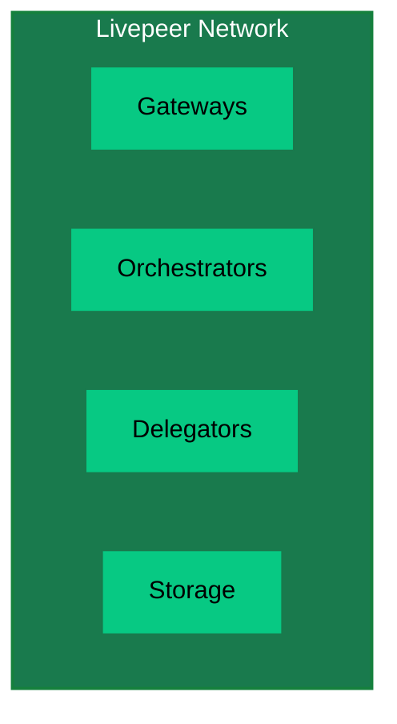
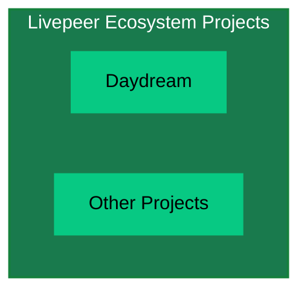
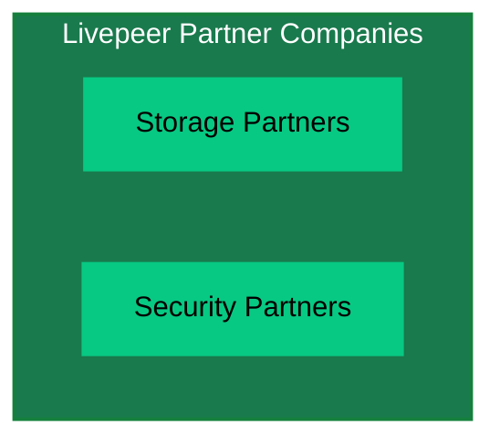
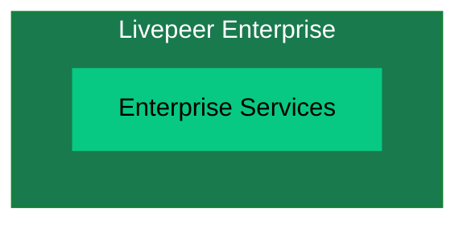

import { PreviewCallout } from '/snippets/components/domain/SHARED/previewCallouts.jsx'

<PreviewCallout />

import { LinkArrow } from '/snippets/components/primitives/links.jsx'

{/* The Livepeer ecosystem and how it works */}

Livepeer is dedicated not just to an open, decentralised architecture but also to a 
contributive community-run organisational structure. 

This governance framework, often called a [DAO](https://en.wikipedia.org/wiki/Decentralized_autonomous_organization) (Decentralised Autonomous Organisation) in the web3 space, enables stakeholders to tangibly participate in the direction and future of Livepeer.

It includes governance decisions on the direction of the protocol as well as funding mechanisms for founders & contributors (via the <LinkArrow label="Onchain Treasury" href="https://explorer.livepeer.org/treasury" target="_blank" newline={false} />) that will benefit the Livepeer Network and its users.onchain treasury) that will benefit the Livepeer Network and its users.

## Livepeer Values

Livepeer is driven by a set of core values that guide its development, operations, and community interactions.

- **Innovation**: Embrace new ideas and technologies to stay ahead of the curve.
- **Collaboration**: Build with and for the community, fostering open dialogue and shared ownership.
- **Accessibility**: Make cutting-edge video and AI tools available to everyone, regardless of technical background.
- **Community**: Build with and for the community, fostering open dialogue and shared ownership.

### Overview

This page serves as a guide to understanding Livepeer's Organisational Structure & Plans

- Livepeer Inc.
  - Core Teams & Function
- Livepeer Foundation
  - Core Teams & Function
- Livepeer Network
  - gateways, orchestrators, delegators
- Livepeer Ecosystem Projects
  - use livepeer: daydream etc.
- Livepeer Partner Companies
  - Do more with Livepeer with our partners -> storage, security etc.
- Livepeer Enterprise

<br />

### Livepeer Ecosystem

<Note> Mermaid Embedded Fowchart Example Only </Note>
```mermaid flowchart TB A[Livepeer Inc.]:::main --> B[Livepeer Foundation]:::main
A --> C[Livepeer Network]:::main A --> D[Livepeer Ecosystem Projects]:::main A -->
E[Livepeer Partner Companies]:::main A --> F[Livepeer Enterprise]:::main

classDef main fill:#197a4d,stroke:#15803D,stroke-width:2px,color:#fff

````

### Livepeer Inc.

```mermaid
flowchart TD
  subgraph Inc["Livepeer Inc."]
    B1[AI SPE]
    B2[Cloud SPE]
  end
  style Inc fill:#197a4d,stroke:#15803D,stroke-width:2px,color:#fff
  style B1 fill:#07C983,stroke:#197a4d,color:#000
  style B2 fill:#07C983,stroke:#197a4d,color:#000
````

### Livepeer Foundation

```mermaid
flowchart TD
  subgraph Foundation["Livepeer Foundation"]
    C1[Strategic Objectives]
    C2[Initiatives]
    C3[Task Forces]
    C4[Operations]
  end
  style Foundation fill:#197a4d,stroke:#15803D,stroke-width:2px,color:#fff
  style C1 fill:#07C983,stroke:#197a4d,color:#000
  style C2 fill:#07C983,stroke:#197a4d,color:#000
  style C3 fill:#07C983,stroke:#197a4d,color:#000
  style C4 fill:#07C983,stroke:#197a4d,color:#000
```

### Livepeer Network



### Livepeer Ecosystem Projects



### Livepeer Partner Companies



### Livepeer Enterprise



### Livepeer Inc.

- AI SPE
- Cloud SPE

### Livepeer Foundation

The [Livepeer Foundation](https://forum.livepeer.org/t/launching-the-livepeer-foundation/2849) was launched in April 2025 with the mission:

> \[...] to steward the long-term vision, ecosystem growth, and core development of the network.

Broadly speaking, the Livepeer Foundation makes decisions in the following areas:

1. Define strategic objectives for Livepeer
2. Design initiatives to accelerate or steer progress towards objectives
3. Drawing on available resources, recruit and coordinate task forces to execute on initiatives
4. Foundation operations

### Livepeer Network

-
- Storage
-

<br />
### Livepeer Ecosystem Projects

<br />

### Livepeer Partner Companies

<br />

### Decentralising Livepeer

<br />

# Livepeer Ecosystem

<Note> Set up a github for self-registering as an ecosystem project </Note>
