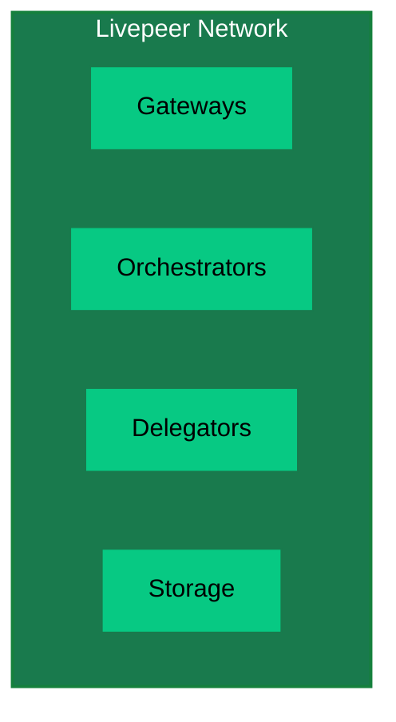
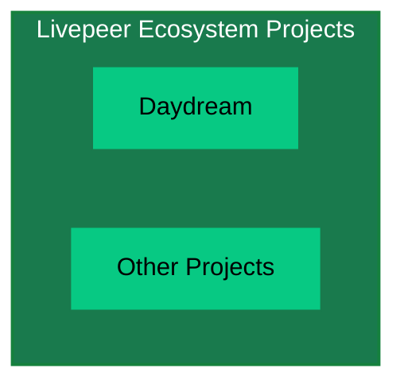
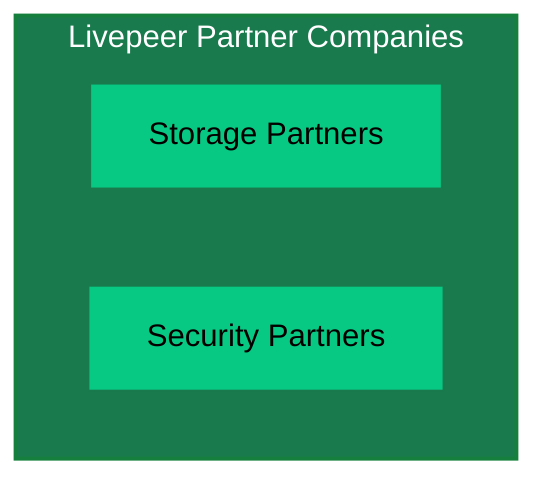
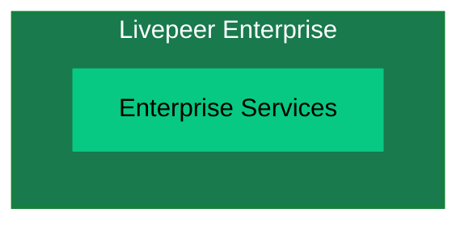

import { PreviewCallout } from '/snippets/components/domain/SHARED/previewCallouts.jsx'

<PreviewCallout />

import { LinkArrow } from '/snippets/components/primitives/links.jsx'
import { FrameQuote } from '/snippets/components/display/quote.jsx'

{/* The Livepeer ecosystem and how it works */}

{/* ## Livepeer Values

Livepeer is driven by a set of core values that guide its development, operations, and community interactions.

- **Innovation**: Embrace new ideas and technologies to stay ahead of the curve.
- **Collaboration**: Build with and for the community, fostering open dialogue and shared ownership.
- **Accessibility**: Make cutting-edge video and AI tools available to everyone, regardless of technical background.
- **Community**: Build with and for the community, fostering open dialogue and shared ownership.

With this in mind, Livepeer is dedicated not just to open, accessible architecture but also to a *contributive organisational structure*.  */}

## Livepeer Organisational Structure

Livepeer’s project structure has evolved to balance a focused core team with a growing community governance model. 
Several entities play distinct roles in Livepeer’s ecosystem: 
{/* - Livepeer Inc. 
- Livepeer Foundation
- Livepeer [DAO](https://en.wikipedia.org/wiki/Decentralized_autonomous_organization) (Decentralised Autonomous Organisation) (community governance)
- Special Purpose Entities (SPEs) */}

import { QuadGrid } from '/snippets/components/layout/quadGrid.jsx'

<QuadGrid icon="arrows-spin" iconSize={50}>
  <Card
    title="Livepeer Inc."
    icon="clapperboard-play"
    href="#livepeer-inc"
    arrow
  >
    Livepeer Inc is the original company behind the Livepeer protocol. Livepeer Inc built the core network infrastructure and continues to drive product development and demand generation.
  </Card>
  <Card
    title="Livepeer Foundation"
    icon="handshake-angle"
    href="#livepeer-foundation"
    arrow
  >
    The Livepeer Foundation is a non-profit organisation that stewards the long-term vision, ecosystem growth, and core development of the Livepeer network.
  </Card>
  <Card
    title="Livepeer DAO"
    icon="chart-network"
    href="#livepeer-dao"
    arrow
  >
    The Livepeer DAO is an unofficial term for the collective of LP tokenholders who decide on the direction of the network via on-chain proposals and an on-chain treasury.
  </Card>
  <Card
    title="Special Purpose Entities (SPEs)"
    icon="shapes"
    href="#special-purpose-entities"
    arrow
  >
    Special Purpose Entities (SPEs) are mission-driven engineering or operational teams funded by the Livepeer ecosystem to deliver the DAO's accepted proposals.

  </Card>
</QuadGrid>

This section describes each and how they interrelate, including ownership of key products like Livepeer Studio and Daydream, 
strategic focuses, and insights from team members on their collaboration.

### Livepeer Inc.
Livepeer Inc is the original for-profit company behind the Livepeer protocol. Livepeer Inc built the core network infrastructure and continues to drive product development.

Livepeer Inc’s current focus is product-market fit (PMF) for the Livepeer network in the era of real-time AI video.

<Accordion title="See more about Livepeer Inc.'s strategic focus" icon="camera-retro" >
  **Strategic Focus:**
  - Livepeer Inc is laser-focused on demand generation and utility for the network, particularly in the AI video domain. Doug Petkanics (CEO) outlined that Inc’s core thesis is proving that builders will use Livepeer for AI-powered video applications because it’s the best option.
  <FrameQuote source="-Doug Petkanics" frame={false} align="left">
  “The team is focused, funded, and running hard at the next major milestone: unlocking product-market fit… as the leading infrastructure for realtime AI video.” 
  </FrameQuote>

  **Role in Ecosystem:**
  - Livepeer Inc acts as a pioneer and catalyst. By running a focused product strategy, Inc provides “proof of utility” for the network.
  - Livepeer Inc. focuses on developing cutting-edge video products and core software to drive growth.

  <FrameQuote
    source="- Livepeer Inc. team"
    frame={false}
    align="left"
  >
  “Livepeer Inc’s work is critical… by building products that generate real demand for the network, Inc provides proof of utility, inspiration, and compounding network effects (more demand → more usage → more infrastructure → more contributors)”
  </FrameQuote>

  **Products:**
  - [Livepeer Studio](https://livepeer.studio) (commercial API platform for developers)
  - [Daydream](https://daydream.live) (real-time generative AI video app)
</Accordion>

### Livepeer Foundation
{/* The Livepeer Foundation is a non-profit organisation that stewards the long-term vision, ecosystem growth, and core development of the Livepeer network. 
It is owned and governed by its members, who have the ability to vote on proposals and make decisions about the direction of the organisation. */}
<span> 
  Launched in mid-2025, the {" "}
  <LinkArrow
    label="Livepeer Foundation (LF)"
    href="https://blog.livepeer.org/introducing-the-livepeer-foundation/"
    target="_blank"
    newline={false}
    /> 
  {" "} is a non-profit entity created to _“to steward the long-term vision, ecosystem growth, and core development of the network”_ complementing the work of Livepeer Inc.
</span>
<br/>
<br/>
{/* The Foundation represents a major step in Livepeer’s progressive decentralization. */}
{/* > “The Foundation represents a major step in Livepeer’s progressive decentralization, enabling broader participation and parallel progress to Livepeer Inc. By supporting and coordinating community-led projects, Livepeer's accelerates its growth.” */}
<FrameQuote
  author="Rich O’Grady"
  source="Launching the Livepeer Foundation"
  href="https://forum.livepeer.org/t/launching-the-livepeer-foundation/2849"
  align="center"
  borderColor="var(--accent)"
>
  "The LF’s role is to ensure that, over time, the Livepeer project builds a thriving ecosystem of founders, applications and gateways, and a highly-performant, secure network, truly accountable and governed by token holders." <br/>
</FrameQuote>
<br/>
  Broadly speaking, the Livepeer Foundation makes decisions in the following areas:
  - Define strategic objectives for Livepeer
  - Design initiatives to accelerate or steer progress towards objectives
  - Drawing on available resources, recruit and coordinate task forces to execute on initiatives
{/* <Icon icon="microphone" /> [Rich O’Grady](https://twitter.com/richogrady) - Livepeer Foundation Lead */}
{/* It does this through Advisory Boards are a mechanism to provide a clear pathway for ecosystem stakeholders to participate in strategy setting. They will try to ensure that the whole community has near-complete symmetry of information as it relates to opportunities within the ecosystem. */}
<br/>

<Accordion title="See more about the Livepeer Foundation's Stewardship role" icon="camera-retro" >
  **Leadership & Stewardship:**
  - The Livepeer Foundation - led by [Rich O’Grady](https://linkedin.com/in/rich-ogrady-3400042/), is owned and governed by its members, who have the ability to vote on proposals and make decisions about the direction of the organisation.
  - Strategy is shaped through multi-stakeholder Advisory Boards (network operators, builders, community members, Inc., and domain experts) across Protocol, Network, Governance, and Markets/Demand.
  - The Foundation synthesizes this input into a long-term [roadmap](https://roadmap.livepeer.org/roadmap), budget, and defined workstreams, which are proposed to the community for approval.
  - Livepeer stakeholders (tokenholders, node operators, developers, and community members) vote on budgets, programs, and the Foundation’s board.
  - The Foundation then coordinates and executes on the approved strategy and workstreams with transparent, regular reporting back to its members.

  <div style={{ justifySelf: "center", width: "80%", alignContent: "center" }}>
    <Tip> 
      You can join in the conversation on the 
      {" "}<Icon icon="comment-pen" /> **[Livepeer Forum](https://forum.livepeer.org/c/foundation/14)** 
      or weekly 
      {" "}<Icon icon="tv-retro" /> **[Watercooler Chats](https://discord.com/events/423160867534929930/1394387788568203274)** 
    </Tip>
  </div>

  **[Advisory Boards:](https://forum.livepeer.org/t/growth-advisory-board-candidacy/2877/14)**
  - Advisory Boards are small, domain-specific groups consisting of Livepeer core contributors, representing different parts of the Livepeer ecosystem.
  - Advisory Boards are formed every 6 months to build and update a coherent roadmap for the Livepeer project in conjunction with the broader community.
  - Advisory Boards do not make capital allocation decisions themselves. Token Holders still have to vote on each SPE when the team has been formed and the [proposal has been submitted onchain](https://explorer.livepeer.org/treasury).
  
  **Advisory Board Focus Areas:** <br/>
  Advisory Boards are focused on four key areas of the Livepeer project:
  - Protocol
  - Network
  - Governance
  - Demand & Markets

  **Workstreams:**
  - [Workstreams](https://forum.livepeer.org/t/introducing-workstreams-a-new-era-of-execution-for-the-livepeer-project/3030) are the day-to-day activities that the Foundation is responsible for.
  - The Foundation has a number of workstreams that are currently being executed, including:
    - Onboarding
    - Growth
    - Developer Experience
    - Treasury
    - Operations
  
  **Role in Ecosystem:**
  - The Foundation is responsible for the long-term health and decentralization of the Livepeer network.
  - The Foundation communitcates closely with the [Livepeer DAO](#livepeer-dao) for its initiatives to ensure it has its members’ trust and support.
  - Funds and coordinates the work of [Special Purpose Entities](#special-purpose-entities) (SPEs) - focused teams delivering long-term infrastructure, open-source software, and public goods.
  - The Foundation is a critical partner in driving the long-term success of the Livepeer network.

</Accordion>

### Livepeer DAO
While not officially called the Livepeer DAO, the Livepeer protocol is governed by a collective of LP tokenholders who decide on the direction of the network via on-chain proposals and an on-chain treasury.

{/* The on-chain treasury is managed by the Livepeer Foundation on behalf of the tokenholders, with the goal of funding the long-term growth and sustainability of the network. */}

**On-Chain Treasury**
{/* Formed in 2022, the on-chain treasury is issued with 10% of Livepeer block rewards to fund the long-term growth and sustainability of the network. */}
In 2022, Livepeer launched the [On-Chain Treasury](../../06_delegators/livepeer-treasury/) to fund the long-term growth and sustainability of the network.
This treasury accumulates a portion of protocol fees (often called block rewards on other chains and also known as 'inflation' within Livepeer) and is controlled by token holder votes. 

The treasury has become a significant source of funding for Special Purpose Entities (SPEs) and other needed initiatives in the Livepeer ecosystem.

<Accordion title="See more about the Livepeer DAO" icon="camera-retro" >
  **Role in Ecosystem**
  - The Livepeer DAO is responsible for the long-term health and decentralization of the Livepeer network.

  **Governance**
  - Decisions are made by tokenholders via on-chain proposals
  - The on-chain treasury is managed by the Livepeer Foundation on behalf of the tokenholders, with the goal of funding the long-term growth and sustainability of the network.
  <LinkArrow
    label="Livepeer Governance Model"
    href="../../06_delegators/livepeer-governance/governance-model.mdx"
    target="_blank"
    newline={false}
    />

  **Notable Decisions**
  - Approval of the [Confluence upgrade](https://medium.com/livepeer-blog/the-confluence-upgrade-is-live-3b6b342ea71e) (migrating to Arbitrum) via [LIP-73](https://github.com/livepeer/LIPs/blob/main/LIPs/LIP-0073.md)
  - Funding of the [AI Video SPE](https://forum.livepeer.org/t/ai-video-spe-stage-3-pre-proposal/2693) (multiple stages funded by votes), 
  - Grants to applications like [Lenstube](https://lenstube.com/) and [Dlive](https://dlive.tv/)
  
  The DAO also elects a Security Committee for multisig control and other meta-governance structures (GovWorks working group, etc., see below). 
  
  By 2025, token holder sentiment pushed for more strategic use of the treasury: “Token holders want to see the onchain treasury deployed more strategically to drive more utility and earning potential from the token”
 – this desire was a driving factor in establishing the Foundation and advisory boards.


---
  - The Livepeer community uses a [standardised governance framework](https://forum.livepeer.org/t/livepeer-governance-workstreams-govworks-whitepaper/3720) to ensure that all on-chain decisions are well-informed, transparent, and executed effectively.
  - The community formed a Governance Working Group (GovWorks) to streamline proposal processes and improve engagement. GovWorks helps coordinate between Livepeer Inc, the Foundation, and token holders (for example, facilitating the new Advisory Boards,

  **Participation**
  - Any tokenholder can participate in governance by delegating their tokens to a delegator or running a delegate node themselves.

</Accordion>

{/* It is responsible for making decisions about the direction of the protocol, including funding for development, infrastructure, and ecosystem growth. */}


### Special Purpose Entities (SPEs)
Special Purpose Entities (SPEs) are mission-driven engineering or operational teams funded by the Livepeer ecosystem to deliver:
- Long-term infrastructure
- Open-source software
- Network-level capabilities
- Public goods that benefit creators, developers, and node operators

{/* Move to governance section: ## Livepeer Protocol [LIPs]
The Livepeer Improvement Proposals (LIPs) document and propose changes to the Livepeer protocol. They are submitted by community members and voted on by the Livepeer community. */}

{/* This governance framework, often called a [DAO](https://en.wikipedia.org/wiki/Decentralized_autonomous_organization) (Decentralised Autonomous Organisation) in the web3 space, enables stakeholders to tangibly participate in the direction and future of Livepeer. */}

{/* It includes governance decisions on the direction of the protocol as well as funding mechanisms for founders & contributors (via the <LinkArrow label="Onchain Treasury" href="https://explorer.livepeer.org/treasury" target="_blank" newline={false} />) that will benefit the Livepeer Network and its users.onchain treasury) that will benefit the Livepeer Network and its users. */}


{/* ### Overview

This page serves as a guide to understanding Livepeer's Organisational Structure & Plans

- Livepeer Inc.
  - Core Teams & Function
- Livepeer Foundation
  - Core Teams & Function
- Livepeer Network
  - gateways, orchestrators, delegators
- Livepeer Ecosystem Projects
  - use livepeer: daydream etc.
- Livepeer Partner Companies
  - Do more with Livepeer with our partners -> storage, security etc.
- Livepeer Enterprise

<br /> */}

{/* ### Livepeer Ecosystem

<Note> Mermaid Embedded Fowchart Example Only </Note>
```mermaid flowchart TB A[Livepeer Inc.]:::main --> B[Livepeer Foundation]:::main
A --> C[Livepeer Network]:::main A --> D[Livepeer Ecosystem Projects]:::main A -->
E[Livepeer Partner Companies]:::main A --> F[Livepeer Enterprise]:::main

classDef main fill:#197a4d,stroke:#15803D,stroke-width:2px,color:#fff

````

### Livepeer Inc.

```mermaid
flowchart TD
  subgraph Inc["Livepeer Inc."]
    B1[AI SPE]
    B2[Cloud SPE]
  end
  style Inc fill:#197a4d,stroke:#15803D,stroke-width:2px,color:#fff
  style B1 fill:#07C983,stroke:#197a4d,color:#000
  style B2 fill:#07C983,stroke:#197a4d,color:#000
````

### Livepeer Foundation

```mermaid
flowchart TD
  subgraph Foundation["Livepeer Foundation"]
    C1[Strategic Objectives]
    C2[Initiatives]
    C3[Task Forces]
    C4[Operations]
  end
  style Foundation fill:#197a4d,stroke:#15803D,stroke-width:2px,color:#fff
  style C1 fill:#07C983,stroke:#197a4d,color:#000
  style C2 fill:#07C983,stroke:#197a4d,color:#000
  style C3 fill:#07C983,stroke:#197a4d,color:#000
  style C4 fill:#07C983,stroke:#197a4d,color:#000
```

### Livepeer Network



### Livepeer Ecosystem Projects



### Livepeer Partner Companies



### Livepeer Enterprise



### Livepeer Inc.

- AI SPE
- Cloud SPE

### Livepeer Foundation

The [Livepeer Foundation](https://forum.livepeer.org/t/launching-the-livepeer-foundation/2849) was launched in April 2025 with the mission:

> \[...] to steward the long-term vision, ecosystem growth, and core development of the network.

Broadly speaking, the Livepeer Foundation makes decisions in the following areas:

1. Define strategic objectives for Livepeer
2. Design initiatives to accelerate or steer progress towards objectives
3. Drawing on available resources, recruit and coordinate task forces to execute on initiatives
4. Foundation operations

### Livepeer Network

-
- Storage
-

<br />
### Livepeer Ecosystem Projects

<br />

### Livepeer Partner Companies

<br />

### Decentralising Livepeer

<br />

# Livepeer Ecosystem

<Note> Set up a github for self-registering as an ecosystem project </Note> */}
