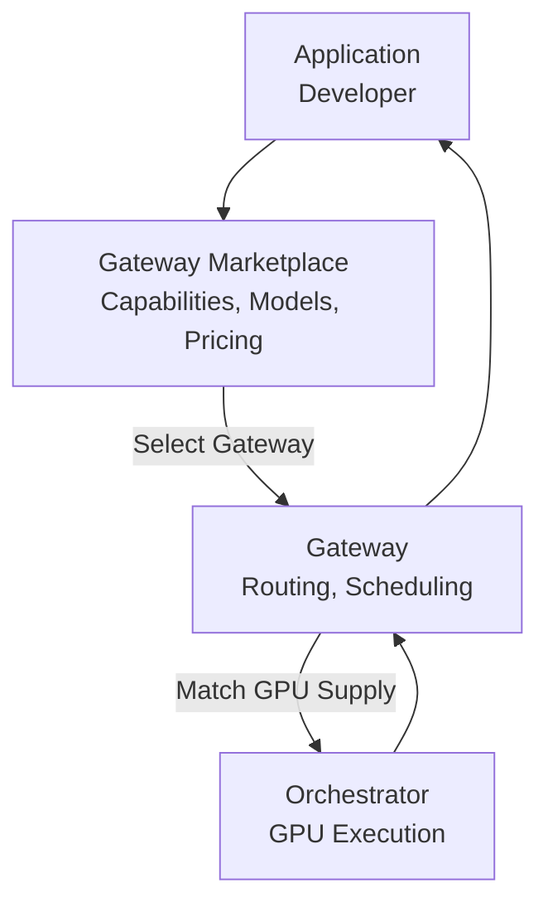

import { GotoCard } from '/snippets/components/links.jsx'

Actors are the main participants in the protocol who make up the core functions of the network.

<Note>Explainer here... </Note>

## Key Concepts & Definitions
**Developer**

A developer is anyone building with Livepeer, usually via hosted services.
They only become gateway operators if they need direct protocol access.

Developers may build on top of the protocol, but most will use hosted services, 
not run infrastructure.

Only developers who want full protocol-level access will choose to run a gateway node.

Developer Journey Examples
<table>table or diagram</table>

**Gateway Operator / Gateway**

A gateway is a Livepeer node run by an operator—not a hosted product.
Running a gateway = interacting directly with the protocol.

Gateway Developer Journey Examples
<table>table or diagram</table>

**Orchestrator** 
GPU Node Operators
-> Run Compute

Orchestrator Journey Examples
<table>table or diagram</table>

**Delegator**
Delegator/Token Holder Journey Examples
<table>table or diagram</table>


## Quick Links

<Columns cols={2}>

<GotoCard label="Gateways" relativePath="./gateways.mdx" icon="torii-gate" />
<GotoCard
  label="Orchestrators"
  relativePath="./orchestrators.mdx"
  icon="microchip"
/>
<GotoCard label="Delegators" relativePath="./delegators.mdx" icon="coin" />
<GotoCard label="Builders & Users" relativePath="./end-users.mdx" icon="user" />

</Columns>

### Why This Architecture Matters

- Decentralized competition — Gateways and orchestrators can specialize
- Better developer UX — Apps talk only to Gateways
- Better performance — Routing optimizes for GPU availability & latency
- Alignment — Orchestrators focus on compute; Gateways focus on services

---

# Marketplace Architecture

The Livepeer Marketplace is an emerging ecosystem layer where Gateways and Orchestrators publicly advertise, price, and compete on real-time AI video services. This marketplace transforms Livepeer from a raw GPU network into a discoverable, composable, and economically aligned infrastructure layer.

---

## Why a Marketplace?

As Livepeer shifts toward real-time AI video (Daydream, ComfyStream, BYOC pipelines), the network needs:

- Service discovery
- Capability matching
- Transparent pricing
- Quality and performance competition
- A way for builders to choose providers intentionally

Gateways and Orchestrators participate jointly to make this possible.

---

## Marketplace Participants

### **Gateway Operators**

Gateways publish:

- Supported models (e.g., diffusion, ControlNet, IPAdapter)
- Supported pipelines (ComfyStream workflows, BYOC containers)
- Pricing (per frame, per second, per inference)
- Geographic/latency characteristics
- Performance metrics

Gateways serve as the “service storefront.”

---

### **Orchestrator Operators**

Orchestrators contribute:

- GPU capacity (A40, 4090, L40S, etc.)
- Model acceleration (TensorRT, Torch Compile)
- Latency and throughput guarantees
- Historical reliability/performance scores

Orchestrators are the “supply side” of compute.

---

## Marketplace Workflow



```

```
