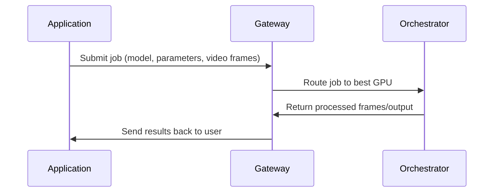

<Danger> Review and Edit Page </Danger>

<Note> Diagram of actors here </Note>

### About Gateways

Gateways are Livepeer’s off-chain coordination layer: the nodes that applications connect to in order to submit real-time AI and video compute jobs.

Instead of talking directly to orchestrators, apps send workloads to a Gateway, which handles service discovery, capability matching, pricing, and low-latency routing.

The Gateway selects the best orchestrator (GPU compute node) based on GPU capacity, model support, performance, and availability, ensuring efficient execution of AI inference, transcoding, and BYOC pipelines.

Gateways expose their offered services and enable a competitive
marketplace while orchestrators focus solely on GPU compute - running the job!

Put simply:
applications → Gateways → orchestrators → results!

Gateways are off-chain service nodes that sit between applications and orchestrators. They provide the entry point for real workloads (AI inference, transcoding, BYOC containers) to reach the decentralized GPU network.

### Gateway Workflow

<div style={{ display: 'flex', justifyContent: 'center' }}>
  <Mermaid chart={`
    graph TD
      A["Application<br/>(Daydream, ComfyUI,<br/>StreamDiffusionTD,<br/>BYOC Pipelines)"]
      B["Gateway<br/>- Job Intake<br/>- Pricing<br/>- Capability Match<br/>- Routing"]
      C["Orchestrator<br/>- GPU Execution<br/>- Transcoding<br/>- AI Inference<br/>- BYOC Containers"]
      D["Application<br/>Receives Output"]

      A -->|API Call| B
      B -->|Dispatch Job| C
      C -->|Results| D

`} />

</div>

### Gateway Services

- Accept jobs
- Match to orchestrators
- Expose capabilities, pricing, model support
- Enable a marketplace
- Provide APIs (for Daydream, BYOC, ComfyStream, StreamDiffusionTD)

Without gateways, developers would need to directly manage GPU node discovery, pricing, and routing — which defeats the purpose of a decentralized compute network


From -> https://github.com/videoDAC/livepeer-gateway?tab=readme-ov-file

They are not block producers, not orchestrators, and not on-chain components.
They are an infrastructure role that apps connect to for low-latency coordination.

### Why Gateways Exist

Across the transcripts and ecosystem discussions, gateways consistently appear in one context:

Gateways solve the “coordination layer” problem

Orchestrators handle compute (GPU jobs).

Gateways handle:

- Job intake
- Routing
- Pricing
- Matching workloads to the right orchestrator
- Providing an interface for applications

## Why Gateways Matter

As Livepeer transitions into a high-demand, real-time AI network, Gateways become essential infrastructure. They enable:

- Low-latency workflows for Daydream, ComfyStream, and other real-time AI video tools
- Dynamic GPU routing for inference-heavy workloads
- A decentralized marketplace of compute capabilities
- Flexible integration via the BYOC pipeline model

Gateways simplify the developer experience while preserving the decentralization, performance, and competitiveness of the Livepeer network.

# Understanding Gateways

Gateways are the entry point for applications into the Livepeer decentralized compute network. They provide the coordination layer that connects real-time AI and video workloads to the orchestrators who perform the GPU compute.

---

## What Gateways Do

Gateways handle all service-level logic required to operate a scalable, low-latency AI video network:

- **Job Intake**  
  They receive workloads from applications using Livepeer APIs, PyTrickle, or BYOC integrations.

- **Capability & Model Matching**  
  Gateways determine which orchestrators support the required GPU, model, or pipeline.

- **Routing & Scheduling**  
  They dispatch jobs to the optimal orchestrator based on performance, availability, and pricing.

- **Marketplace Exposure**  
  Gateway operators can publish the services they offer, including supported models, pipelines, and pricing structures.

Gateways do _not_ perform GPU compute. Instead, they focus on coordination and service routing.

---

## Relationship to Orchestrators

Orchestrators are GPU operators who execute the actual workload—transcoding, AI inference, or BYOC containers. Gateways route jobs _to_ orchestrators, collect results, and return them to the application.

**Applications → Gateway → Orchestrator → Gateway → Application**

This separation allows:

- Clean abstraction for developers
- Efficient load balancing
- Competition and specialization across operators
- Support for a broad range of real-time AI pipelines

---

## Summary

Gateways are the coordination and routing layer of the Livepeer ecosystem. They expose capabilities, price services, accept workloads, and dispatch them to orchestrators for GPU execution. This design enables a scalable, low-latency, AI-ready decentralized compute marketplace.

### CALLOUT YOU CAN RUN A GATEWAY & EARN!

<Danger> Random Notes only below here </Danger>

<Accordion title="Random Notes to remove">
  <p>
    This is referenced directly in Peter Schroedl's talk, where he describes the
    Gateway + Orchestrator stack as the system PyTrickle connects into, enabling
    apps to run arbitrary AI pipelines via Livepeer.
  </p>

<p>
  Demo of Livepeer Gateway Single Click Deployment with Playback Stream Test:
  <a href="https://www.youtube.com/watch?v=csJjzoIw_pM">
    https://www.youtube.com/watch?v=csJjzoIw_pM
  </a>
</p>

<p>
  → GWID{' '}
  <a href="https://forum.livepeer.org/t/get-to-know-gwid-and-the-team-a-fully-managed-devop-platform-for-livepeer/2851">
    https://forum.livepeer.org/t/get-to-know-gwid-and-the-team-a-fully-managed-devop-platform-for-livepeer/2851
  </a>
</p>

<p>Gateways appear again in the marketplace discussion:</p>

<blockquote>
  "Gateway operators [should] display or publicize what they're offering…
  pricing, capabilities… orchestrators and gateways meet in the marketplace
  concept."
</blockquote>

  <p>This shows that gateways are the commercial / service-facing nodes.</p>
</Accordion>

<div style={{ display: 'flex', justifyContent: 'center' }}>
  <Mermaid
    chart={`
    graph LR
      subgraph APP["Application Layer"]
        X["User App<br/>(Web, Mobile, TouchDesigner)"]
      end
      
      subgraph GW["Gateway Layer"]
        G1["Job Intake"]
        G2["Capability Discovery"]
        G3["Pricing & Marketplace"]
        G4["Routing / Scheduling"]
      end
      
      subgraph ORC["Orchestrator Layer"]
        O1["GPU Worker"]
        O2["AI Models / BYOC Containers"]
        O3["Transcoder"]
      end
      
      X -->|Submit Job| GW
      GW -->|Dispatch| ORC
      ORC -->|Results| GW
      GW -->|Return Output| X
  `}
  />
</div>

# Gateway vs Orchestrator: What’s the Difference?

Livepeer uses two core node types—**Gateways** and **Orchestrators**—that work together to provide real-time AI video compute at scale. Although closely connected, they serve entirely different purposes. This page breaks down how they differ and why both roles matter for a decentralized compute marketplace.

---

## Overview

| Role             | Function                                       | Performs GPU Work? | External-Facing? |
| ---------------- | ---------------------------------------------- | ------------------ | ---------------- |
| **Gateway**      | Job intake, pricing, routing, capability match | ❌ No              | ✅ Yes           |
| **Orchestrator** | GPU compute, inference, transcoding, BYOC      | ✅ Yes             | ❌ No            |

Gateways coordinate.  
Orchestrators compute.

Together, they form the backbone of the Livepeer AI video pipeline.

---

## Gateway Responsibilities

Gateways act as the front door to the network:

- Receive jobs from applications
- Determine required model, pipeline, or GPU
- Select the best orchestrator based on performance and pricing
- Route the workload with low latency
- Return results to the client
- Publish marketplace offerings (models, pipelines, cost per frame, etc.)

Gateways provide _service intelligence_, not compute.

---

## Orchestrator Responsibilities

Orchestrators are GPU operators who run:

- Real-time AI inference
- Daydream / ComfyStream pipelines
- BYOC containers
- Traditional transcoding

They provide:

- GPU horsepower
- Model execution
- Deterministic and verifiable output
- Performance guarantees

They do not expose external APIs directly—Gateways handle that.

---

## How They Work Together



## Why This Architecture Matters

Decentralized competition — Gateways and orchestrators can specialize

Better developer UX — Apps talk only to Gateways

Better performance — Routing optimizes for GPU availability & latency

Alignment — Orchestrators focus on compute; Gateways focus on services

## Summary

Gateways = service routers

Orchestrators = GPU compute workers

---

# ✅ **3. Marketplace Architecture Page**

_Mntlify-ready, polished, usable as a top-level docs page_

````md
# Marketplace Architecture

The Livepeer Marketplace is an emerging ecosystem layer where Gateways and Orchestrators publicly advertise, price, and compete on real-time AI video services. This marketplace transforms Livepeer from a raw GPU network into a discoverable, composable, and economically aligned infrastructure layer.

---

## Why a Marketplace?

As Livepeer shifts toward real-time AI video (Daydream, ComfyStream, BYOC pipelines), the network needs:

- Service discovery
- Capability matching
- Transparent pricing
- Quality and performance competition
- A way for builders to choose providers intentionally

Gateways and Orchestrators participate jointly to make this possible.

---

## Marketplace Participants

### **Gateway Operators**

Gateways publish:

- Supported models (e.g., diffusion, ControlNet, IPAdapter)
- Supported pipelines (ComfyStream workflows, BYOC containers)
- Pricing (per frame, per second, per inference)
- Geographic/latency characteristics
- Performance metrics

Gateways serve as the “service storefront.”

---

### **Orchestrator Operators**

Orchestrators contribute:

- GPU capacity (A40, 4090, L40S, etc.)
- Model acceleration (TensorRT, Torch Compile)
- Latency and throughput guarantees
- Historical reliability/performance scores

Orchestrators are the “supply side” of compute.

---

## Marketplace Workflow

```mermaid
flowchart TD

    A[Application<br/>Developer] --> B[Gateway Marketplace<br/>Capabilities, Models, Pricing]

    B -->|Select Gateway| C[Gateway<br/>Routing, Scheduling]

    C -->|Match GPU Supply| D[Orchestrator<br/>GPU Execution]

    D --> C --> A


Key Marketplace Features
1. Capability Discovery

Gateways and orchestrators list:

AI model support

Versioning and model weights

Pipeline compatibility

GPU type and compute class

Applications can programmatically choose the best provider.

2. Dynamic Pricing

Pricing can vary by:

GPU class

Model complexity

Latency SLA

Throughput requirements

Region

Gateways expose pricing APIs for transparent selection.

3. Performance Competition

Orchestrators compete on:

Speed

Reliability

GPU quality

Cost efficiency

Gateways compete on:

Routing quality

Supported features

Latency

Developer ecosystem fit

This creates a healthy decentralized market.

4. BYOC Integration

Any container-based pipeline can be brought into the marketplace:

Run custom AI models

Run ML workflows

Execute arbitrary compute

Support enterprise workloads

Gateways advertise BYOC offerings; orchestrators execute containers.

Marketplace Benefits

Developer choice — choose the best model, price, and performance

Economic incentives — better nodes earn more work

Scalability — network supply grows independently of demand

Innovation unlock — new models and pipelines can be added instantly

Decentralization — no single operator controls the workload flow

Summary

The Marketplace turns Livepeer into a competitive, discoverable, real-time AI compute layer.
Gateways expose services.
Orchestrators execute them.
Applications choose the best fit.

This architecture enables Livepeer to scale into a global provider of real-time AI video infrastructure.
```
````
