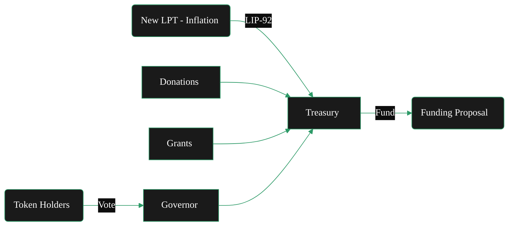

{/* 
This page describes:
5. **Treasury**

   * Funding source
   * Inflation allocation
   * Grants / SPEs
   * Budget governance 

BUT - only briefly - it lives in token.

*/}
import { CardTitleTextWithArrow } from '/snippets/components/primitives/text.jsx'
import { CustomDivider } from '/snippets/components/primitives/divider.jsx'
import { Quote } from '/snippets/components/display/quote.jsx'

  <CardTitleTextWithArrow icon="piggy-bank" horizontal href="https://explorer.livepeer.org/treasury"> Treasury </CardTitleTextWithArrow> 

<CustomDivider style={{margin: 0, marginBottom: "-1rem"}} />

<Quote>
The Livepeer Treasury is a smart contract-controlled pool of LPT tokens funded through protocol inflation and penalty mechanisms. It serves as the protocol’s capital allocator - financing public goods and ecosystem development, and is governed by token holders via LIP proposals.
</Quote>

## Origin
In late 2023, the community passed several proposals creating the Livepeer Treasury. 

- **Creation & Governance**: 
   - [LIP‑89](https://github.com/livepeer/LIPs/blob/main/LIPs/LIP-0089.md) established the [Treasury](./treasury.mdx)
   - It deployed a custom OpenZeppelin Governor (with a 100 LPT proposal threshold and stake-weighted voting)
{/* - [LIP-89](https://github.com/livepeer/LIPs/blob/main/LIPs/LIP-0089.md) introduced a treasury contract managed by Livepeer’s Governor framework. Any token holder can propose using treasury funds. Treasury proposals follow the standard governance rules: stake 100 LPT to propose, then voting requires ≥33% quorum and >50% “For” to pass (identical to protocol votes). Once passed, the treasury contract executes the transfer (of LPT or ETH) to the specified recipient. */}
- **Funding**: 
   - [LIP‑92](https://github.com/livepeer/LIPs/blob/main/LIPs/LIP-0092.md) set the on-chain revenue allocation: sending **10% of new LPT** emissions into the treasury.
   {/* - Initially, the treasury holds whatever funds were donated or allocated during genesis and via special proposals. There is no automatic tax today. [LIP-92](https://github.com/livepeer/LIPs/blob/main/LIPs/LIP-0092.md) has been discussed as a way to deduct a small percentage of protocol inflation each round and add it to the treasury. Other funding methods include grants, donations, or revenue-sharing agreements. Any change to treasury funding (like LIP-92) must be approved by token-holder vote. */}
- **Usage**: 
   - [LIP‑90](https://github.com/livepeer/LIPs/blob/main/LIPs/LIP-0090.md) established that the treasury should fund public goods.
   - Approved proposals can allocate treasury assets to projects that benefit the Livepeer ecosystem. 
   {/* - For example, Special Purpose Entities (teams building tools, education, security audits, etc.) can apply for grants from the treasury. All spending is transparent on-chain. The Community Forum often hosts calls or discussions with applicants, and final decisions rest with the on-chain vote. */}

{/* https://github.com/shtukaresearch/livepeer-data-geography/blob/651a56e8c8290b30855f1393543ee9e0961c071c/roles/spe.md
The Livepeer treasury is allocated to ecosystem projects via so-called special-purpose entities (SPEs) who vie for budget allocations through a competitive grant application process. A dashboard of SPE with active funding allocations can be found here.

Scenarios
An SPE or prospective SPE operator must develop Livepeer ecosystem programmes and apply to the DAO for funding.

Identify opportunities for funded contributions.
Into which focus areas are funds most likely to be allocated?
Data availability score: 0 (no treasury allocation strategy)
Potential resource. Develop and publich ecosystem funding strategy.
How much existing competition for funding is there in my focus area?
Resource. Trawling Treasury forum
Data availability score: 4
Decide parameters (amount, focus area) to pitch an application for funding.
How much have previous grant applicants in similar focus areas received?
Resource. Trawling Treasury forum
Data availability score: 4
Which grants were rejected or revisions requested because they asked for too much funding or support?
Resource. Trawling Treasury forum; Treasury explorer
Data availability score: 4
Views: Governance (all subviews). */}

{/* <iframe src="https://dune.com/dob/livepeer-treasury" width="100%" height="500px" frameBorder="0"></iframe> */}

## Objectives
The treasury is designed to:

- **Sustain ecosystem growth** by funding core development, tools, integrations, and R&D
- **Improve protocol security** by supporting audits, incentive design, and bug bounties
- **Decentralise governance** via on-chain voting on funding proposals (LIPs)
- **Enable long-term coordination** beyond the scope of any single actor or company

## Funding Sources

Livepeer’s treasury accrues value from three primary sources:

1. **Protocol Inflation**: 10% of newly minted LPT (inflationary rewards LPT) goes directly to the on-chain community treasury each round. (into a multisig controlled by the Livepeer Foundation and community stewards.)
2. **Slashing Penalties**: when orchestrators are slashed, slashed LPT is partially burned and partially transferred to the treasury.
3. **Fee Pool Remainders**: if gateways/broadcasters deposit more ETH than is ultimately paid via winning tickets, the remainder is swept to the treasury. 

## Fund Usage
The purpose of the treasury is to fund public goods.

This includes development, grants, security audits, research, operational initiatives, tooling and ecosystem growth initiatives that benefit the entire ecosystem (as determined by the community). 

Examples include grants for improving monitoring infrastructure, research into verifiable transcoding and support for builders. 

<Card title="Livepeer Treasury" icon="globe" href="https://explorer.livepeer.org/treasury" arrow horizontal > Monitor on-chain staking, proposals, and treasury transactions in real time on the Livepeer Explorer </Card>
{/* When the treasury balance reached a pre‑defined cap, contributions paused; future LIPs can adjust the rate or resume funding. */}

## Governance
The treasury uses the same [governance model & processes](governance-model.mdx) as the the protocol (though implemented by a separate Governor contract):
{/* Compound-style Governor contract customized for Livepeer. */}
- **Proposals**: Stake 100 LPT to propose.
- **Voting**: Any staked tokens (orchestrators + delegators) can vote on the grant. Delegators normally let their operator vote on their behalf, but may detach to vote separately.
- **Quorum/Threshold**: Same as protocol: 33% of stake must participate, with a majority in favor.
- **Execution**: If passed, the Governor releases funds immediately. If failed, the stake is returned, and funds remain untouched.

**Transparency & Accountability** 
- Track the treasury on-chain via the Livepeer Explorer. 
- All proposals, votes, and payments are public on Arbitrum. 
- For historical examples, see the [Forum threads](https://forum.livepeer.org/c/treasury/20) on funding proposals or the explorer’s voting records.
- Follow milestone updates and reports on the [Livepeer Forum](https://forum.livepeer.org/c/treasury/20).

{/* ## Grants & Allocations
The Livepeer treasury is allocated to ecosystem projects via so-called special-purpose entities (SPEs) who vie for budget allocations through a competitive grant application process. 

Spending proposals must be approved by governance, ensuring transparency and accountability. 

Special‑purpose entities (SPEs) can request allocations to execute scoped projects (e.g., building a verification framework, developing new codecs) and must report back on milestones. 

This structure turns inflation into a community‑directed investment in the protocol’s long‑term health rather than pure dilution. */}

## Stewardship
The Livepeer Foundation stewards the treasury on behalf of the community. 

## Improvement Discussions
To ensure that treasury spending aligns with protocol objectives, the Livepeer community has experimented with frameworks for public‑goods funding. 

One example is the transparent milestone‑based grant model: proposers submit budgets and deliverables, funds are released in tranches upon completion and progress is publicly reported on the forum. 

Another is quadratic funding, which could match community donations from the treasury to signal strong grassroots support. Discussions have also explored regen network‑style retroactive funding, where contributions are rewarded after impact is demonstrated. 

These experiments reflect a wider movement in decentralised governance toward more inclusive and accountable resource allocation.

## Further Resources
<Columns cols={2}>
   <Card title="LIP-89: Treasury Proposal" icon="file" href="https://github.com/livepeer/LIPs/blob/master/LIPs/LIP-89.md"> Specification for the on-chain Treasury and governance framework </Card> 
   <Card title="LIP-92: Treasury Funding" icon="message" href="https://forum.livepeer.org/t/lip-92-livepeer-treasury-contribution-percentage/3249"> Discussion of allocating a percentage of inflation to the treasury </Card> 
   <Card title="Treasury Explorer" icon="globe" href="https://explorer.livepeer.org/treasury" > On-chain treasury transactions </Card>
   <Card title="Messari Report" icon="scroll" href="https://messari.io/asset/livepeer/reports" > Messari Report: Livepeer Treasury </Card>
   <Card title="Treasury Analytics" icon="chart-line" href="https://dune.com/dob/livepeer-treasury" > Dune Dashboard Analytics </Card>
   <Card href="https://www.karmahq.xyz/community/livepeer" title="Community SPE Dashboard" icon="boxes" > SPE Project Dashboard</Card>
</Columns>