import { ZoomableDiagram } from '/snippets/components/zoomable-diagram.jsx'
import { DoubleIconLink } from '/snippets/components/links.jsx'
import { ExternalContent } from '/snippets/components/external-content.jsx'
import BoxConfig from '/snippets/external/box-additional-config.mdx'

---
A single Gateway can handle both video transcoding and AI processing simultaneously.
The Gateway's dual capability is enabled by its modular architecture, where different
managers handle specific workflows while sharing common infrastructure for media ingestion,
payment processing, and result delivery.

```mermaid
%%{init: {'theme': 'base', 'themeVariables': { 'primaryColor': '#1a1a1a', 'primaryTextColor': '#fff', 'primaryBorderColor': '#2d9a67', 'lineColor': '#2d9a67', 'secondaryColor': '#0d0d0d', 'tertiaryColor': '#1a1a1a', 'background': '#0d0d0d', 'fontFamily': 'system-ui' }}}%%
flowchart TB
    subgraph INPUT["Input Sources"]
        direction LR
        RTMP["RTMP Stream"]
        HTTP["HTTP Upload"]
        AI_REQ["AI Request"]
    end

    GATEWAY["Gateway Node<br/>LivepeerNode"]

    INPUT --> GATEWAY

    subgraph MANAGERS["Session Managers"]
        direction LR
        BSM["BroadcastSessionsManager<br/>Video Transcoding"]
        ASM["AISessionManager<br/>AI Processing"]
    end

    GATEWAY --> BSM
    GATEWAY --> ASM

    subgraph VIDEO["Video Pipeline"]
        SEG["Segment Processing"]
        ORCH_V["Orchestrators<br/>Transcoding"]
        HLS["HLS/DASH Output"]
    end

    subgraph AI["AI Pipeline"]
        PROC["AI Processing"]
        ORCH_AI["Orchestrators<br/>AI Models"]
        OUT_AI["AI Output<br/>Images/Video"]
    end

    BSM --> SEG --> ORCH_V --> HLS
    ASM --> PROC --> ORCH_AI --> OUT_AI

    subgraph PAYMENT["Payment"]
        direction LR
        PAY_SEG["Per Segment"]
        PAY_PIX["Per Pixel"]
    end

    ORCH_V --> PAY_SEG
    ORCH_AI --> PAY_PIX

    classDef default fill:#1a1a1a,color:#fff,stroke:#2d9a67,stroke-width:2px
    classDef video fill:#1a1a1a,color:#fff,stroke:#3b82f6,stroke-width:2px
    classDef ai fill:#1a1a1a,color:#fff,stroke:#a855f7,stroke-width:2px
    class RTMP,HTTP,BSM,SEG,ORCH_V,HLS,PAY_SEG video
    class AI_REQ,ASM,PROC,ORCH_AI,OUT_AI,PAY_PIX ai
    style INPUT fill:#0d0d0d,stroke:#2d9a67,stroke-width:1px
    style MANAGERS fill:#0d0d0d,stroke:#2d9a67,stroke-width:1px
    style VIDEO fill:#0d0d0d,stroke:#3b82f6,stroke-width:1px
    style AI fill:#0d0d0d,stroke:#a855f7,stroke-width:1px
    style PAYMENT fill:#0d0d0d,stroke:#2d9a67,stroke-width:1px
```

<ZoomableDiagram title="Dual Gateway Architecture: Video & AI Pipelines">

</ZoomableDiagram>

## Dual Configuration

The LivepeerNode struct contains fields for both traditional transcoding (Transcoder, TranscoderManager)
and AI processing (AIWorker, AIWorkerManager) <DoubleIconLink label="livepeernode.go" href="https://github.com/livepeer/go-livepeer/blob/5691cb48/core/livepeernode.go" iconLeft="github" />

The gateway determines the processing type based on the request:
- Standard transcoding requests go through the BroadcastSessionsManager
- AI requests go through the AISessionManager with AI-specific authentication and pipeline selection <DoubleIconLink label="ai_auth.go" href="https://github.com/livepeer/go-livepeer/blob/5691cb48/server/ai_auth.go" iconLeft="github" />

### Key Differences
 
<table>
  <thead>
    <tr>
      <th>Aspect</th>
      <th style={{ color: '#3b82f6' }}>Video Transcoding</th>
      <th style={{ color: '#a855f7' }}>AI Pipelines</th>
    </tr>
  </thead>
  <tbody>
    <tr>
      <td>Processing Type</td>
      <td>Format/bitrate conversion</td>
      <td>AI model inference</td>
    </tr>
    <tr>
      <td>Session Manager</td>
      <td>BroadcastSessionsManager</td>
      <td>AISessionManager</td>
    </tr>
    <tr>
      <td>Payment Model</td>
      <td>Per segment</td>
      <td>Per pixel processed</td>
    </tr>
    <tr>
      <td>Protocol</td>
      <td>Standard HLS/DASH</td>
      <td>Trickle protocol for real-time AI</td>
    </tr>
    <tr>
      <td>Components</td>
      <td>RTMP Server, Playlist Manager</td>
      <td>MediaMTX, Trickle Server</td>
    </tr>
  </tbody>
</table>

## Configuration

To configure a gateway to handle both video transcoding and AI processing, you need to set the appropriate flags and options when starting the livepeer binary.

## Setup Example

The box setup for local development demonstrates running a gateway that handles both types of processing.

<ExternalContent
  repoName="livepeer/go-livepeer - box/box.md"
  githubUrl="https://github.com/livepeer/go-livepeer/blob/master/box/box.md"
  maxHeight="800px"
>
  <BoxConfig />
</ExternalContent>
