import { DoubleIconLink } from '/snippets/components/links.jsx'
import { DynamicTable } from '/snippets/components/table.jsx';
import { ScrollableDiagram } from '/snippets/components/zoomable-diagram.jsx'

{/* Page Flow:
1. Intro
2. Diagram
3. Main Flags 
3. Quickstart Code
4. Full Config Guide Options */}
## TL;DR Configuration

If you just want a working video gateway, run the below command:
<CodeGroup>
```bash wrap lines icon="terminal" Off-Chain Video Gateway
livepeer -gateway \
  -network offchain \
  # Minimum required video flags
  -rtmpAddr=0.0.0.0:1935 \
  -httpAddr=0.0.0.0:8935 \
  -transcodingOptions=P240p30fps16x9,P360p30fps16x9 \
  # You will need to add your local orchestrator address if you are running offchain
  -orchAddr=<ORCH_ADDR> 
```

```bash wrap lines icon="link" On-Chain Video Gateway
livepeer -gateway \
  -network arbitrum-one-mainnet \
  # See the on-chain setup guide for more details on these flags
  -ethUrl=<YOUR_RPC_URL> \
  -ethAcctAddr=<YOUR_ETH_ADDRESS> \
  -ethPassword=<YOUR_PASSWORD> \
  -ethKeystorePath=<KEYSTORE_PATH> \
  # Minimum required video flags
  -rtmpAddr=0.0.0.0:1935 \
  -httpAddr=0.0.0.0:8935 \
  -maxPricePerUnit=1000 \
  -transcodingOptions=P240p30fps16x9,P360p30fps16x9 \
  -orchAddr=<ORCHESTRATOR_ADDRESSES> 
  # You will need to connect to a public orchestrator if you are running onchain

```
</CodeGroup>


{/* 1. Intro */}
## Gateways for Video Transcoding
In traditional video transcoding, the Gateway ingests video streams via [RTMP](https://en.wikipedia.org/wiki/Real-Time_Messaging_Protocol) or [HTTP](https://en.wikipedia.org/wiki/Hypertext_Transfer_Protocol), 
segments them, and distributes transcoding work to Orchestrators 

The workflow involves segmenting video, sending segments with payments to Orchestrators, 
receiving transcoded results, and serving them via HLS .

Gateways that receive a live or recorded RTMP stream need to transcode it into multiple renditions before sending it to Orchestrators for distribution. 

{/* Key components include:

- **[BroadcastSessionsManager](https://github.com/livepeer/go-livepeer/blob/5691cb48/core/broadcast.go)**: Manages transcoding sessions and selects Orchestrators
- **[RTMP](https://en.wikipedia.org/wiki/Real-Time_Messaging_Protocol) Server**: Handles RTMP (Real-Time Message Protocol) stream ingestion
- **[Payment Manager](https://github.com/livepeer/go-livepeer/blob/5691cb48/core/live_payment.go)**: Generates and sends payment tickets for transcoding work */}

{/* 2. Diagram */}

```mermaid
%%{init: {'theme': 'base', 'themeVariables': { 'primaryColor': '#1a1a1a', 'primaryTextColor': '#fff', 'primaryBorderColor': '#2d9a67', 'lineColor': '#2d9a67', 'secondaryColor': '#0d0d0d', 'tertiaryColor': '#1a1a1a', 'background': '#0d0d0d', 'fontFamily': 'system-ui' }}}%%
flowchart TB
    subgraph INPUT["Video Input Sources"]
        direction LR
        RTMP["RTMP Stream<br/>:1935"]
        HTTP["HTTP Upload<br/>:8935"]
    end

    GATEWAY["Gateway Node<br/>LivepeerNode<br/>-gateway mode"]

    INPUT --> GATEWAY

    subgraph MANAGER["Broadcast Session Manager"]
        BSM["BroadcastSessionsManager<br/>Manages transcoding sessions<br/>Selects orchestrators"]
    end

    GATEWAY --> BSM

    subgraph PROCESSING["Video Processing Pipeline"]
        direction TB
        SEG["Segment Video<br/>Split into chunks"]
        TRANS["Send to Orchestrators<br/>with payment tickets"]
        ORCH["Orchestrators<br/>Transcode segments<br/>Multiple renditions"]
        RECEIVE["Receive Results<br/>Transcoded segments"]
    end

    BSM --> SEG --> TRANS --> ORCH --> RECEIVE

    subgraph OUTPUT["Output & Delivery"]
        direction LR
        HLS["HLS Manifest<br/>.m3u8"]
        RENDITIONS["Multiple Renditions<br/>240p, 360p, 720p, 1080p"]
    end

    RECEIVE --> HLS --> RENDITIONS

    subgraph PAYMENT["Payment System"]
        direction TB
        PM["Payment Manager<br/>Generate tickets"]
        TICKETS["Per-segment payments<br/>Based on pixels transcoded"]
    end

    TRANS --> PM --> TICKETS --> ORCH

    subgraph STORAGE["Storage (Optional)"]
        OBJ["Object Store<br/>S3/IPFS"]
    end

    RENDITIONS -.-> OBJ

    classDef default fill:#1a1a1a,color:#fff,stroke:#2d9a67,stroke-width:2px
    classDef video fill:#1a1a1a,color:#fff,stroke:#3b82f6,stroke-width:2px
    classDef payment fill:#1a1a1a,color:#fff,stroke:#fbbf24,stroke-width:2px
    class RTMP,HTTP,BSM,SEG,TRANS,ORCH,RECEIVE,HLS,RENDITIONS video
    class PM,TICKETS payment
    style INPUT fill:#0d0d0d,stroke:#2d9a67,stroke-width:1px
    style MANAGER fill:#0d0d0d,stroke:#3b82f6,stroke-width:1px
    style PROCESSING fill:#0d0d0d,stroke:#3b82f6,stroke-width:1px
    style OUTPUT fill:#0d0d0d,stroke:#3b82f6,stroke-width:1px
    style PAYMENT fill:#0d0d0d,stroke:#fbbf24,stroke-width:1px
    style STORAGE fill:#0d0d0d,stroke:#2d9a67,stroke-width:1px,stroke-dasharray: 5 5
```

<ScrollableDiagram title="Video Gateway Transcoding Architecture">



</ScrollableDiagram>

<Card
    title="Code Reference"
    icon="github"
    href="https://github.com/livepeer/go-livepeer/blob/5691cb48/core/livepeernode.go"
    horizontal
    arrow
  >
  go-livepeer/core/livepeernode.go
  </Card>

{/* 3. Main Flags */}
## Essential Configuration Flags
#### Required Flags
<ResponseField name="-gateway" type="boolean">
  Enable Gateway mode
</ResponseField>
<ResponseField name="-network" type="string" default="offchain">
  Set to the blockchain network for production gateways <Badge color="green"> `arbitrum-one-mainnet` </Badge>

  Use the default for local development `offchain` -> Requires an Orchestrator running locally 
</ResponseField>
<ResponseField name="-orchAddr" type="string" default="none">
  Set to <Badge color="green"> `http://<ORCHESTRATOR_IP>:<PORT>` </Badge> to connect to orchestrators
</ResponseField>
#### Network Configuration
<ResponseField name="-rtmpAddr" type="string" default="127.0.0.1:1935">
  Set to <Badge color="green"> `0.0.0.0:1935` </Badge> to allow external RTMP connections
</ResponseField>
<ResponseField name="-httpAddr" type="string" default="127.0.0.1:8935">
  Set to <Badge color="green"> `0.0.0.0:8935` </Badge> to allow external HLS/API access
</ResponseField>
#### Transcoding Configuration
<ResponseField name="-transcodingOptions" type="string" default="P240p30fps16x9,P360p30fps16x9">
  Set to <Badge color="green"> `path/to/transcodingOptions.json` </Badge> to use a custom transcoding configuration
</ResponseField>


{/* 4. Quickstart Code */}
{/* # Quick Start Video Gateway Configuration

For a basic video gateway, start with the below recommended settings and gradually add options based on your specific needs. 
The most critical settings are `-orchAddr` (to connect to orchestrators) and network addresses to allow external access.

```bash wrap lines icon="terminal" Transcoding Options
livepeer -gateway \
  -network offchain \
  -rtmpAddr=0.0.0.0:1935 \
  -httpAddr=0.0.0.0:8935 \
  -cliAddr=0.0.0.0:5935 \
    -maxSessions=10 \
  -orchAddr=<ORCHESTRATOR_ADDRESSES> \
  -transcodingOptions=P240p30fps16x9,P360p30fps16x9,P720p30fps16x9 
  # You can also use a JSON file: path/to/transcodingOptions.json
``` */}

# Configuration Full Guide

### Configuration Methods
You have three ways to configure your Livepeer gateway after installation:

- Command-line flags (most common)
- Environment variables (prefixed with LP_)
- Configuration file (plain text key value format)

## Configuration Examples

### Offchain Development Setup

<Tabs>
<Tab title="Docker" icon="docker">

  ```bash wrap icon="docker" Create docker-compose.yml
  # 1. Create a basic docker-compose.yml  
  cat > docker-compose.yml << EOF  
  version: '3.9'  
  services:  
    gateway:  
      image: livepeer/go-livepeer:master  
      ports:  
        - 1935:1935  # RTMP ingest  
        - 8935:8935  # HLS/API  
      volumes:  
        - gateway-data:/root/.lpData  
      command: |  
        -gateway  
        -network offchain  
        -rtmpAddr=0.0.0.0:1935  
        -httpAddr=0.0.0.0:8935  
        -orchAddr=https://orchestrator.example.com:8935  
        -transcodingOptions=P240p30fps16x9,P360p30fps16x9,P720p30fps16x9  
    
  volumes:  
    gateway-data:  
  EOF  
  ``` 
  Start the Gateway
  ```bash wrap icon="docker" Start the gateway  
  # 2. Start the gateway  
  docker-compose up -d  
  ```
</Tab>
<Tab title="Binary" icon="code">
</Tab>
</Tabs>

```bash
livepeer -gateway \
  -network offchain \
  -transcodingOptions=${env:HOME}/.lpData/offchain/transcodingOptions.json \
  -orchAddr=0.0.0.0:8935 \
  -httpAddr=0.0.0.0:9935 \
  -v=6
``` 

### Production On-Chain Setup
Add these flags for on-chain operation  
- `-network arbitrum-one-mainnet`   
- `-ethUrl <YOUR_RPC_URL>`   
- `-ethAcctAddr <YOUR_ETH_ADDRESS>`   
- `-ethPassword <YOUR_PASSWORD>`  
- `-ethKeystorePath <KEYSTORE_PATH>`  
- `-maxPricePerUnit 1000`


<Card title="On-Chain Setup Guide" href="/v2/pages/04_gateways/run-a-gateway/requirements/on-chain setup/on-chain" icon="chain" arrow horizontal >
  See the full on-chain setup guide 
</Card>
<Tabs>
<Tab title="Docker" icon="docker">

  ```bash wrap icon="docker" Create docker-compose.yml
  # 1. Create a basic docker-compose.yml  
  cat > docker-compose.yml << EOF  
  version: '3.9'  
  services:  
    gateway:  
      image: livepeer/go-livepeer:master  
      ports:  
        - 1935:1935  # RTMP ingest  
        - 8935:8935  # HLS/API  
      volumes:  
        - gateway-data:/root/.lpData  
      command: |  
        -gateway  
        -network arbitrum-one-mainnet  
        -rtmpAddr=0.0.0.0:1935  
        -httpAddr=0.0.0.0:8935  
        -orchAddr=https://orchestrator.example.com:8935  
        -transcodingOptions=P240p30fps16x9,P360p30fps16x9,P720p30fps16x9
        -ethUrl <YOUR_RPC_URL> \  
        -ethAcctAddr <YOUR_ETH_ADDRESS> \  
        -ethPassword <YOUR_PASSWORD> \  
        -ethKeystorePath <KEYSTORE_PATH> \  
        -maxPricePerUnit 1000  
    
  volumes:  
    gateway-data:  
  EOF  
  ``` 
  Start the Gateway
  ```bash wrap icon="docker" Start the gateway  
  # 2. Start the gateway  
  docker-compose up -d  
  ```
</Tab>
<Tab title="Binary" icon="code">
</Tab>
</Tabs>

```bash
livepeer -gateway \
  -network arbitrum-one-mainnet \
  -ethUrl=<YOUR_RPC_URL> \
  -ethAcctAddr=<YOUR_ETH_ADDRESS> \
  -ethPassword=<YOUR_PASSWORD> \
  -ethKeystorePath=<KEYSTORE_PATH> \
  -maxPricePerUnit=1000 \
  -orchAddr=<ORCHESTRATOR_ADDRESSES> \
  -monitor=true
```  

## Transcoding Options JSON
Livepeer supports JSON configuration files for transcoding options through the `-transcodingOptions` flag.

The transcodingOptions.json file lets you precisely control the encoding ladder.

This file is a custom configuration file containing an array of rendition objects that defines which renditions (resolutions + bitrates) 
your Gateway will produce for each incoming stream. 

It overrides the default built-in ladder (e.g., P240p30fps16x9, etc.).


  ```json wrap lines icon="brackets-curly" transcodingOptions.json example
  [
    {
      // required
      "bitrate": 1600000,                
      "width": 854,                     
      "height": 480,                    
      // optional
      "name": "480p0",                  
      "fps": 0,                         
      "profile": "h264constrainedhigh", 
      "gop": "1"                        
      
    },
    {
      // required                     
      "bitrate": 3000000,
      "width": 1280,
      "height": 720,
      // optional
      "name": "720p0",                  
      "fps": 0,      
      "profile": "h264constrainedhigh", 
      "gop": "1"                        
    },
    {
      // required                     
      "bitrate": 6500000,
      "width": 1920,
      "height": 1080,
      // optional
      "name": "1080p0",                 
      "fps": 0,    
      "profile": "h264constrainedhigh", 
      "gop": "1"                        
    }
  ]
  ```
  #### Notes
- JSON configuration only applies to transcoding options, not other gateway flags
- The file must contain valid JSON with the specified structure
- All fields are optional except width, height, and bitrate
- You can mix JSON configuration with other command-line flags


<Card title = "Next Step: Pricing Configuration" href="./pricing-configuration" icon="hand-holding-dollar" horizontal arrow>
  Configure pricing for your gateway.
</Card>


## Key Configuration Options to Change

### Essential Changes

<DynamicTable
  headerList={["Option", "Recommended Change", "Why"]}
  itemsList={[
    { Option: "-orchAddr", "Recommended Change": "Set to your orchestrator URLs", Why: "Required to connect to transcoding services" },
    { Option: "-transcodingOptions", "Recommended Change": "Customize based on needs", Why: "Controls output video quality profiles" },
    { Option: "-maxSessions", "Recommended Change": "Adjust based on server capacity", Why: "Limits concurrent streams" }
  ]}
  monospaceColumns={[0]}
/>

### Network Configuration

<DynamicTable
  headerList={["Option", "Default", "Recommended", "Description"]}
  itemsList={[
    { Option: "-rtmpAddr", Default: "127.0.0.1:1935", Recommended: "0.0.0.0:1935", Description: "Allow external RTMP connections" },
    { Option: "-httpAddr", Default: "127.0.0.1:8935", Recommended: "0.0.0.0:8935", Description: "Allow external HLS access" },
    { Option: "-cliAddr", Default: "127.0.0.1:7935", Recommended: "0.0.0.0:5935", Description: "Allow external CLI access" }
  ]}
  monospaceColumns={[0, 1, 2]}
/>

### Transcoding Settings

<DynamicTable
  headerList={["Option", "Default", "When to Change", "Description"]}
  itemsList={[
    { Option: "-transcodingOptions", Default: "P240p30fps16x9,P360p30fps16x9", "When to Change": "Need different quality levels", Description: "Video output profiles" },
    { Option: "-maxSessions", Default: "10", "When to Change": "Based on server capacity", Description: "Max concurrent streams" },
    { Option: "-maxAttempts", Default: "3", "When to Change": "Unreliable network", Description: "Retry attempts for failed transcodes" }
  ]}
  monospaceColumns={[0, 1]}
/>

### Production Considerations

<DynamicTable
  headerList={["Option", "Recommended Setting", "Use Case"]}
  itemsList={[
    { Option: "-monitor", "Recommended Setting": "true", "Use Case": "Production monitoring" },
    { Option: "-authWebhookUrl", "Recommended Setting": "Set your auth endpoint", "Use Case": "Secure stream authentication" },
    { Option: "-currentManifest", "Recommended Setting": "true", "Use Case": "Easier HLS playback" }
  ]}
  monospaceColumns={[0, 1]}
/>

<Expandable title=">_ Configuration Options">
  <DynamicTable
    headerList={["Category", "Flag", "Default", "Description"]}
    itemsList={[
      { Category: "Basic Setup", Flag: "-gateway", Default: "-", Description: "Enable gateway mode (required)" },
      { Category: "", Flag: "-network",  Default: "offchain", Description: "Network type (offchain, arbitrum-one-mainnet)" },
      { Category: "Network Binding", Flag: "-rtmpAddr", Default: "127.0.0.1:1935", Description: "RTMP server address for video ingest" },
      { Category: "", Flag: "-httpAddr", Default: "127.0.0.1:8935", Description: "HTTP server address for API/HLS" },
      { Category: "", Flag: "-cliAddr", Default: "127.0.0.1:7935", Description: "CLI API server address" },
      { Category: "Transcoding", Flag: "-transcodingOptions", Default: "P240p30fps16x9,P360p30fps16x9", Description: "Video output profiles" },
      { Category: "", Flag: "-maxSessions", Default: "10", Description: "Maximum concurrent streams" },
      { Category: "", Flag: "-maxPricePerUnit", Default: "0", Description: "Maximum price per pixel" },
      { Category: "Orchestrator", Flag: "-orchAddr", Default: '""', Description: "Orchestrator addresses" },
      { Category: "", Flag: "-orchWebhookUrl", Default: '""', Description: "Discovery webhook URL" },
      { Category: "Authentication", Flag: "-authWebhookUrl", Default: '""', Description: "Stream authentication webhook" },
      { Category: "Storage", Flag: "-objectStore", Default: '""', Description: "Object storage URL" },
      { Category: "Monitoring", Flag: "-monitor", Default: "false", Description: "Enable metrics collection" }
    ]}
    monospaceColumns={[1, 2]}
  />
</Expandable>


<Expandable title="old docs">
  ## Modify Config Files
  <Tabs>
      <Tab title="Docker Config (Recommended)">

  Create the transcodingOptions.json file using the above template.

  ``` bash icon="docker"
  nano -p /var/lib/docker/volumes/gateway-lpData/_data/transcodingOptions.json
  ```

  Modify the docker-compose.yml file from the root user's home directory _/root/_
  and add the following below `-pixelsPerUnit=1`

  ``` bash icon="docker"
  -transcodingOptions=/root/.lpData/transcodingOptions.json
  ```
      </Tab>
      <Tab title="Linux Config">

  Create the transcodingOptions.json file using the above template.

  ``` bash icon="linux"
  sudo nano /usr/local/bin/lptConfig/transcodingOptions.json
  ```

  Modify the Linux Service file /etc/systemd/system/livepeer.service and add the
  following below `-pixelsPerUnit=1`

  ``` bash icon="linux"
  -transcodingOptions=/usr/local/bin/lptConfig/transcodingOptions.json \
  ```
  </Tab>
  <Tab title="Windows Config">

  Create the transcodingOptions.json file using the above template.

  Open notepad (or your text editor of choice) paste the template above and save
  the transcodingOptions.json file in the following location.

  In Windows,  <span style={{ fontWeight: 'bold', color: '#fff' }}>%USERNAME%</span> is already a built-in environment variable 
  -> You can use it directly.

  ``` bash icon="windows"
  C:\Users\%USERNAME%\.lpData\transcodingOptions.json
  ```

  Modify Windows bat file to include the following command after
  `-pixelsPerUnit=1`

  ``` bash icon="windows"
  -transcodingOptions=C:\Users\%USERNAME%\.lpData\transcodingOptions.json
  ```
  </Tab>
  </Tabs>
</Expandable>