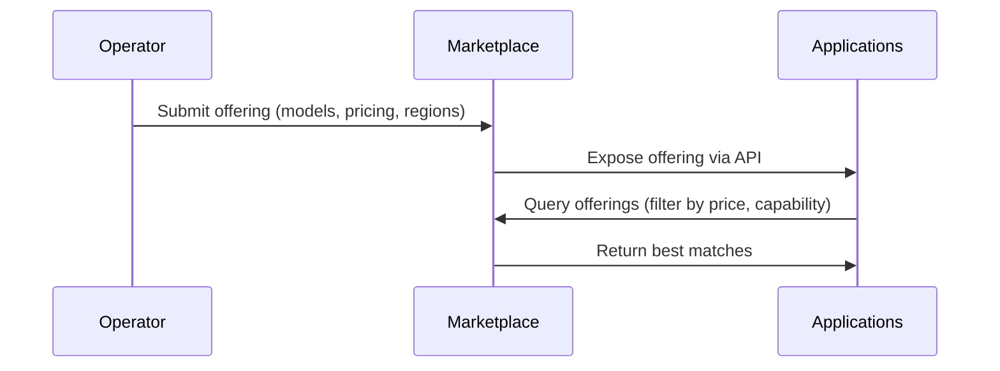

<Danger>
  This page is a work in progress.  
  TODO: Overview, Edit, Streamline, Format, Style, Link to github / other
  resources
</Danger>

  <Icon icon="party-horn" style={{ marginRight: '8px' }} />
  
    So you have a gateway running - yay!
  

  

# How to Publish Offerings to the Marketplace

The Livepeer Marketplace allows Gateways and Orchestrators to advertise compute capabilities, pricing, and performance characteristics. This page explains how operators publish offerings so applications can discover and select them programmatically.

---

## What Is an Offering?

An offering is a structured declaration of:

- Supported models (e.g., SDXL, ControlNet, depth models)
- Supported pipelines (ComfyStream, Daydream, BYOC)
- Pricing per frame / per second / per request
- GPU tiers and performance metrics
- Regional availability
- SLAs and expected latency

Gateways publish service-level offerings.  
Orchestrators publish compute-level offerings.

---

## Publishing as a Gateway

Gateways expose offerings describing:

### **1. Supported Models**

Example:

- `stable-diffusion-v1.5`
- `depth-anything`
- `controlnet_lineart`
- `ip_adapter`

### **2. Supported Pipelines**

- Daydream-style real-time style transfer
- ComfyStream workflows
- BYOC containers
- Custom inference graphs

### **3. Pricing**

A Gateway may price:

- `$0.004 / frame`
- `$0.06 / second`
- `$0.0005 / inference token`

### **4. Regions**

Example:

- `us-east`
- `eu-central`
- `ap-southeast`

### **5. Reliability Scores**

Gateways may publish:

- Availability %
- Average inference latency
- Failover configuration

---

## Publishing as an Orchestrator

Orchestrators publish compute offerings showing:

### **GPU Inventory**

- 4090
- A40
- L40S
- V100

### **Model Compatibility**

- TensorRT support
- Torch Compile accelerations

### **Benchmarks**

- Frames per second
- Tokens per second
- Latency per model

---

## Marketplace Submission Workflow

## Updating Offerings

Operators can dynamically update:

- Pricing
- Model support
- Pipeline versions
- GPU availability
  Performance metrics

Updates propagate automatically to Marketplace consumers.

## Summary

Publishing offerings to the Marketplace enables:

- Discoverability
- Fair competition
- Informed selection
- Differentiation and specialization

This is crucial for the growth of Livepeer’s decentralized AI compute economy.
