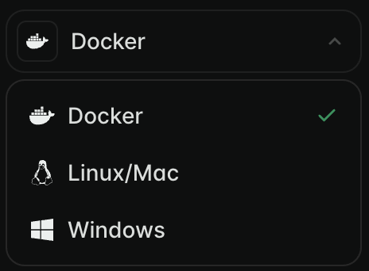

import { LatestRelease, LatestReleaseURL } from '/snippets/components/release.jsx';
import { CustomCodeBlock } from '/snippets/components/code.jsx';
import { TipWithArrow } from '/snippets/components/links.jsx';

{/*  */}
<TipWithArrow>
  Use the Dropdown at the top-right of this page to view the Quickstart Guide for your preferred OS.
</TipWithArrow>


This page will have you running a Livepeer Gateway for video & AI trancoding in 10 minutes on Mac, Linux or Windows.

This guide includes both on-chain (production) and off-chain (local) Gateway setup.

{/* #### Assumed (On-chain setup) */}
{/* - You have ETH on Arbitrum L2 Network (or can get it from a faucet)
- You have an Arbitrum RPC URL (or can use a public one) */}
<br/>
<View title="Docker" icon="docker" iconType="solid">
## <Icon icon="docker" iconType="solid" size={32} />  Docker Quickstart Guide

This guide will install and configure a Gateway to run video & AI workloads.

<Tabs>
  <Tab title="Off-Chain Gateway" icon="floppy-disk">
  <Warning> 
  <span style={{fontSize: '1.0rem' }}>You will need to <span style={{ color: 'white' }}>run your own Orchestrator node</span> to test an off-chain Gateway:  [<Icon icon="arrow-up-right" color="#2d9a67"/> Orchestrator Quickstart](/v2/pages/05_orchestrators/setting-up-an-orchestrator/setting-up-an-orchestrator/quickstart-add-your-gpu-to-livepeer)</span>

  <p>Note: You can use [<Icon icon="arrow-up-right" color="#2d9a67"/> BYOC pipelines](/v2/pages/03_developers/ai-inference-on-livepeer/byoc) for local testing without needing a GPU. </p>
  </Warning>
  <Steps titleSize="h3">
    <Step title="Install Gateway Software">
      Pull the docker image from [Livepeer Docker Hub]()
      <CustomCodeBlock
        codeString="docker pull livepeer/go-livepeer:master"
        language="bash"
        icon="terminal"
      />
    </Step>
    <Step title="Configure Gateway">
      Create the `docker-compose.yml` file that defines the dual gateway service (video & AI).
      ```bash icon="terminal" docker-compose.yml
        version: '3.9'  
  
        services:  
          dual-gateway:
            image: livepeer/go-livepeer:master
            container_name: 'dual-gateway'
            hostname: 'dual-gateway'
            ports:
              - 1935:1935  # RTMP for video ingest
              - 8935:8935  # HTTP API for both video and AI
              - 5935:5935  # CLI port
            volumes:
              - dual-gateway-lpData:/root/.lpData
              - ./aiModels.json:/root/.lpData/aiModels.json
              - ./models:/root/.lpData/models
            command: '-network offchain
                      -gateway
                      -httpIngest
                      -aiServiceRegistry
                      -monitor=true
                      -v=6
                      -rtmpAddr=0.0.0.0:1935
                      -httpAddr=0.0.0.0:8935
                      -cliAddr=0.0.0.0:5935
                      -orchAddr=<ORCHESTRATOR_ADDRESSES>
                      -transcodingOptions=P240p30fps16x9,P360p30fps16x9,P720p30fps16x9
                      -aiModels=/root/.lpData/aiModels.json
                      -aiModelsDir=/root/.lpData/models
                      -livePaymentInterval=5s'

          volumes:
            dual-gateway-lpData:
              external: true
      ```
      <Note>
        Replace <Badge color="gray">{'<ORCHESTRATOR_ADDRESSES>'}</Badge> with your locally running orchestrator http address.

        If you don't have this, leave it blank for now. You can add it later.
      </Note>

      Create the `aiModels.json` file that specifies which AI pipelines & models to load.
   ```bash icon="brackets-curly" aiModels.json
  [
    {
      'pipeline': 'text-to-image',
      'model_id': 'stabilityai/sd-turbo',
      'warm': true {/* preloads the model into GPU memory for faster inference */}
    }
  ]
  ```

      Create the models directory
      <CustomCodeBlock
        codeString="mkdir models"
        language="bash"
        icon="terminal"
      />

      OPT: Create the transcodingOptions.json file
      <CustomCodeBlock
        codeString="cat > transcodingOptions.json << EOF
        [
          {
            'name': '240p',
            'width': 426,
            'height': 240,
            'bitrate': 250000,
            'fps': 30,
            'profile': 'h264constrainedhigh'
          },
          {
            'name': '360p',
            'width': 640,
            'height': 360,
            'bitrate': 500000,
            'fps': 30,
            'profile': 'h264constrainedhigh'
          },
          {
            'name': '720p',
            'width': 1280,
            'height': 720,
            'bitrate': 3000000,
            'fps': 30,
            'profile': 'h264constrainedhigh'
          }
        ]
        EOF"
              language="bash"
              icon="terminal"
      />

    <Badge color="green"> on-chain </Badge>
    Create the password.txt file
    <CustomCodeBlock
      codeString="echo 'your_password' > password.txt"
      language="bash"
      icon="terminal"
    />

    </Step>
    <Step title="Run Gateway">
        <CustomCodeBlock
        codeString="docker run -p 8935:8935 -p 1935:1935 livepeer/go-livepeer:master -gateway -httpAddr=0.0.0.0:8935 -rtmpAddr=0.0.0.0:1935"
        language="bash"
        icon="terminal"
      />
    </Step>
    <Step title="Connect Gateway">
    </Step>
    <Step title="Test Gateway">
    </Step>
    </Steps>
  </Tab>
  <Tab title="On-Chain Gateway" icon="link">
  hello
  </Tab>
</Tabs>

## Reference Pages
<Columns cols={2}>
  <Card title="Docker Installation Guide" href="../install/docker-install" arrow horizontal >
    View Full Installation Guide
  </Card>
  <Card title="Configuration Flags Reference" href="../../references/configuration-flags.mdx" arrow horizontal >
    Gateway Configuration Flag Guide
  </Card>
</Columns>


</View>

<View title="Linux/Mac" icon="linux" iconType="solid">
## <Icon icon="linux" iconType="solid" size={32} /> Linux/Mac Quickstart Guide
  <Steps>
  <Step title="Install Gateway Software">
    hi
    <LatestReleaseUrl asset="livepeer-linux-amd64.tar.gz">
      <CustomCodeBlock
        codeString="sudo wget https://github.com/livepeer/go-livepeer/releases/download/{PLACEHOLDER}/livepeer-linux-amd64.tar.gz"
        placeholderValue={LatestRelease}
        language="bash"
        icon="terminal"
      />  
    </LatestReleaseUrl>
  </Step>
  <Step title="Configure Gateway">
  </Step>
  <Step title="Run Gateway">
  </Step>
  <Step title="Test Gateway">
  </Step>
  </Steps>
</View>

<View title="Windows" icon="windows" iconType="solid">
## <Icon icon="windows" iconType="solid" size={32} /> Windows Quickstart Guide
  <Steps>
  <Step title="Install Gateway Software">
  </Step>
  <Step title="Configure Gateway">
  </Step>
  <Step title="Run Gateway">
  </Step>
  <Step title="Test Gateway">
  </Step>
  </Steps>
</View>

## Troubleshooting
<Card title="Common Issues" icon="triangle-exclamation" iconType="solid" arrow horizontal>
FAQ here?
</Card>


## Related Pages
<Columns cols={2}>
  <Card title="Setup Checklist" href="../requirements" arrow horizontal> See Prerequisites & Requirements. </Card>
  <Card title="On-Chain Setup" href="../requirements/on-chain" arrow horizontal> 
    See on-chain Setup Checklist. 
  </Card>
  <Card title="Run a Gateway" href="../run-a-gateway" arrow horizontal>
    See full Gateway Setup Guide.
  </Card>
  <Card title="Orchestrator Guide" href="../orchestrator-guide" arrow horizontal>
    Setup an Orchestrator.
  </Card>
</Columns>


{/* This page will have you running a Livepeer Gateway for video & AI trancoding in 10 minutes on Mac, Linux or Windows.

It shows both off-chain (local) and on-chain (production) modes.

## Assumed
- You have ETH on Arbitrum L2 Network (or can get it from a faucet)
- 

It uses defaults for all optional parameters. See the [full setup guide](/v2/pages/04_gateways/run-a-gateway/run-a-gateway) for more details on customising your Gateway. */}


{/* <Tabs>
  <Tab title="On-Chain Gateway">
    This mode connects your Gateway to the Livepeer network on Arbitrum. 

    The guide uses a public RPC URL (rate-limited) & creates your account (wallet) for you. 

  ## Install
    Install the latest version of the Livepeer Gateway software: [go-livepeer](https://github.com/livepeer/go-livepeer)
    <Badge color="green"> Latest Release: <LatestReleaseUrl asset="livepeer-linux-amd64.tar.gz"/> </Badge>
    <Tabs>
    <Tab title="Linux/Mac">
    <LatestReleaseUrl asset="livepeer-linux-amd64.tar.gz">
    <CustomCodeBlock
      codeString="sudo wget https://github.com/livepeer/go-livepeer/releases/download/{PLACEHOLDER}/livepeer-linux-amd64.tar.gz"
      placeholderValue={LatestRelease}
      language="bash"
      icon="terminal"
    />  
    </LatestReleaseUrl>
    </Tab>
    <Tab title="Windows">
    <LatestReleaseUrl asset="livepeer-windows-amd64.zip">
    <CustomCodeBlock
      codeString="https://github.com/livepeer/go-livepeer/releases/download/{PLACEHOLDER}/livepeer-windows-amd64.zip"
      placeholderValue={LatestRelease}
      language="bash"
      icon="terminal"
    />  
    </LatestReleaseUrl>
    </Tab>
    <Tab title="Docker">
    <CustomCodeBlock
      codeString="docker pull livepeer/go-livepeer:master"
      language="bash"
      icon="terminal"
    />  
    </Tab>
    </Tabs>

  ## Configure

  </Tab>
  <Tab title="Off-Chain Gateway">
    ## Install


    ## Configure

  </Tab>
</Tabs> */}


{/* 
When you run with empty ETH parameters, Livepeer:

- Detects no existing account in the keystore 
- Creates a new Ethereum account automatically 
- Prompts for password to encrypt the keystore file */}