<Danger>
This page is a work in progress.
    <Accordian title="TODO">
    **TODO:**

    - [ ] Copy fixing
    - [ ] Editing
    - [ ] Streamlining
    - [ ] Format
    - [ ] Style
    - [ ] Copy over v1 docs
    - [ ] Fix Mermaid Diagram
    </Accordian>
</Danger>

import { GotoLink } from '/snippets/components/links.jsx'

Gateways are essential infrastructure in the Livepeer network. 
They provide the service coordination layer (routing & verification) that connects applications to the decentralized GPU compute layer. 
This guide explains the requirements, setup steps, and best practices for running a Gateway node.

```mermaid
%%{init: {'theme': 'base', 'themeVariables': { 'primaryColor': '#1a1a1a', 'primaryTextColor': '#fff', 'primaryBorderColor': '#2d9a67', 'lineColor': '#2d9a67', 'secondaryColor': '#0d0d0d', 'tertiaryColor': '#1a1a1a', 'background': '#0d0d0d', 'fontFamily': 'system-ui' }}}%%
flowchart LR
    subgraph INPUT["Input Sources"]
        CAM["Camera / RTMP / WebRTC"]
        VID["Video File"]
        AIIN["AI Prompt / Model Request"]
    end

    GATEWAY["Gateway Node<br/>• Ingest (RTMP/HTTP/WebRTC)<br/>• Segment video<br/>• Queue + order jobs<br/>• AI pipeline routing<br/>• Orchestrator selection<br/>• Verification & receipts"]

    CAM -->|"Live stream"| GATEWAY
    VID -->|"VOD upload"| GATEWAY
    AIIN -->|"AI job request"| GATEWAY

    subgraph JOBS["Workflows"]
        VJ["Video Transcoding Job"]
        AIJ["AI Inference Job<br/>(Daydream / ComfyStream / BYOC)"]
    end

    GATEWAY --> VJ
    GATEWAY --> AIJ

    subgraph ORCH["Orchestrator Network (GPU Operators)"]
        O1["Orchestrator A<br/>GPU Pool"]
        O2["Orchestrator B<br/>GPU Pool"]
        O3["Orchestrator C<br/>GPU Pool"]
    end

    VJ -->|"Transcode segments"| O1
    VJ --> O2
    AIJ -->|"Run model / inference"| O1
    AIJ --> O3

    subgraph OUTPUTS["Outputs"]
        HLS["Adaptive Bitrate Video (HLS/LL-HLS)"]
        AIOUT["AI Frames / Stylized Video"]
    end

    O1 --> GATEWAY
    O2 --> GATEWAY
    O3 --> GATEWAY

    GATEWAY --> HLS
    GATEWAY --> AIOUT

    ETH[("Arbitrum Blockchain<br/>Payments • Tickets • Rewards")]
    GATEWAY --> ETH
    O1 --> ETH
    O2 --> ETH
    O3 --> ETH

    classDef default fill:#1a1a1a,color:#fff,stroke:#2d9a67,stroke-width:2px
    style INPUT fill:#0d0d0d,stroke:#2d9a67,stroke-width:1px
    style JOBS fill:#0d0d0d,stroke:#2d9a67,stroke-width:1px
    style ORCH fill:#0d0d0d,stroke:#2d9a67,stroke-width:1px
    style OUTPUTS fill:#0d0d0d,stroke:#2d9a67,stroke-width:1px
```



<AccordionGroup>
<Accordion title="From a Cloud Background?" icon="cloud" description="Think: Load Balancer / API Gateway">

Running a Gateway is similar to operating an API Gateway or Load Balancer in cloud computing — 
it ingests traffic, routes workloads to backend GPU nodes, and manages session flow 
without doing the heavy compute itself.

```mermaid
%%{init: {'theme': 'base', 'themeVariables': { 
  'primaryColor': '#1a1a1a', 
  'primaryTextColor': '#fff', 
  'primaryBorderColor': '#2d9a67', 
  'lineColor': '#2d9a67', 
  'secondaryColor': '#0d0d0d', 
  'tertiaryColor': '#1a1a1a', 
  'background': '#0d0d0d', 
  'fontFamily': 'system-ui' 
}}}%%
flowchart LR
    subgraph Clients["Client / Application Layer"]
        A["Apps & SDKs<br/>• Video Ingest<br/>• AI Inference Requests<br/>• WebRTC / HTTP"]
    end

    subgraph Gateway["Gateway Layer (Livepeer Gateway)"]
        B["Gateway Node<br/><br/>Cloud Analogy:<br/>• API Gateway<br/>• L7 Load Balancer<br/>• Control Plane<br/><br/>Responsibilities:<br/>• Auth & Rate Limits<br/>• Stream Segmentation<br/>• Job Routing<br/>• Health Checks<br/>• Retry & Failover"]
    end

    subgraph Compute["Compute Layer (Supply Side)"]
        C["Orchestrators<br/>GPU Workers<br/><br/>Cloud Analogy:<br/>• Auto-scaling GPU Fleet<br/>• Managed Inference Pool"]
    end

    subgraph Settlement["Coordination & Settlement"]
        D["Ethereum + Livepeer Protocol<br/><br/>• Payments<br/>• Accounting<br/>• Slashing / Security"]
    end

    A -->|Requests| B
    B -->|Dispatch Jobs| C
    C -->|Results / Streams| B
    B -->|Responses| A
    C -->|Usage & Proof| D

    classDef default fill:#1a1a1a,color:#fff,stroke:#2d9a67,stroke-width:2px
    style Clients fill:#0d0d0d,stroke:#2d9a67,stroke-width:1px
    style Gateway fill:#0d0d0d,stroke:#2d9a67,stroke-width:1px
    style Compute fill:#0d0d0d,stroke:#2d9a67,stroke-width:1px
    style Settlement fill:#0d0d0d,stroke:#2d9a67,stroke-width:1px
```

</Accordion>
<Accordion title="From an Ethereum Background?" icon="coin" description="Think: L2 Sequencer">

Running a Gateway is **not** like running a validator on Ethereum.
Validators secure consensus whereas Gateways route workloads. It's more akin to a Sequencer on a Layer 2.
Just as a Sequencer ingests user transactions, orders them, and routes them into the rollup execution layer, 
a Livepeer Gateway performs the same function for the Livepeer compute network.


    ```mermaid
    %%{init: {'theme': 'base', 'themeVariables': { 'primaryColor': '#1a1a1a', 'primaryTextColor': '#fff', 'primaryBorderColor': '#2d9a67', 'lineColor': '#2d9a67', 'secondaryColor': '#0d0d0d', 'tertiaryColor': '#1a1a1a', 'background': '#0d0d0d', 'fontFamily': 'system-ui' }}}%%
    flowchart LR
        subgraph User["User Layer"]
            A["Client<br/>Video/AI Request"]
        end

        subgraph Gateway["Gateway Layer"]
            B["Livepeer Gateway<br/>= L2 Sequencer<br/><br/>• Ingests Requests<br/>• Segments/Preprocesses<br/>• Selects Orchestrators<br/>• Routes Jobs<br/>• Returns Results"]
        end

        subgraph Compute["Compute Layer"]
            C["Orchestrators<br/>GPU Workers<br/><br/>= L2 Execution Layer"]
        end

        subgraph Settlement["Settlement Layer"]
            D["Ethereum<br/>Consensus & Payment Security"]
        end

        A --> B
        B --> C
        C --> B
        B --> A
        C --> D

        classDef default fill:#1a1a1a,color:#fff,stroke:#2d9a67,stroke-width:2px
        style User fill:#0d0d0d,stroke:#2d9a67,stroke-width:1px
        style Gateway fill:#0d0d0d,stroke:#2d9a67,stroke-width:1px
        style Compute fill:#0d0d0d,stroke:#2d9a67,stroke-width:1px
        style Settlement fill:#0d0d0d,stroke:#2d9a67,stroke-width:1px
    ```
    <div style={{ textAlign: 'center', fontStyle: 'italic', fontSize: '0.75rem', color: '#888' }}>Gateways as L2 Sequencers</div>
</Accordion>
<Accordion title="Neither? You can still run a gateway!" icon="film" description="Think: Film Producer">

For the rest of us, running a Gateway is like being a film producer.
You take a request, assemble the right specialists, manage constraints, 
and ensure the final result is delivered reliably—without doing every task yourself.

```mermaid
%%{init: {'theme': 'base', 'themeVariables': { 
  'primaryColor': '#1a1a1a',
  'primaryTextColor': '#fff',
  'primaryBorderColor': '#2d9a67',
  'lineColor': '#2d9a67',
  'secondaryColor': '#0d0d0d',
  'background': '#0d0d0d',
  'fontFamily': 'system-ui'
}}}%%
flowchart LR
    subgraph Persona["Persona: Gateway Operator = Film Producer"]
        P["Film Producer Mindset<br/>• Owns delivery<br/>• Sets constraints<br/>• Chooses specialists<br/>• Ensures quality"]
    end

    subgraph Request["Act I — The Pitch"]
        A["Incoming Request<br/>• Live Video Stream<br/>• AI Inference Job<br/>• Quality & Latency Requirements"]
    end

    subgraph Planning["Act II — Pre-Production"]
        B["Gateway (Producer)<br/><br/>• Interpret the request<br/>• Set budget & latency constraints<br/>• Choose specialists<br/>• Plan execution"]
    end

    subgraph Crew["Act III — Production Crew"]
        C["Orchestrators / GPU Workers<br/><br/>• Transcoding<br/>• AI Inference<br/>• Real-time Processing"]
    end

    subgraph Delivery["Act IV — Final Cut & Release"]
        D["Verified Output<br/>• Stream / AI Result<br/>• Quality checked<br/>• Delivered on time"]
    end

    subgraph Settlement["Credits & Accounting"]
        E["Onchain Settlement<br/>• Usage recorded<br/>• Payments distributed<br/>• Trust enforced"]
    end

    P --> A
    A --> B
    B --> C
    C --> B
    B --> D
    C --> E

    classDef default fill:#1a1a1a,color:#fff,stroke:#2d9a67,stroke-width:2px
    style Persona fill:#0d0d0d,stroke:#2d9a67
    style Request fill:#0d0d0d,stroke:#2d9a67
    style Planning fill:#0d0d0d,stroke:#2d9a67
    style Crew fill:#0d0d0d,stroke:#2d9a67
    style Delivery fill:#0d0d0d,stroke:#2d9a67
    style Settlement fill:#0d0d0d,stroke:#2d9a67
```


</Accordion>
</AccordionGroup>

## What a Gateway Operator Does

Gateway operators handle:

- Job intake and API requests
- Routing workloads to the best Orchestrator (GPU Node)
- Managing pricing, capabilities, and service metadata
- Publishing offerings (AI inference, video transcoding and more) to the Marketplace
- Monitoring job performance, latency, and reliability

Gateways do **not** compute or perform the AI inference or transcoding themselves. 
That work is performed by orchestrators.


## Gateway Operator Journey

```mermaid
%%{init: {'theme': 'base', 'themeVariables': { 'primaryColor': '#1a1a1a', 'primaryTextColor': '#fff', 'primaryBorderColor': '#2d9a67', 'lineColor': '#2d9a67', 'secondaryColor': '#0d0d0d', 'tertiaryColor': '#1a1a1a', 'background': '#0d0d0d', 'fontFamily': 'system-ui' }}}%%
flowchart TB
    subgraph reqs["Pre-Reqs"]
        A["Check Hardware Requirements"]
        B["Check Network & Software Requirements"]
    end

    subgraph setup["Setup"]
        C["Deploy Gateway Service"]
        D["Connect to Orchestrators"]
    end

    subgraph config["Configuration"]
        E["Configure Capabilities"]
        F["Set Pricing"]
    end

    subgraph launch["Launch"]
        G["Register in Marketplace"]
        H["Monitor & Optimize"]
    end

    A --> B
    B --> C
    C --> D
    D --> E
    E --> F
    F --> G
    G --> H

    classDef default fill:#1a1a1a,color:#fff,stroke:#2d9a67,stroke-width:2px
    style reqs fill:#0d0d0d,stroke:#2d9a67,stroke-width:1px
    style setup fill:#0d0d0d,stroke:#2d9a67,stroke-width:1px
    style config fill:#0d0d0d,stroke:#2d9a67,stroke-width:1px
    style launch fill:#0d0d0d,stroke:#2d9a67,stroke-width:1px
```

<br/>

<Columns cols={2}>  
<div style={{ display: 'flex', justifyContent: 'center' }}>

</div>
<div style={{ marginTop: '-3.5rem', display: 'flex', justifyContent: 'center' }}>
<Steps>
  <Step title="Requirements Check">
    Check hardware, network, and software requirements. <br/>
    <GotoLink
      label="Requirements"
      relativePath="./requirements"
    />
  </Step>
  <Step title="Install & Deploy Gateway">
    Install the Livepeer Gateway software, deploy & connect to orchestrators. <br/>
    <GotoLink
      label="Installation Guide"
      relativePath="./install"
    />
  </Step>
  <Step title="Configure Gateway">
    Configure models, pipelines, regions, pricing, and more. <br />
    <GotoLink
      label="Configuration Guide"
      relativePath="./configure"
    />
  </Step>
  <Step title="Publish Offerings">
    Price & publish offerings to the Marketplace. <br/>
    <GotoLink
      label="Publish Offerings"
      relativePath="./publish"
    />
  </Step>
    <Step title="Monitor & Optimize">
    Monitor performance, optimize routing & service quality. <br/>
    <GotoLink
      label="Tools & Dashboards"
      relativePath="./tools"
    />
  </Step>
</Steps>

</div>
</Columns>