```mermaid
%%{init: {'theme': 'base', 'themeVariables': { 'primaryColor': '#1a1a1a', 'primaryTextColor': '#fff', 'primaryBorderColor': '#2d9a67', 'lineColor': '#2d9a67', 'secondaryColor': '#0d0d0d', 'tertiaryColor': '#1a1a1a', 'background': '#0d0d0d', 'fontFamily': 'system-ui' }}}%%
flowchart LR
    subgraph INPUT["Input Sources"]
        CAM["Camera / RTMP / WebRTC"]
        VID["Video File"]
        AIIN["AI Prompt / Model Request"]
    end

    GATEWAY["Gateway Node<br/>• Ingest (RTMP/HTTP/WebRTC)<br/>• Segment video<br/>• Queue + order jobs<br/>• AI pipeline routing<br/>• Orchestrator selection<br/>• Verification & receipts"]

    CAM -->|"Live stream"| GATEWAY
    VID -->|"VOD upload"| GATEWAY
    AIIN -->|"AI job request"| GATEWAY

    subgraph JOBS["Workflows"]
        VJ["Video Transcoding Job"]
        AIJ["AI Inference Job<br/>(Daydream / ComfyStream / BYOC)"]
    end

    GATEWAY --> VJ
    GATEWAY --> AIJ

    subgraph ORCH["Orchestrator Network (GPU Operators)"]
        O1["Orchestrator A<br/>GPU Pool"]
        O2["Orchestrator B<br/>GPU Pool"]
        O3["Orchestrator C<br/>GPU Pool"]
    end

    VJ -->|"Transcode segments"| O1
    VJ --> O2
    AIJ -->|"Run model / inference"| O1
    AIJ --> O3

    subgraph OUTPUTS["Outputs"]
        HLS["Adaptive Bitrate Video (HLS/LL-HLS)"]
        AIOUT["AI Frames / Stylized Video"]
    end

    O1 --> GATEWAY
    O2 --> GATEWAY
    O3 --> GATEWAY

    GATEWAY --> HLS
    GATEWAY --> AIOUT

    ETH[("Arbitrum Blockchain<br/>Payments • Tickets • Rewards")]
    GATEWAY --> ETH
    O1 --> ETH
    O2 --> ETH
    O3 --> ETH

    classDef default fill:#1a1a1a,color:#fff,stroke:#2d9a67,stroke-width:2px
    style INPUT fill:#0d0d0d,stroke:#2d9a67,stroke-width:1px
    style JOBS fill:#0d0d0d,stroke:#2d9a67,stroke-width:1px
    style ORCH fill:#0d0d0d,stroke:#2d9a67,stroke-width:1px
    style OUTPUTS fill:#0d0d0d,stroke:#2d9a67,stroke-width:1px
```

import { GotoLink } from '/snippets/components/links.jsx'
import { ScrollableDiagram } from "/snippets/components/zoomable-diagram.jsx"

 
Gateways are essential infrastructure in the Livepeer network. 
They provide the service coordination layer (routing & verification) that connects applications to the decentralized GPU compute layer (DePIN). 
This guide explains the requirements, setup steps, and best practices for running a Gateway node."

<ScrollableDiagram title="Dual Gateway Architecture: Video & AI Pipelines" maxHeight="600px">

</ScrollableDiagram>

 

<Card
    title="Gateway Economics"
    href="../about-gateways/gateway-economics"
    icon="hand-holding-dollar"
    horizontal
    arrow
    >
    Looking for information on how gateways earn fees for services?
    <GotoLink
      label="Read the 'Gateway Economics' section"
      relativePath="../about-gateways/gateway-economics"
    />   
</Card>

## Gateway Operator Journey

```mermaid
%%{init: {'theme': 'base', 'themeVariables': { 'primaryColor': '#1a1a1a', 'primaryTextColor': '#fff', 'primaryBorderColor': '#2d9a67', 'lineColor': '#2d9a67', 'secondaryColor': '#0d0d0d', 'tertiaryColor': '#1a1a1a', 'background': '#0d0d0d', 'fontFamily': 'system-ui' }}}%%
flowchart TB
    subgraph reqs["Pre-Reqs"]
        A["Check Hardware Requirements"]
        B["Check Network & Software Requirements"]
    end

    subgraph setup["Setup"]
        C["Deploy Gateway Service"]
        D["Connect to Orchestrators"]
    end

    subgraph config["Configuration"]
        E["Configure Capabilities"]
        F["Set Pricing"]
    end

    subgraph launch["Launch"]
        G["Register in Marketplace"]
        H["Monitor & Optimize"]
    end

    A --> B
    B --> C
    C --> D
    D --> E
    E --> F
    F --> G
    G --> H

    classDef default fill:#1a1a1a,color:#fff,stroke:#2d9a67,stroke-width:2px
    style reqs fill:#0d0d0d,stroke:#2d9a67,stroke-width:1px
    style setup fill:#0d0d0d,stroke:#2d9a67,stroke-width:1px
    style config fill:#0d0d0d,stroke:#2d9a67,stroke-width:1px
    style launch fill:#0d0d0d,stroke:#2d9a67,stroke-width:1px
```
 

<Columns cols={2}>  

<Steps>
  <Step title="Requirements Check">
    Check hardware, network, and software requirements.  
    <GotoLink
      label="Requirements"
      relativePath="./requirements"
    />
  </Step>
  <Step title="Install & Deploy Gateway">
    Install the Livepeer Gateway software, deploy & connect to orchestrators.  
    <GotoLink
      label="Installation Guide"
      relativePath="./install"
    />
  </Step>
  <Step title="Configure Gateway">
    Configure models, pipelines, regions, pricing, and more.  
    <GotoLink
      label="Configuration Guide"
      relativePath="./configure"
    />
  </Step>
  <Step title="Publish Offerings">
    Price & publish offerings to the Marketplace.  
    <GotoLink
      label="Publish Offerings"
      relativePath="./publish"
    />
  </Step>
    <Step title="Monitor & Optimize">
    Monitor performance, optimize routing & service quality.  
    <GotoLink
      label="Tools & Dashboards"
      relativePath="./tools"
    />
  </Step>
</Steps>

</Columns>

<Danger>
    This page is a work in progress.
    <Expandable title="TODO">
    **TODO:**

    - [ ] Copy fixing
    - [ ] Editing
    - [ ] Streamlining
    - [ ] Format
    - [ ] Style
    - [ ] Copy over v1 docs
    - [ ] Fix Mermaid Diagram
    - [ ] Add Video
    - [ ] MISSING: Connecting to Orchestrators?
    </Expandable>
</Danger>
