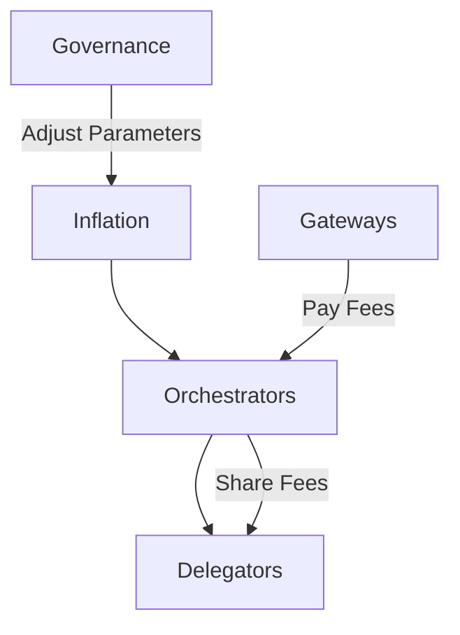

## Executive Summary

LPT tokenomics define how security is budgeted, how inflation adjusts, how rewards are distributed, and how long-term sustainability transitions from issuance-driven to fee-driven economics.

Livepeer uses a dynamic inflation model tied to staking participation (bonding rate). Inflation increases when participation falls below a target and decreases when participation exceeds it. This mechanism automatically adjusts the protocol security budget without centralized intervention.

---

## Formal Definition

Let:

- \(S\) = total token supply
- \(B\) = total bonded (staked) LPT
- \(r\) = bonding rate = \(B / S\)
- \(r^*\) = target bonding rate
- \(I_t\) = inflation rate at time \(t\)
- \(\Delta\) = adjustment coefficient per round
- \(R\) = protocol round duration

The inflation rate evolves as a function of deviation from target bonding participation.

---

## Architectural Context

### Protocol Layer (On-Chain)

Tokenomics are enforced by protocol smart contracts, primarily:

- **Minter** — controls inflation rate and token minting
- **BondingManager** — manages stake and reward distribution
- **RoundsManager** — defines accounting periods ("rounds")
- **Controller** — registry of protocol contracts

All issuance, stake accounting, and reward allocation occur on-chain.

### Network Layer (Off-Chain)

The network performs:

- Video transcoding
- AI inference workloads
- Real-time streaming compute

Tokenomics do not influence job execution directly. They influence *who* is economically incentivized to provide infrastructure.

---

## Dynamic Inflation Model

Livepeer adjusts inflation each round according to bonding participation.

### Bonding Rate

\[
r = \frac{B}{S}
\]

Where:

- \(B\) = total bonded stake
- \(S\) = total token supply

### Adjustment Rule

If \(r < r^*\):

\[
I_{t+1} = I_t + \Delta
\]

If \(r > r^*\):

\[
I_{t+1} = I_t - \Delta
\]

If \(r = r^*\):

\[
I_{t+1} = I_t
\]

Where:

- \(\Delta\) is a governance-defined adjustment coefficient
- Updates occur once per protocol round

This creates a negative feedback loop stabilizing participation around the target bonding rate.

---

## Stepwise Derivation

1. Security budget depends on total bonded stake \(B\).
2. Low participation (\(r < r^*\)) reduces economic security.
3. Inflation increases → staking yield increases → \(B\) rises.
4. High participation (\(r > r^*\)) implies over-allocation of capital.
5. Inflation decreases → staking yield decreases → \(B\) stabilizes.

Thus:

Inflation becomes a control system stabilizing \(r\) around \(r^*\).

This design avoids fixed-schedule dilution.

---

## Reward Distribution

Total inflation minted in a round:

\[
M = \frac{I_t \times S}{N}
\]

Where:

- \(N\) = number of rounds per year

Orchestrator share:

\[
R_i = M \times \frac{B_i}{B}
\]

Where:

- \(B_i\) = stake backing orchestrator \(i\)

Delegator payout (after commission \(s\)):

\[
P_i = (R_i + F_i) \times (1 - s)
\]

Where:

- \(F_i\) = fees earned by orchestrator \(i\)
- \(s\) = orchestrator reward cut

Protocol issuance and fee revenue are distinct economic streams.

---

## Slashing Economics

If slashing is enabled for specific job types:

Let:

- \(L\) = slashed amount

Then stake reduction:

\[
B_i' = B_i - L
\]

Delegators share proportional slashing impact.

Slashing increases expected cost of malicious behavior.

---

## Long-Term Transition Model

In early phases:

Total rewards ≈ inflation-dominated

As usage grows:

Total rewards ≈ fee-dominated

Goal state:

Security budget funded primarily by real demand.

Inflation acts as a bootstrapping mechanism rather than a permanent subsidy.

---

## Economic Implications

1. Security budget scales with participation.
2. Capital efficiency emerges as inflation declines.
3. Fee growth reduces reliance on issuance.
4. Governance can tune \(\Delta\) and \(r^*\) to rebalance incentives.

This model aligns decentralized infrastructure growth with economic sustainability.

---

## Operational Considerations

- Inflation parameters are adjustable via governance.
- Round duration determines adjustment frequency.
- Staking yields vary with bonding participation.
- Delegators must evaluate orchestrator commission rates and fee sharing.

---

## Economic Flow Diagram

---

## Verified Contract References

**Deployment Network:** Arbitrum One

Contract addresses and ABIs must be retrieved from the official Livepeer GitHub repository and verified via Arbiscan at time of review to prevent outdated references.

Authoritative sources:

- [Livepeer Protocol Repository](https://github.com/livepeer/protocol) (smart contracts)
- [Arbiscan verified contracts](https://arbiscan.io) (Arbitrum)
- [Livepeer Governance Forum](https://forum.livepeer.org) (parameter changes)

---

## Design Tradeoffs

| Mechanism | Tradeoff |
| --- | --- |
| Dynamic inflation | Stability vs governance complexity |
| Delegated staking | Accessibility vs capital concentration |
| Fee sharing optionality | Market flexibility vs variability |
| Round-based updates | Determinism vs responsiveness |

---

## Summary

LPT tokenomics are governed by a dynamic control system tied to staking participation.

Inflation is adjustable. Security is capital-backed. Rewards combine issuance and real fees.

This design enables decentralized GPU infrastructure to bootstrap securely and transition toward demand-funded sustainability.
